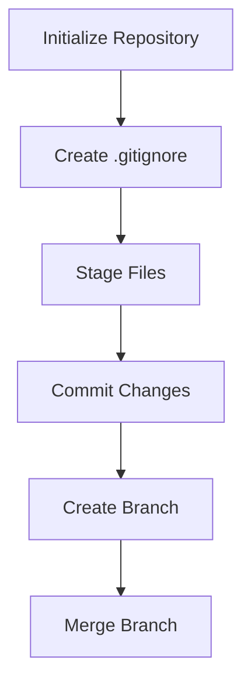

## 2.9.1 Initializing a Git Repository

As experienced Java developers transitioning to Clojure, mastering version control with Git is essential for managing your codebase effectively. In this section, we'll explore how to initialize a Git repository for your Clojure projects, create a `.gitignore` file to exclude unnecessary files, and understand the best practices for version control in a functional programming environment.

### Why Use Git for Clojure Projects?

Git is a distributed version control system that allows you to track changes in your code, collaborate with others, and manage different versions of your project. For Clojure developers, Git provides a robust framework to handle the iterative and collaborative nature of software development. Here are some reasons why Git is indispensable:

- **Collaboration**: Git enables multiple developers to work on the same project simultaneously without conflicts.
- **Version Tracking**: Keep a history of changes, making it easy to revert to previous versions if needed.
- **Branching**: Experiment with new features without affecting the main codebase.
- **Integration**: Git integrates seamlessly with popular platforms like GitHub, GitLab, and Bitbucket, enhancing your workflow.

### Initializing a Git Repository

Let's start by initializing a Git repository for your Clojure project. This process is straightforward and involves a few simple commands.

#### Step 1: Create a New Clojure Project

Before initializing a Git repository, ensure you have a Clojure project set up. If you haven't created one yet, you can use Leiningen, a popular build automation tool for Clojure.

```bash
lein new app my-clojure-app
```

This command creates a new Clojure application named `my-clojure-app`.

#### Step 2: Navigate to Your Project Directory

Change your directory to the newly created project folder:

```bash
cd my-clojure-app
```

#### Step 3: Initialize the Git Repository

Now, let's initialize the Git repository. This command creates a new `.git` directory in your project folder, which will track all changes to your files.

```bash
git init
```

**Output:**

```
Initialized empty Git repository in /path/to/my-clojure-app/.git/
```

### Creating a `.gitignore` File

A `.gitignore` file specifies intentionally untracked files that Git should ignore. This is crucial for excluding build artifacts and other files that do not need to be version-controlled.

#### Step 1: Create the `.gitignore` File

In your project directory, create a file named `.gitignore`:

```bash
touch .gitignore
```

#### Step 2: Add Common Clojure Ignored Files

Open the `.gitignore` file in your preferred text editor and add the following entries:

```plaintext
# Ignore Leiningen build artifacts
/target/
/classes/
/lib/

# Ignore REPL history
/.lein-repl-history

# Ignore IntelliJ IDEA project files
/.idea/
/*.iml

# Ignore MacOS system files
.DS_Store

# Ignore log files
*.log
```

**Explanation:**

- **`/target/`**: Directory where Leiningen stores compiled files.
- **`/.lein-repl-history`**: File storing REPL command history.
- **`/.idea/` and `/*.iml`**: IntelliJ IDEA project files, unnecessary for version control.
- **`.DS_Store`**: MacOS system file, often created in directories.
- **`*.log`**: Log files generated during development.

### Committing Your Initial Project

With your Git repository initialized and `.gitignore` configured, it's time to make your first commit.

#### Step 1: Stage Your Files

Add all files to the staging area, except those specified in `.gitignore`:

```bash
git add .
```

#### Step 2: Commit Your Changes

Commit the staged files with a descriptive message:

```bash
git commit -m "Initial commit: Set up Clojure project structure"
```

### Comparing Git with Java's Version Control Practices

Java developers often use centralized version control systems like Subversion (SVN). Git, being distributed, offers several advantages:

- **Local Repositories**: Work offline and commit changes locally before pushing to a remote repository.
- **Branching and Merging**: Git's branching model is more flexible and efficient, allowing for easier experimentation and feature development.
- **Community and Tools**: Git's widespread adoption means better integration with modern development tools and platforms.

### Try It Yourself

Experiment with the following tasks to deepen your understanding:

- **Modify the `.gitignore`**: Add more entries specific to your development environment or tools.
- **Create a New Branch**: Use `git branch <branch-name>` to create a new branch and `git checkout <branch-name>` to switch to it.
- **Merge Branches**: Practice merging branches with `git merge <branch-name>`.

### Visualizing Git Workflow

Below is a simple diagram illustrating the basic Git workflow, from initializing a repository to making commits and branching.



*Diagram: Basic Git Workflow*

### Further Reading

For more in-depth information on Git and version control, consider the following resources:

- [Official Git Documentation](https://git-scm.com/doc)
- [Pro Git Book](https://git-scm.com/book/en/v2)
- [ClojureDocs on Git](https://clojuredocs.org/)

### Exercises

1. **Initialize a New Repository**: Create a new Clojure project and initialize a Git repository. Make several commits to practice version control.
2. **Branching and Merging**: Create a feature branch, make changes, and merge it back into the main branch.
3. **Advanced `.gitignore`**: Customize your `.gitignore` file to include additional files specific to your workflow.

### Key Takeaways

- **Git Initialization**: Setting up a Git repository is the first step in managing your Clojure project's version control.
- **`.gitignore` Importance**: Excluding unnecessary files keeps your repository clean and focused on source code.
- **Version Control Best Practices**: Regular commits, meaningful messages, and branching strategies enhance collaboration and project management.

By mastering Git, you enhance your ability to manage Clojure projects effectively, leveraging the power of version control to maintain a clean, organized, and collaborative codebase.

## Git and Clojure: Quiz for Java Developers



### What is the primary purpose of initializing a Git repository?

- [x] To start tracking changes in a project's files
- [ ] To compile Clojure code
- [ ] To install dependencies
- [ ] To deploy an application

> **Explanation:** Initializing a Git repository sets up a system to track changes in files, allowing for version control.

### Which command is used to initialize a Git repository?

- [x] `git init`
- [ ] `git start`
- [ ] `git create`
- [ ] `git new`

> **Explanation:** The `git init` command initializes a new Git repository in the current directory.

### What is the purpose of a `.gitignore` file?

- [x] To specify files and directories that Git should ignore
- [ ] To list all files in the repository
- [ ] To store Git configuration settings
- [ ] To track changes in binary files

> **Explanation:** A `.gitignore` file tells Git which files or directories to ignore, preventing them from being tracked.

### Which of the following is a common entry in a Clojure project's `.gitignore` file?

- [x] `/target/`
- [ ] `/src/`
- [ ] `/bin/`
- [ ] `/lib/`

> **Explanation:** The `/target/` directory is commonly ignored as it contains build artifacts.

### How do you stage all files for a commit in Git?

- [x] `git add .`
- [ ] `git stage all`
- [ ] `git commit -a`
- [ ] `git push`

> **Explanation:** The `git add .` command stages all files in the current directory for the next commit.

### What is the benefit of using branches in Git?

- [x] To work on new features without affecting the main codebase
- [ ] To increase application performance
- [ ] To compile code faster
- [ ] To reduce memory usage

> **Explanation:** Branches allow developers to work on new features or experiments without impacting the main codebase.

### Which command is used to create a new branch in Git?

- [x] `git branch <branch-name>`
- [ ] `git new-branch <branch-name>`
- [ ] `git create-branch <branch-name>`
- [ ] `git checkout <branch-name>`

> **Explanation:** The `git branch <branch-name>` command creates a new branch with the specified name.

### What does the `git commit -m "message"` command do?

- [x] Commits staged changes with a descriptive message
- [ ] Initializes a new repository
- [ ] Merges branches
- [ ] Deletes a branch

> **Explanation:** The `git commit -m "message"` command commits staged changes to the repository with a message describing the changes.

### True or False: Git is a centralized version control system.

- [ ] True
- [x] False

> **Explanation:** Git is a distributed version control system, allowing for local repositories and offline work.

### What is the advantage of using Git over centralized version control systems?

- [x] Allows for local commits and offline work
- [ ] Requires less disk space
- [ ] Automatically compiles code
- [ ] Provides built-in deployment tools

> **Explanation:** Git's distributed nature allows developers to commit changes locally and work offline, providing greater flexibility.


