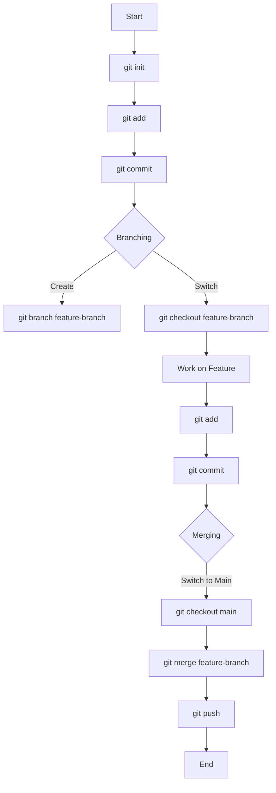

## 2.9.2 Basic Git Commands

As experienced Java developers transitioning to Clojure, understanding Git is crucial for managing your codebase effectively. Git is a distributed version control system that allows multiple developers to work on a project simultaneously without overwriting each other's changes. In this section, we'll explore essential Git commands and workflows that will help you manage your Clojure projects efficiently.

### Introduction to Git

Git is a powerful tool for version control, enabling developers to track changes, collaborate with others, and maintain a history of their codebase. It is widely used in both open-source and enterprise environments. Understanding Git's basic commands and workflows will enhance your ability to manage Clojure projects, whether you're working solo or as part of a team.

### Key Git Concepts

Before diving into the commands, let's briefly cover some key Git concepts:

- **Repository**: A Git repository is a directory that contains your project's files and the entire history of changes made to those files.
- **Commit**: A commit is a snapshot of your repository at a specific point in time. It includes a message describing the changes.
- **Branch**: A branch is a parallel version of your repository. By default, Git creates a `main` branch, but you can create additional branches to work on features or fixes independently.
- **Merge**: Merging is the process of integrating changes from one branch into another.
- **Remote**: A remote is a version of your repository hosted on the internet or another network. It allows you to collaborate with others.

### Basic Git Commands

Let's explore some of the fundamental Git commands that you'll use frequently in your Clojure development workflow.

#### `git init`

The `git init` command initializes a new Git repository. This command is used when you want to start tracking an existing project with Git.

```bash
git init
```

**Explanation**: This command creates a new `.git` directory in your project folder, which contains all the metadata and history for your repository.

#### `git add`

The `git add` command stages changes for the next commit. It tells Git to include updates to files in the next snapshot of the repository.

```bash
git add <file>
```

**Example**: To stage all changes in your project, use:

```bash
git add .
```

**Explanation**: The `.` argument stages all modified files in the current directory and its subdirectories.

#### `git commit`

The `git commit` command records changes to the repository. Each commit has a unique ID and a message describing the changes.

```bash
git commit -m "Your commit message"
```

**Explanation**: The `-m` flag allows you to add a commit message directly from the command line. This message should be concise yet descriptive.

#### `git push`

The `git push` command uploads your local commits to a remote repository. This is how you share your changes with others.

```bash
git push origin main
```

**Explanation**: This command pushes the changes from your local `main` branch to the `main` branch on the remote repository named `origin`.

#### `git pull`

The `git pull` command fetches changes from a remote repository and merges them into your current branch.

```bash
git pull origin main
```

**Explanation**: This command updates your local `main` branch with the latest changes from the remote `main` branch.

#### Branching and Merging

Branching allows you to work on different features or fixes independently. Merging integrates changes from one branch into another.

##### Creating a Branch

To create a new branch, use the `git branch` command:

```bash
git branch feature-branch
```

**Explanation**: This command creates a new branch named `feature-branch` based on the current branch.

##### Switching Branches

To switch to a different branch, use the `git checkout` command:

```bash
git checkout feature-branch
```

**Explanation**: This command switches your working directory to the `feature-branch`.

##### Merging Branches

To merge changes from one branch into another, use the `git merge` command:

```bash
git checkout main
git merge feature-branch
```

**Explanation**: First, switch to the branch you want to merge into (e.g., `main`), then merge the changes from `feature-branch`.

### Visualizing Git Workflows

Understanding how these commands fit together in a typical workflow can be challenging. Let's visualize a common Git workflow using a Mermaid.js diagram.



**Diagram Explanation**: This flowchart represents a typical Git workflow. It starts with initializing a repository, adding and committing changes, branching, working on a feature, merging, and finally pushing changes to a remote repository.

### Comparing Git with Java's Version Control

Java developers may be familiar with other version control systems like Subversion (SVN) or CVS. Let's compare Git with these systems:

- **Distributed vs. Centralized**: Git is distributed, meaning each developer has a full copy of the repository, including its history. SVN and CVS are centralized, relying on a single server.
- **Branching**: Git's branching is lightweight and fast, encouraging frequent branching and merging. SVN and CVS have heavier branching models.
- **Speed**: Git is generally faster for most operations, especially when working offline.

### Try It Yourself

Now that we've covered the basics, try experimenting with these commands in your own Clojure project:

1. **Initialize a Repository**: Create a new directory and initialize it as a Git repository.
2. **Stage and Commit Changes**: Make some changes to your Clojure code, stage them, and commit with a meaningful message.
3. **Create and Merge Branches**: Create a new branch for a feature, make changes, and merge it back into the main branch.
4. **Push to a Remote**: If you have a remote repository (e.g., on GitHub), push your changes and verify they appear online.

### Exercises

1. **Exercise 1**: Create a new branch called `experiment` and make some changes to a Clojure file. Commit your changes and merge them into the `main` branch.
2. **Exercise 2**: Simulate a conflict by modifying the same line in a file on two different branches. Merge the branches and resolve the conflict.
3. **Exercise 3**: Set up a remote repository on GitHub and push your local repository to it. Pull changes from the remote repository.

### Summary and Key Takeaways

- **Git Basics**: We've covered essential Git commands like `git add`, `git commit`, `git push`, and `git pull`.
- **Branching and Merging**: Branching allows for isolated development, while merging integrates changes.
- **Distributed Nature**: Git's distributed model offers flexibility and speed compared to centralized systems.
- **Practice**: Regularly using Git commands will build your confidence and proficiency.

### Further Reading

For more in-depth information on Git, consider exploring the following resources:

- [Pro Git Book](https://git-scm.com/book/en/v2) - A comprehensive guide to Git.
- [Git Documentation](https://git-scm.com/doc) - Official Git documentation.
- [GitHub Guides](https://guides.github.com/) - Tutorials and guides for using Git and GitHub.

---

## Quiz: Mastering Basic Git Commands for Clojure Development



### What is the purpose of the `git add` command?

- [x] To stage changes for the next commit
- [ ] To commit changes to the repository
- [ ] To push changes to a remote repository
- [ ] To initialize a new Git repository

> **Explanation:** The `git add` command stages changes, preparing them to be included in the next commit.

### Which command is used to upload local commits to a remote repository?

- [ ] `git commit`
- [ ] `git add`
- [x] `git push`
- [ ] `git pull`

> **Explanation:** The `git push` command is used to upload local commits to a remote repository.

### How do you create a new branch in Git?

- [ ] `git checkout`
- [x] `git branch`
- [ ] `git merge`
- [ ] `git init`

> **Explanation:** The `git branch` command is used to create a new branch.

### What does the `git pull` command do?

- [ ] It stages changes for the next commit
- [ ] It uploads local commits to a remote repository
- [x] It fetches changes from a remote repository and merges them into the current branch
- [ ] It initializes a new Git repository

> **Explanation:** The `git pull` command fetches changes from a remote repository and merges them into the current branch.

### Which command is used to switch branches in Git?

- [x] `git checkout`
- [ ] `git branch`
- [ ] `git merge`
- [ ] `git add`

> **Explanation:** The `git checkout` command is used to switch between branches.

### What is the main advantage of Git's distributed nature?

- [x] Each developer has a full copy of the repository, including its history
- [ ] It requires a central server for all operations
- [ ] It is slower than centralized systems
- [ ] It does not support branching

> **Explanation:** Git's distributed nature allows each developer to have a complete copy of the repository, enabling offline work and faster operations.

### How do you merge changes from one branch into another?

- [ ] `git branch`
- [x] `git merge`
- [ ] `git add`
- [ ] `git push`

> **Explanation:** The `git merge` command is used to integrate changes from one branch into another.

### What is the purpose of a commit message?

- [ ] To stage changes for the next commit
- [ ] To upload changes to a remote repository
- [x] To describe the changes made in a commit
- [ ] To create a new branch

> **Explanation:** A commit message describes the changes made in a commit, providing context and history for the repository.

### Which command initializes a new Git repository?

- [x] `git init`
- [ ] `git add`
- [ ] `git commit`
- [ ] `git push`

> **Explanation:** The `git init` command initializes a new Git repository, setting up the necessary metadata and history tracking.

### True or False: Git's branching model is heavier than SVN's.

- [ ] True
- [x] False

> **Explanation:** Git's branching model is lightweight and fast, encouraging frequent branching and merging, unlike SVN's heavier model.


