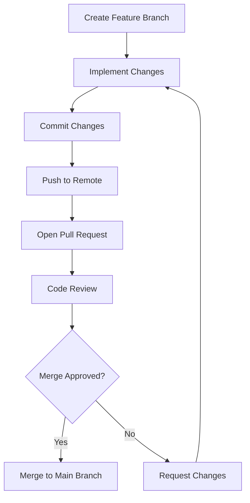
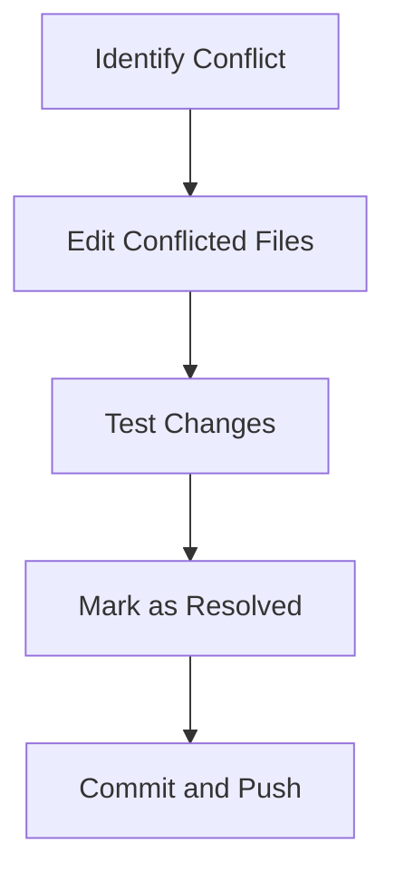

## 2.9.3 Collaborating with Others

Collaboration is a cornerstone of modern software development, and mastering it is essential for any developer transitioning from Java to Clojure. In this section, we will explore best practices for collaborating with others using Git and version control, focusing on pull requests, code reviews, and managing merge conflicts. These practices not only enhance code quality but also foster a culture of continuous learning and improvement.

### Pull Requests: The Gateway to Collaboration

Pull requests (PRs) are a fundamental part of collaborative development. They serve as a formal mechanism for proposing changes to a codebase, allowing team members to review, discuss, and improve code before it is merged.

#### Understanding Pull Requests

A pull request is essentially a request to merge code from one branch into another. In a typical workflow, developers create a feature branch from the main branch, implement their changes, and then open a pull request to merge their feature branch back into the main branch.

**Key Steps in Creating a Pull Request:**

1. **Branching Strategy**: Start by creating a new branch for your feature or bug fix. This keeps your work isolated and makes it easier to manage.

   ```bash
   git checkout -b feature/new-feature
   ```

2. **Committing Changes**: As you work on your feature, commit your changes with clear and descriptive messages.

   ```bash
   git add .
   git commit -m "Add new feature for user authentication"
   ```

3. **Pushing to Remote**: Push your branch to the remote repository to make it available for others.

   ```bash
   git push origin feature/new-feature
   ```

4. **Opening a Pull Request**: Navigate to your repository on GitHub (or another platform) and open a pull request. Provide a detailed description of your changes and any relevant context.

#### Best Practices for Pull Requests

- **Keep Pull Requests Small**: Smaller pull requests are easier to review and less likely to introduce bugs. Aim to focus on a single feature or bug fix per pull request.

- **Write Descriptive Titles and Descriptions**: Clearly explain what your pull request does and why. Include any relevant context or background information.

- **Link to Relevant Issues**: If your pull request addresses a specific issue, link to it in the description. This provides context and helps track progress.

- **Request Specific Reviewers**: Tag team members who are knowledgeable about the code or feature area for review.

### Code Reviews: Ensuring Quality and Learning

Code reviews are an integral part of the pull request process. They serve as a quality control mechanism and a learning opportunity for both the reviewer and the author.

#### Conducting Effective Code Reviews

1. **Understand the Context**: Before diving into the code, read the pull request description and any linked issues to understand the context and goals.

2. **Review for Functionality and Style**: Check that the code works as intended and adheres to the project's coding standards. Look for potential bugs, performance issues, and readability concerns.

3. **Provide Constructive Feedback**: Offer specific, actionable feedback. Highlight what is done well and suggest improvements where necessary.

4. **Encourage Discussion**: Use code reviews as an opportunity for discussion and learning. Encourage the author to explain their thought process and consider alternative approaches.

5. **Approve or Request Changes**: If the code meets the project's standards, approve the pull request. If not, request changes and provide guidance on what needs to be addressed.

#### Benefits of Code Reviews

- **Improved Code Quality**: Code reviews catch bugs and improve code quality by ensuring adherence to standards and best practices.

- **Knowledge Sharing**: They facilitate knowledge sharing and help team members learn from each other.

- **Consistency**: Code reviews help maintain consistency across the codebase, making it easier to understand and maintain.

### Managing Merge Conflicts: Navigating the Challenges

Merge conflicts occur when changes in different branches conflict with each other. They are a natural part of collaborative development and can be managed effectively with the right approach.

#### Understanding Merge Conflicts

A merge conflict arises when Git cannot automatically reconcile differences between branches. This typically happens when two branches modify the same line in a file or when one branch deletes a file that another branch modifies.

#### Steps to Resolve Merge Conflicts

1. **Identify the Conflict**: Git will indicate which files have conflicts. Open these files to see the conflicting changes.

2. **Edit the Conflicted Files**: Manually edit the files to resolve the conflicts. Git marks the conflicting sections with `<<<<<<<`, `=======`, and `>>>>>>>`.

   ```plaintext
   <<<<<<< HEAD
   // Code from the current branch
   =======
   // Code from the branch being merged
   >>>>>>> feature/new-feature
   ```

3. **Test Your Changes**: After resolving the conflicts, test your changes to ensure everything works as expected.

4. **Mark as Resolved**: Once the conflicts are resolved, mark the files as resolved and commit the changes.

   ```bash
   git add conflicted-file.txt
   git commit -m "Resolve merge conflict in conflicted-file.txt"
   ```

5. **Complete the Merge**: Finish the merge process by pushing the resolved changes to the remote repository.

   ```bash
   git push origin main
   ```

#### Best Practices for Managing Merge Conflicts

- **Communicate with Your Team**: If you're unsure about how to resolve a conflict, communicate with your team. They may have insights or context that can help.

- **Use Tools to Visualize Conflicts**: Tools like `git mergetool` or IDE-integrated merge tools can help visualize conflicts and make resolution easier.

- **Regularly Sync with Main Branch**: Regularly merge changes from the main branch into your feature branch to minimize conflicts.

### Try It Yourself: Hands-On Practice

To reinforce these concepts, try the following exercises:

1. **Create a Pull Request**: Implement a small feature or bug fix in a Clojure project and open a pull request. Focus on writing a clear description and requesting a review.

2. **Conduct a Code Review**: Review a colleague's pull request. Provide constructive feedback and engage in a discussion about the code.

3. **Resolve a Merge Conflict**: Simulate a merge conflict by creating conflicting changes in two branches. Practice resolving the conflict and completing the merge.

### Diagrams and Visual Aids

To further illustrate these concepts, let's use a few diagrams:



*Diagram 1: Pull Request Workflow* - This diagram illustrates the typical workflow for creating and merging a pull request.



*Diagram 2: Merge Conflict Resolution* - This diagram outlines the steps involved in resolving a merge conflict.

### Further Reading and Resources

For more information on collaborating with others in Clojure development, consider exploring the following resources:

- [Official Clojure Documentation](https://clojure.org/)
- [GitHub Guides: Understanding the GitHub Flow](https://guides.github.com/introduction/flow/)
- [ClojureDocs](https://clojuredocs.org/)

### Exercises and Practice Problems

1. **Exercise 1**: Open a pull request in a Clojure project and request feedback from a peer. Focus on writing a clear and concise description.

2. **Exercise 2**: Participate in a code review session. Review a pull request and provide constructive feedback.

3. **Exercise 3**: Simulate a merge conflict by making conflicting changes in two branches. Practice resolving the conflict and completing the merge.

### Summary and Key Takeaways

In this section, we've explored the essential practices for collaborating with others in Clojure development. By mastering pull requests, code reviews, and merge conflict resolution, you can contribute effectively to your team and ensure high-quality code. Remember, collaboration is not just about the code—it's about learning, sharing knowledge, and growing together as a team.

Now that we've covered the fundamentals of collaboration, let's continue our journey by exploring more advanced topics in Clojure development.

## Quiz: Mastering Collaboration in Clojure Development



### What is the primary purpose of a pull request?

- [x] To propose changes to a codebase for review and merging
- [ ] To automatically merge code changes into the main branch
- [ ] To delete a branch after changes are complete
- [ ] To create a backup of the codebase

> **Explanation:** A pull request is used to propose changes to a codebase, allowing team members to review and discuss the changes before merging.

### What is a key benefit of conducting code reviews?

- [x] Improved code quality and knowledge sharing
- [ ] Automatic bug fixing
- [ ] Faster code deployment
- [ ] Reduced need for testing

> **Explanation:** Code reviews improve code quality by catching bugs and ensuring adherence to standards. They also facilitate knowledge sharing among team members.

### How can you resolve a merge conflict in Git?

- [x] Manually edit the conflicted files and commit the resolved changes
- [ ] Delete the conflicted files and start over
- [ ] Use the `git resolve` command
- [ ] Wait for Git to automatically resolve the conflict

> **Explanation:** Merge conflicts are resolved by manually editing the conflicted files, testing the changes, and committing the resolved files.

### What is a best practice for writing pull request descriptions?

- [x] Provide a detailed explanation of the changes and their context
- [ ] Use vague language to keep it brief
- [ ] Include only the title of the pull request
- [ ] Avoid linking to related issues

> **Explanation:** A detailed description helps reviewers understand the changes and their context, making the review process more efficient.

### Which tool can help visualize merge conflicts?

- [x] `git mergetool`
- [ ] `git status`
- [ ] `git log`
- [ ] `git branch`

> **Explanation:** `git mergetool` is a command-line tool that helps visualize and resolve merge conflicts.

### What should you do if you're unsure how to resolve a merge conflict?

- [x] Communicate with your team for insights and context
- [ ] Ignore the conflict and continue working
- [ ] Delete the conflicting branch
- [ ] Use trial and error to resolve it

> **Explanation:** Communicating with your team can provide valuable insights and context for resolving merge conflicts effectively.

### Why is it important to keep pull requests small?

- [x] They are easier to review and less likely to introduce bugs
- [ ] They require less documentation
- [ ] They can be merged automatically
- [ ] They reduce the need for testing

> **Explanation:** Smaller pull requests are easier to review, reducing the likelihood of introducing bugs and making the review process more efficient.

### What is a common outcome of a successful code review?

- [x] Approval of the pull request and merging into the main branch
- [ ] Automatic deployment of the code
- [ ] Deletion of the feature branch
- [ ] Creation of a new issue

> **Explanation:** A successful code review results in the approval of the pull request, allowing the changes to be merged into the main branch.

### What is the purpose of linking issues in a pull request?

- [x] To provide context and track progress
- [ ] To automatically close the issue
- [ ] To increase the pull request's visibility
- [ ] To reduce the number of comments

> **Explanation:** Linking issues in a pull request provides context for the changes and helps track progress on related tasks.

### True or False: Code reviews are only beneficial for the reviewer.

- [ ] True
- [x] False

> **Explanation:** Code reviews benefit both the reviewer and the author by improving code quality, facilitating knowledge sharing, and encouraging discussion.


