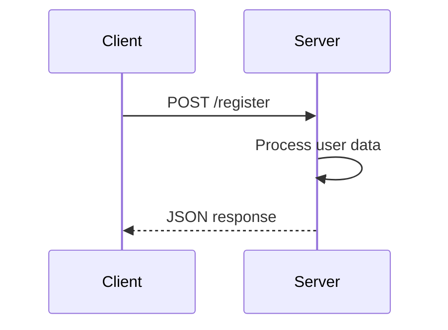

## 20.1.1 Understanding Microservices

As experienced Java developers, you're likely familiar with the monolithic architecture, where a single application is built as a cohesive unit. Transitioning to Clojure offers an opportunity to explore microservices architecture, which contrasts sharply with the monolithic approach. In this section, we'll delve into what microservices are, their core principles, and the benefits they offer. We'll also draw parallels between Java and Clojure to help you understand how these concepts translate across languages.

### What are Microservices?

Microservices, or the microservice architecture, is an architectural style that structures an application as a collection of loosely coupled services. Each service is fine-grained and the protocols are lightweight. This approach allows for the independent deployment and scaling of services, which can be developed and maintained by small, autonomous teams.

#### Key Characteristics of Microservices

1. **Single Responsibility**: Each microservice is designed to perform a specific business function and does so independently. This aligns with the Single Responsibility Principle (SRP) in software design, ensuring that each service has a well-defined purpose.

2. **Decentralized Governance**: Unlike monolithic architectures, where a single technology stack is often enforced, microservices allow for decentralized governance. Teams can choose the best tools and technologies for their specific service, promoting innovation and flexibility.

3. **Independent Deployability**: Microservices can be deployed independently of one another. This means that a change in one service does not necessitate a redeployment of the entire application, reducing downtime and enabling continuous delivery.

4. **Scalability**: Each service can be scaled independently based on its demand. This is particularly beneficial for services with varying loads, allowing for efficient resource utilization.

5. **Fault Isolation**: In a microservices architecture, the failure of one service does not necessarily impact the entire system. This isolation improves the overall resilience of the application.

### Microservices vs. Monolithic Architecture

To better understand microservices, let's compare them with monolithic architecture:

| Feature                | Monolithic Architecture                          | Microservices Architecture                       |
|------------------------|--------------------------------------------------|--------------------------------------------------|
| **Structure**          | Single, unified codebase                         | Collection of independent services               |
| **Deployment**         | Entire application deployed as a unit            | Services deployed independently                  |
| **Scalability**        | Scale the entire application                     | Scale individual services                        |
| **Technology Stack**   | Uniform technology stack                         | Diverse technology choices per service           |
| **Fault Tolerance**    | Failure affects the entire application           | Failure isolated to individual services          |
| **Development Teams**  | Large, centralized teams                         | Small, autonomous teams                          |

### Principles of Microservices

Microservices architecture is guided by several principles that ensure its effectiveness and efficiency:

1. **Service Autonomy**: Each service operates independently, with its own database and lifecycle. This autonomy allows teams to develop, test, and deploy services without dependencies on other teams.

2. **API-First Design**: Services communicate through well-defined APIs, often using REST or messaging protocols. This ensures clear contracts between services and facilitates integration.

3. **Continuous Delivery**: Microservices support continuous integration and delivery practices, enabling rapid and reliable deployment of services.

4. **Decentralized Data Management**: Each service manages its own data, which can lead to data duplication but ensures that services are not tightly coupled through a shared database.

5. **DevOps Culture**: Microservices encourage a DevOps culture, where development and operations teams collaborate closely to automate and streamline the deployment process.

### Benefits of Microservices

Microservices offer several advantages over traditional monolithic architectures:

- **Scalability**: Services can be scaled independently, allowing for efficient resource allocation and cost savings.
- **Flexibility in Technology Choices**: Teams can choose the best tools and technologies for their specific service, fostering innovation and adaptability.
- **Improved Fault Isolation**: The failure of one service does not bring down the entire application, enhancing system reliability.
- **Faster Time to Market**: Independent deployability and continuous delivery practices enable faster release cycles and quicker response to market changes.
- **Enhanced Team Productivity**: Small, autonomous teams can work on different services simultaneously, reducing bottlenecks and increasing productivity.

### Clojure and Microservices

Clojure, with its emphasis on simplicity and functional programming, is well-suited for building microservices. Here are some reasons why Clojure is a great fit for microservices:

- **Immutability**: Clojure's immutable data structures reduce the risk of side effects, making it easier to reason about service behavior and ensuring consistency across distributed systems.
- **Concurrency**: Clojure provides powerful concurrency primitives, such as atoms, refs, and agents, which are essential for building responsive and resilient microservices.
- **Interoperability**: Clojure runs on the Java Virtual Machine (JVM), allowing seamless integration with existing Java libraries and tools, which is beneficial for teams transitioning from Java to Clojure.
- **Expressiveness**: Clojure's concise syntax and functional programming paradigm enable developers to write clean, maintainable code, which is crucial for managing the complexity of microservices.

### Clojure Code Example: A Simple Microservice

Let's look at a simple Clojure microservice that handles user registration. This example demonstrates how to define a RESTful API endpoint using Clojure's Ring and Compojure libraries.

```clojure
(ns user-registration.core
  (:require [ring.adapter.jetty :refer [run-jetty]]
            [compojure.core :refer [defroutes GET POST]]
            [compojure.route :as route]
            [ring.util.response :refer [response]]))

;; Define a handler for user registration
(defn register-user [request]
  (let [user-data (:body request)]
    ;; Process user data and register the user
    ;; For simplicity, we'll just return a success message
    (response {:status "success" :message "User registered successfully"})))

;; Define routes
(defroutes app-routes
  (POST "/register" request (register-user request))
  (route/not-found "Not Found"))

;; Start the Jetty server
(defn -main []
  (run-jetty app-routes {:port 3000 :join? false}))

;; Run the server by executing (-main)
```

**Explanation:**

- We use the `ring.adapter.jetty` to run a Jetty server, which serves our application.
- The `compojure.core` library helps define routes for our microservice.
- The `register-user` function processes incoming POST requests to the `/register` endpoint.
- The `response` function from `ring.util.response` is used to send a JSON response back to the client.

### Java Code Comparison

Here's how a similar service might look in Java using Spring Boot:

```java
import org.springframework.boot.SpringApplication;
import org.springframework.boot.autoconfigure.SpringBootApplication;
import org.springframework.web.bind.annotation.*;

@SpringBootApplication
@RestController
public class UserRegistrationApplication {

    public static void main(String[] args) {
        SpringApplication.run(UserRegistrationApplication.class, args);
    }

    @PostMapping("/register")
    public ResponseEntity<String> registerUser(@RequestBody User user) {
        // Process user data and register the user
        // For simplicity, we'll just return a success message
        return ResponseEntity.ok("{\"status\":\"success\",\"message\":\"User registered successfully\"}");
    }
}
```

**Comparison:**

- Both examples define a RESTful API endpoint for user registration.
- Clojure's concise syntax allows for a more compact representation of the service.
- Java's Spring Boot provides a rich ecosystem and tooling support, which is beneficial for large-scale applications.

### Try It Yourself

To experiment with the Clojure example, try modifying the `register-user` function to validate user data before registration. You can also add more endpoints to handle user login and profile updates.

### Diagrams and Visualizations

Below is a Mermaid.js diagram illustrating the flow of a request through the microservice:



*Diagram Caption*: This sequence diagram shows the interaction between a client and the server during a user registration request.

### Further Reading

For more information on microservices and Clojure, consider exploring the following resources:

- [Official Clojure Documentation](https://clojure.org/)
- [ClojureDocs](https://clojuredocs.org/)
- [Spring Boot Documentation](https://spring.io/projects/spring-boot)

### Exercises

1. **Exercise 1**: Extend the Clojure microservice to include a GET endpoint that retrieves user information based on a user ID.
2. **Exercise 2**: Implement error handling in the `register-user` function to return appropriate HTTP status codes for different error scenarios.
3. **Exercise 3**: Compare the performance of the Clojure microservice with a similar Java microservice using a load testing tool like Apache JMeter.

### Key Takeaways

- Microservices architecture offers scalability, flexibility, and improved fault isolation compared to monolithic architectures.
- Clojure's features, such as immutability and concurrency support, make it an excellent choice for building microservices.
- Understanding the principles of microservices, such as service autonomy and API-first design, is crucial for successful implementation.
- Experimenting with code examples and exercises helps reinforce learning and understanding of microservices concepts.

Now that we've explored the fundamentals of microservices, let's apply these concepts to build robust and scalable applications using Clojure.

## Quiz: Mastering Microservices Architecture with Clojure



### What is a key characteristic of microservices architecture?

- [x] Independent deployability
- [ ] Single codebase
- [ ] Centralized governance
- [ ] Uniform technology stack

> **Explanation:** Microservices architecture allows for independent deployability, meaning each service can be deployed independently of others.

### Which principle is crucial for microservices?

- [x] Service autonomy
- [ ] Shared database
- [ ] Monolithic deployment
- [ ] Centralized control

> **Explanation:** Service autonomy ensures that each microservice operates independently, with its own data and lifecycle.

### What is a benefit of using microservices?

- [x] Improved fault isolation
- [ ] Increased complexity
- [ ] Single point of failure
- [ ] Uniform technology stack

> **Explanation:** Microservices improve fault isolation, meaning the failure of one service does not affect the entire system.

### How does Clojure's immutability benefit microservices?

- [x] Reduces side effects
- [ ] Increases side effects
- [ ] Requires shared state
- [ ] Complicates concurrency

> **Explanation:** Clojure's immutability reduces side effects, making it easier to reason about service behavior.

### What is a challenge of microservices architecture?

- [x] Increased complexity
- [ ] Simplified deployment
- [ ] Single technology stack
- [ ] Centralized data management

> **Explanation:** Microservices architecture can lead to increased complexity due to the need to manage multiple services.

### Which Clojure feature supports concurrency in microservices?

- [x] Atoms
- [ ] Reflection
- [ ] Inheritance
- [ ] Shared state

> **Explanation:** Clojure's atoms provide a way to manage state changes safely in a concurrent environment.

### What is a common communication protocol for microservices?

- [x] REST
- [ ] FTP
- [ ] SMTP
- [ ] POP3

> **Explanation:** REST is a common protocol used for communication between microservices.

### How does Clojure's expressiveness benefit microservices development?

- [x] Enables concise code
- [ ] Requires verbose code
- [ ] Complicates syntax
- [ ] Limits functionality

> **Explanation:** Clojure's expressiveness enables developers to write concise and maintainable code.

### What is a principle of microservices architecture?

- [x] API-first design
- [ ] Shared database
- [ ] Monolithic structure
- [ ] Centralized deployment

> **Explanation:** API-first design ensures clear contracts between services, facilitating integration.

### Is Clojure's interoperability with Java beneficial for microservices?

- [x] True
- [ ] False

> **Explanation:** Clojure's interoperability with Java allows seamless integration with existing Java libraries and tools, which is beneficial for microservices development.


