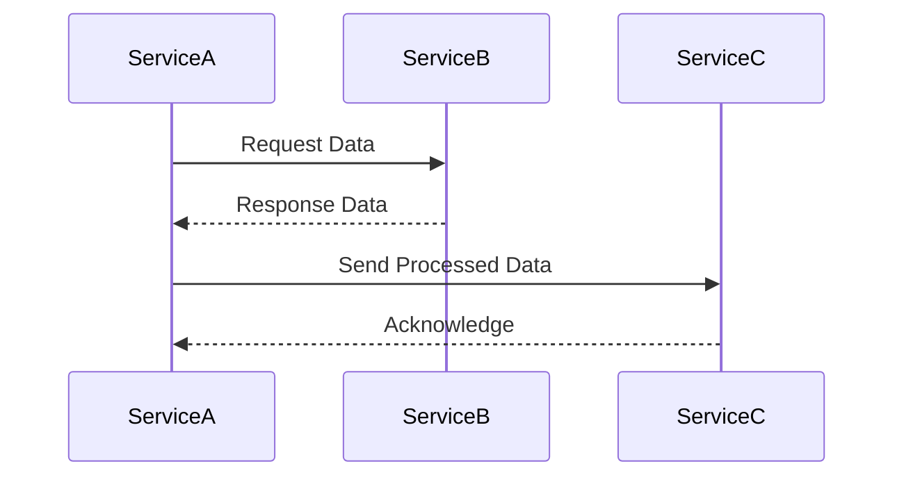
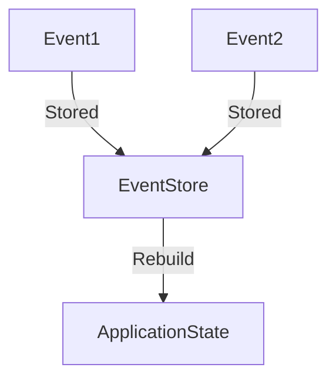

## 20.1.2 Challenges of Microservices

Microservices architecture has become a popular choice for building scalable and flexible systems. However, it introduces a set of challenges that developers must address to ensure successful implementation. In this section, we will explore these challenges and discuss strategies to mitigate them, particularly using Clojure. We'll draw parallels with Java to help experienced Java developers transition smoothly to Clojure.

### Understanding the Complexities of Microservices

Microservices architecture breaks down a monolithic application into smaller, independent services that communicate with each other. While this approach offers numerous benefits, such as scalability and flexibility, it also introduces complexities that developers must manage.

#### Increased Operational Overhead

One of the primary challenges of microservices is the increased operational overhead. Each microservice runs as a separate process, requiring its own deployment, monitoring, and scaling. This can lead to a significant increase in the complexity of managing the system.

**Strategies to Mitigate Operational Overhead:**

1. **Adopt DevOps Practices:** Implementing DevOps practices can help streamline the deployment and management of microservices. Continuous integration and continuous deployment (CI/CD) pipelines automate the build, test, and deployment processes, reducing manual effort and errors.

2. **Use Containerization:** Tools like Docker can package microservices into containers, making them easier to deploy and manage. Containers provide a consistent environment for running services, reducing compatibility issues.

3. **Leverage Orchestration Tools:** Kubernetes is a popular choice for orchestrating containers. It automates the deployment, scaling, and management of containerized applications, reducing operational overhead.

#### Communication Between Services

Microservices must communicate with each other to function as a cohesive system. This communication can be complex, especially when services are distributed across different networks.

**Challenges in Service Communication:**

- **Network Latency:** Communication over a network introduces latency, which can affect the performance of the system.
- **Service Discovery:** Services need to discover each other dynamically, especially in a cloud environment where IP addresses can change.
- **Data Serialization:** Data exchanged between services must be serialized and deserialized, which can introduce overhead and potential errors.

**Strategies to Mitigate Communication Challenges:**

1. **Use Lightweight Protocols:** Protocols like HTTP/2 and gRPC are designed for efficient communication between services. They offer features like multiplexing and compression to reduce latency.

2. **Implement Service Discovery:** Tools like Consul and Eureka provide service discovery capabilities, allowing services to find each other dynamically.

3. **Standardize Data Formats:** Using standardized data formats like JSON or Protocol Buffers ensures consistency and reduces serialization errors.

#### Data Consistency

Maintaining data consistency across distributed services is a significant challenge in microservices architecture. Each service may have its own database, leading to potential inconsistencies.

**Challenges in Data Consistency:**

- **Eventual Consistency:** In a distributed system, achieving strong consistency can be difficult. Eventual consistency models allow for temporary inconsistencies, which can be challenging to manage.
- **Distributed Transactions:** Implementing transactions across multiple services is complex and can lead to performance issues.

**Strategies to Mitigate Data Consistency Challenges:**

1. **Use Event Sourcing:** Event sourcing captures all changes to the application state as a sequence of events. This approach can help maintain consistency across services.

2. **Implement Saga Patterns:** The Saga pattern manages distributed transactions by breaking them into a series of smaller, local transactions. Each service completes its transaction and publishes an event to trigger the next step.

3. **Adopt CQRS (Command Query Responsibility Segregation):** CQRS separates the read and write operations, allowing for more flexible data consistency models.

### Distributed System Challenges

Microservices architecture inherently involves distributed systems, which come with their own set of challenges.

#### Fault Tolerance and Resilience

In a distributed system, failures are inevitable. Services must be designed to handle failures gracefully to ensure system resilience.

**Strategies for Fault Tolerance:**

1. **Implement Circuit Breakers:** Circuit breakers prevent a service from repeatedly trying to execute an operation that is likely to fail, allowing the system to recover gracefully.

2. **Use Retry Mechanisms:** Implementing retry mechanisms with exponential backoff can help recover from transient failures.

3. **Design for Redundancy:** Redundancy ensures that if one instance of a service fails, others can take over, maintaining system availability.

#### Monitoring and Observability

With multiple services running independently, monitoring and observability become crucial for maintaining system health.

**Strategies for Monitoring and Observability:**

1. **Centralized Logging:** Aggregating logs from all services into a centralized system like ELK (Elasticsearch, Logstash, Kibana) allows for easier analysis and troubleshooting.

2. **Distributed Tracing:** Tools like Jaeger and Zipkin provide distributed tracing capabilities, helping track requests as they flow through the system.

3. **Metrics and Alerts:** Implementing metrics and alerts ensures that any issues are detected and addressed promptly.

### Clojure's Role in Addressing Microservices Challenges

Clojure, with its functional programming paradigm and emphasis on immutability, offers unique advantages in addressing the challenges of microservices.

#### Immutability and Concurrency

Clojure's immutable data structures and concurrency primitives, such as atoms, refs, and agents, simplify state management and concurrency, reducing the complexity of distributed systems.

**Code Example: Using Atoms for State Management**

```clojure
(def counter (atom 0))

(defn increment-counter []
  (swap! counter inc))

;; Increment the counter
(increment-counter)
;; => 1

;; The atom ensures thread-safe updates to the state
```

In this example, we use an atom to manage a shared state (`counter`). The `swap!` function ensures that updates are thread-safe, making it easier to manage state in a distributed system.

#### Functional Composition and Modularity

Clojure's emphasis on functional composition and modularity aligns well with the microservices architecture, where each service is a self-contained unit.

**Code Example: Composing Functions**

```clojure
(defn add [x y] (+ x y))
(defn multiply [x y] (* x y))

(defn add-and-multiply [a b c]
  (-> a
      (add b)
      (multiply c)))

;; Compose functions to perform operations
(add-and-multiply 2 3 4)
;; => 20
```

Here, we compose functions using the `->` threading macro, demonstrating how Clojure's functional composition can simplify complex operations within a microservice.

### Try It Yourself

Experiment with the code examples above by modifying the functions or adding new operations. For instance, try creating a new function that combines subtraction and division, and integrate it into the composition.

### Diagrams and Visualizations

To better understand the flow of data and interactions in a microservices architecture, let's visualize some of these concepts using Mermaid.js diagrams.

#### Service Communication Flow



*Caption:* This sequence diagram illustrates the communication flow between three microservices, highlighting the request-response pattern.

#### Data Consistency with Event Sourcing



*Caption:* This diagram represents the event sourcing pattern, where events are stored and used to rebuild the application state, ensuring data consistency.

### Further Reading

For more information on microservices architecture and Clojure, consider exploring the following resources:

- [Official Clojure Documentation](https://clojure.org/)
- [ClojureDocs](https://clojuredocs.org/)
- [Microservices Patterns](https://microservices.io/patterns/index.html)

### Exercises and Practice Problems

1. **Implement a Simple Microservice:** Create a basic microservice in Clojure that performs a specific task, such as processing data or managing a resource.

2. **Simulate Service Communication:** Develop two Clojure microservices that communicate with each other using HTTP requests. Implement a simple service discovery mechanism.

3. **Explore Data Consistency Models:** Experiment with different data consistency models in a Clojure application. Implement event sourcing or the Saga pattern to manage distributed transactions.

### Key Takeaways

- Microservices architecture introduces challenges such as increased operational overhead, complex service communication, and data consistency issues.
- Adopting DevOps practices, using appropriate tooling, and leveraging Clojure's features can help mitigate these challenges.
- Clojure's immutability, concurrency primitives, and functional composition offer unique advantages in building and managing microservices.
- Understanding and addressing these challenges is crucial for successful microservices implementation.

Now that we've explored the challenges of microservices and how Clojure can help address them, let's apply these concepts to build robust and scalable systems.

## Quiz: Mastering Microservices Challenges with Clojure



### What is a primary challenge of microservices architecture?

- [x] Increased operational overhead
- [ ] Simplified deployment
- [ ] Reduced complexity
- [ ] Enhanced monolithic structure

> **Explanation:** Microservices architecture increases operational overhead due to the need to manage multiple independent services.

### Which tool is commonly used for container orchestration in microservices?

- [x] Kubernetes
- [ ] Docker
- [ ] Jenkins
- [ ] Ansible

> **Explanation:** Kubernetes is a popular tool for orchestrating containers in microservices architecture.

### What is a common challenge in service communication?

- [x] Network latency
- [ ] Direct method calls
- [ ] Single-threaded execution
- [ ] In-memory data sharing

> **Explanation:** Network latency is a common challenge in service communication due to the distributed nature of microservices.

### Which pattern helps manage distributed transactions in microservices?

- [x] Saga pattern
- [ ] Singleton pattern
- [ ] Factory pattern
- [ ] Observer pattern

> **Explanation:** The Saga pattern helps manage distributed transactions by breaking them into smaller, local transactions.

### What is a benefit of using Clojure's immutable data structures in microservices?

- [x] Simplified state management
- [ ] Increased mutability
- [ ] Complex concurrency
- [ ] Direct memory access

> **Explanation:** Clojure's immutable data structures simplify state management, making it easier to handle concurrency.

### Which Clojure feature aids in composing functions for microservices?

- [x] Threading macros
- [ ] Reflection
- [ ] Inheritance
- [ ] Static typing

> **Explanation:** Threading macros in Clojure aid in composing functions, allowing for clear and concise code.

### What is a strategy to mitigate data consistency challenges in microservices?

- [x] Event sourcing
- [ ] Direct database access
- [ ] Single database for all services
- [ ] In-memory caching

> **Explanation:** Event sourcing captures changes as events, helping maintain data consistency across services.

### Which tool provides distributed tracing capabilities?

- [x] Jaeger
- [ ] Logstash
- [ ] Docker
- [ ] Ansible

> **Explanation:** Jaeger provides distributed tracing capabilities, helping track requests through the system.

### What is a key advantage of using DevOps practices in microservices?

- [x] Streamlined deployment
- [ ] Increased manual effort
- [ ] Reduced automation
- [ ] Enhanced monolithic structure

> **Explanation:** DevOps practices streamline deployment and management, reducing manual effort and errors.

### True or False: Clojure's concurrency primitives simplify managing distributed systems.

- [x] True
- [ ] False

> **Explanation:** Clojure's concurrency primitives, such as atoms and agents, simplify managing state and concurrency in distributed systems.


