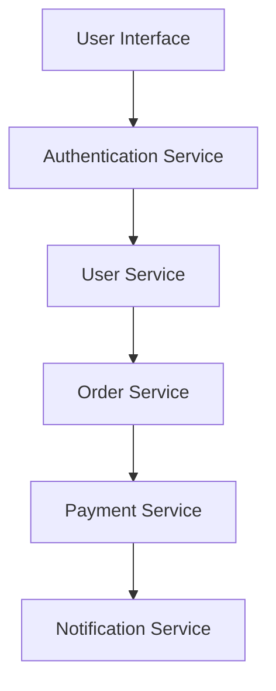

## 20.1.3 When to Use Microservices

Microservices architecture has gained significant traction in the software development community, offering a modular approach to building applications. However, it's crucial to recognize that microservices are not a one-size-fits-all solution. In this section, we'll explore the scenarios where adopting microservices is beneficial, particularly for Clojure developers transitioning from Java. We'll consider factors such as team size, application complexity, and organizational readiness.

### Understanding Microservices

Before diving into when to use microservices, let's briefly define what they are. Microservices are a style of software architecture where an application is composed of small, independent services that communicate over a network. Each service is responsible for a specific business capability and can be developed, deployed, and scaled independently.

#### Key Characteristics of Microservices

- **Decentralization**: Each service is autonomous, with its own database and deployment pipeline.
- **Scalability**: Services can be scaled independently based on demand.
- **Resilience**: Failure in one service does not necessarily affect others.
- **Flexibility**: Different services can be written in different programming languages or frameworks.

### When to Consider Microservices

Microservices architecture is not suitable for every project. Here are some scenarios where microservices might be the right choice:

#### 1. **Complex and Evolving Applications**

If your application is complex and expected to grow over time, microservices can help manage this complexity. By breaking down the application into smaller, manageable services, teams can focus on specific areas without affecting the entire system.

**Example**: Consider an e-commerce platform with modules for user management, product catalog, order processing, and payment. Each module can be a separate microservice, allowing teams to work independently and deploy updates without disrupting other parts of the system.

#### 2. **Scalability Requirements**

Microservices are ideal for applications that require high scalability. Since each service can be scaled independently, you can allocate resources where they are most needed.

**Example**: A video streaming service might need to scale its video processing service more than its user authentication service. Microservices allow for targeted scaling, optimizing resource usage.

#### 3. **Diverse Technology Stack**

If your team wants to leverage different technologies for different parts of the application, microservices provide the flexibility to do so. Each service can be built using the most suitable technology for its specific needs.

**Example**: A data analytics platform might use Clojure for data processing services and Python for machine learning services, taking advantage of each language's strengths.

#### 4. **Independent Deployment Cycles**

Microservices enable independent deployment cycles, which is beneficial for teams that need to release features quickly and frequently. This reduces the risk of deploying changes and allows for faster iteration.

**Example**: A social media platform can deploy updates to its messaging service without affecting the news feed service, allowing for continuous delivery and rapid user feedback.

#### 5. **Organizational Structure and Team Size**

Microservices can align well with organizations that have multiple small teams. Each team can own and manage a specific service, fostering ownership and accountability.

**Example**: A large organization with teams distributed across different locations can assign each team a microservice, enabling parallel development and reducing dependencies.

### When to Avoid Microservices

While microservices offer many benefits, they also introduce complexity. Here are some scenarios where microservices might not be the best fit:

#### 1. **Small and Simple Applications**

For small applications with limited functionality, the overhead of managing multiple services might outweigh the benefits. A monolithic architecture might be more efficient in such cases.

**Example**: A simple blog application with basic features like posting and commenting might not benefit from a microservices architecture.

#### 2. **Limited Resources and Expertise**

Microservices require a certain level of expertise and resources to manage effectively. If your team lacks experience with distributed systems or the necessary infrastructure, it might be challenging to implement microservices successfully.

**Example**: A startup with a small team and limited budget might struggle to manage the complexity of a microservices architecture.

#### 3. **Tightly Coupled Components**

If your application components are tightly coupled and require frequent communication, microservices might introduce unnecessary latency and complexity.

**Example**: An application where every user action requires data from multiple components might face performance issues with a microservices architecture.

### Clojure and Microservices

Clojure's functional programming paradigm and emphasis on immutability make it a strong candidate for building microservices. Let's explore how Clojure's features align with microservices architecture.

#### Immutability and Statelessness

Clojure's immutable data structures promote stateless services, which are easier to scale and manage. Stateless services can handle requests independently, improving resilience and scalability.

#### Concurrency and Parallelism

Clojure's concurrency primitives, such as atoms, refs, and agents, facilitate building concurrent services. These features help manage shared state and ensure consistency across distributed services.

#### Interoperability with Java

Clojure's seamless interoperability with Java allows developers to leverage existing Java libraries and tools, making it easier to integrate with other services in a microservices architecture.

### Code Example: Building a Simple Microservice in Clojure

Let's build a simple microservice in Clojure that handles user registration. We'll use Ring, a Clojure web application library, to create a RESTful API.

```clojure
(ns user-service.core
  (:require [ring.adapter.jetty :refer [run-jetty]]
            [ring.util.response :refer [response]]))

(defn register-user [request]
  ;; Extract user data from the request
  (let [user-data (:body request)]
    ;; Simulate user registration logic
    (println "Registering user:" user-data)
    ;; Return a success response
    (response {:status "success" :message "User registered successfully"})))

(defn app [request]
  ;; Route the request to the appropriate handler
  (case (:uri request)
    "/register" (register-user request)
    (response {:status "error" :message "Not Found"})))

(defn -main []
  ;; Start the Jetty server on port 3000
  (run-jetty app {:port 3000}))

;; To run the service, execute (-main) in the REPL
```

**Explanation**:
- We define a `register-user` function to handle user registration requests.
- The `app` function routes requests to the appropriate handler based on the URI.
- We use `run-jetty` to start a Jetty server and listen for incoming requests.

**Try It Yourself**: Modify the `register-user` function to validate user data before registration. Add error handling to return appropriate responses for invalid data.

### Diagram: Microservices Communication

Below is a diagram illustrating how microservices communicate with each other in a distributed system.



**Diagram Explanation**: This diagram shows a typical flow of requests in a microservices architecture. Each service communicates with others over a network, allowing for independent scaling and deployment.

### Challenges and Considerations

While microservices offer many advantages, they also come with challenges. Here are some considerations to keep in mind:

#### 1. **Network Latency and Reliability**

Microservices rely on network communication, which can introduce latency and reliability issues. It's essential to design services with these factors in mind.

#### 2. **Data Consistency**

Ensuring data consistency across distributed services can be challenging. Consider using eventual consistency models and distributed transactions where appropriate.

#### 3. **Monitoring and Logging**

With multiple services, monitoring and logging become more complex. Implement centralized logging and monitoring solutions to gain visibility into the system.

#### 4. **Security**

Each service needs to be secured independently. Implement authentication and authorization mechanisms to protect sensitive data and prevent unauthorized access.

### Conclusion

Microservices architecture can offer significant benefits in terms of scalability, flexibility, and resilience. However, it's essential to evaluate your application's needs and organizational readiness before adopting this approach. By understanding when to use microservices and leveraging Clojure's strengths, you can build robust and scalable systems that meet your business requirements.

### Key Takeaways

- Microservices are suitable for complex, scalable, and evolving applications.
- Consider team size, organizational structure, and technology stack when deciding to adopt microservices.
- Clojure's features, such as immutability and concurrency, align well with microservices architecture.
- Evaluate the trade-offs and challenges associated with microservices, such as network latency and data consistency.

### Further Reading

- [Official Clojure Documentation](https://clojure.org/)
- [ClojureDocs](https://clojuredocs.org/)
- [Microservices.io](https://microservices.io/)

### Exercises

1. **Design a Microservice**: Identify a component in your current application that could be refactored into a microservice. Outline the steps needed to achieve this.
2. **Implement a New Feature**: Add a new feature to the Clojure microservice example provided, such as user authentication or data validation.
3. **Evaluate Your Application**: Assess your current application's architecture. Determine if microservices could offer any benefits and justify your reasoning.

## Quiz: When to Use Microservices



### Which of the following is a key characteristic of microservices?

- [x] Decentralization
- [ ] Centralized database
- [ ] Single deployment pipeline
- [ ] Monolithic architecture

> **Explanation:** Microservices are decentralized, allowing each service to have its own database and deployment pipeline.

### When is microservices architecture most beneficial?

- [x] For complex and evolving applications
- [ ] For small and simple applications
- [ ] When resources are limited
- [ ] When components are tightly coupled

> **Explanation:** Microservices are beneficial for complex and evolving applications due to their modularity and scalability.

### What is a potential drawback of microservices?

- [x] Increased complexity
- [ ] Simplified deployment
- [ ] Reduced scalability
- [ ] Centralized logging

> **Explanation:** Microservices can increase complexity due to the need for managing multiple services and their interactions.

### How does Clojure's immutability benefit microservices?

- [x] Promotes stateless services
- [ ] Increases state management complexity
- [ ] Requires more resources
- [ ] Limits scalability

> **Explanation:** Immutability promotes stateless services, which are easier to scale and manage in a microservices architecture.

### What is a challenge associated with microservices?

- [x] Network latency
- [ ] Simplified monitoring
- [ ] Centralized security
- [ ] Single point of failure

> **Explanation:** Microservices rely on network communication, which can introduce latency and reliability issues.

### Which Clojure feature aids in building concurrent services?

- [x] Concurrency primitives
- [ ] Mutable data structures
- [ ] Centralized state management
- [ ] Single-threaded execution

> **Explanation:** Clojure's concurrency primitives, such as atoms and agents, facilitate building concurrent services.

### What is a benefit of independent deployment cycles in microservices?

- [x] Faster iteration
- [ ] Increased deployment risk
- [ ] Tighter coupling
- [ ] Reduced flexibility

> **Explanation:** Independent deployment cycles allow for faster iteration and reduced risk when deploying changes.

### When might a monolithic architecture be more efficient than microservices?

- [x] For small and simple applications
- [ ] For applications with high scalability needs
- [ ] When using diverse technology stacks
- [ ] For large and complex applications

> **Explanation:** A monolithic architecture might be more efficient for small and simple applications due to reduced overhead.

### How can microservices align with organizational structure?

- [x] By allowing teams to own specific services
- [ ] By centralizing all services
- [ ] By requiring large, centralized teams
- [ ] By limiting team autonomy

> **Explanation:** Microservices allow teams to own and manage specific services, fostering ownership and accountability.

### True or False: Microservices are always the best choice for any application.

- [ ] True
- [x] False

> **Explanation:** Microservices are not always the best choice; they are suitable for specific scenarios and can introduce complexity.


