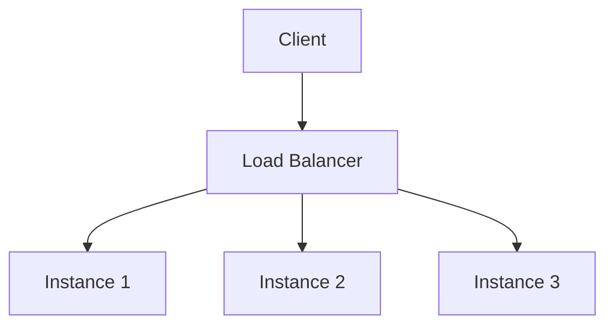

## 20.10.1 Designing for Resilience and Scalability

In the world of microservices, resilience and scalability are paramount. As experienced Java developers transitioning to Clojure, understanding how to design systems that can gracefully handle failures and scale efficiently is crucial. This section delves into best practices for building resilient and scalable microservices using Clojure, focusing on concepts such as circuit breakers, bulkheads, and fault tolerance patterns.

### Understanding Resilience and Scalability

**Resilience** refers to a system's ability to recover from failures and continue operating. In microservices, this means ensuring that a failure in one service does not cascade to others, maintaining overall system stability.

**Scalability** is the capability of a system to handle increased load by adding resources. In microservices, this often involves distributing services across multiple nodes or containers to manage demand effectively.

#### Key Concepts

- **Fault Tolerance**: The ability of a system to continue functioning in the event of a failure.
- **Circuit Breakers**: A pattern used to detect failures and encapsulate the logic of preventing a failure from constantly recurring.
- **Bulkheads**: A design pattern that isolates components to prevent failures from spreading.
- **Load Balancing**: Distributing workloads across multiple computing resources to ensure no single resource is overwhelmed.

### Implementing Circuit Breakers

Circuit breakers are a critical component in building resilient microservices. They prevent a system from repeatedly trying to execute an operation that's likely to fail, allowing it to recover gracefully.

#### How Circuit Breakers Work

A circuit breaker monitors the number of failures in a service call. If failures exceed a threshold, the circuit breaker trips, and subsequent calls fail immediately without attempting the operation. After a timeout, the circuit breaker allows a limited number of test calls to check if the service has recovered.

**Clojure Example:**

```clojure
(ns myapp.circuit-breaker
  (:require [clojure.core.async :as async]))

(defn circuit-breaker [operation failure-threshold timeout]
  (let [failure-count (atom 0)
        state (atom :closed)]
    (fn []
      (cond
        (= @state :open)
        (do
          (println "Circuit is open. Operation not allowed.")
          nil)

        (= @state :half-open)
        (do
          (println "Testing operation...")
          (try
            (let [result (operation)]
              (reset! failure-count 0)
              (reset! state :closed)
              result)
            (catch Exception e
              (swap! failure-count inc)
              (when (>= @failure-count failure-threshold)
                (reset! state :open))
              nil)))

        :else
        (try
          (let [result (operation)]
            (reset! failure-count 0)
            result)
          (catch Exception e
            (swap! failure-count inc)
            (when (>= @failure-count failure-threshold)
              (reset! state :open))
            nil))))))

;; Usage
(defn unreliable-operation []
  (if (< (rand) 0.5)
    (throw (Exception. "Operation failed"))
    "Success"))

(def breaker (circuit-breaker unreliable-operation 3 5000))

(dotimes [_ 10]
  (println (breaker)))
```

**Explanation:**

- **State Management**: The circuit breaker maintains a state (`:closed`, `:open`, `:half-open`) to determine whether to allow operations.
- **Failure Count**: An atom tracks the number of consecutive failures.
- **Operation Execution**: The operation is attempted, and the state is updated based on success or failure.

### Implementing Bulkheads

Bulkheads isolate different parts of a system to prevent a failure in one area from affecting others. This pattern is akin to compartmentalizing a ship to prevent it from sinking if one compartment is breached.

#### Bulkhead Pattern in Practice

In Clojure, we can implement bulkheads by using separate thread pools or channels for different services or operations, ensuring that a failure in one does not exhaust resources needed by others.

**Clojure Example:**

```clojure
(ns myapp.bulkhead
  (:require [clojure.core.async :as async]))

(defn bulkhead [operation pool-size]
  (let [pool (async/chan pool-size)]
    (fn []
      (async/go
        (async/>! pool :task)
        (try
          (let [result (operation)]
            (println "Operation succeeded:" result)
            result)
          (catch Exception e
            (println "Operation failed:" (.getMessage e))
            nil)
          (finally
            (async/<!! pool)))))))

;; Usage
(defn critical-operation []
  (if (< (rand) 0.7)
    (throw (Exception. "Critical operation failed"))
    "Critical success"))

(def bulkhead-op (bulkhead critical-operation 5))

(dotimes [_ 10]
  (bulkhead-op))
```

**Explanation:**

- **Channel as Bulkhead**: A channel with limited capacity acts as a bulkhead, controlling the number of concurrent operations.
- **Resource Isolation**: By limiting the number of concurrent tasks, we prevent resource exhaustion.

### Fault Tolerance Patterns

Fault tolerance patterns help systems continue operating in the face of failures. These patterns include retries, fallbacks, and timeouts.

#### Retry Pattern

Retries involve attempting an operation multiple times before failing. This is useful for transient failures, such as network issues.

**Clojure Example:**

```clojure
(defn retry [operation max-retries]
  (loop [attempt 1]
    (try
      (operation)
      (catch Exception e
        (if (< attempt max-retries)
          (do
            (println "Retrying operation...")
            (recur (inc attempt)))
          (println "Operation failed after retries"))))))

;; Usage
(retry unreliable-operation 3)
```

**Explanation:**

- **Loop for Retries**: A loop attempts the operation up to `max-retries` times.
- **Exception Handling**: Exceptions are caught, and retries are attempted until the limit is reached.

#### Fallback Pattern

Fallbacks provide an alternative action when an operation fails, ensuring that the system can continue to function.

**Clojure Example:**

```clojure
(defn fallback [operation fallback-operation]
  (try
    (operation)
    (catch Exception e
      (println "Operation failed, executing fallback.")
      (fallback-operation))))

;; Usage
(fallback unreliable-operation (fn [] "Fallback result"))
```

**Explanation:**

- **Fallback Execution**: If the primary operation fails, the fallback operation is executed.

### Load Balancing and Scalability

Load balancing distributes incoming requests across multiple instances of a service, ensuring no single instance is overwhelmed. This is crucial for scalability.

#### Load Balancing Strategies

- **Round Robin**: Distributes requests evenly across instances.
- **Least Connections**: Directs requests to the instance with the fewest active connections.
- **IP Hash**: Uses the client's IP address to determine which instance receives the request.

**Diagram: Load Balancing Strategies**



*Diagram Caption*: This diagram illustrates a load balancer distributing requests to multiple service instances.

### Monitoring and Observability

Monitoring and observability are essential for maintaining resilience and scalability. They provide insights into system performance and help identify issues before they impact users.

#### Key Metrics to Monitor

- **Latency**: The time taken to process a request.
- **Throughput**: The number of requests processed per unit time.
- **Error Rates**: The frequency of errors occurring in the system.
- **Resource Utilization**: CPU, memory, and network usage.

### Implementing Monitoring in Clojure

Clojure's ecosystem provides several libraries for monitoring and observability, such as [Metrics-Clojure](https://github.com/metrics-clojure/metrics-clojure) and [Prometheus](https://prometheus.io/).

**Clojure Example:**

```clojure
(ns myapp.monitoring
  (:require [metrics.core :as metrics]
            [metrics.timers :as timers]))

(def request-timer (timers/timer ["myapp" "requests"]))

(defn monitored-operation []
  (timers/time! request-timer
    (unreliable-operation)))

;; Usage
(monitored-operation)
```

**Explanation:**

- **Timer**: A timer is used to measure the duration of an operation.
- **Metrics Collection**: Metrics are collected and can be exported to monitoring systems like Prometheus.

### Exercises and Practice Problems

1. **Implement a Circuit Breaker**: Modify the circuit breaker example to include a half-open state that tests the operation before fully closing the circuit.
2. **Create a Bulkhead**: Implement a bulkhead pattern using core.async channels to isolate different operations in your application.
3. **Design a Retry Mechanism**: Extend the retry example to include exponential backoff between retries.
4. **Monitor a Clojure Application**: Set up a monitoring system using Metrics-Clojure and Prometheus to track key metrics in your application.

### Summary and Key Takeaways

- **Resilience and Scalability** are critical for microservices, ensuring they can handle failures and increased load.
- **Circuit Breakers** and **Bulkheads** are essential patterns for building resilient systems.
- **Fault Tolerance** patterns like retries and fallbacks help maintain system functionality during failures.
- **Load Balancing** is crucial for distributing requests and ensuring scalability.
- **Monitoring and Observability** provide insights into system performance and help identify issues early.

By applying these best practices, you can design Clojure microservices that are both resilient and scalable, capable of handling the demands of modern applications.

## Quiz: Test Your Knowledge on Resilience and Scalability in Clojure Microservices



### What is the primary purpose of a circuit breaker in microservices?

- [x] To prevent repeated execution of failing operations
- [ ] To balance load across multiple instances
- [ ] To isolate components within a system
- [ ] To monitor system performance

> **Explanation:** Circuit breakers prevent repeated execution of failing operations, allowing systems to recover gracefully.

### Which pattern isolates components to prevent failures from spreading?

- [ ] Circuit Breaker
- [x] Bulkhead
- [ ] Retry
- [ ] Fallback

> **Explanation:** Bulkheads isolate components to prevent failures from spreading, similar to compartments in a ship.

### What is a common strategy for load balancing?

- [x] Round Robin
- [ ] Circuit Breaking
- [ ] Fallback
- [ ] Retry

> **Explanation:** Round Robin is a common load balancing strategy that distributes requests evenly across instances.

### How does the retry pattern handle transient failures?

- [x] By attempting the operation multiple times
- [ ] By isolating the operation in a separate thread
- [ ] By immediately failing the operation
- [ ] By redirecting the operation to a fallback

> **Explanation:** The retry pattern handles transient failures by attempting the operation multiple times before failing.

### What is a key metric to monitor for system performance?

- [x] Latency
- [x] Throughput
- [ ] Circuit State
- [ ] Bulkhead Capacity

> **Explanation:** Latency and throughput are key metrics to monitor for system performance, indicating how quickly and efficiently requests are processed.

### What library can be used for monitoring in Clojure?

- [x] Metrics-Clojure
- [ ] CircuitBreaker-Clojure
- [ ] LoadBalancer-Clojure
- [ ] Retry-Clojure

> **Explanation:** Metrics-Clojure is a library used for monitoring and collecting metrics in Clojure applications.

### Which pattern provides an alternative action when an operation fails?

- [ ] Circuit Breaker
- [ ] Bulkhead
- [ ] Retry
- [x] Fallback

> **Explanation:** The fallback pattern provides an alternative action when an operation fails, ensuring continued functionality.

### What is the role of observability in microservices?

- [x] To provide insights into system performance
- [ ] To prevent failures from occurring
- [ ] To distribute requests across instances
- [ ] To isolate components within a system

> **Explanation:** Observability provides insights into system performance, helping identify issues before they impact users.

### Which pattern uses separate thread pools to prevent resource exhaustion?

- [ ] Circuit Breaker
- [x] Bulkhead
- [ ] Retry
- [ ] Fallback

> **Explanation:** The bulkhead pattern uses separate thread pools or channels to prevent resource exhaustion and isolate failures.

### True or False: Load balancing is only necessary for systems with high traffic.

- [ ] True
- [x] False

> **Explanation:** Load balancing is beneficial for any system to ensure even distribution of requests and prevent any single instance from being overwhelmed.


