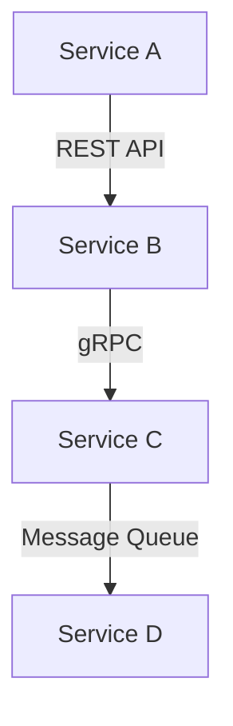

## 20.10.3 Documentation and Knowledge Sharing

In the world of microservices, where systems are composed of numerous small, independent services, **documentation and knowledge sharing** become crucial components of successful development and maintenance. As experienced Java developers transitioning to Clojure, you may already appreciate the importance of documentation in large-scale systems. However, the dynamic and distributed nature of microservices amplifies this need. In this section, we will explore the best practices for documenting Clojure microservices and sharing knowledge effectively within your team.

### The Importance of Documentation in Microservices

Documentation serves as the backbone of any software project, providing a reference for developers, stakeholders, and users. In microservices, documentation is even more critical due to the following reasons:

1. **Complexity Management**: Microservices architectures can become complex, with numerous services interacting with each other. Documentation helps manage this complexity by providing a clear overview of the system architecture.

2. **Onboarding New Team Members**: Well-documented code and architecture allow new developers to understand the system quickly, reducing the onboarding time.

3. **API Clarity**: Each microservice typically exposes APIs that need to be clearly documented to ensure correct usage by other services or external clients.

4. **Facilitating Maintenance**: As services evolve, documentation ensures that changes are tracked and understood, facilitating easier maintenance and updates.

5. **Knowledge Preservation**: Documentation acts as a repository of knowledge, preserving insights and decisions made during the development process.

### Types of Documentation in Microservices

Let's delve into the different types of documentation that are essential in a microservices architecture:

#### 1. **API Documentation**

API documentation is crucial for any microservice, as it defines how other services or clients can interact with it. In Clojure, tools like **Swagger** and **OpenAPI** can be used to generate comprehensive API documentation.

- **Swagger**: A powerful tool for designing, building, and documenting RESTful APIs. It allows you to define your API's endpoints, request/response formats, and authentication methods.

- **OpenAPI**: An open standard for defining APIs, which can be used with Swagger to create interactive documentation.

**Example**: Below is a simple example of how you might define an API endpoint in Clojure using Swagger.

```clojure
(ns my-service.api
  (:require [ring.swagger.swagger2 :refer [swagger-json]]
            [ring.swagger.ui :refer [swagger-ui]]
            [compojure.api.sweet :refer :all]))

(defapi app
  (swagger-ui)
  (swagger-json)
  (context "/api" []
    :tags ["example"]
    (GET "/hello" []
      :return String
      :summary "Returns a greeting message"
      (ok "Hello, World!"))))
```

In this example, we define a simple API with a single endpoint `/hello` that returns a greeting message. The `swagger-ui` and `swagger-json` functions are used to generate interactive documentation.

#### 2. **System Architecture Documentation**

Documenting the overall architecture of your microservices system is vital for understanding how different services interact. This can include:

- **Service Diagrams**: Visual representations of how services are connected and communicate with each other.

- **Data Flow Diagrams**: Illustrate how data moves through the system, highlighting key data transformations and storage points.

- **Deployment Diagrams**: Show how services are deployed across different environments, including cloud infrastructure and network configurations.

**Mermaid Diagram Example**: Below is a simple service diagram using Mermaid.js to illustrate the interaction between services.



*Diagram Caption*: This diagram shows a basic interaction flow between four services in a microservices architecture, highlighting the communication protocols used.

#### 3. **Code Documentation**

Code documentation involves writing clear and concise comments within your codebase to explain complex logic, algorithms, or design decisions. In Clojure, this can be achieved using docstrings and comments.

- **Docstrings**: Clojure supports docstrings, which are strings placed immediately after the function definition to describe its purpose and usage.

- **Comments**: Use comments to explain non-obvious code logic or to provide context for future developers.

**Example**: Below is a Clojure function with a docstring and comments.

```clojure
(defn calculate-sum
  "Calculates the sum of two numbers."
  [a b]
  ;; Ensure both inputs are numbers
  (when (and (number? a) (number? b))
    (+ a b)))
```

In this example, the docstring describes the function's purpose, while the comment explains a key validation step.

#### 4. **Operational Documentation**

Operational documentation provides insights into how services are deployed, monitored, and maintained. This includes:

- **Deployment Guides**: Instructions on how to deploy services, including configuration files and environment variables.

- **Monitoring and Logging**: Documentation on how to monitor service health and performance, and how to interpret logs.

- **Incident Response**: Procedures for handling service outages or incidents, including contact information and escalation paths.

### Tools for Documentation and Knowledge Sharing

Several tools can aid in creating and maintaining documentation for Clojure microservices:

- **Confluence**: A collaboration tool that allows teams to create, share, and collaborate on documentation in a centralized location.

- **GitHub/GitLab Wikis**: Integrated wikis that can be used to document codebases, APIs, and system architecture.

- **JIRA**: While primarily a project management tool, JIRA can be used to track documentation tasks and link them to development work.

- **Slack/Teams**: Communication platforms that can facilitate knowledge sharing through channels dedicated to documentation and best practices.

### Best Practices for Effective Documentation

To ensure your documentation is effective and useful, consider the following best practices:

1. **Keep Documentation Up-to-Date**: Regularly update documentation to reflect changes in the codebase or system architecture.

2. **Use Clear and Concise Language**: Avoid jargon and write in a way that is easy to understand for all team members.

3. **Leverage Visuals**: Use diagrams and charts to complement textual documentation and provide a visual understanding of complex concepts.

4. **Encourage Contributions**: Foster a culture where team members are encouraged to contribute to documentation, ensuring diverse perspectives and comprehensive coverage.

5. **Review and Revise**: Regularly review documentation for accuracy and completeness, and revise as necessary.

### Knowledge Sharing Strategies

In addition to documentation, effective knowledge sharing is crucial for the success of microservices teams. Here are some strategies to enhance knowledge sharing:

#### 1. **Regular Knowledge Sharing Sessions**

Organize regular sessions where team members can share insights, challenges, and solutions. This can be in the form of:

- **Brown Bag Sessions**: Informal meetings where team members present on topics of interest during lunch breaks.

- **Tech Talks**: More formal presentations on specific technical topics, followed by Q&A sessions.

- **Code Reviews**: Encourage peer reviews of code to share knowledge and improve code quality.

#### 2. **Mentorship Programs**

Establish mentorship programs where experienced developers guide newer team members. This can help transfer knowledge and build a supportive team culture.

#### 3. **Documentation Sprints**

Organize documentation sprints where the team focuses on creating or updating documentation. This can be a collaborative effort to ensure comprehensive coverage.

#### 4. **Use of Collaborative Tools**

Leverage collaborative tools like Confluence, Slack, or Microsoft Teams to facilitate real-time communication and knowledge sharing.

### Challenges in Documentation and Knowledge Sharing

Despite the benefits, there are challenges associated with documentation and knowledge sharing in microservices:

- **Keeping Documentation Current**: As services evolve, keeping documentation up-to-date can be challenging.

- **Balancing Detail and Brevity**: Finding the right balance between providing enough detail and keeping documentation concise.

- **Encouraging Participation**: Motivating team members to contribute to documentation and share knowledge can be difficult.

### Overcoming Challenges

To overcome these challenges, consider the following approaches:

- **Automate Documentation**: Use tools that automatically generate documentation from code comments or API definitions.

- **Set Documentation Standards**: Establish clear standards for documentation to ensure consistency and quality.

- **Recognize Contributions**: Acknowledge and reward team members who contribute to documentation and knowledge sharing.

### Conclusion

In conclusion, documentation and knowledge sharing are vital components of successful microservices architecture. By implementing best practices and leveraging the right tools, teams can ensure that their Clojure microservices are well-documented and that knowledge is effectively shared among team members. This not only improves the maintainability and scalability of the system but also fosters a collaborative and informed team culture.

### Key Takeaways

- **Documentation is Essential**: It provides clarity, facilitates onboarding, and aids in maintenance.
- **Use the Right Tools**: Leverage tools like Swagger, Confluence, and GitHub Wikis for effective documentation.
- **Foster a Culture of Knowledge Sharing**: Encourage regular knowledge sharing sessions and mentorship programs.
- **Overcome Challenges**: Automate documentation and set standards to keep documentation current and consistent.

### Exercises

1. **Create API Documentation**: Using Swagger, document an existing Clojure microservice API. Include endpoint definitions, request/response formats, and authentication methods.

2. **Develop a System Architecture Diagram**: Create a visual representation of your microservices architecture using Mermaid.js. Include service interactions and communication protocols.

3. **Organize a Knowledge Sharing Session**: Plan and conduct a knowledge sharing session within your team. Choose a topic relevant to your current project and encourage team participation.

4. **Review and Update Documentation**: Select a section of your project's documentation and update it to reflect recent changes. Ensure clarity and completeness.

5. **Implement a Mentorship Program**: Design a mentorship program for your team. Define goals, pair mentors with mentees, and establish regular check-ins.

### Further Reading

- [Official Clojure Documentation](https://clojure.org/documentation)
- [Swagger Documentation](https://swagger.io/docs/)
- [Confluence Documentation](https://www.atlassian.com/software/confluence/guides)

## Quiz: Mastering Documentation and Knowledge Sharing in Clojure Microservices



### What is the primary purpose of documentation in microservices?

- [x] To manage complexity and facilitate maintenance
- [ ] To increase code execution speed
- [ ] To reduce the number of services
- [ ] To eliminate the need for testing

> **Explanation:** Documentation helps manage complexity, facilitates maintenance, and provides clarity on system architecture and APIs.

### Which tool is commonly used for generating API documentation in Clojure?

- [x] Swagger
- [ ] JIRA
- [ ] Confluence
- [ ] Slack

> **Explanation:** Swagger is a popular tool for designing, building, and documenting RESTful APIs in Clojure.

### What type of diagram illustrates how services are connected and communicate in a microservices architecture?

- [x] Service Diagram
- [ ] Deployment Diagram
- [ ] Class Diagram
- [ ] Sequence Diagram

> **Explanation:** Service diagrams visually represent how services are connected and communicate in a microservices architecture.

### What is a key benefit of regular knowledge sharing sessions?

- [x] They facilitate the exchange of insights and solutions among team members.
- [ ] They eliminate the need for documentation.
- [ ] They increase the number of microservices.
- [ ] They reduce the complexity of the codebase.

> **Explanation:** Regular knowledge sharing sessions facilitate the exchange of insights and solutions, enhancing team collaboration and understanding.

### Which of the following is a challenge in documentation and knowledge sharing?

- [x] Keeping documentation current
- [ ] Increasing code execution speed
- [ ] Reducing the number of services
- [ ] Eliminating the need for testing

> **Explanation:** Keeping documentation current is a common challenge due to the evolving nature of microservices.

### What is a recommended strategy to overcome documentation challenges?

- [x] Automate documentation generation
- [ ] Increase the number of services
- [ ] Eliminate code comments
- [ ] Reduce team size

> **Explanation:** Automating documentation generation helps keep documentation current and reduces manual effort.

### What is the role of docstrings in Clojure?

- [x] To describe the purpose and usage of functions
- [ ] To increase code execution speed
- [ ] To eliminate the need for testing
- [ ] To reduce the number of services

> **Explanation:** Docstrings in Clojure describe the purpose and usage of functions, aiding in code understanding and maintenance.

### Which tool can be used for centralized documentation and collaboration?

- [x] Confluence
- [ ] JIRA
- [ ] Slack
- [ ] GitHub

> **Explanation:** Confluence is a collaboration tool that allows teams to create, share, and collaborate on documentation in a centralized location.

### What is a benefit of using visuals in documentation?

- [x] They provide a visual understanding of complex concepts.
- [ ] They eliminate the need for text.
- [ ] They increase code execution speed.
- [ ] They reduce the number of services.

> **Explanation:** Visuals complement textual documentation by providing a visual understanding of complex concepts, making them easier to grasp.

### True or False: Documentation is only necessary during the initial development phase of a microservice.

- [ ] True
- [x] False

> **Explanation:** Documentation is necessary throughout the lifecycle of a microservice, including development, maintenance, and updates.


