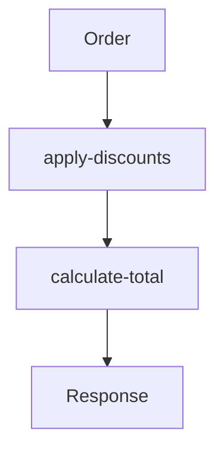

## 20.2.3 Implementing Business Logic in Clojure Microservices

In this section, we will explore how to implement the core functionality of a microservice using Clojure, focusing on clean, pure functions and functional programming principles. We'll cover handling requests, processing data, and returning responses, all while leveraging Clojure's unique features to create efficient and maintainable business logic.

### Understanding Business Logic in Microservices

Business logic is the heart of any application, encapsulating the rules and operations that define how data is processed and transformed. In a microservices architecture, each service is responsible for a specific piece of business logic, allowing for modular and scalable systems. Implementing business logic in Clojure involves embracing functional programming paradigms, such as immutability and pure functions, to ensure code that is both robust and easy to maintain.

### Functional Programming Principles

Before diving into code, let's briefly revisit some key functional programming principles that will guide our implementation:

- **Immutability**: Data structures in Clojure are immutable by default, meaning they cannot be changed after creation. This leads to safer and more predictable code.
- **Pure Functions**: Functions that always produce the same output for the same input and have no side effects. They are easier to test and reason about.
- **Higher-Order Functions**: Functions that can take other functions as arguments or return them as results, enabling powerful abstractions and code reuse.
- **First-Class Functions**: Functions are treated as first-class citizens, meaning they can be passed around just like any other data.

### Implementing Business Logic with Pure Functions

Let's start by implementing a simple business logic function in Clojure. Suppose we have a microservice responsible for processing orders. Our business logic will include calculating the total price of an order, applying discounts, and determining the final amount.

```clojure
(defn calculate-total
  "Calculates the total price of an order, applying discounts if applicable."
  [order]
  (let [items (:items order)
        discount (:discount order 0)
        total (reduce + (map :price items))]
    (* total (- 1 discount))))
```

**Explanation:**

- **`calculate-total`**: This function takes an `order` map as input.
- **`items`**: Extracts the list of items from the order.
- **`discount`**: Retrieves the discount value, defaulting to 0 if not present.
- **`total`**: Uses `reduce` and `map` to sum up the prices of all items.
- **`(* total (- 1 discount))`**: Applies the discount to the total price.

### Handling Requests and Responses

In a microservice, business logic is often triggered by incoming requests. Let's see how we can handle HTTP requests using Clojure's Ring library, which provides a simple and flexible way to build web applications.

```clojure
(require '[ring.adapter.jetty :refer [run-jetty]]
         '[ring.util.response :refer [response]])

(defn handle-order-request
  "Handles an incoming order request and returns the total price."
  [request]
  (let [order (:body request)
        total (calculate-total order)]
    (response {:total total})))

(defn start-server []
  (run-jetty handle-order-request {:port 3000}))
```

**Explanation:**

- **`handle-order-request`**: This function processes incoming HTTP requests. It extracts the order from the request body and calculates the total using our `calculate-total` function.
- **`response`**: Constructs an HTTP response with the calculated total.
- **`start-server`**: Starts a Jetty server on port 3000, using `handle-order-request` to handle incoming requests.

### Data Processing and Transformation

Clojure excels at data processing and transformation, thanks to its rich set of collection functions. Let's enhance our business logic by adding a feature to apply different types of discounts based on order size.

```clojure
(defn apply-discounts
  "Applies discounts based on the number of items in the order."
  [order]
  (let [item-count (count (:items order))
        discount (cond
                   (> item-count 10) 0.15
                   (> item-count 5) 0.10
                   :else 0)]
    (assoc order :discount discount)))

(defn process-order
  "Processes an order by applying discounts and calculating the total."
  [order]
  (-> order
      apply-discounts
      calculate-total))
```

**Explanation:**

- **`apply-discounts`**: Determines the discount based on the number of items in the order and updates the order map with the discount.
- **`process-order`**: Uses the `->` threading macro to apply discounts and calculate the total in a clear and readable manner.

### Comparing with Java

To highlight the differences between Clojure and Java, let's compare the above logic with a similar implementation in Java. In Java, you might use classes and methods to achieve the same functionality:

```java
public class OrderProcessor {
    public double calculateTotal(Order order) {
        double total = order.getItems().stream()
                            .mapToDouble(Item::getPrice)
                            .sum();
        double discount = order.getDiscount();
        return total * (1 - discount);
    }

    public Order applyDiscounts(Order order) {
        int itemCount = order.getItems().size();
        double discount = itemCount > 10 ? 0.15 : itemCount > 5 ? 0.10 : 0;
        order.setDiscount(discount);
        return order;
    }

    public double processOrder(Order order) {
        applyDiscounts(order);
        return calculateTotal(order);
    }
}
```

**Key Differences:**

- **Immutability**: In Java, we often modify objects in place, whereas Clojure encourages creating new data structures.
- **Conciseness**: Clojure's functional style allows for more concise and expressive code.
- **Threading Macros**: Clojure's `->` macro simplifies chaining operations, improving readability.

### Try It Yourself

Experiment with the Clojure code by modifying the discount logic or adding new features. For example, try implementing a loyalty program that offers additional discounts to returning customers.

### Visualizing Data Flow

To better understand how data flows through our functions, let's use a Mermaid.js diagram to illustrate the process:



**Diagram Explanation**: This flowchart shows the sequence of operations in our business logic, starting with the order, applying discounts, calculating the total, and returning the response.

### Handling Concurrency

Clojure provides powerful concurrency primitives, such as atoms, refs, and agents, to manage state changes safely. Let's see how we can use atoms to handle concurrent order processing.

```clojure
(def orders (atom []))

(defn add-order
  "Adds a new order to the list of orders."
  [order]
  (swap! orders conj order))

(defn process-orders
  "Processes all orders concurrently."
  []
  (doseq [order @orders]
    (println "Processing order:" (process-order order))))
```

**Explanation:**

- **`orders`**: An atom that holds a list of orders.
- **`add-order`**: Adds a new order to the list using `swap!`, which safely updates the atom's state.
- **`process-orders`**: Processes each order in the list, demonstrating how to handle concurrency in Clojure.

### Exercises

1. **Extend the Business Logic**: Add a feature to calculate shipping costs based on the order's total weight.
2. **Implement Error Handling**: Modify the `handle-order-request` function to handle invalid orders gracefully.
3. **Optimize for Performance**: Use Clojure's `pmap` to process orders in parallel and measure the performance improvement.

### Key Takeaways

- **Functional Programming**: Embrace immutability and pure functions to create robust and maintainable business logic.
- **Concurrency**: Leverage Clojure's concurrency primitives to handle state changes safely in a microservices environment.
- **Data Processing**: Utilize Clojure's rich set of collection functions for efficient data transformation.

By applying these principles and techniques, you can implement effective and scalable business logic in your Clojure microservices. Now that we've explored these concepts, let's continue to build upon them as we delve deeper into the world of Clojure.

### Further Reading

- [Official Clojure Documentation](https://clojure.org/reference/documentation)
- [ClojureDocs](https://clojuredocs.org/)
- [Ring Library on GitHub](https://github.com/ring-clojure/ring)

## Quiz: Mastering Business Logic in Clojure Microservices



### What is a key benefit of using pure functions in business logic?

- [x] They are easier to test and reason about.
- [ ] They allow for mutable state.
- [ ] They require less memory.
- [ ] They are faster than impure functions.

> **Explanation:** Pure functions are easier to test and reason about because they always produce the same output for the same input and have no side effects.

### How does Clojure handle data immutability?

- [x] By default, data structures are immutable.
- [ ] By allowing direct modification of data structures.
- [ ] By using mutable data structures.
- [ ] By requiring explicit locks for data access.

> **Explanation:** In Clojure, data structures are immutable by default, which leads to safer and more predictable code.

### What is the purpose of the `->` threading macro in Clojure?

- [x] To chain operations in a readable manner.
- [ ] To create loops.
- [ ] To handle exceptions.
- [ ] To define functions.

> **Explanation:** The `->` threading macro is used to chain operations in a readable manner, improving code clarity.

### Which Clojure concurrency primitive is used to manage state changes safely?

- [x] Atoms
- [ ] Threads
- [ ] Locks
- [ ] Arrays

> **Explanation:** Atoms are a concurrency primitive in Clojure used to manage state changes safely.

### What is a key difference between Clojure and Java in handling data?

- [x] Clojure uses immutable data structures by default.
- [ ] Java uses immutable data structures by default.
- [ ] Clojure requires explicit memory management.
- [ ] Java supports first-class functions.

> **Explanation:** Clojure uses immutable data structures by default, whereas Java typically uses mutable data structures.

### How can you apply discounts based on the number of items in an order in Clojure?

- [x] By using a `cond` expression to determine the discount.
- [ ] By modifying the order object directly.
- [ ] By using a loop to iterate over items.
- [ ] By creating a new class for each discount type.

> **Explanation:** A `cond` expression can be used to determine the discount based on the number of items in an order.

### What is the role of the `response` function in handling HTTP requests?

- [x] To construct an HTTP response.
- [ ] To parse the request body.
- [ ] To start the server.
- [ ] To handle concurrency.

> **Explanation:** The `response` function is used to construct an HTTP response in Clojure's Ring library.

### Which of the following is a higher-order function in Clojure?

- [x] `map`
- [ ] `if`
- [ ] `def`
- [ ] `let`

> **Explanation:** `map` is a higher-order function in Clojure that takes a function and a collection as arguments.

### What is the advantage of using `pmap` in Clojure?

- [x] It processes data in parallel.
- [ ] It simplifies error handling.
- [ ] It reduces memory usage.
- [ ] It improves code readability.

> **Explanation:** `pmap` processes data in parallel, which can lead to performance improvements.

### True or False: Clojure's immutability leads to safer and more predictable code.

- [x] True
- [ ] False

> **Explanation:** Clojure's immutability leads to safer and more predictable code because data structures cannot be changed after creation.


