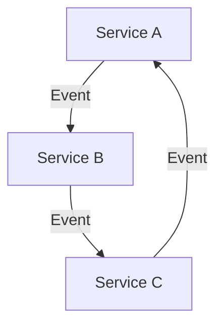
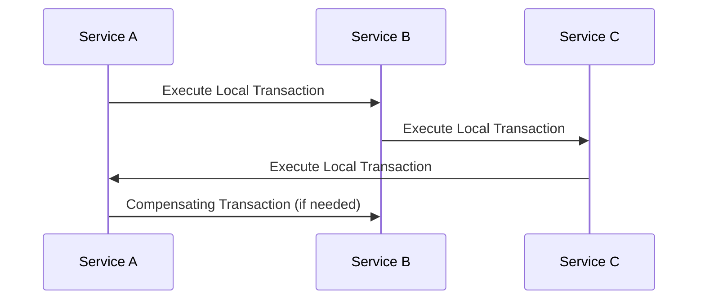

## 20.2.4 Data Storage and Persistence

In the realm of microservices, data storage and persistence are critical components that can significantly impact the scalability, performance, and reliability of your applications. As experienced Java developers transitioning to Clojure, you will find that Clojure offers unique paradigms and tools that can simplify and enhance your approach to data management. In this section, we will explore various data storage strategies, discuss the pros and cons of different approaches, and delve into how to manage data consistency and integrity effectively.

### Understanding Data Storage in Microservices

Microservices architecture promotes the decomposition of a monolithic application into smaller, independent services. Each service is responsible for a specific business capability and often has its own data storage. This approach provides several benefits, such as improved scalability, flexibility, and the ability to use different storage technologies optimized for each service's needs.

#### Separate Databases per Service

One common pattern in microservices is to have a separate database for each service. This approach aligns with the principle of service autonomy, allowing each service to choose the most suitable database technology and schema design.

**Advantages:**
- **Service Independence:** Each service can evolve independently without affecting others.
- **Optimized Storage:** Services can choose databases that best fit their specific requirements (e.g., SQL, NoSQL, in-memory databases).
- **Fault Isolation:** Issues in one service's database do not directly impact others.

**Disadvantages:**
- **Data Duplication:** Some data may need to be duplicated across services, leading to potential inconsistencies.
- **Complex Transactions:** Implementing transactions that span multiple services can be challenging.
- **Increased Operational Overhead:** Managing multiple databases can increase complexity.

#### Shared Data Stores

Alternatively, some microservices architectures use a shared data store, where multiple services access the same database. This approach can simplify data management but may introduce tight coupling between services.

**Advantages:**
- **Simplified Data Access:** Services can easily access shared data without duplication.
- **Consistent Data View:** A single source of truth for shared data can reduce inconsistencies.

**Disadvantages:**
- **Tight Coupling:** Services become dependent on the shared database schema, reducing flexibility.
- **Scalability Challenges:** A single database can become a bottleneck as the system grows.
- **Complexity in Data Access Control:** Ensuring proper access control and data integrity can be more challenging.

### Managing Data Consistency and Integrity

In a microservices architecture, maintaining data consistency and integrity is crucial, especially when services have their own databases. Let's explore some strategies to address these challenges.

#### Event-Driven Architecture

An event-driven architecture can help manage data consistency across services. Services publish events when their data changes, and other services subscribe to these events to update their own data accordingly.

**Benefits:**
- **Loose Coupling:** Services communicate through events, reducing direct dependencies.
- **Scalability:** Event-driven systems can scale independently as services only need to handle their own events.

**Challenges:**
- **Eventual Consistency:** Data may not be immediately consistent across services.
- **Complexity in Event Handling:** Designing and managing event flows can be complex.

#### Sagas and Distributed Transactions

Sagas are a pattern for managing distributed transactions across multiple services. A saga is a sequence of local transactions, where each transaction updates a service's database and publishes an event or message to trigger the next step.

**Benefits:**
- **Consistency Across Services:** Sagas ensure that all services involved in a transaction reach a consistent state.
- **Failure Handling:** Compensating transactions can be used to roll back changes in case of failures.

**Challenges:**
- **Complexity:** Implementing sagas requires careful design and coordination.
- **Partial Failures:** Handling partial failures and ensuring data integrity can be challenging.

### Implementing Data Storage in Clojure

Clojure provides several libraries and tools to facilitate data storage and persistence in microservices. Let's explore some of these options and how they compare to Java.

#### Using Databases in Clojure

Clojure's functional nature and emphasis on immutability make it well-suited for working with databases. Here are some popular libraries for database interaction in Clojure:

- **clojure.java.jdbc:** A simple and flexible library for interacting with SQL databases.
- **next.jdbc:** A modern, idiomatic library for SQL database access, offering better performance and ease of use.
- **Datomic:** A distributed database designed for immutability and time-based queries, providing a unique approach to data storage.

**Example: Using clojure.java.jdbc**

```clojure
(require '[clojure.java.jdbc :as jdbc])

(def db-spec {:dbtype "h2" :dbname "test"})

;; Create a table
(jdbc/execute! db-spec ["CREATE TABLE users (id INT, name VARCHAR(50))"])

;; Insert data
(jdbc/insert! db-spec :users {:id 1 :name "Alice"})

;; Query data
(def users (jdbc/query db-spec ["SELECT * FROM users"]))
(println users) ; => [{:id 1, :name "Alice"}]
```

**Comparison with Java:**

In Java, interacting with databases typically involves using JDBC directly or through frameworks like Hibernate. Clojure's `clojure.java.jdbc` provides a more concise and functional approach, reducing boilerplate code and improving readability.

#### Handling NoSQL Databases

Clojure also supports interaction with NoSQL databases, such as MongoDB and Cassandra, through various libraries. These databases can be particularly useful for services that require flexible schemas or need to handle large volumes of unstructured data.

**Example: Using MongoDB with Clojure**

```clojure
(require '[monger.core :as mg]
         '[monger.collection :as mc])

(def conn (mg/connect))
(def db (mg/get-db conn "mydb"))

;; Insert a document
(mc/insert db "users" {:name "Bob" :age 30})

;; Query documents
(def users (mc/find-maps db "users"))
(println users) ; => ({:name "Bob", :age 30})
```

**Comparison with Java:**

Java developers often use libraries like MongoDB Java Driver or Spring Data MongoDB. Clojure's MongoDB libraries offer a more functional and expressive syntax, aligning with Clojure's idiomatic practices.

### Ensuring Data Integrity

Ensuring data integrity in a microservices architecture requires careful consideration of transactions, consistency, and error handling.

#### Transactions in Clojure

Clojure's support for Software Transactional Memory (STM) can be leveraged to manage transactions within a service. STM allows for safe, concurrent updates to shared data, ensuring consistency without explicit locking.

**Example: Using STM in Clojure**

```clojure
(def account (ref {:balance 100}))

;; Perform a transaction
(dosync
  (alter account update :balance + 50))

(println @account) ; => {:balance 150}
```

**Comparison with Java:**

Java developers typically use synchronized blocks or locks to manage concurrency. Clojure's STM provides a higher-level abstraction, reducing the risk of deadlocks and race conditions.

### Try It Yourself

Experiment with the provided code examples by modifying the database schema, adding new fields, or implementing additional queries. Try integrating a NoSQL database into your Clojure microservice and observe how it handles different data types.

### Diagrams and Visualizations

To better understand the flow of data and transactions in a microservices architecture, let's visualize these concepts using Mermaid.js diagrams.

#### Data Flow in Microservices



*Diagram 1: This diagram illustrates the event-driven communication between microservices, where each service publishes events that other services subscribe to.*

#### Sagas in Microservices



*Diagram 2: This sequence diagram shows the flow of a saga across multiple services, highlighting the execution of local transactions and compensating transactions.*

### Exercises

1. **Implement a Simple Microservice:** Create a Clojure microservice that interacts with a SQL database. Implement basic CRUD operations and explore how to handle transactions.
2. **Integrate a NoSQL Database:** Modify the microservice to use a NoSQL database instead. Compare the differences in data modeling and query capabilities.
3. **Design an Event-Driven System:** Implement a simple event-driven architecture using Clojure, where services communicate through events. Explore how to handle eventual consistency.

### Key Takeaways

- **Service Autonomy:** Separate databases per service promote service autonomy and flexibility but may introduce data consistency challenges.
- **Event-Driven Architecture:** Using events for communication can help manage data consistency across services while maintaining loose coupling.
- **Clojure's Strengths:** Clojure's functional nature and support for immutability and STM provide powerful tools for managing data storage and persistence.
- **Experimentation Encouraged:** Try different database technologies and architectures to find the best fit for your microservices.

By understanding and applying these concepts, you can effectively manage data storage and persistence in your Clojure microservices, leveraging the language's unique strengths to build robust and scalable systems.

## Quiz: Mastering Data Storage and Persistence in Clojure Microservices



### What is a key advantage of using separate databases per microservice?

- [x] Service independence and optimized storage
- [ ] Simplified data access and reduced duplication
- [ ] Consistent data view across services
- [ ] Reduced operational overhead

> **Explanation:** Separate databases per service allow each service to evolve independently and choose the most suitable database technology, optimizing storage for specific needs.

### What is a disadvantage of using a shared data store in microservices?

- [ ] Simplified data access
- [ ] Consistent data view
- [x] Tight coupling between services
- [ ] Reduced complexity in data access control

> **Explanation:** Shared data stores can lead to tight coupling between services, as they become dependent on the shared database schema, reducing flexibility.

### How does an event-driven architecture help manage data consistency?

- [x] By allowing services to communicate through events, reducing direct dependencies
- [ ] By ensuring immediate consistency across services
- [ ] By simplifying data access control
- [ ] By reducing the need for transactions

> **Explanation:** Event-driven architecture allows services to communicate through events, reducing direct dependencies and enabling scalability.

### What is a saga in the context of microservices?

- [ ] A single transaction across multiple services
- [x] A sequence of local transactions with compensating actions
- [ ] A shared data store for multiple services
- [ ] An event-driven communication pattern

> **Explanation:** A saga is a sequence of local transactions, where each transaction updates a service's database and publishes an event or message to trigger the next step, with compensating actions for failure handling.

### Which Clojure library is commonly used for SQL database interaction?

- [x] clojure.java.jdbc
- [ ] monger
- [ ] Datomic
- [ ] core.async

> **Explanation:** `clojure.java.jdbc` is a commonly used library for interacting with SQL databases in Clojure.

### What is a benefit of using Clojure's Software Transactional Memory (STM)?

- [x] Safe, concurrent updates to shared data without explicit locking
- [ ] Simplified data access control
- [ ] Immediate consistency across services
- [ ] Reduced need for compensating transactions

> **Explanation:** Clojure's STM allows for safe, concurrent updates to shared data, ensuring consistency without explicit locking, reducing the risk of deadlocks and race conditions.

### What is a challenge of implementing sagas in microservices?

- [ ] Simplified transaction management
- [x] Complexity in design and coordination
- [ ] Immediate consistency across services
- [ ] Reduced need for compensating transactions

> **Explanation:** Implementing sagas requires careful design and coordination, as they involve managing distributed transactions across multiple services.

### Which diagram best illustrates event-driven communication in microservices?

- [x] Flowchart showing services publishing and subscribing to events
- [ ] Sequence diagram of local transactions
- [ ] Class diagram of service dependencies
- [ ] Data structure diagram of shared data store

> **Explanation:** A flowchart showing services publishing and subscribing to events best illustrates event-driven communication in microservices.

### What is a key takeaway from using separate databases per service?

- [x] Promotes service autonomy and flexibility
- [ ] Simplifies data access and reduces duplication
- [ ] Ensures immediate consistency across services
- [ ] Reduces operational overhead

> **Explanation:** Separate databases per service promote service autonomy and flexibility, allowing each service to choose the most suitable database technology.

### True or False: Clojure's functional nature and support for immutability provide powerful tools for managing data storage and persistence.

- [x] True
- [ ] False

> **Explanation:** Clojure's functional nature and support for immutability and STM provide powerful tools for managing data storage and persistence, aligning with microservices' needs for scalability and reliability.


