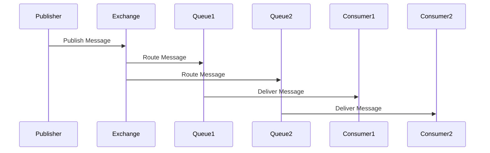

## 20.3.2 Asynchronous Messaging

In the realm of microservices, asynchronous messaging plays a pivotal role in enabling services to communicate efficiently and reliably. This section delves into the concepts and implementations of asynchronous messaging in Clojure microservices, leveraging popular message brokers such as RabbitMQ, Kafka, and AWS SNS/SQS. We'll explore patterns like publish/subscribe and event-driven architectures, drawing parallels with Java to aid your transition to Clojure.

### Understanding Asynchronous Messaging

Asynchronous messaging allows services to communicate without waiting for each other to respond, enhancing scalability and resilience. Unlike synchronous communication, where a service must wait for a response before proceeding, asynchronous messaging enables a service to send a message and continue its operations, allowing the receiving service to process the message at its own pace.

#### Key Benefits

- **Decoupling**: Services are loosely coupled, reducing dependencies and allowing independent scaling.
- **Resilience**: Systems can handle failures gracefully, as messages can be retried or rerouted.
- **Scalability**: Services can scale independently, processing messages as resources allow.

### Message Brokers Overview

Message brokers facilitate asynchronous communication by managing the transmission of messages between services. Let's explore some popular message brokers and how they integrate with Clojure.

#### RabbitMQ

RabbitMQ is a widely-used message broker that supports various messaging protocols. It excels in scenarios requiring complex routing and message delivery guarantees.

**Clojure Integration**: The `langohr` library provides a robust interface for interacting with RabbitMQ in Clojure.

```clojure
(require '[langohr.core :as rmq]
         '[langohr.channel :as ch]
         '[langohr.queue :as q]
         '[langohr.basic :as b])

(defn connect []
  (rmq/connect {:host "localhost"}))

(defn publish-message [channel queue message]
  (b/publish channel "" queue message))

(defn consume-messages [channel queue]
  (q/declare channel queue {:durable true})
  (b/consume channel queue (fn [ch metadata payload]
                             (println "Received message:" (String. payload "UTF-8")))))
```

#### Apache Kafka

Kafka is designed for high-throughput, distributed messaging. It is ideal for event streaming and real-time data processing.

**Clojure Integration**: The `clj-kafka` library allows seamless interaction with Kafka from Clojure.

```clojure
(require '[clj-kafka.producer :as producer]
         '[clj-kafka.consumer :as consumer])

(defn produce-message [topic message]
  (producer/send {:topic topic :value message}))

(defn consume-messages [topic]
  (consumer/consume {:topic topic}
                    (fn [msg]
                      (println "Received message:" (:value msg)))))
```

#### AWS SNS/SQS

AWS Simple Notification Service (SNS) and Simple Queue Service (SQS) provide scalable, fully-managed messaging services. SNS is used for pub/sub messaging, while SQS is used for message queuing.

**Clojure Integration**: The `amazonica` library offers a comprehensive interface for AWS services, including SNS and SQS.

```clojure
(require '[amazonica.aws.sns :as sns]
         '[amazonica.aws.sqs :as sqs])

(defn publish-sns-message [topic-arn message]
  (sns/publish :topic-arn topic-arn :message message))

(defn send-sqs-message [queue-url message]
  (sqs/send-message :queue-url queue-url :message-body message))

(defn receive-sqs-messages [queue-url]
  (sqs/receive-message :queue-url queue-url))
```

### Patterns in Asynchronous Messaging

#### Publish/Subscribe Pattern

In the publish/subscribe pattern, messages are published to a topic, and multiple subscribers can receive the messages. This pattern is ideal for broadcasting events to multiple services.

**Example**: Using RabbitMQ, we can set up a publish/subscribe system where a message is published to an exchange, and multiple queues bound to the exchange receive the message.

```clojure
(defn setup-pub-sub [channel exchange queue]
  (q/declare channel queue {:durable true})
  (ch/exchange-declare channel exchange "fanout")
  (q/bind channel queue exchange))

(defn publish-to-exchange [channel exchange message]
  (b/publish channel exchange "" message))
```

#### Event-Driven Architecture

Event-driven architecture (EDA) leverages asynchronous messaging to trigger actions in response to events. This architecture is highly decoupled and scalable, as services react to events independently.

**Example**: In a Kafka-based EDA, services produce events to a Kafka topic, and other services consume these events to perform actions.

```clojure
(defn produce-event [topic event]
  (producer/send {:topic topic :value event}))

(defn consume-events [topic]
  (consumer/consume {:topic topic}
                    (fn [event]
                      (println "Processing event:" (:value event)))))
```

### Comparing with Java

In Java, asynchronous messaging is often implemented using JMS (Java Message Service) or specific libraries for RabbitMQ, Kafka, etc. Clojure's functional nature and concise syntax offer a more streamlined approach to setting up and managing asynchronous messaging.

**Java Example**: Setting up a simple JMS producer and consumer.

```java
// JMS Producer
ConnectionFactory connectionFactory = new ActiveMQConnectionFactory("tcp://localhost:61616");
Connection connection = connectionFactory.createConnection();
Session session = connection.createSession(false, Session.AUTO_ACKNOWLEDGE);
Destination destination = session.createQueue("TEST.QUEUE");
MessageProducer producer = session.createProducer(destination);
TextMessage message = session.createTextMessage("Hello World");
producer.send(message);

// JMS Consumer
MessageConsumer consumer = session.createConsumer(destination);
consumer.setMessageListener(new MessageListener() {
    public void onMessage(Message message) {
        if (message instanceof TextMessage) {
            TextMessage textMessage = (TextMessage) message;
            System.out.println("Received: " + textMessage.getText());
        }
    }
});
```

**Clojure Example**: The equivalent setup using RabbitMQ with `langohr`.

```clojure
(defn connect []
  (rmq/connect {:host "localhost"}))

(defn publish-message [channel queue message]
  (b/publish channel "" queue message))

(defn consume-messages [channel queue]
  (q/declare channel queue {:durable true})
  (b/consume channel queue (fn [ch metadata payload]
                             (println "Received message:" (String. payload "UTF-8")))))
```

### Try It Yourself

Experiment with the provided code examples by:

- Modifying the message content and observing how it propagates through the system.
- Setting up multiple consumers to see how messages are distributed.
- Implementing error handling and retry logic for message processing.

### Diagrams and Visualizations

Below is a sequence diagram illustrating the flow of messages in a publish/subscribe system using RabbitMQ.



*Diagram 1: Message flow in a RabbitMQ publish/subscribe system.*

### Further Reading

- [RabbitMQ Official Documentation](https://www.rabbitmq.com/documentation.html)
- [Apache Kafka Documentation](https://kafka.apache.org/documentation/)
- [AWS SNS and SQS Documentation](https://aws.amazon.com/documentation/sns/)

### Exercises

1. Set up a RabbitMQ instance and implement a simple publish/subscribe system in Clojure.
2. Use Kafka to create an event-driven architecture where multiple services react to a common event.
3. Explore AWS SNS/SQS by setting up a notification system that sends alerts to multiple subscribers.

### Key Takeaways

- Asynchronous messaging decouples services, enhancing scalability and resilience.
- Clojure provides concise and powerful libraries for interacting with message brokers.
- Patterns like publish/subscribe and event-driven architectures are fundamental to building robust microservices.

Now that we've explored asynchronous messaging in Clojure microservices, let's apply these concepts to build scalable and resilient systems.

## Quiz: Mastering Asynchronous Messaging in Clojure Microservices



### What is a key benefit of asynchronous messaging in microservices?

- [x] Decoupling services
- [ ] Synchronous communication
- [ ] Increased latency
- [ ] Direct service dependencies

> **Explanation:** Asynchronous messaging decouples services, allowing them to operate independently and scale separately.

### Which Clojure library is commonly used for RabbitMQ integration?

- [x] langohr
- [ ] clj-kafka
- [ ] amazonica
- [ ] core.async

> **Explanation:** The `langohr` library provides a robust interface for interacting with RabbitMQ in Clojure.

### What pattern involves publishing messages to a topic for multiple subscribers?

- [x] Publish/Subscribe
- [ ] Request/Response
- [ ] Point-to-Point
- [ ] Direct Messaging

> **Explanation:** The publish/subscribe pattern allows messages to be published to a topic, with multiple subscribers receiving the messages.

### Which AWS service is used for message queuing?

- [ ] AWS SNS
- [x] AWS SQS
- [ ] AWS Lambda
- [ ] AWS EC2

> **Explanation:** AWS Simple Queue Service (SQS) is used for message queuing.

### What is a primary use case for Kafka in microservices?

- [x] Event streaming
- [ ] Direct messaging
- [ ] Synchronous communication
- [ ] File storage

> **Explanation:** Kafka is designed for high-throughput, distributed messaging, making it ideal for event streaming.

### Which Clojure library provides an interface for AWS services like SNS and SQS?

- [x] amazonica
- [ ] langohr
- [ ] clj-kafka
- [ ] core.async

> **Explanation:** The `amazonica` library offers a comprehensive interface for AWS services, including SNS and SQS.

### What is a key advantage of event-driven architecture?

- [x] Services react independently to events
- [ ] Increased coupling between services
- [ ] Synchronous processing
- [ ] Direct service dependencies

> **Explanation:** Event-driven architecture allows services to react independently to events, enhancing scalability and decoupling.

### How does Clojure's approach to asynchronous messaging differ from Java's?

- [x] Clojure offers a more streamlined and functional approach
- [ ] Clojure requires more boilerplate code
- [ ] Java provides more concise syntax
- [ ] Clojure lacks support for message brokers

> **Explanation:** Clojure's functional nature and concise syntax offer a more streamlined approach to setting up and managing asynchronous messaging.

### Which pattern is ideal for broadcasting events to multiple services?

- [x] Publish/Subscribe
- [ ] Request/Response
- [ ] Point-to-Point
- [ ] Direct Messaging

> **Explanation:** The publish/subscribe pattern is ideal for broadcasting events to multiple services.

### True or False: Asynchronous messaging increases direct dependencies between services.

- [ ] True
- [x] False

> **Explanation:** Asynchronous messaging reduces direct dependencies between services, allowing them to operate independently.


