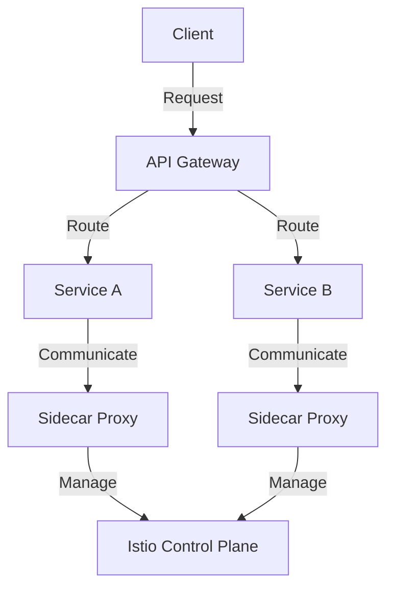

## 20.3.3 API Gateways and Service Meshes

In the world of microservices, managing communication between services is crucial for building scalable and resilient systems. **API gateways** and **service meshes** are two key technologies that help manage this communication effectively. In this section, we'll delve into how these tools can be leveraged in Clojure applications, drawing parallels with Java where applicable.

### Understanding API Gateways

An **API Gateway** acts as a single entry point for all client requests to your microservices architecture. It handles various cross-cutting concerns such as authentication, rate limiting, routing, and more. This centralization simplifies client interactions and offloads common tasks from individual services.

#### Key Responsibilities of an API Gateway

1. **Routing**: Directs incoming requests to the appropriate service based on the request path and method.
2. **Authentication and Authorization**: Validates client credentials and ensures that requests have the necessary permissions.
3. **Rate Limiting**: Controls the number of requests a client can make in a given time period to prevent abuse.
4. **Load Balancing**: Distributes incoming requests across multiple instances of a service to ensure even load distribution.
5. **Caching**: Stores responses temporarily to reduce load on services and improve response times.
6. **Monitoring and Logging**: Tracks request metrics and logs for analysis and debugging.

#### Implementing an API Gateway in Clojure

Let's explore how we can implement a simple API Gateway in Clojure using the `ring` and `compojure` libraries.

```clojure
(ns api-gateway.core
  (:require [ring.adapter.jetty :refer [run-jetty]]
            [compojure.core :refer [defroutes GET POST]]
            [compojure.route :as route]
            [ring.middleware.defaults :refer [wrap-defaults site-defaults]]
            [ring.middleware.json :refer [wrap-json-response wrap-json-body]]))

(defroutes app-routes
  (GET "/service1" [] (service1-handler))
  (POST "/service2" [] (service2-handler))
  (route/not-found "Not Found"))

(defn service1-handler []
  {:status 200
   :headers {"Content-Type" "application/json"}
   :body {:message "Service 1 response"}})

(defn service2-handler []
  {:status 200
   :headers {"Content-Type" "application/json"}
   :body {:message "Service 2 response"}})

(def app
  (-> app-routes
      (wrap-json-response)
      (wrap-json-body)
      (wrap-defaults site-defaults)))

(defn -main []
  (run-jetty app {:port 8080 :join? false}))
```

**Explanation:**

- **Routing**: We define routes using `compojure` to direct requests to different services.
- **Middleware**: We use middleware to handle JSON requests and responses, which is common in API gateways.
- **Handlers**: Simple handlers return JSON responses for demonstration purposes.

#### Comparing with Java

In Java, a similar API Gateway might be implemented using Spring Cloud Gateway. Here's a conceptual comparison:

- **Spring Cloud Gateway**: Uses routes defined in a `RouteLocator` bean, similar to `compojure` routes.
- **Middleware**: Java uses filters and interceptors, akin to Clojure's middleware.
- **Handlers**: Java handlers are typically methods in a controller class.

### Introduction to Service Meshes

A **Service Mesh** is a dedicated infrastructure layer for managing service-to-service communication. It provides features like load balancing, service discovery, retries, and circuit breaking. Popular service mesh technologies include **Istio** and **Linkerd**.

#### Key Features of a Service Mesh

1. **Traffic Management**: Controls the flow of traffic between services, including routing, retries, and failovers.
2. **Security**: Provides end-to-end encryption and authentication between services.
3. **Observability**: Offers insights into service communication through metrics, logs, and tracing.
4. **Policy Enforcement**: Applies policies for access control and rate limiting.

#### Implementing a Service Mesh with Istio

Istio is a popular service mesh that integrates seamlessly with Kubernetes. It uses a sidecar proxy model to intercept and manage traffic between services.

**Istio Architecture Diagram:**



*Diagram Explanation*: This diagram illustrates how Istio manages communication between services using sidecar proxies and a control plane.

#### Setting Up Istio with Clojure Services

1. **Install Istio**: Follow the [Istio installation guide](https://istio.io/latest/docs/setup/) to set up Istio on your Kubernetes cluster.
2. **Deploy Clojure Services**: Deploy your Clojure microservices in Kubernetes.
3. **Inject Sidecar Proxies**: Use Istio's automatic sidecar injection to add proxies to your services.
4. **Configure Traffic Management**: Define routing rules and policies using Istio's configuration resources.

### Comparing API Gateways and Service Meshes

While both API gateways and service meshes manage communication, they serve different purposes:

- **API Gateway**: Focuses on client-to-service communication, handling external requests.
- **Service Mesh**: Manages service-to-service communication, focusing on internal traffic.

**Table: API Gateway vs. Service Mesh**

| Feature                | API Gateway                     | Service Mesh                   |
|------------------------|---------------------------------|--------------------------------|
| **Scope**              | Client-to-service               | Service-to-service             |
| **Primary Focus**      | Authentication, routing         | Traffic management, security   |
| **Implementation**     | Centralized entry point         | Distributed sidecar proxies    |
| **Use Case**           | External client interactions    | Internal service communication |

### Try It Yourself

- **Modify the API Gateway**: Add more routes and handlers to simulate a more complex gateway.
- **Experiment with Istio**: Deploy a sample Clojure application with Istio and explore traffic management features.

### Further Reading

- [Istio Documentation](https://istio.io/latest/docs/)
- [Linkerd Documentation](https://linkerd.io/2.11/overview/)
- [Spring Cloud Gateway](https://spring.io/projects/spring-cloud-gateway)

### Exercises

1. **Implement a Rate Limiter**: Extend the API Gateway example to include rate limiting using a Clojure library like `clj-rate-limiter`.
2. **Deploy a Service Mesh**: Set up a service mesh using Linkerd and deploy a Clojure application to observe service communication.

### Key Takeaways

- **API Gateways** centralize client requests, handling cross-cutting concerns like authentication and routing.
- **Service Meshes** manage internal service communication, providing traffic management and security.
- Both tools enhance the scalability and resilience of microservices architectures.

By understanding and implementing API gateways and service meshes, you can build robust microservices systems in Clojure that are both scalable and secure.

## Quiz: Mastering API Gateways and Service Meshes in Clojure Microservices



### What is the primary role of an API Gateway?

- [x] To act as a single entry point for client requests
- [ ] To manage service-to-service communication
- [ ] To provide end-to-end encryption
- [ ] To handle database transactions

> **Explanation:** An API Gateway acts as a single entry point for client requests, handling cross-cutting concerns like authentication and routing.


### Which of the following is a key feature of a service mesh?

- [x] Traffic management
- [ ] Client authentication
- [ ] Database management
- [ ] User interface design

> **Explanation:** A service mesh provides traffic management, security, and observability for service-to-service communication.


### How does Istio manage service communication?

- [x] Using sidecar proxies
- [ ] Through a centralized API Gateway
- [ ] By modifying application code
- [ ] By directly interacting with clients

> **Explanation:** Istio uses sidecar proxies to intercept and manage traffic between services.


### What is a common use case for an API Gateway?

- [x] Handling external client interactions
- [ ] Managing internal service communication
- [ ] Performing data analytics
- [ ] Designing user interfaces

> **Explanation:** API Gateways handle external client interactions, routing requests to the appropriate services.


### Which technology is used for service-to-service communication management?

- [x] Service Mesh
- [ ] API Gateway
- [ ] Database Middleware
- [ ] User Interface Library

> **Explanation:** A service mesh manages service-to-service communication, focusing on traffic management and security.


### What is the primary focus of a service mesh?

- [x] Traffic management and security
- [ ] Client authentication
- [ ] Data storage
- [ ] User experience

> **Explanation:** A service mesh focuses on traffic management and security for internal service communication.


### Which of the following is NOT a responsibility of an API Gateway?

- [ ] Routing
- [ ] Authentication
- [x] Service-to-service traffic management
- [ ] Rate limiting

> **Explanation:** Service-to-service traffic management is handled by a service mesh, not an API Gateway.


### What is the role of sidecar proxies in a service mesh?

- [x] To intercept and manage service communication
- [ ] To authenticate clients
- [ ] To store data
- [ ] To render user interfaces

> **Explanation:** Sidecar proxies intercept and manage service communication in a service mesh.


### Which tool would you use to manage internal service communication in a microservices architecture?

- [x] Service Mesh
- [ ] API Gateway
- [ ] Database Middleware
- [ ] User Interface Library

> **Explanation:** A service mesh is used to manage internal service communication in a microservices architecture.


### True or False: An API Gateway is responsible for managing service-to-service communication.

- [ ] True
- [x] False

> **Explanation:** An API Gateway handles client-to-service communication, while a service mesh manages service-to-service communication.


