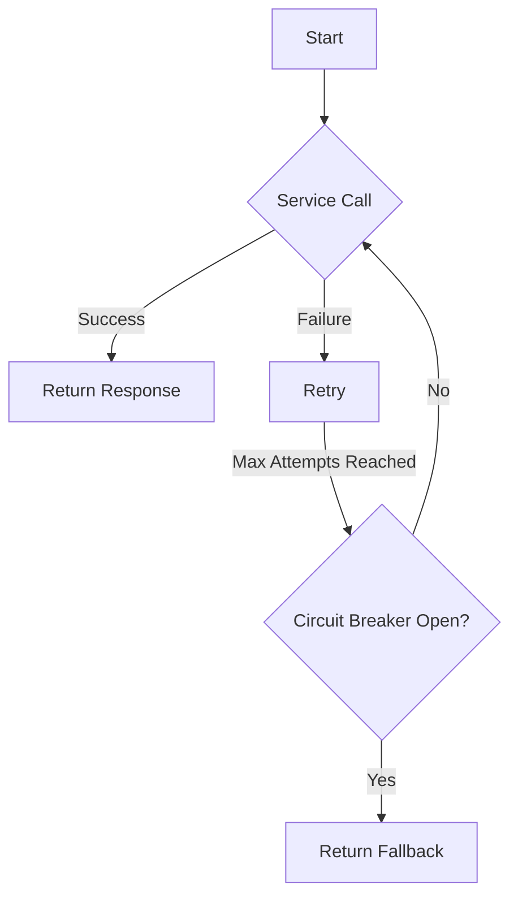

## 20.3.4 Handling Network Failures

In the world of microservices, network failures are inevitable. As experienced Java developers transitioning to Clojure, understanding how to make microservice communication resilient is crucial. In this section, we will explore strategies such as retries, circuit breakers, and fallback mechanisms, and demonstrate how to implement these patterns in Clojure.

### Understanding Network Failures

Network failures can occur due to various reasons, such as server downtime, network congestion, or misconfigurations. These failures can lead to service unavailability, degraded performance, and poor user experience. To mitigate these issues, we need to design our microservices to handle network failures gracefully.

### Strategies for Resilient Communication

Let's delve into some common strategies for handling network failures:

1. **Retries**: Automatically retrying failed requests can help recover from transient network issues.
2. **Circuit Breakers**: Prevents a service from making requests to a failing service, allowing it to recover.
3. **Fallback Mechanisms**: Provides alternative responses when a service is unavailable.

#### Retries

Retries involve reattempting a failed network request after a certain interval. This strategy is useful for handling transient failures, such as temporary network glitches or server overloads.

**Clojure Example: Implementing Retries**

Let's implement a simple retry mechanism in Clojure using a recursive function:

```clojure
(defn retry
  "Retries a function `f` up to `max-attempts` times with a delay of `delay-ms` milliseconds between attempts."
  [f max-attempts delay-ms]
  (loop [attempt 1]
    (try
      (f)
      (catch Exception e
        (if (< attempt max-attempts)
          (do
            (Thread/sleep delay-ms)
            (recur (inc attempt)))
          (throw e))))))

;; Usage example
(defn unreliable-service-call []
  ;; Simulate a network call that may fail
  (if (< (rand) 0.7)
    (throw (Exception. "Network failure"))
    "Success"))

(println (retry unreliable-service-call 5 1000))
```

In this example, the `retry` function takes a function `f`, the maximum number of attempts `max-attempts`, and a delay `delay-ms` between attempts. It uses a loop to retry the function until it succeeds or the maximum attempts are reached.

**Java Comparison: Retries with Exponential Backoff**

In Java, you might use a library like [Resilience4j](https://resilience4j.readme.io/docs/retry) to implement retries with exponential backoff. Here's a basic example:

```java
RetryConfig config = RetryConfig.custom()
    .maxAttempts(5)
    .waitDuration(Duration.ofSeconds(1))
    .build();

Retry retry = Retry.of("id", config);

Supplier<String> supplier = Retry.decorateSupplier(retry, () -> {
    if (Math.random() < 0.7) {
        throw new RuntimeException("Network failure");
    }
    return "Success";
});

String result = Try.ofSupplier(supplier).get();
System.out.println(result);
```

**Try It Yourself**

- Modify the `unreliable-service-call` function to simulate different failure rates.
- Experiment with different `max-attempts` and `delay-ms` values to observe their impact.

#### Circuit Breakers

Circuit breakers prevent a service from making requests to a failing service, allowing it to recover. This pattern helps avoid cascading failures in a microservice architecture.

**Clojure Example: Implementing a Circuit Breaker**

We can implement a simple circuit breaker in Clojure using an atom to track the state:

```clojure
(defn circuit-breaker
  "Creates a circuit breaker that opens after `failure-threshold` failures and closes after `reset-timeout-ms` milliseconds."
  [failure-threshold reset-timeout-ms]
  (let [state (atom {:failures 0 :open false :last-failure-time nil})]
    (fn [f]
      (let [{:keys [failures open last-failure-time]} @state]
        (if (and open
                 (< (- (System/currentTimeMillis) last-failure-time) reset-timeout-ms))
          (throw (Exception. "Circuit breaker is open"))
          (try
            (let [result (f)]
              (reset! state {:failures 0 :open false :last-failure-time nil})
              result)
            (catch Exception e
              (swap! state update :failures inc)
              (when (>= (:failures @state) failure-threshold)
                (swap! state assoc :open true :last-failure-time (System/currentTimeMillis)))
              (throw e))))))))

;; Usage example
(defn unreliable-service-call []
  ;; Simulate a network call that may fail
  (if (< (rand) 0.7)
    (throw (Exception. "Network failure"))
    "Success"))

(def breaker (circuit-breaker 3 5000))

(println (breaker unreliable-service-call))
```

In this example, the `circuit-breaker` function returns a function that wraps the service call. It tracks the number of failures and opens the circuit if the failure threshold is reached. The circuit remains open for a specified timeout period.

**Java Comparison: Circuit Breakers with Resilience4j**

In Java, you might use Resilience4j to implement circuit breakers:

```java
CircuitBreakerConfig config = CircuitBreakerConfig.custom()
    .failureRateThreshold(50)
    .waitDurationInOpenState(Duration.ofMillis(5000))
    .build();

CircuitBreaker circuitBreaker = CircuitBreaker.of("id", config);

Supplier<String> supplier = CircuitBreaker.decorateSupplier(circuitBreaker, () -> {
    if (Math.random() < 0.7) {
        throw new RuntimeException("Network failure");
    }
    return "Success";
});

String result = Try.ofSupplier(supplier).get();
System.out.println(result);
```

**Try It Yourself**

- Adjust the `failure-threshold` and `reset-timeout-ms` to see how the circuit breaker responds to different failure rates.
- Implement a logging mechanism to track when the circuit opens and closes.

#### Fallback Mechanisms

Fallback mechanisms provide alternative responses when a service is unavailable. This can be a default response, cached data, or a call to another service.

**Clojure Example: Implementing a Fallback Mechanism**

Let's implement a fallback mechanism in Clojure:

```clojure
(defn with-fallback
  "Executes `f` and returns its result, or `fallback` if `f` throws an exception."
  [f fallback]
  (try
    (f)
    (catch Exception e
      (println "Service failed, using fallback")
      fallback)))

;; Usage example
(defn unreliable-service-call []
  ;; Simulate a network call that may fail
  (if (< (rand) 0.7)
    (throw (Exception. "Network failure"))
    "Success"))

(println (with-fallback unreliable-service-call "Fallback response"))
```

In this example, the `with-fallback` function executes a service call and returns a fallback response if the call fails.

**Java Comparison: Fallback Mechanisms with Resilience4j**

In Java, you might use Resilience4j to implement fallback mechanisms:

```java
Supplier<String> supplier = () -> {
    if (Math.random() < 0.7) {
        throw new RuntimeException("Network failure");
    }
    return "Success";
};

String result = Try.ofSupplier(supplier)
    .recover(throwable -> "Fallback response")
    .get();

System.out.println(result);
```

**Try It Yourself**

- Modify the `unreliable-service-call` function to simulate different failure scenarios.
- Experiment with different fallback responses.

### Combining Strategies

In practice, you might combine these strategies to create a robust solution. For example, you could use retries with exponential backoff, a circuit breaker, and a fallback mechanism together.

**Clojure Example: Combining Strategies**

Here's how you might combine these strategies in Clojure:

```clojure
(defn resilient-call
  "Combines retries, circuit breaker, and fallback for a resilient service call."
  [f max-attempts delay-ms failure-threshold reset-timeout-ms fallback]
  (let [breaker (circuit-breaker failure-threshold reset-timeout-ms)]
    (with-fallback
      #(retry (breaker f) max-attempts delay-ms)
      fallback)))

;; Usage example
(defn unreliable-service-call []
  ;; Simulate a network call that may fail
  (if (< (rand) 0.7)
    (throw (Exception. "Network failure"))
    "Success"))

(println (resilient-call unreliable-service-call 5 1000 3 5000 "Fallback response"))
```

In this example, the `resilient-call` function combines retries, a circuit breaker, and a fallback mechanism to create a resilient service call.

**Try It Yourself**

- Experiment with different configurations for retries, circuit breakers, and fallbacks.
- Implement logging to track the behavior of each strategy.

### Visualizing the Flow

To better understand the flow of these strategies, let's visualize the process using a flowchart:



**Diagram Explanation**: This flowchart illustrates the process of handling a network failure with retries, a circuit breaker, and a fallback mechanism. If a service call fails, it is retried until the maximum attempts are reached. If the circuit breaker is open, a fallback response is returned.

### Best Practices

- **Use Exponential Backoff**: When implementing retries, use exponential backoff to avoid overwhelming the service.
- **Monitor and Log Failures**: Implement logging to monitor failures and track the state of circuit breakers.
- **Test Resilience**: Regularly test your microservices to ensure they can handle network failures gracefully.

### Further Reading

- [Resilience4j Documentation](https://resilience4j.readme.io/docs)
- [ClojureDocs](https://clojuredocs.org/)
- [Official Clojure Documentation](https://clojure.org/reference)

### Exercises

1. Implement a retry mechanism with exponential backoff in Clojure.
2. Extend the circuit breaker example to include half-open state logic.
3. Create a fallback mechanism that calls an alternative service.

### Key Takeaways

- Network failures are inevitable in microservices, but we can design resilient systems to handle them gracefully.
- Retries, circuit breakers, and fallback mechanisms are essential strategies for resilient communication.
- Combining these strategies can create robust solutions that improve service reliability and user experience.

Now that we've explored how to handle network failures in microservices with Clojure, let's apply these strategies to build resilient systems that can withstand the challenges of distributed environments.

## Quiz: Mastering Network Failure Handling in Clojure Microservices



### What is the primary purpose of implementing retries in microservices?

- [x] To recover from transient network failures
- [ ] To permanently fix network issues
- [ ] To increase the load on the network
- [ ] To replace circuit breakers

> **Explanation:** Retries are used to recover from transient network failures by reattempting failed requests.

### How does a circuit breaker help in handling network failures?

- [x] It prevents requests to a failing service, allowing it to recover
- [ ] It increases the number of requests to a service
- [ ] It permanently closes the connection to a service
- [ ] It replaces the need for retries

> **Explanation:** A circuit breaker prevents requests to a failing service, allowing it to recover and avoid cascading failures.

### What is a fallback mechanism used for in microservices?

- [x] To provide alternative responses when a service is unavailable
- [ ] To permanently replace a failing service
- [ ] To increase the number of retries
- [ ] To open the circuit breaker

> **Explanation:** A fallback mechanism provides alternative responses, such as cached data or default responses, when a service is unavailable.

### In Clojure, which function can be used to implement retries?

- [x] `retry`
- [ ] `circuit-breaker`
- [ ] `with-fallback`
- [ ] `try-catch`

> **Explanation:** The `retry` function is used to implement retries by reattempting a function call multiple times.

### What is the role of the `circuit-breaker` function in Clojure?

- [x] To track failures and open the circuit when a threshold is reached
- [ ] To provide fallback responses
- [ ] To increase the number of retries
- [ ] To permanently close the connection

> **Explanation:** The `circuit-breaker` function tracks failures and opens the circuit when a failure threshold is reached, preventing further requests.

### How can you combine retries, circuit breakers, and fallbacks in Clojure?

- [x] By using the `resilient-call` function
- [ ] By using only the `retry` function
- [ ] By using only the `circuit-breaker` function
- [ ] By using only the `with-fallback` function

> **Explanation:** The `resilient-call` function combines retries, circuit breakers, and fallbacks to create a resilient service call.

### What is the benefit of using exponential backoff with retries?

- [x] It avoids overwhelming the service with requests
- [ ] It increases the number of retries
- [ ] It permanently fixes network issues
- [ ] It replaces the need for circuit breakers

> **Explanation:** Exponential backoff avoids overwhelming the service with requests by gradually increasing the delay between retries.

### Why is it important to monitor and log failures in microservices?

- [x] To track the state of circuit breakers and identify issues
- [ ] To increase the number of retries
- [ ] To permanently fix network issues
- [ ] To replace fallback mechanisms

> **Explanation:** Monitoring and logging failures help track the state of circuit breakers and identify issues in the system.

### What should you do if a circuit breaker is open?

- [x] Return a fallback response
- [ ] Increase the number of retries
- [ ] Permanently close the connection
- [ ] Replace the service

> **Explanation:** When a circuit breaker is open, a fallback response should be returned to handle the failure gracefully.

### True or False: Combining retries, circuit breakers, and fallbacks can improve service reliability.

- [x] True
- [ ] False

> **Explanation:** Combining retries, circuit breakers, and fallbacks can improve service reliability by handling network failures gracefully.


