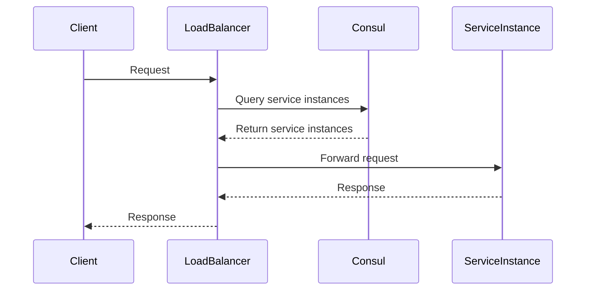

## 20.4.1 Service Registration and Discovery

In the world of microservices, **service registration and discovery** play a crucial role in enabling services to find and communicate with each other dynamically. This section will guide you through the concepts and implementations of service registration and discovery in Clojure, leveraging tools like **Consul**, **etcd**, and **Eureka**. We'll explore both client-side and server-side discovery patterns, drawing parallels with Java-based systems to ease the transition for Java developers.

### Understanding Service Registration and Discovery

Service registration and discovery are essential components in a microservices architecture. They allow services to register themselves and discover other services without hardcoding their locations. This dynamic nature is vital for scaling, fault tolerance, and maintaining a loosely coupled architecture.

#### Key Concepts

- **Service Registration**: The process by which a service instance registers its network location (IP address and port) with a service registry.
- **Service Discovery**: The mechanism that allows a service to find the network location of another service by querying the service registry.

### Tools for Service Registration and Discovery

Several tools facilitate service registration and discovery, each with its strengths and use cases. Let's explore three popular options:

#### Consul

**Consul** is a widely used tool for service discovery, configuration, and segmentation. It provides a distributed, highly available service mesh with built-in health checking.

- **Features**: Key/value store, health checks, multi-datacenter support.
- **Use Case**: Ideal for environments where you need a robust service mesh with additional features like health checks and configuration management.

#### etcd

**etcd** is a distributed key-value store that provides a reliable way to store data across a cluster of machines.

- **Features**: Strong consistency, watchable key-value store, simple API.
- **Use Case**: Suitable for storing configuration data and service discovery in distributed systems.

#### Eureka

**Eureka** is a service registry developed by Netflix, primarily for use in AWS cloud environments.

- **Features**: Client-side load balancing, resilience, and failover.
- **Use Case**: Well-suited for cloud-native applications, especially those running on AWS.

### Client-Side vs. Server-Side Discovery

Understanding the difference between client-side and server-side discovery is crucial for implementing service registration and discovery effectively.

#### Client-Side Discovery

In client-side discovery, the client is responsible for determining the network location of the service instances. The client queries the service registry and selects an instance to communicate with.

- **Advantages**: Simplicity, direct control over load balancing.
- **Disadvantages**: Clients need to handle discovery logic, which can lead to duplicated code.

#### Server-Side Discovery

In server-side discovery, the client makes a request to a load balancer, which queries the service registry and forwards the request to an appropriate service instance.

- **Advantages**: Centralized discovery logic, easier to manage.
- **Disadvantages**: Potential single point of failure, additional infrastructure required.

### Implementing Service Registration and Discovery in Clojure

Let's dive into implementing service registration and discovery in Clojure using Consul as an example. We'll cover both client-side and server-side discovery patterns.

#### Setting Up Consul

Before we begin, ensure you have Consul installed and running. You can download it from the [official Consul website](https://www.consul.io/downloads).

```bash
# Start Consul in development mode
consul agent -dev
```

#### Registering a Service with Consul

In Clojure, we can use the `clj-http` library to interact with Consul's HTTP API. Here's a simple example of registering a service:

```clojure
(ns myapp.consul
  (:require [clj-http.client :as client]))

(defn register-service
  "Registers a service with Consul."
  [service-name service-id address port]
  (let [url (str "http://localhost:8500/v1/agent/service/register")
        body {:Name service-name
              :ID service-id
              :Address address
              :Port port}]
    (client/put url {:body (json/write-str body)
                     :headers {"Content-Type" "application/json"}})))

;; Register a service
(register-service "my-service" "my-service-1" "127.0.0.1" 8080)
```

**Explanation**: This code registers a service named "my-service" with Consul, specifying its ID, address, and port.

#### Discovering Services with Consul

To discover services, we query Consul's service catalog:

```clojure
(defn discover-service
  "Discovers a service from Consul."
  [service-name]
  (let [url (str "http://localhost:8500/v1/catalog/service/" service-name)
        response (client/get url {:as :json})]
    (map #(select-keys % [:ServiceAddress :ServicePort]) (:body response))))

;; Discover services
(discover-service "my-service")
```

**Explanation**: This function queries Consul for instances of "my-service" and returns their addresses and ports.

#### Client-Side Discovery Example

In a client-side discovery setup, the client uses the discovered service instances to make requests directly:

```clojure
(defn call-service
  "Calls a service instance directly."
  [service-name]
  (let [instances (discover-service service-name)
        {:keys [ServiceAddress ServicePort]} (first instances)
        url (str "http://" ServiceAddress ":" ServicePort "/api/endpoint")]
    (client/get url)))

;; Call the service
(call-service "my-service")
```

**Explanation**: This code retrieves the first instance of "my-service" and makes an HTTP GET request to its endpoint.

#### Server-Side Discovery Example

For server-side discovery, we typically use a load balancer like HAProxy or NGINX. The load balancer queries Consul and forwards requests to service instances.



**Diagram Explanation**: This sequence diagram illustrates the flow of a request in a server-side discovery setup, where the load balancer handles service discovery.

### Comparing with Java

In Java, service registration and discovery can be implemented using libraries like Spring Cloud Netflix, which provides integration with Eureka. Here's a simple Java example:

```java
import org.springframework.cloud.client.discovery.DiscoveryClient;
import org.springframework.beans.factory.annotation.Autowired;

public class ServiceDiscovery {

    @Autowired
    private DiscoveryClient discoveryClient;

    public List<ServiceInstance> discoverService(String serviceName) {
        return discoveryClient.getInstances(serviceName);
    }
}
```

**Comparison**: While Java's Spring Cloud provides a comprehensive framework for service discovery, Clojure's approach using libraries like `clj-http` offers more flexibility and simplicity, aligning with Clojure's philosophy of small, composable libraries.

### Try It Yourself

Experiment with the provided Clojure code by:

- Modifying the service name and port in the registration function.
- Adding error handling to the discovery function.
- Implementing a simple load balancer in Clojure for server-side discovery.

### Exercises

1. **Implement a Health Check**: Extend the service registration code to include a health check URL.
2. **Load Balancing Strategy**: Implement a round-robin load balancing strategy for client-side discovery.
3. **Integrate with etcd**: Modify the code to use etcd for service registration and discovery.

### Key Takeaways

- Service registration and discovery are fundamental to microservices architecture, enabling dynamic service interaction.
- Tools like Consul, etcd, and Eureka provide robust solutions for service registration and discovery.
- Clojure's flexibility allows for simple and effective implementations of both client-side and server-side discovery patterns.
- Understanding the differences between client-side and server-side discovery helps in choosing the right approach for your architecture.

For further reading, explore the [Consul Documentation](https://www.consul.io/docs) and [etcd Documentation](https://etcd.io/docs/).

Now that we've explored service registration and discovery in Clojure, let's apply these concepts to build resilient and scalable microservices architectures.

## Quiz: Mastering Service Registration and Discovery in Clojure Microservices



### What is the primary purpose of service registration in microservices?

- [x] To register a service's network location with a service registry
- [ ] To monitor the health of a service
- [ ] To balance the load among service instances
- [ ] To encrypt service communications

> **Explanation:** Service registration involves registering a service's network location (IP address and port) with a service registry to enable discovery by other services.

### Which tool is known for providing a distributed, highly available service mesh with built-in health checking?

- [x] Consul
- [ ] etcd
- [ ] Eureka
- [ ] Spring Cloud

> **Explanation:** Consul is known for its distributed service mesh capabilities, including built-in health checking and multi-datacenter support.

### In client-side discovery, who is responsible for determining the network location of service instances?

- [x] The client
- [ ] The server
- [ ] The load balancer
- [ ] The service registry

> **Explanation:** In client-side discovery, the client queries the service registry to determine the network location of service instances.

### What is a disadvantage of client-side discovery?

- [x] Clients need to handle discovery logic
- [ ] Centralized discovery logic
- [ ] Easier to manage
- [ ] Additional infrastructure required

> **Explanation:** A disadvantage of client-side discovery is that clients need to handle the discovery logic, which can lead to duplicated code.

### Which of the following is a feature of etcd?

- [x] Strong consistency
- [ ] Client-side load balancing
- [ ] Built-in health checks
- [ ] Multi-datacenter support

> **Explanation:** etcd provides strong consistency and a watchable key-value store, making it suitable for distributed systems.

### In server-side discovery, who queries the service registry to forward requests to service instances?

- [x] The load balancer
- [ ] The client
- [ ] The server
- [ ] The service registry

> **Explanation:** In server-side discovery, the load balancer queries the service registry and forwards requests to appropriate service instances.

### Which tool is primarily used for service registration and discovery in AWS cloud environments?

- [x] Eureka
- [ ] Consul
- [ ] etcd
- [ ] Spring Cloud

> **Explanation:** Eureka, developed by Netflix, is primarily used for service registration and discovery in AWS cloud environments.

### What is a key advantage of server-side discovery?

- [x] Centralized discovery logic
- [ ] Clients need to handle discovery logic
- [ ] Direct control over load balancing
- [ ] Simplicity

> **Explanation:** A key advantage of server-side discovery is centralized discovery logic, which simplifies management.

### Which Clojure library is used in the examples for interacting with Consul's HTTP API?

- [x] clj-http
- [ ] ring
- [ ] compojure
- [ ] core.async

> **Explanation:** The `clj-http` library is used in the examples to interact with Consul's HTTP API for service registration and discovery.

### True or False: In server-side discovery, the client directly queries the service registry.

- [ ] True
- [x] False

> **Explanation:** In server-side discovery, the client does not directly query the service registry; instead, the load balancer handles this task.


