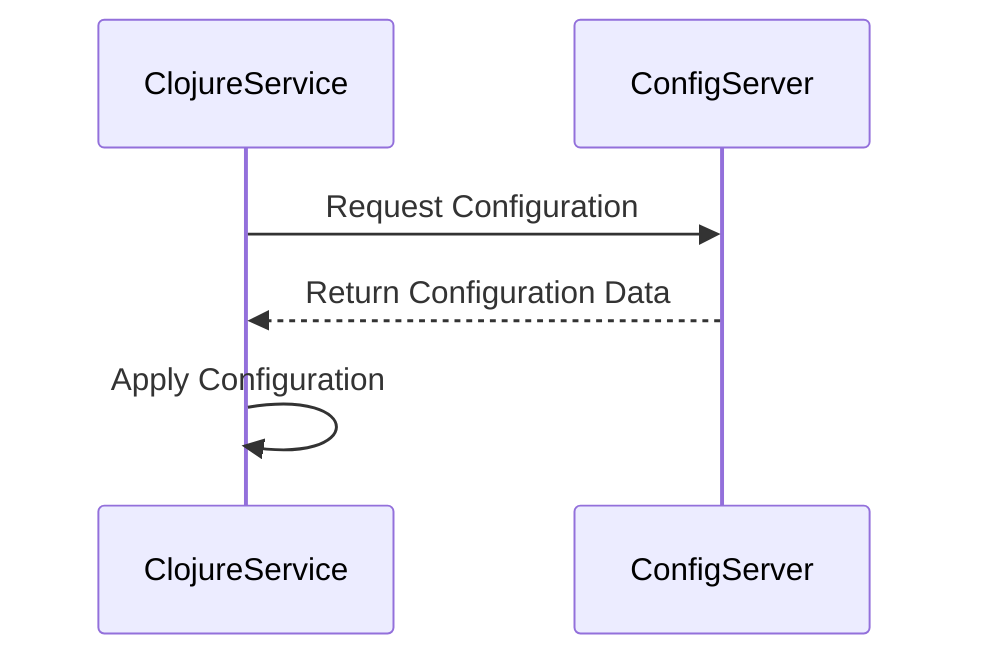

## 20.4.2 Configuration Management

In the world of microservices, managing configuration effectively is crucial for maintaining consistency, security, and flexibility across distributed systems. As experienced Java developers transitioning to Clojure, you'll find that while some principles remain the same, Clojure offers unique approaches and tools that can enhance your configuration management strategy.

### Understanding Configuration Management

Configuration management involves defining, maintaining, and controlling the configuration of software systems. In a microservices architecture, where services are independently deployable and scalable, configuration management becomes even more critical. Proper configuration management ensures that services can operate correctly in different environments (development, testing, production) and can adapt to changes without requiring code modifications.

#### Key Concepts

- **Consistency**: Ensuring that configuration is consistent across all services and environments.
- **Security**: Protecting sensitive information such as API keys, database credentials, and other secrets.
- **Flexibility**: Allowing configuration to be easily changed without redeploying services.
- **Centralization**: Managing configuration from a central location to simplify updates and ensure uniformity.

### Configuration Management Strategies

There are several strategies for managing configuration in a microservices environment. We'll explore two primary approaches: using environment variables and centralized configuration services.

#### Environment Variables

Environment variables are a simple and effective way to manage configuration. They are easy to use, supported by all operating systems, and can be set at runtime, making them ideal for containerized environments like Docker.

**Advantages:**

- **Simplicity**: Easy to set and access within applications.
- **Portability**: Work across different environments and platforms.
- **Security**: Can be managed by the operating system, reducing the risk of hardcoding sensitive information.

**Disadvantages:**

- **Scalability**: Managing a large number of environment variables can become cumbersome.
- **Visibility**: Changes to environment variables are not always immediately visible or traceable.

**Example in Clojure:**

```clojure
(defn get-config []
  {:db-url (System/getenv "DB_URL")
   :api-key (System/getenv "API_KEY")})

;; Usage
(let [config (get-config)]
  (println "Database URL:" (:db-url config))
  (println "API Key:" (:api-key config)))
```

In this example, we define a function `get-config` that retrieves configuration values from environment variables. This approach is straightforward and leverages Clojure's interop capabilities with Java's `System` class.

#### Centralized Configuration Services

Centralized configuration services, such as Spring Cloud Config, Consul, or etcd, provide a more robust solution for managing configuration across multiple services. These services allow you to store configuration in a central repository and access it via APIs.

**Advantages:**

- **Centralization**: Manage all configuration from a single location.
- **Dynamic Updates**: Change configuration without restarting services.
- **Versioning**: Track changes and roll back if necessary.

**Disadvantages:**

- **Complexity**: Requires additional infrastructure and setup.
- **Latency**: Accessing configuration over the network can introduce latency.

**Example with Spring Cloud Config:**

To integrate a centralized configuration service with Clojure, you can use libraries like `clj-http` to fetch configuration data from a service like Spring Cloud Config.

```clojure
(require '[clj-http.client :as client])

(defn fetch-config [service-name]
  (let [url (str "http://config-server/" service-name "/default")
        response (client/get url {:as :json})]
    (:body response)))

;; Usage
(let [config (fetch-config "my-service")]
  (println "Configuration:" config))
```

In this example, we use `clj-http` to make an HTTP request to a configuration server and retrieve the configuration for a specific service. This approach allows for dynamic configuration updates and central management.

### Security Considerations

Security is a paramount concern in configuration management. Here are some best practices to ensure your configuration is secure:

- **Encrypt Sensitive Data**: Use encryption for sensitive information, both at rest and in transit.
- **Access Control**: Limit access to configuration data to only those who need it.
- **Audit and Monitoring**: Implement logging and monitoring to detect unauthorized access or changes.

### Comparing with Java

In Java, configuration management often involves using properties files, XML, or YAML configurations, sometimes combined with frameworks like Spring Boot. Clojure's approach, leveraging environment variables and centralized services, offers a more functional and dynamic way to manage configuration.

**Java Example:**

```java
import java.util.Properties;
import java.io.InputStream;
import java.io.IOException;

public class Config {
    private Properties properties = new Properties();

    public Config() {
        try (InputStream input = getClass().getClassLoader().getResourceAsStream("config.properties")) {
            if (input == null) {
                System.out.println("Sorry, unable to find config.properties");
                return;
            }
            properties.load(input);
        } catch (IOException ex) {
            ex.printStackTrace();
        }
    }

    public String getProperty(String key) {
        return properties.getProperty(key);
    }
}
```

In this Java example, we load configuration from a properties file. While this approach is effective, it lacks the flexibility and dynamic capabilities of Clojure's environment variable and centralized service strategies.

### Try It Yourself

Experiment with the Clojure examples provided by:

- Modifying the environment variable names and values to see how the application behavior changes.
- Setting up a simple configuration server using a tool like Consul and fetching configuration data in Clojure.
- Encrypting sensitive configuration data and implementing decryption in your Clojure application.

### Diagrams and Visualizations

To better understand the flow of configuration management, consider the following diagram illustrating the interaction between a Clojure microservice and a centralized configuration service.



**Diagram Description**: This sequence diagram shows a Clojure microservice requesting configuration data from a centralized configuration server and applying the received configuration.

### Exercises

1. **Environment Variables**: Set up a Clojure application that reads configuration from environment variables. Experiment with different variable values and observe the changes.
2. **Centralized Configuration**: Implement a simple configuration server using Consul and integrate it with a Clojure service to fetch configuration data.
3. **Security**: Encrypt a sensitive configuration value and implement decryption logic in your Clojure application.

### Summary and Key Takeaways

- Configuration management is essential for maintaining consistency, security, and flexibility in microservices.
- Environment variables offer a simple and portable solution, while centralized configuration services provide robustness and dynamic capabilities.
- Security should be a top priority, with encryption and access control as key practices.
- Clojure's functional approach to configuration management offers unique advantages over traditional Java methods.

By mastering these configuration management strategies, you'll be well-equipped to handle the complexities of microservices in Clojure, ensuring your applications are both resilient and adaptable.

### Further Reading

- [Official Clojure Documentation](https://clojure.org/)
- [Spring Cloud Config](https://spring.io/projects/spring-cloud-config)
- [Consul by HashiCorp](https://www.consul.io/)
- [ClojureDocs](https://clojuredocs.org/)

## Quiz: Mastering Configuration Management in Clojure Microservices



### What is a key advantage of using environment variables for configuration management in microservices?

- [x] Simplicity and portability across environments
- [ ] Centralized management
- [ ] Dynamic updates without service restarts
- [ ] Built-in encryption

> **Explanation:** Environment variables are simple to use and portable across different environments, making them ideal for configuration management.

### Which of the following is a disadvantage of using centralized configuration services?

- [ ] Simplicity
- [x] Complexity and additional infrastructure
- [ ] Dynamic updates
- [ ] Centralized management

> **Explanation:** Centralized configuration services require additional infrastructure and setup, adding complexity to the system.

### How can sensitive configuration data be protected in a microservices environment?

- [x] Encrypting sensitive data
- [ ] Storing in plain text
- [ ] Using default passwords
- [ ] Disabling access control

> **Explanation:** Encrypting sensitive data is a best practice to protect it from unauthorized access.

### In Clojure, how can you retrieve an environment variable?

- [x] Using `System/getenv`
- [ ] Using `System/getProperty`
- [ ] Using `System/setenv`
- [ ] Using `System/setProperty`

> **Explanation:** In Clojure, `System/getenv` is used to retrieve environment variables.

### What is a benefit of using centralized configuration services over environment variables?

- [x] Centralized management and dynamic updates
- [ ] Simplicity
- [ ] Portability
- [ ] Reduced latency

> **Explanation:** Centralized configuration services offer centralized management and allow for dynamic updates without restarting services.

### Which Clojure library can be used to make HTTP requests to a configuration server?

- [x] `clj-http`
- [ ] `clojure.java.io`
- [ ] `clojure.data.json`
- [ ] `clojure.core.async`

> **Explanation:** `clj-http` is a Clojure library used for making HTTP requests, suitable for fetching configuration from a server.

### What is a common challenge when managing a large number of environment variables?

- [x] Scalability and visibility
- [ ] Security
- [ ] Portability
- [ ] Simplicity

> **Explanation:** Managing a large number of environment variables can become cumbersome and challenging to track.

### Which of the following is a security best practice for configuration management?

- [x] Implementing access control
- [ ] Using default credentials
- [ ] Storing secrets in code
- [ ] Disabling logging

> **Explanation:** Implementing access control ensures that only authorized users can access sensitive configuration data.

### What is the primary role of a centralized configuration service?

- [x] To manage configuration from a single location
- [ ] To increase application performance
- [ ] To simplify code deployment
- [ ] To reduce network latency

> **Explanation:** A centralized configuration service manages configuration from a single location, ensuring consistency and ease of updates.

### True or False: In Clojure, configuration can only be managed using environment variables.

- [ ] True
- [x] False

> **Explanation:** In Clojure, configuration can be managed using both environment variables and centralized configuration services, among other methods.


