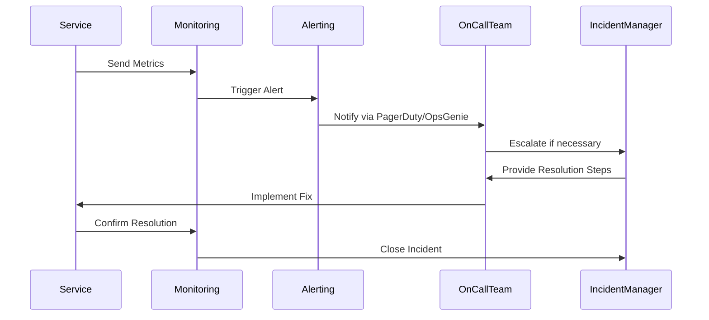

## 20.5.3 Alerting and Incident Response

In the world of microservices, where applications are composed of numerous interconnected services, maintaining system reliability and performance is crucial. **Alerting and incident response** are key components of an effective monitoring strategy, enabling teams to quickly identify and resolve issues before they impact users. In this section, we'll explore how to set up alerting mechanisms in Clojure microservices, integrate with popular alerting services like PagerDuty and OpsGenie, and establish a robust incident response process.

### Understanding Alerting and Incident Response

**Alerting** involves setting up notifications to inform teams of potential issues in the system. These alerts can be triggered by various conditions, such as high error rates, latency spikes, or resource exhaustion. **Incident response** is the process of managing and resolving these alerts to restore normal service operation.

#### Key Concepts in Alerting

- **Thresholds**: Define specific conditions that trigger alerts, such as CPU usage exceeding 80%.
- **Severity Levels**: Categorize alerts based on their impact, from informational to critical.
- **Notification Channels**: Determine how alerts are communicated, e.g., email, SMS, or chat.
- **Escalation Policies**: Define how alerts are escalated if not acknowledged or resolved in a timely manner.

#### Key Concepts in Incident Response

- **Incident Triage**: Assess the severity and impact of an incident to prioritize response efforts.
- **Root Cause Analysis**: Investigate the underlying cause of an incident to prevent recurrence.
- **Postmortems**: Conduct reviews after incidents to identify improvements and share learnings.

### Setting Up Alerting in Clojure Microservices

To effectively monitor Clojure microservices, we need to integrate alerting into our monitoring setup. This involves selecting appropriate tools, defining alert conditions, and configuring notification channels.

#### Choosing Monitoring and Alerting Tools

Clojure microservices can leverage a variety of monitoring tools, many of which offer built-in alerting capabilities. Popular choices include:

- **Prometheus**: An open-source monitoring system with a powerful query language and alerting capabilities.
- **Grafana**: A visualization tool that integrates with Prometheus to create dashboards and alerts.
- **Datadog**: A cloud-based monitoring service with comprehensive alerting features.

#### Defining Alert Conditions

When defining alert conditions, it's important to focus on metrics that reflect the health and performance of your microservices. Common metrics include:

- **Error Rates**: Monitor the rate of errors or exceptions in your services.
- **Latency**: Track response times to identify performance bottlenecks.
- **Resource Utilization**: Monitor CPU, memory, and disk usage to prevent resource exhaustion.

Here's an example of defining an alert condition in Prometheus:

```yaml
# Prometheus alerting rule example
groups:
- name: microservices
  rules:
  - alert: HighErrorRate
    expr: rate(http_requests_total{status=~"5.."}[5m]) > 0.05
    for: 5m
    labels:
      severity: critical
    annotations:
      summary: "High error rate detected"
      description: "The error rate has exceeded 5% for the past 5 minutes."
```

#### Configuring Notification Channels

Once alert conditions are defined, configure notification channels to ensure alerts reach the right people. This can involve integrating with services like PagerDuty or OpsGenie, which offer advanced notification and escalation features.

### Integrating with PagerDuty and OpsGenie

PagerDuty and OpsGenie are popular alerting services that provide robust incident management capabilities. They allow you to define escalation policies, manage on-call schedules, and integrate with various notification channels.

#### Integrating PagerDuty with Clojure

To integrate PagerDuty with your Clojure microservices, you'll typically use their API to send alerts. Here's a basic example of sending an alert using Clojure:

```clojure
(ns alerting.pagerduty
  (:require [clj-http.client :as client]
            [cheshire.core :as json]))

(defn send-pagerduty-alert [service-key description]
  (let [payload {:service_key service-key
                 :event_type "trigger"
                 :description description}]
    (client/post "https://events.pagerduty.com/generic/2010-04-15/create_event.json"
                 {:body (json/generate-string payload)
                  :headers {"Content-Type" "application/json"}})))

;; Example usage
(send-pagerduty-alert "your-service-key" "High error rate detected in service A")
```

**Explanation**: This code uses the `clj-http` library to send an HTTP POST request to PagerDuty's API, triggering an alert with a specified description.

#### Integrating OpsGenie with Clojure

Similarly, you can integrate OpsGenie by sending alerts via their API. Here's an example:

```clojure
(ns alerting.opsgenie
  (:require [clj-http.client :as client]
            [cheshire.core :as json]))

(defn send-opsgenie-alert [api-key message]
  (let [payload {:message message
                 :priority "P1"}]
    (client/post "https://api.opsgenie.com/v2/alerts"
                 {:body (json/generate-string payload)
                  :headers {"Content-Type" "application/json"
                            "Authorization" (str "GenieKey " api-key)}})))

;; Example usage
(send-opsgenie-alert "your-api-key" "Service B is experiencing high latency")
```

**Explanation**: This code sends an alert to OpsGenie using the `clj-http` library, specifying a message and priority level.

### Establishing a Robust Incident Response Process

Effective incident response requires a well-defined process that enables teams to quickly assess, resolve, and learn from incidents.

#### Incident Triage and Escalation

When an alert is triggered, the first step is to triage the incident. This involves assessing its severity and impact to prioritize response efforts. Use escalation policies to ensure critical incidents are addressed promptly.

#### Conducting Root Cause Analysis

After resolving an incident, conduct a root cause analysis to understand what went wrong and how to prevent similar issues in the future. This involves examining logs, metrics, and system behavior to identify the underlying cause.

#### Postmortems and Continuous Improvement

Conduct postmortems to review incidents and identify improvements. Document findings and share them with the team to foster a culture of continuous improvement.

### Visualizing Alerting and Incident Response

To better understand the flow of alerting and incident response, let's visualize the process using a sequence diagram.



**Diagram Description**: This sequence diagram illustrates the flow of data and actions in an alerting and incident response process, from metrics collection to incident resolution.

### Try It Yourself

To deepen your understanding, try modifying the code examples to:

- Send alerts with different severity levels.
- Integrate with other notification channels, such as Slack or email.
- Implement a simple incident response workflow in your Clojure application.

### Further Reading

For more information on alerting and incident response, consider exploring the following resources:

- [Prometheus Alerting](https://prometheus.io/docs/alerting/latest/overview/)
- [PagerDuty API Documentation](https://developer.pagerduty.com/docs/events-api-v2/overview/)
- [OpsGenie API Documentation](https://docs.opsgenie.com/docs/alert-api)

### Exercises

1. **Define Alert Conditions**: Create alert conditions for a Clojure microservice that monitors CPU usage and memory consumption.
2. **Integrate with PagerDuty**: Set up a PagerDuty account and configure your Clojure application to send alerts.
3. **Conduct a Postmortem**: Simulate an incident in your application and conduct a postmortem to identify improvements.

### Key Takeaways

- **Alerting and incident response** are critical for maintaining the reliability of microservices.
- **Integrating with tools** like PagerDuty and OpsGenie enhances notification and escalation capabilities.
- **A robust incident response process** involves triage, root cause analysis, and continuous improvement.

By implementing these practices, you'll be well-equipped to manage incidents in your Clojure microservices effectively.

## Quiz: Mastering Alerting and Incident Response in Clojure Microservices



### What is the primary purpose of alerting in microservices?

- [x] To notify teams of potential issues
- [ ] To automatically resolve incidents
- [ ] To replace monitoring tools
- [ ] To improve code quality

> **Explanation:** Alerting is designed to notify teams of potential issues so they can respond promptly.

### Which tool is commonly used for monitoring and alerting in Clojure microservices?

- [x] Prometheus
- [ ] Jenkins
- [ ] Docker
- [ ] Git

> **Explanation:** Prometheus is a popular monitoring tool that offers alerting capabilities.

### What is the role of escalation policies in incident response?

- [x] To ensure critical incidents are addressed promptly
- [ ] To automate incident resolution
- [ ] To replace manual monitoring
- [ ] To improve code performance

> **Explanation:** Escalation policies ensure that critical incidents are addressed promptly by escalating them if necessary.

### How can you send alerts to PagerDuty from a Clojure application?

- [x] By using the PagerDuty API
- [ ] By sending emails directly
- [ ] By using a third-party library
- [ ] By configuring Jenkins

> **Explanation:** Alerts can be sent to PagerDuty by using their API, as demonstrated in the code example.

### What is the purpose of a postmortem in incident response?

- [x] To review incidents and identify improvements
- [ ] To automate incident resolution
- [ ] To replace monitoring tools
- [ ] To improve code quality

> **Explanation:** Postmortems are conducted to review incidents and identify improvements for future prevention.

### Which of the following is a common metric to monitor in microservices?

- [x] Error rates
- [ ] Code complexity
- [ ] Number of developers
- [ ] Lines of code

> **Explanation:** Error rates are a common metric to monitor as they indicate potential issues in the system.

### What is the benefit of integrating OpsGenie with Clojure microservices?

- [x] Enhanced notification and escalation features
- [ ] Automated code deployment
- [ ] Improved code readability
- [ ] Reduced development time

> **Explanation:** Integrating OpsGenie provides enhanced notification and escalation features for incident management.

### What is the first step in incident triage?

- [x] Assessing the severity and impact of the incident
- [ ] Implementing a fix
- [ ] Conducting a postmortem
- [ ] Sending alerts

> **Explanation:** The first step in incident triage is to assess the severity and impact of the incident to prioritize response efforts.

### How can you visualize the flow of alerting and incident response?

- [x] Using sequence diagrams
- [ ] Using bar charts
- [ ] Using pie charts
- [ ] Using scatter plots

> **Explanation:** Sequence diagrams are effective for visualizing the flow of alerting and incident response processes.

### True or False: Incident response is only necessary for critical incidents.

- [ ] True
- [x] False

> **Explanation:** Incident response is necessary for all incidents, not just critical ones, to ensure system reliability and performance.


