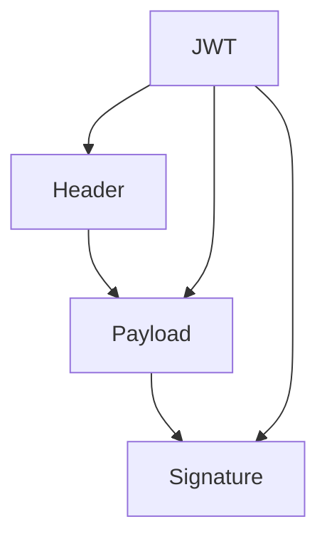
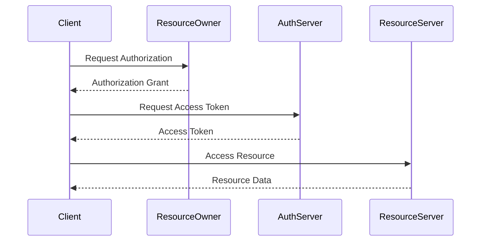

## 20.6.1 Authentication and Authorization

In the world of microservices, securing your applications is paramount. Authentication and authorization are two critical components that ensure only the right users have access to the right resources. In this section, we'll explore various strategies for implementing authentication and authorization in Clojure microservices, including JSON Web Tokens (JWTs), OAuth 2.0, and API keys. We'll also discuss how to maintain consistency across services, drawing parallels with Java where applicable.

### Understanding Authentication and Authorization

Before diving into implementation, let's clarify the concepts:

- **Authentication** is the process of verifying the identity of a user or system. It's about answering the question: "Who are you?"
- **Authorization** determines what an authenticated user is allowed to do. It answers: "What can you do?"

In a microservices architecture, these processes can become complex due to the distributed nature of services. Each service might need to authenticate requests and enforce authorization policies.

### Strategies for Authentication

#### JSON Web Tokens (JWT)

JWTs are a popular choice for stateless authentication in microservices. They are compact, URL-safe tokens that contain claims about a user and are signed to ensure integrity.

**Advantages of JWTs:**

- **Stateless**: No need to store session information on the server.
- **Scalable**: Easily distributed across services.
- **Interoperable**: Language-agnostic and widely supported.

**JWT Structure:**

A JWT consists of three parts: Header, Payload, and Signature, encoded as Base64 strings and separated by dots.



*Diagram: Structure of a JWT*

**Clojure Example:**

Let's see how to generate and verify JWTs in Clojure using the `buddy` library.

```clojure
(ns myapp.auth
  (:require [buddy.sign.jwt :as jwt]))

(def secret "my-secret-key")

;; Generate a JWT
(defn generate-token [user-id]
  (jwt/sign {:user-id user-id} secret))

;; Verify a JWT
(defn verify-token [token]
  (try
    (jwt/unsign token secret)
    (catch Exception e
      nil))) ; Return nil if verification fails
```

*Code Explanation:*

- **`generate-token`**: Creates a JWT with a user ID as a claim.
- **`verify-token`**: Verifies the token using the secret key.

**Try It Yourself:**

- Modify the `secret` key and observe how verification fails with an incorrect key.
- Add additional claims to the JWT payload and verify them.

#### OAuth 2.0

OAuth 2.0 is an authorization framework that enables third-party applications to obtain limited access to a service. It's widely used for delegated access, such as logging in with Google or Facebook.

**OAuth 2.0 Flow:**

1. **Authorization Request**: The client requests authorization from the resource owner.
2. **Authorization Grant**: The resource owner provides an authorization grant.
3. **Access Token Request**: The client requests an access token using the grant.
4. **Access Token Response**: The authorization server issues an access token.
5. **Resource Access**: The client uses the access token to access protected resources.



*Diagram: OAuth 2.0 Authorization Flow*

**Clojure Example:**

Using `clj-oauth2`, we can implement an OAuth 2.0 client.

```clojure
(ns myapp.oauth
  (:require [clj-oauth2.client :as oauth2]))

(def client-config
  {:client-id "your-client-id"
   :client-secret "your-client-secret"
   :authorize-uri "https://provider.com/oauth2/authorize"
   :access-token-uri "https://provider.com/oauth2/token"
   :redirect-uri "https://yourapp.com/callback"})

(defn get-authorization-url []
  (oauth2/authorization-url client-config))

(defn get-access-token [code]
  (oauth2/access-token client-config {:code code}))
```

*Code Explanation:*

- **`get-authorization-url`**: Generates the URL for user authorization.
- **`get-access-token`**: Exchanges the authorization code for an access token.

**Try It Yourself:**

- Change the `redirect-uri` and observe how it affects the flow.
- Implement token refresh logic for long-lived sessions.

#### API Keys

API keys are simple tokens that identify the calling program. They are often used for server-to-server communication.

**Advantages of API Keys:**

- **Simplicity**: Easy to implement and use.
- **Control**: Can be revoked or rotated without affecting users.

**Clojure Example:**

```clojure
(ns myapp.api-keys)

(def valid-api-keys #{"key1" "key2" "key3"})

(defn authenticate-api-key [api-key]
  (contains? valid-api-keys api-key))
```

*Code Explanation:*

- **`valid-api-keys`**: A set of valid API keys.
- **`authenticate-api-key`**: Checks if the provided key is valid.

**Try It Yourself:**

- Add new keys to the `valid-api-keys` set and test authentication.
- Implement rate limiting based on API keys.

### Strategies for Authorization

Authorization in microservices can be complex due to the need for consistent policy enforcement across services. Here are some strategies:

#### Role-Based Access Control (RBAC)

RBAC assigns permissions to roles rather than individual users. Users are then assigned roles, simplifying permission management.

**Clojure Example:**

```clojure
(ns myapp.rbac)

(def roles
  {:admin #{:read :write :delete}
   :user #{:read}})

(defn has-permission? [role permission]
  (contains? (roles role) permission))
```

*Code Explanation:*

- **`roles`**: Maps roles to their permissions.
- **`has-permission?`**: Checks if a role has a specific permission.

**Try It Yourself:**

- Add a new role and permissions, then test access control.
- Implement a function to assign roles to users.

#### Attribute-Based Access Control (ABAC)

ABAC uses attributes (e.g., user, resource, environment) to determine access. It's more flexible than RBAC but also more complex.

**Clojure Example:**

```clojure
(ns myapp.abac)

(defn has-access? [user resource action]
  (and (= (:role user) :admin)
       (= (:resource-type resource) :document)
       (= action :read)))
```

*Code Explanation:*

- **`has-access?`**: Determines access based on user role, resource type, and action.

**Try It Yourself:**

- Modify the attributes and observe how access decisions change.
- Implement additional attribute checks for more complex scenarios.

### Consistency Across Services

Ensuring consistent authentication and authorization across microservices is crucial. Here are some best practices:

- **Centralized Authentication**: Use a single authentication service to issue tokens.
- **Shared Authorization Policies**: Define policies centrally and enforce them across services.
- **Token Introspection**: Validate tokens at the gateway or service level to ensure they are still valid.

### Comparing with Java

Java developers might be familiar with frameworks like Spring Security for authentication and authorization. Clojure offers similar capabilities but with a functional twist.

**Java Example:**

```java
import org.springframework.security.config.annotation.web.builders.HttpSecurity;
import org.springframework.security.config.annotation.web.configuration.WebSecurityConfigurerAdapter;

public class SecurityConfig extends WebSecurityConfigurerAdapter {
    @Override
    protected void configure(HttpSecurity http) throws Exception {
        http
            .authorizeRequests()
            .antMatchers("/admin/**").hasRole("ADMIN")
            .antMatchers("/user/**").hasRole("USER")
            .and()
            .formLogin();
    }
}
```

**Comparison:**

- **Declarative vs. Functional**: Java uses annotations and configuration classes, while Clojure leverages functions and data structures.
- **Flexibility**: Clojure's functional nature allows for more dynamic and flexible security policies.

### Exercises and Practice Problems

1. **Implement JWT Authentication**: Create a Clojure service that issues and verifies JWTs. Add claims for user roles and permissions.
2. **OAuth 2.0 Client**: Set up an OAuth 2.0 client in Clojure and authenticate with a third-party provider.
3. **API Key Management**: Develop a system for managing API keys, including generation, revocation, and usage tracking.
4. **RBAC System**: Implement a role-based access control system in Clojure. Assign roles to users and enforce permissions.
5. **ABAC Implementation**: Create an attribute-based access control system. Use user and resource attributes to make access decisions.

### Key Takeaways

- **Authentication and Authorization** are critical for securing microservices.
- **JWTs, OAuth 2.0, and API Keys** are common strategies for authentication.
- **RBAC and ABAC** provide flexible authorization mechanisms.
- **Consistency** across services is essential for effective security.
- **Clojure's functional approach** offers flexibility and power in implementing security features.

By understanding and implementing these strategies, you can build secure and robust microservices with Clojure. Now that we've explored these concepts, let's apply them to secure your applications effectively.

### Further Reading

- [Official Clojure Documentation](https://clojure.org/)
- [OAuth 2.0 Specification](https://oauth.net/2/)
- [JWT Introduction](https://jwt.io/introduction/)
- [Spring Security Documentation](https://spring.io/projects/spring-security)

---

## Quiz: Mastering Authentication and Authorization in Clojure Microservices



### What is the primary purpose of authentication in microservices?

- [x] To verify the identity of a user or system
- [ ] To determine what an authenticated user can do
- [ ] To encrypt data in transit
- [ ] To manage API keys

> **Explanation:** Authentication is about verifying the identity of a user or system, answering the question "Who are you?"

### Which of the following is a key advantage of using JWTs for authentication?

- [x] Statelessness
- [ ] Complexity
- [ ] Requires server-side session storage
- [ ] Limited scalability

> **Explanation:** JWTs are stateless, meaning they do not require server-side session storage, making them scalable and easy to distribute across services.

### In OAuth 2.0, what is the purpose of an access token?

- [x] To access protected resources
- [ ] To identify the client application
- [ ] To encrypt user data
- [ ] To refresh user credentials

> **Explanation:** An access token is used by the client to access protected resources on behalf of the user.

### What does RBAC stand for?

- [x] Role-Based Access Control
- [ ] Resource-Based Access Control
- [ ] Rule-Based Access Control
- [ ] Role-Based Authentication Control

> **Explanation:** RBAC stands for Role-Based Access Control, a method of restricting access based on user roles.

### Which Clojure library is commonly used for handling JWTs?

- [x] buddy
- [ ] clj-oauth2
- [ ] ring
- [ ] compojure

> **Explanation:** The `buddy` library is commonly used in Clojure for handling JWTs, providing functions for signing and verifying tokens.

### What is a common use case for API keys in microservices?

- [x] Server-to-server communication
- [ ] User authentication
- [ ] Encrypting data
- [ ] Managing user sessions

> **Explanation:** API keys are often used for server-to-server communication, providing a simple way to authenticate requests.

### How does ABAC differ from RBAC?

- [x] ABAC uses attributes to determine access, while RBAC uses roles
- [ ] ABAC is simpler than RBAC
- [ ] ABAC is less flexible than RBAC
- [ ] ABAC is only used for user authentication

> **Explanation:** ABAC (Attribute-Based Access Control) uses attributes to determine access, offering more flexibility than RBAC, which uses roles.

### What is a benefit of centralized authentication in microservices?

- [x] Consistency across services
- [ ] Increased complexity
- [ ] Reduced security
- [ ] Limited scalability

> **Explanation:** Centralized authentication provides consistency across services, ensuring a unified approach to verifying identities.

### Which of the following is a common challenge in implementing authorization across microservices?

- [x] Consistent policy enforcement
- [ ] Lack of available libraries
- [ ] Inability to use JWTs
- [ ] Difficulty in generating API keys

> **Explanation:** Ensuring consistent policy enforcement across distributed services is a common challenge in microservices.

### True or False: OAuth 2.0 is primarily used for authentication.

- [ ] True
- [x] False

> **Explanation:** OAuth 2.0 is primarily an authorization framework, although it is often used in conjunction with authentication mechanisms.


