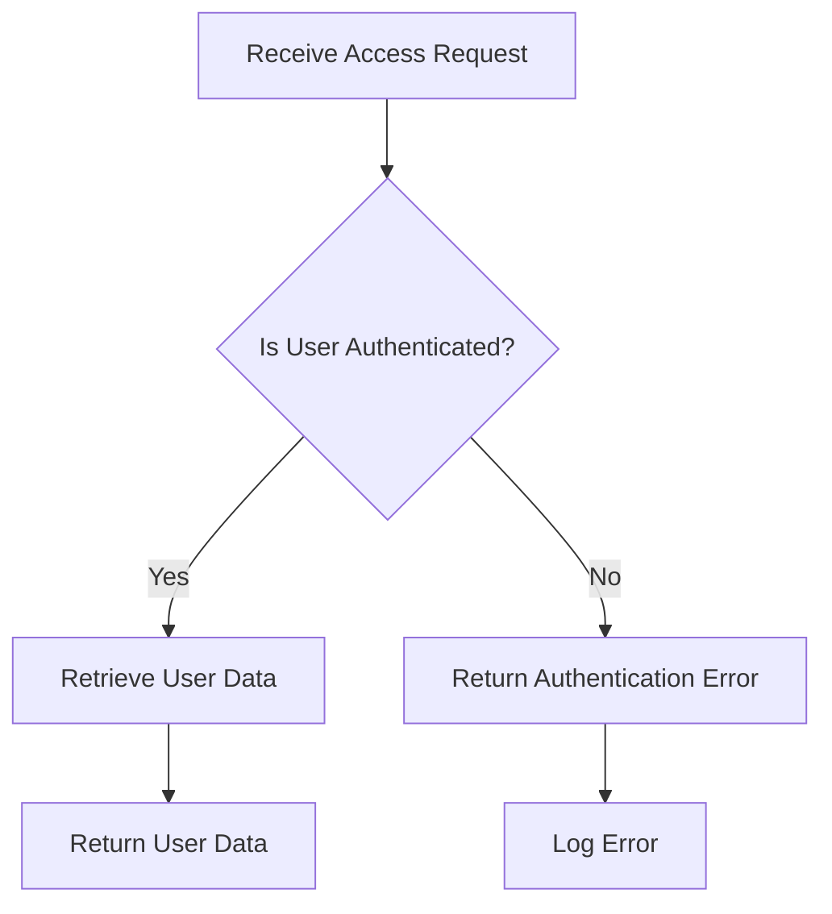

## 20.6.3 Compliance and Data Protection

In today's digital landscape, ensuring compliance and data protection is paramount, especially when building microservices with Clojure. As experienced Java developers transitioning to Clojure, understanding how to address regulatory compliance requirements such as the General Data Protection Regulation (GDPR) or the Health Insurance Portability and Accountability Act (HIPAA) is crucial. This section will guide you through best practices for handling sensitive data, anonymization techniques, and adhering to compliance standards.

### Understanding Regulatory Compliance

Regulatory compliance involves adhering to laws, regulations, guidelines, and specifications relevant to your business processes. For microservices, this often means ensuring that data handling practices align with legal requirements to protect user privacy and data integrity.

#### Key Regulations

- **GDPR**: The GDPR is a comprehensive data protection law in the European Union that governs how organizations handle personal data. It emphasizes user consent, data protection by design, and the right to be forgotten.
- **HIPAA**: HIPAA is a U.S. law that sets standards for protecting sensitive patient information. It requires healthcare providers and their business associates to implement safeguards to protect patient data.

### Best Practices for Compliance in Clojure Microservices

#### Data Minimization

Data minimization involves collecting only the data necessary for a specific purpose. This practice reduces the risk of data breaches and simplifies compliance efforts.

```clojure
;; Example of data minimization in Clojure
(defn collect-user-data [user]
  ;; Collect only necessary data fields
  {:name (:name user)
   :email (:email user)})
```

In this example, we only collect the user's name and email, minimizing the amount of sensitive data stored.

#### Data Anonymization

Anonymization is the process of removing personally identifiable information (PII) from data sets, making it impossible to identify individuals.

```clojure
;; Anonymizing user data
(defn anonymize-data [user]
  (assoc user :id (java.util.UUID/randomUUID)))
```

Here, we replace the user's ID with a randomly generated UUID, ensuring that the data cannot be traced back to the individual.

#### Encryption

Encrypting sensitive data both at rest and in transit is a fundamental practice for protecting data privacy.

```clojure
;; Encrypting data using a simple encryption library
(require '[buddy.core.crypto :as crypto])

(def secret-key "my-secret-key")

(defn encrypt-data [data]
  (crypto/encrypt data secret-key))

(defn decrypt-data [encrypted-data]
  (crypto/decrypt encrypted-data secret-key))
```

This example demonstrates how to encrypt and decrypt data using a secret key, ensuring that unauthorized parties cannot access the data.

### Compliance by Design

Compliance by design means integrating compliance measures into the development process from the outset. This approach ensures that compliance is not an afterthought but a core component of the system architecture.

#### Privacy Impact Assessments

Conducting privacy impact assessments (PIAs) helps identify potential privacy risks and implement measures to mitigate them.

- **Identify**: Determine what personal data is being processed.
- **Assess**: Evaluate the necessity and proportionality of the data processing.
- **Mitigate**: Implement measures to address identified risks.

#### Data Protection Officer

Appointing a Data Protection Officer (DPO) can help ensure that your organization complies with data protection laws and best practices.

### Handling Data Subject Requests

Under regulations like GDPR, individuals have rights regarding their personal data, including the right to access, rectify, and erase their data. Implementing mechanisms to handle these requests is essential.

```clojure
;; Handling a data subject access request
(defn handle-access-request [user-id]
  ;; Retrieve and return user data
  (get-user-data user-id))
```

This function retrieves user data based on their ID, allowing them to access their information.

### Data Breach Response

Having a data breach response plan is critical for minimizing damage and ensuring compliance with notification requirements.

#### Steps to Take in the Event of a Data Breach

1. **Identify**: Detect the breach and assess its scope.
2. **Contain**: Implement measures to contain the breach.
3. **Notify**: Inform affected individuals and regulatory authorities as required.
4. **Review**: Analyze the breach to prevent future occurrences.

### Comparing Clojure and Java for Compliance

Clojure's functional programming paradigm and immutable data structures offer unique advantages for compliance:

- **Immutability**: Reduces the risk of accidental data modification, enhancing data integrity.
- **Functional Composition**: Facilitates the creation of reusable, composable compliance functions.

In contrast, Java's object-oriented approach may require more boilerplate code to achieve similar compliance goals.

### Code Example: Implementing GDPR Compliance in Clojure

Let's implement a simple Clojure service that adheres to GDPR requirements by handling user consent and data erasure requests.

```clojure
(ns compliance-service.core
  (:require [buddy.core.crypto :as crypto]))

(def secret-key "my-secret-key")

(def users (atom {}))

(defn add-user [user]
  (swap! users assoc (:id user) user))

(defn get-user [user-id]
  (get @users user-id))

(defn delete-user [user-id]
  (swap! users dissoc user-id))

(defn encrypt-data [data]
  (crypto/encrypt data secret-key))

(defn decrypt-data [encrypted-data]
  (crypto/decrypt encrypted-data secret-key))

(defn handle-consent [user-id consent]
  (let [user (get-user user-id)]
    (if consent
      (add-user (assoc user :consent true))
      (delete-user user-id))))
```

In this example, we manage user consent and data erasure using an atom to store user data. We also encrypt sensitive data to ensure privacy.

### Try It Yourself

Experiment with the code above by adding new users, handling consent, and testing data erasure. Consider extending the service to handle additional GDPR requirements, such as data portability.

### Diagrams and Visualizations

Below is a flowchart illustrating the process of handling a data subject access request in a Clojure microservice.



**Diagram Caption**: This flowchart shows the steps involved in processing a data subject access request, including authentication and data retrieval.

### Further Reading

For more information on GDPR and HIPAA compliance, consider the following resources:

- [GDPR Official Website](https://gdpr.eu/)
- [HIPAA Journal](https://www.hipaajournal.com/)
- [Clojure Documentation](https://clojure.org/)

### Exercises

1. **Implement Data Portability**: Extend the example service to allow users to export their data in a machine-readable format.
2. **Enhance Data Anonymization**: Modify the anonymization function to handle additional data fields.
3. **Simulate a Data Breach**: Create a scenario where a data breach occurs and implement a response plan.

### Key Takeaways

- **Compliance is Essential**: Adhering to regulations like GDPR and HIPAA is crucial for protecting user data and avoiding legal penalties.
- **Clojure's Advantages**: Clojure's functional programming paradigm and immutable data structures provide unique benefits for compliance.
- **Proactive Measures**: Implementing compliance by design and having a data breach response plan are vital for maintaining data integrity and trust.

Now that we've explored compliance and data protection in Clojure microservices, let's apply these concepts to ensure your applications are secure and compliant.

## Quiz: Test Your Knowledge on Compliance and Data Protection



### Which regulation emphasizes user consent and the right to be forgotten?

- [x] GDPR
- [ ] HIPAA
- [ ] PCI DSS
- [ ] SOX

> **Explanation:** GDPR emphasizes user consent and the right to be forgotten as part of its data protection principles.


### What is the primary goal of data minimization?

- [x] Collect only necessary data
- [ ] Encrypt all data
- [ ] Anonymize all data
- [ ] Store data indefinitely

> **Explanation:** Data minimization aims to collect only the data necessary for a specific purpose, reducing the risk of data breaches.


### Which Clojure feature helps reduce the risk of accidental data modification?

- [x] Immutability
- [ ] Macros
- [ ] Dynamic typing
- [ ] Reflection

> **Explanation:** Immutability in Clojure helps reduce the risk of accidental data modification, enhancing data integrity.


### What is the purpose of a Data Protection Officer?

- [x] Ensure compliance with data protection laws
- [ ] Encrypt sensitive data
- [ ] Anonymize user data
- [ ] Manage user authentication

> **Explanation:** A Data Protection Officer ensures that an organization complies with data protection laws and best practices.


### How can you anonymize user data in Clojure?

- [x] Replace identifiable information with random values
- [ ] Encrypt all data
- [ ] Delete all user data
- [ ] Store data in a secure database

> **Explanation:** Anonymizing user data involves replacing identifiable information with random values to prevent identification.


### What should you do first in the event of a data breach?

- [x] Identify and assess the breach
- [ ] Notify affected individuals
- [ ] Contain the breach
- [ ] Review the breach

> **Explanation:** The first step in the event of a data breach is to identify and assess the breach to understand its scope.


### Which of the following is a benefit of compliance by design?

- [x] Integrating compliance measures from the outset
- [ ] Encrypting all data
- [ ] Anonymizing all data
- [ ] Storing data indefinitely

> **Explanation:** Compliance by design involves integrating compliance measures into the development process from the outset.


### What is the role of encryption in data protection?

- [x] Protect data privacy by making it unreadable to unauthorized parties
- [ ] Anonymize data
- [ ] Minimize data collection
- [ ] Store data securely

> **Explanation:** Encryption protects data privacy by making it unreadable to unauthorized parties, ensuring data security.


### How does Clojure's functional composition aid compliance?

- [x] Facilitates the creation of reusable, composable compliance functions
- [ ] Encrypts data automatically
- [ ] Anonymizes data automatically
- [ ] Stores data securely

> **Explanation:** Clojure's functional composition facilitates the creation of reusable, composable compliance functions, aiding compliance efforts.


### True or False: GDPR requires organizations to notify affected individuals in the event of a data breach.

- [x] True
- [ ] False

> **Explanation:** GDPR requires organizations to notify affected individuals and regulatory authorities in the event of a data breach.


