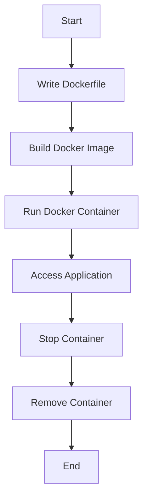

## 20.7.1 Containerization with Docker

In the world of microservices, **containerization** has become a cornerstone for deploying applications consistently across different environments. Docker, a leading containerization platform, allows developers to package applications and their dependencies into a standardized unit called a container. This section will guide you through the process of using Docker to containerize Clojure microservices, drawing parallels with Java-based applications where applicable.

### Why Use Docker for Clojure Microservices?

Docker provides several advantages that are particularly beneficial for microservices architecture:

- **Consistency Across Environments**: Docker ensures that your application runs the same way in development, testing, and production environments.
- **Isolation**: Each microservice runs in its own container, isolated from others, which prevents conflicts and enhances security.
- **Scalability**: Containers can be easily scaled up or down to handle varying loads.
- **Efficiency**: Containers are lightweight and start quickly, making them ideal for microservices that need to be responsive.

### Creating Dockerfiles for Clojure Applications

A **Dockerfile** is a script containing a series of instructions on how to build a Docker image. Let's explore how to create a Dockerfile for a simple Clojure microservice.

#### Basic Dockerfile Structure

Here's a basic Dockerfile for a Clojure application:

```dockerfile
# Use the official Clojure image as the base
FROM clojure:openjdk-11-lein

# Set the working directory inside the container
WORKDIR /app

# Copy the project files into the container
COPY . .

# Install the dependencies
RUN lein deps

# Compile the application
RUN lein uberjar

# Specify the command to run the application
CMD ["java", "-jar", "target/your-app-standalone.jar"]
```

**Explanation:**

- **FROM**: Specifies the base image. Here, we use an official Clojure image with OpenJDK 11 and Leiningen.
- **WORKDIR**: Sets the working directory inside the container.
- **COPY**: Copies the current directory contents into the container.
- **RUN**: Executes commands inside the container. We use it to install dependencies and compile the application.
- **CMD**: Defines the default command to run when the container starts.

#### Building the Docker Image

To build the Docker image, navigate to the directory containing your Dockerfile and run:

```bash
docker build -t your-app-name .
```

This command builds the image and tags it as `your-app-name`.

#### Running the Docker Container

Once the image is built, you can run it using:

```bash
docker run -p 8080:8080 your-app-name
```

This command maps port 8080 of the container to port 8080 on your host machine, allowing you to access the application via `http://localhost:8080`.

### Managing Docker Images and Containers

Docker provides several commands to manage images and containers effectively.

#### Listing Images and Containers

To list all Docker images on your system, use:

```bash
docker images
```

To list all running containers, use:

```bash
docker ps
```

To include stopped containers in the list, add the `-a` flag:

```bash
docker ps -a
```

#### Removing Images and Containers

To remove a Docker image, use:

```bash
docker rmi your-app-name
```

To remove a container, first stop it (if running) and then remove it:

```bash
docker stop container_id
docker rm container_id
```

### Handling Dependencies in Docker

Managing dependencies is crucial for ensuring that your application runs smoothly inside a container. In Clojure, dependencies are typically managed using Leiningen or tools.deps.

#### Using Leiningen

Leiningen is a popular build tool for Clojure. The `lein deps` command in the Dockerfile installs all dependencies specified in the `project.clj` file.

#### Using tools.deps

If you prefer tools.deps, you can modify the Dockerfile to use the `clojure` command for dependency management:

```dockerfile
# Use the official Clojure image with tools.deps
FROM clojure:tools-deps

# Set the working directory
WORKDIR /app

# Copy the project files
COPY . .

# Install dependencies
RUN clojure -P

# Compile the application
RUN clojure -M:uberjar

# Run the application
CMD ["java", "-jar", "target/your-app-standalone.jar"]
```

### Comparing Docker with Java Deployment

In Java, applications are often packaged as JAR or WAR files and deployed on application servers like Tomcat or Jetty. Docker simplifies this process by encapsulating the application and its runtime environment into a single container, eliminating the need for separate server configuration.

**Java Deployment Example:**

```java
// Traditional Java deployment involves packaging the application
// and deploying it on an application server.
```

**Clojure with Docker Example:**

```clojure
;; Clojure deployment with Docker involves creating a Dockerfile
;; and running the application in a container.
```

### Try It Yourself

Experiment with the Dockerfile by:

- Changing the base image to a different version of Clojure or Java.
- Adding environment variables using the `ENV` instruction.
- Mounting a volume to persist data across container restarts.

### Visualizing Docker Workflow

Below is a Mermaid diagram illustrating the Docker workflow for building and running a Clojure microservice.



**Diagram Caption**: This flowchart represents the typical workflow of using Docker to containerize a Clojure microservice, from writing the Dockerfile to accessing the running application.

### Further Reading

For more information on Docker and Clojure, consider exploring the following resources:

- [Official Docker Documentation](https://docs.docker.com/)
- [Clojure Docker Images on Docker Hub](https://hub.docker.com/_/clojure)
- [Leiningen Documentation](https://leiningen.org/)
- [Clojure Official Documentation](https://clojure.org/)

### Exercises

1. **Create a Dockerfile** for a simple Clojure web application and deploy it locally.
2. **Modify the Dockerfile** to use a different base image and observe any changes in performance or compatibility.
3. **Experiment with Docker Compose** to manage multiple Clojure microservices and their dependencies.

### Key Takeaways

- Docker provides a consistent environment for deploying Clojure microservices.
- A Dockerfile is essential for defining how to build and run your application in a container.
- Managing dependencies effectively ensures that your application runs smoothly inside a container.
- Docker simplifies deployment by encapsulating the application and its runtime environment.

Now that we've explored how to containerize Clojure microservices with Docker, let's apply these concepts to streamline your deployment process and enhance the scalability of your applications.

## Quiz: Mastering Docker for Clojure Microservices



### What is the primary benefit of using Docker for microservices?

- [x] Consistency across environments
- [ ] Increased memory usage
- [ ] Slower startup times
- [ ] Dependency conflicts

> **Explanation:** Docker ensures that applications run consistently across different environments, eliminating "it works on my machine" issues.

### Which command is used to build a Docker image from a Dockerfile?

- [x] `docker build`
- [ ] `docker run`
- [ ] `docker create`
- [ ] `docker start`

> **Explanation:** The `docker build` command is used to create a Docker image from a Dockerfile.

### What does the `CMD` instruction in a Dockerfile specify?

- [x] The default command to run when the container starts
- [ ] The base image to use
- [ ] The working directory inside the container
- [ ] The files to copy into the container

> **Explanation:** The `CMD` instruction specifies the default command that runs when the container starts.

### How do you list all Docker images on your system?

- [x] `docker images`
- [ ] `docker ps`
- [ ] `docker list`
- [ ] `docker show`

> **Explanation:** The `docker images` command lists all Docker images available on the system.

### Which tool is commonly used for dependency management in Clojure?

- [x] Leiningen
- [ ] Maven
- [ ] Gradle
- [ ] Ant

> **Explanation:** Leiningen is a popular build tool for managing dependencies in Clojure projects.

### What is the purpose of the `WORKDIR` instruction in a Dockerfile?

- [x] Sets the working directory inside the container
- [ ] Copies files into the container
- [ ] Installs dependencies
- [ ] Specifies the base image

> **Explanation:** The `WORKDIR` instruction sets the working directory inside the container where subsequent commands will be run.

### How can you remove a Docker container?

- [x] `docker rm container_id`
- [ ] `docker delete container_id`
- [ ] `docker remove container_id`
- [ ] `docker stop container_id`

> **Explanation:** The `docker rm` command is used to remove a Docker container.

### What is the advantage of using Docker over traditional Java deployment methods?

- [x] Encapsulation of the application and its runtime environment
- [ ] Requires more configuration
- [ ] Slower deployment process
- [ ] Limited to specific operating systems

> **Explanation:** Docker encapsulates the application and its runtime environment, simplifying deployment and ensuring consistency.

### True or False: Docker containers are heavier than virtual machines.

- [ ] True
- [x] False

> **Explanation:** Docker containers are lightweight compared to virtual machines because they share the host OS kernel.

### Which command maps a container's port to a host machine's port?

- [x] `docker run -p`
- [ ] `docker expose`
- [ ] `docker map`
- [ ] `docker link`

> **Explanation:** The `docker run -p` command maps a container's port to a port on the host machine, allowing access to the application.


