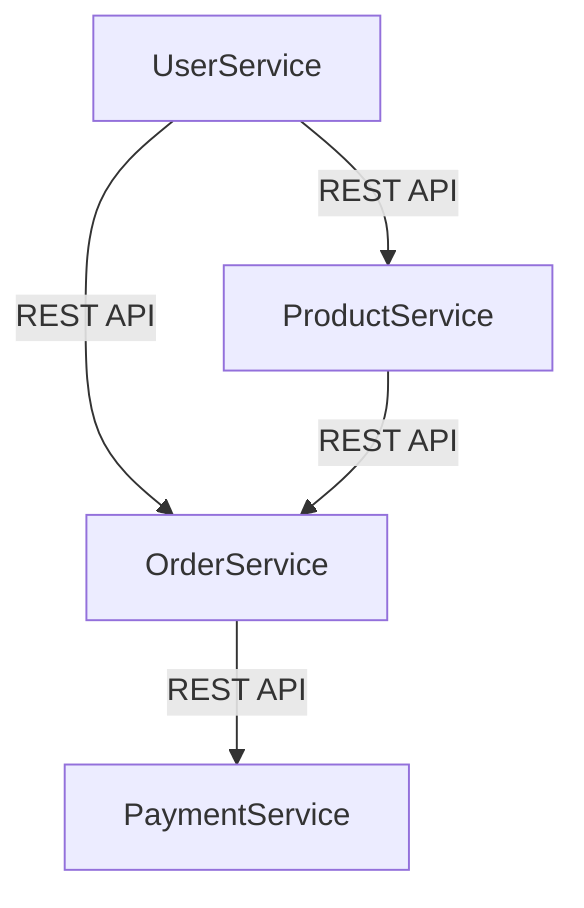

## 20.8.1 Overview of the Case Study

In this section, we delve into a comprehensive case study of a microservices architecture implemented using Clojure. This real-world example will provide insights into the business domain, the challenges faced, and how Clojure's unique features were leveraged to design an efficient and scalable system. By drawing parallels with Java, we aim to facilitate a smoother transition for Java developers exploring Clojure for microservices.

### Business Domain and Problem Statement

The business domain for this case study is an online retail platform, similar to Amazon or eBay, which requires a robust and scalable architecture to handle various services such as user management, product catalog, order processing, and payment handling. The primary challenges include:

- **Scalability**: The system must handle thousands of concurrent users and transactions.
- **Resilience**: Services should remain operational despite failures in individual components.
- **Flexibility**: The architecture should allow for easy addition and modification of services.
- **Performance**: Fast response times are crucial for a seamless user experience.

### System Design Overview

The system is designed using a microservices architecture, where each service is responsible for a specific business capability. This approach allows for independent deployment and scaling of services, aligning with the business needs for flexibility and scalability.

#### Key Components

1. **User Service**: Manages user accounts, authentication, and authorization.
2. **Product Service**: Handles product listings, search, and inventory management.
3. **Order Service**: Processes orders, manages order status, and coordinates with the payment service.
4. **Payment Service**: Manages payment processing and transaction records.

Each service is implemented as a standalone Clojure application, communicating over HTTP using RESTful APIs. This design choice leverages Clojure's strengths in handling concurrent operations and its seamless Java interoperability for integrating with existing systems.

### Clojure's Role in the Architecture

Clojure's functional programming paradigm and immutable data structures provide a robust foundation for building microservices. Let's explore how Clojure's features are utilized in this architecture:

#### Immutability and Concurrency

Clojure's immutable data structures simplify state management, reducing the risk of concurrency issues. This is particularly beneficial in a microservices architecture where services often need to handle multiple requests simultaneously.

```clojure
(defn process-order [order]
  ;; Immutable data ensures thread safety
  (let [validated-order (validate-order order)
        payment-result (process-payment validated-order)]
    (if (:success payment-result)
      (update-order-status validated-order :completed)
      (update-order-status validated-order :failed))))
```

In the above example, the `process-order` function demonstrates how immutable data structures can be used to safely handle order processing in a concurrent environment.

#### Higher-Order Functions and Composition

Clojure's support for higher-order functions allows for elegant composition of business logic, making the codebase more modular and maintainable.

```clojure
(defn handle-request [request]
  (-> request
      authenticate
      authorize
      process-order
      generate-response))
```

The `handle-request` function uses the threading macro `->` to compose multiple functions, illustrating how Clojure's functional capabilities can streamline request handling.

#### Java Interoperability

Clojure's seamless interoperability with Java enables the use of existing Java libraries and tools, facilitating integration with legacy systems and third-party services.

```clojure
(import 'java.util.UUID)

(defn generate-uuid []
  ;; Using Java's UUID class
  (str (UUID/randomUUID)))
```

This snippet shows how Clojure can leverage Java's `UUID` class to generate unique identifiers, highlighting the ease of integrating Java components into a Clojure-based system.

### System Architecture Diagram

Below is a simplified architecture diagram illustrating the interaction between microservices in the system:



**Diagram Description**: This diagram depicts the communication flow between the User, Product, Order, and Payment services, each interacting through REST APIs.

### Challenges and Solutions

#### Challenge 1: Service Communication

**Problem**: Ensuring reliable communication between services, especially under high load.

**Solution**: Implementing circuit breakers and retries using Clojure's core.async library to manage asynchronous communication and handle failures gracefully.

```clojure
(require '[clojure.core.async :as async])

(defn call-service [service-url]
  (async/go
    (try
      ;; Simulate service call
      (let [response (http/get service-url)]
        (if (= 200 (:status response))
          (:body response)
          (throw (Exception. "Service call failed"))))
      (catch Exception e
        ;; Retry logic or circuit breaker
        (println "Error calling service:" (.getMessage e))))))
```

This code snippet demonstrates using `core.async` to manage service calls, providing a mechanism for handling failures and retries.

#### Challenge 2: Data Consistency

**Problem**: Maintaining data consistency across distributed services.

**Solution**: Utilizing Clojure's software transactional memory (STM) for managing shared state within services, ensuring consistency without locking.

```clojure
(defn update-inventory [product-id quantity]
  (dosync
    (let [current-stock (ref (get-inventory product-id))]
      (alter current-stock - quantity)
      (println "Inventory updated for product:" product-id))))
```

The `update-inventory` function uses STM to safely update inventory levels, demonstrating how Clojure's concurrency primitives can ensure data consistency.

### Conclusion

This case study highlights the effectiveness of using Clojure for building a microservices architecture, leveraging its functional programming paradigm, concurrency support, and Java interoperability. By addressing key challenges such as service communication and data consistency, Clojure proves to be a powerful tool for developing scalable and resilient systems.

### Try It Yourself

To deepen your understanding, try modifying the provided code examples:

- Implement additional error handling in the `call-service` function.
- Extend the `process-order` function to include logging and auditing features.
- Experiment with different concurrency models using Clojure's agents and refs.

### Further Reading

For more information on Clojure and microservices, consider exploring the following resources:

- [Official Clojure Documentation](https://clojure.org/)
- [ClojureDocs](https://clojuredocs.org/)
- [Microservices Patterns](https://microservices.io/)

### Exercises

1. **Design a New Service**: Create a new microservice for handling customer reviews, integrating it with the existing architecture.
2. **Implement a Circuit Breaker**: Develop a circuit breaker pattern for the `call-service` function to enhance fault tolerance.
3. **Data Consistency Challenge**: Explore different strategies for maintaining data consistency across distributed services.

### Key Takeaways

- **Clojure's Functional Paradigm**: Emphasizes immutability and higher-order functions, simplifying concurrent programming.
- **Java Interoperability**: Facilitates integration with existing Java systems and libraries.
- **Microservices Architecture**: Enables scalable, resilient, and flexible system design.

By applying these concepts, you can effectively leverage Clojure to build robust microservices architectures, enhancing your software development capabilities.

## Quiz: Mastering Microservices with Clojure



### What is a key advantage of using Clojure's immutable data structures in a microservices architecture?

- [x] Simplifies state management and reduces concurrency issues
- [ ] Increases memory usage
- [ ] Complicates data handling
- [ ] Requires more complex code

> **Explanation:** Immutable data structures simplify state management by preventing unintended modifications, reducing concurrency issues.

### How does Clojure's `core.async` library help in microservices communication?

- [x] Manages asynchronous communication and handles failures
- [ ] Increases synchronous processing
- [ ] Complicates service interactions
- [ ] Reduces service reliability

> **Explanation:** `core.async` helps manage asynchronous communication, providing mechanisms for handling failures and retries.

### What is the role of Clojure's STM in managing data consistency?

- [x] Ensures consistency without locking
- [ ] Increases data inconsistency
- [ ] Requires complex locking mechanisms
- [ ] Reduces system performance

> **Explanation:** Clojure's STM allows for consistent data management without traditional locking, enhancing performance and reliability.

### Which Clojure feature facilitates integration with existing Java systems?

- [x] Java Interoperability
- [ ] Immutable Data Structures
- [ ] Higher-Order Functions
- [ ] STM

> **Explanation:** Clojure's Java interoperability allows seamless integration with Java systems and libraries.

### What is a primary benefit of using higher-order functions in Clojure?

- [x] Enhances code modularity and maintainability
- [ ] Increases code complexity
- [ ] Reduces code readability
- [ ] Requires more boilerplate code

> **Explanation:** Higher-order functions enhance code modularity and maintainability by allowing functions to be composed and reused.

### How does Clojure's functional paradigm benefit microservices architecture?

- [x] Simplifies concurrent programming
- [ ] Increases code complexity
- [ ] Reduces system flexibility
- [ ] Requires more resources

> **Explanation:** Clojure's functional paradigm simplifies concurrent programming through immutability and higher-order functions.

### What is a challenge addressed by implementing circuit breakers in microservices?

- [x] Ensures reliable communication under high load
- [ ] Increases service downtime
- [ ] Complicates service interactions
- [ ] Reduces system performance

> **Explanation:** Circuit breakers help ensure reliable communication by managing failures and retries under high load.

### Which Clojure concurrency primitive is used for managing shared state within services?

- [x] STM (Software Transactional Memory)
- [ ] Agents
- [ ] Atoms
- [ ] Futures

> **Explanation:** STM is used for managing shared state within services, ensuring data consistency without locking.

### What is a key takeaway from using Clojure for microservices?

- [x] Enhances scalability and resilience
- [ ] Increases system complexity
- [ ] Reduces system flexibility
- [ ] Requires more resources

> **Explanation:** Clojure enhances scalability and resilience through its functional paradigm and concurrency support.

### True or False: Clojure's interoperability with Java complicates integration with existing systems.

- [ ] True
- [x] False

> **Explanation:** Clojure's interoperability with Java simplifies integration with existing systems, leveraging Java libraries and tools.


