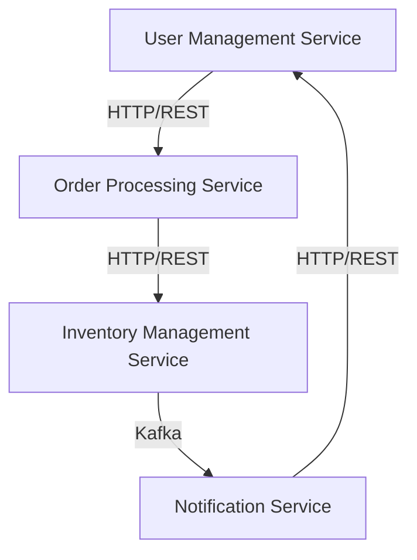

## 20.8.2 Architectural Decisions

In this section, we will delve into the architectural decisions made during the development of a microservices-based application using Clojure. As experienced Java developers transitioning to Clojure, understanding these decisions will provide insights into how Clojure's functional programming paradigm can be leveraged to build scalable, maintainable, and efficient microservices. We'll explore service boundaries, communication protocols, and technology choices, highlighting the rationale behind each decision.

### Service Boundaries

Defining clear service boundaries is crucial in a microservices architecture. It ensures that each service is responsible for a specific business capability, promoting modularity and independence. In our case study, we identified the following key service boundaries:

1. **User Management Service**: Handles user authentication, authorization, and profile management.
2. **Order Processing Service**: Manages order creation, updates, and tracking.
3. **Inventory Management Service**: Keeps track of product inventory levels and updates.
4. **Notification Service**: Sends notifications to users about order status and other events.

#### Rationale

- **Single Responsibility Principle**: Each service is designed to handle a specific domain, reducing complexity and making it easier to manage and scale.
- **Independent Deployment**: Services can be deployed independently, allowing for more agile updates and scaling strategies.
- **Fault Isolation**: Issues in one service do not directly impact others, improving overall system resilience.

### Communication Protocols

Choosing the right communication protocol is essential for efficient interaction between microservices. In our architecture, we opted for a combination of synchronous and asynchronous communication:

1. **HTTP/REST for Synchronous Communication**: Used for real-time interactions, such as user authentication and order placement.
2. **Kafka for Asynchronous Messaging**: Employed for events like inventory updates and notifications, where immediate response is not critical.

#### Rationale

- **HTTP/REST**: Provides a simple and widely adopted protocol for synchronous communication, making it easy to integrate with external systems and clients.
- **Kafka**: Offers a robust messaging platform for handling high-throughput, low-latency event streaming, which is ideal for decoupling services and ensuring reliable message delivery.

### Technology Choices

Selecting the right technology stack is pivotal for the success of a microservices architecture. Here's a breakdown of the technologies chosen for our case study:

1. **Clojure**: The primary language for service implementation, chosen for its functional programming capabilities, immutability, and simplicity.
2. **Docker**: Used for containerizing services, ensuring consistent environments across development, testing, and production.
3. **Kubernetes**: Employed for orchestrating containers, providing scalability, and managing service discovery.
4. **PostgreSQL**: Selected as the primary database for its reliability, scalability, and support for complex queries.
5. **Redis**: Used for caching and session management, improving performance and reducing database load.

#### Rationale

- **Clojure**: Its functional nature simplifies concurrency and state management, making it well-suited for microservices.
- **Docker and Kubernetes**: Together, they provide a powerful platform for managing microservices, offering features like auto-scaling, load balancing, and self-healing.
- **PostgreSQL and Redis**: These databases complement each other, with PostgreSQL handling persistent data and Redis providing fast access to frequently used data.

### Code Examples

Let's explore some Clojure code snippets that demonstrate how these architectural decisions are implemented.

#### Service Definition

```clojure
(ns user-management.core
  (:require [ring.adapter.jetty :refer [run-jetty]]
            [compojure.core :refer [defroutes GET POST]]
            [compojure.route :as route]))

(defroutes app-routes
  (GET "/users/:id" [id] (get-user id))
  (POST "/users" request (create-user request))
  (route/not-found "Not Found"))

(defn -main []
  (run-jetty app-routes {:port 8080}))
```

*Comments:*
- **Namespace Declaration**: Defines the namespace for the service, organizing code logically.
- **Routes**: Uses Compojure to define HTTP routes for user management.
- **Jetty Server**: Runs the service on a specified port.

#### Kafka Producer

```clojure
(ns inventory-management.kafka
  (:require [clj-kafka.producer :as producer]))

(defn send-inventory-update [product-id quantity]
  (producer/send-message
    {:topic "inventory-updates"
     :key product-id
     :value (str quantity)}))
```

*Comments:*
- **Kafka Producer**: Sends inventory updates to a Kafka topic, enabling asynchronous communication.
- **Message Structure**: Defines the topic, key, and value for the message.

### Diagrams

To better understand the architecture, let's visualize the service interactions and data flow.



*Caption:* This diagram illustrates the communication flow between services, highlighting the use of HTTP/REST for synchronous interactions and Kafka for asynchronous messaging.

### Try It Yourself

To deepen your understanding, try modifying the code examples:

- **Add a new route** to the User Management Service for updating user profiles.
- **Implement a Kafka consumer** in the Notification Service to process inventory updates.
- **Experiment with different database configurations** in PostgreSQL and Redis to optimize performance.

### Further Reading

For more information on the technologies and concepts discussed, consider exploring the following resources:

- [Official Clojure Documentation](https://clojure.org/)
- [Kafka Documentation](https://kafka.apache.org/documentation/)
- [Docker Documentation](https://docs.docker.com/)
- [Kubernetes Documentation](https://kubernetes.io/docs/)

### Exercises

1. **Define Service Boundaries**: Identify and define service boundaries for a hypothetical e-commerce application.
2. **Implement a New Service**: Create a new microservice in Clojure that handles payment processing.
3. **Explore Communication Protocols**: Experiment with different communication protocols, such as gRPC, and compare their performance with HTTP/REST.

### Key Takeaways

- **Service Boundaries**: Clearly defined boundaries enhance modularity and scalability.
- **Communication Protocols**: Choosing the right protocol is crucial for efficient service interaction.
- **Technology Choices**: Selecting the appropriate technology stack can significantly impact the success of a microservices architecture.

By understanding these architectural decisions, you can effectively leverage Clojure to build robust microservices, taking full advantage of its functional programming paradigm.

## SEO optimized quiz title



### What is the primary benefit of defining clear service boundaries in a microservices architecture?

- [x] Modularity and independence
- [ ] Increased complexity
- [ ] Reduced fault isolation
- [ ] Slower deployment

> **Explanation:** Clear service boundaries promote modularity and independence, allowing services to be managed and scaled independently.

### Which communication protocol is used for asynchronous messaging in the case study?

- [ ] HTTP/REST
- [x] Kafka
- [ ] gRPC
- [ ] WebSockets

> **Explanation:** Kafka is used for asynchronous messaging, providing a robust platform for event streaming and decoupling services.

### What is the primary language used for service implementation in the case study?

- [x] Clojure
- [ ] Java
- [ ] Python
- [ ] JavaScript

> **Explanation:** Clojure is chosen for its functional programming capabilities, immutability, and simplicity, making it well-suited for microservices.

### Why is Docker used in the technology stack?

- [x] For containerizing services
- [ ] For database management
- [ ] For asynchronous messaging
- [ ] For user authentication

> **Explanation:** Docker is used to containerize services, ensuring consistent environments across development, testing, and production.

### Which database is selected for caching and session management?

- [ ] PostgreSQL
- [x] Redis
- [ ] MySQL
- [ ] MongoDB

> **Explanation:** Redis is used for caching and session management, providing fast access to frequently used data.

### What is the role of Kubernetes in the architecture?

- [x] Orchestrating containers
- [ ] Managing user sessions
- [ ] Handling HTTP requests
- [ ] Processing Kafka messages

> **Explanation:** Kubernetes is employed for orchestrating containers, providing scalability, and managing service discovery.

### What is the benefit of using Kafka for asynchronous messaging?

- [x] High-throughput, low-latency event streaming
- [ ] Simplified synchronous communication
- [ ] Direct database access
- [ ] Improved user authentication

> **Explanation:** Kafka offers high-throughput, low-latency event streaming, ideal for decoupling services and ensuring reliable message delivery.

### Which service is responsible for sending notifications to users?

- [ ] User Management Service
- [ ] Order Processing Service
- [ ] Inventory Management Service
- [x] Notification Service

> **Explanation:** The Notification Service is responsible for sending notifications to users about order status and other events.

### What is the primary advantage of using Clojure for microservices?

- [x] Simplifies concurrency and state management
- [ ] Provides object-oriented programming features
- [ ] Offers built-in database management
- [ ] Supports synchronous communication only

> **Explanation:** Clojure's functional nature simplifies concurrency and state management, making it well-suited for microservices.

### True or False: PostgreSQL is used for caching in the architecture.

- [ ] True
- [x] False

> **Explanation:** Redis, not PostgreSQL, is used for caching and session management in the architecture.


