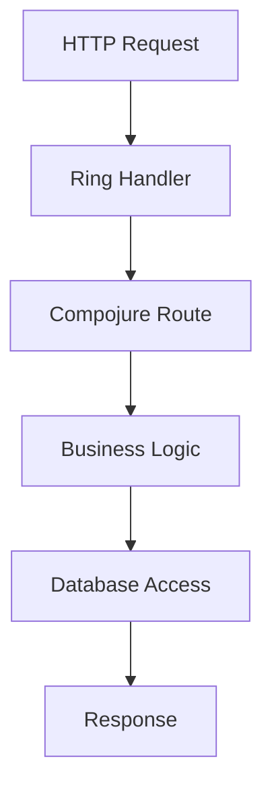
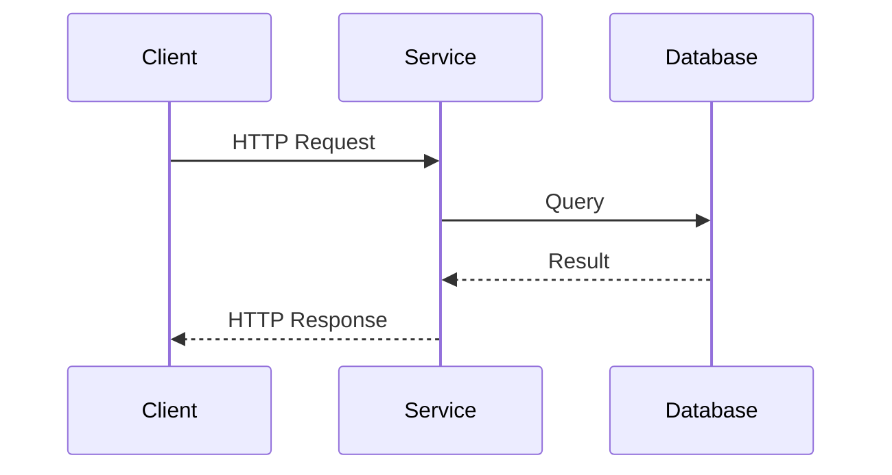

## 20.8.3 Implementation Highlights

In this section, we delve into the implementation highlights of building microservices using Clojure. We will explore the use of specific libraries, handling cross-cutting concerns, and innovative solutions to challenges faced during the development process. This guide is tailored for experienced Java developers transitioning to Clojure, leveraging their existing knowledge to facilitate understanding.

### Leveraging Clojure Libraries for Microservices

Clojure's ecosystem provides a rich set of libraries that simplify the development of microservices. Let's explore some key libraries and their roles in building robust microservices.

#### 1. **Ring and Compojure for HTTP Routing**

**Ring** is a foundational library for handling HTTP requests and responses in Clojure. It provides a simple and composable way to build web applications. **Compojure** builds on top of Ring, offering a concise DSL (Domain-Specific Language) for defining routes.

```clojure
(ns my-microservice.core
  (:require [compojure.core :refer :all]
            [compojure.route :as route]
            [ring.adapter.jetty :refer [run-jetty]]))

(defroutes app-routes
  (GET "/" [] "Welcome to my Clojure microservice!")
  (GET "/health" [] "OK")
  (route/not-found "Not Found"))

(defn -main []
  (run-jetty app-routes {:port 3000}))
```

*Comments:*
- **`GET "/" []`**: Defines a route for the root path, returning a welcome message.
- **`GET "/health" []`**: A health check endpoint, useful for monitoring.
- **`route/not-found`**: Handles unmatched routes with a "Not Found" response.

*Comparison with Java:*
In Java, setting up a similar HTTP server might involve using frameworks like Spring Boot, which requires more boilerplate code and configuration.

#### 2. **Integrating with Databases using next.jdbc**

**next.jdbc** is a modern Clojure library for interacting with SQL databases. It provides a straightforward API for executing queries and managing connections.

```clojure
(ns my-microservice.db
  (:require [next.jdbc :as jdbc]))

(def db-spec {:dbtype "h2" :dbname "test"})

(defn fetch-users []
  (jdbc/execute! db-spec ["SELECT * FROM users"]))
```

*Comments:*
- **`db-spec`**: Defines the database connection specifications.
- **`fetch-users`**: Executes a SQL query to retrieve all users.

*Comparison with Java:*
Java developers might use JDBC directly or through an ORM like Hibernate, which adds complexity and overhead.

#### 3. **Asynchronous Processing with core.async**

**core.async** is a Clojure library that provides facilities for asynchronous programming using channels and go blocks, enabling non-blocking operations.

```clojure
(ns my-microservice.async
  (:require [clojure.core.async :refer [go chan >! <!]]))

(defn async-task [input]
  (let [c (chan)]
    (go
      (let [result (process-input input)]
        (>! c result)))
    c))

(defn process-input [input]
  ;; Simulate processing
  (Thread/sleep 1000)
  (str "Processed: " input))
```

*Comments:*
- **`chan`**: Creates a channel for communication between go blocks.
- **`go`**: Launches a lightweight thread for asynchronous execution.
- **`>!` and `<!`**: Put and take operations on channels.

*Comparison with Java:*
Java's CompletableFuture or ExecutorService can achieve similar results but with more verbose syntax and less focus on immutability.

### Handling Cross-Cutting Concerns

Cross-cutting concerns such as logging, security, and configuration management are crucial in microservices architecture. Clojure offers elegant solutions to these challenges.

#### 1. **Logging with Timbre**

**Timbre** is a flexible and easy-to-use logging library for Clojure. It supports various output formats and destinations.

```clojure
(ns my-microservice.logging
  (:require [taoensso.timbre :as timbre]))

(timbre/info "Microservice started successfully.")
```

*Comments:*
- **`timbre/info`**: Logs an informational message.

*Comparison with Java:*
Java developers often use SLF4J or Log4j, which require more configuration and setup.

#### 2. **Configuration Management with Aero**

**Aero** is a Clojure library for managing configuration files. It supports environment-specific configurations and is easy to integrate.

```clojure
(ns my-microservice.config
  (:require [aero.core :refer [read-config]]))

(def config (read-config "config.edn"))

(defn get-db-url []
  (:db-url config))
```

*Comments:*
- **`read-config`**: Reads configuration from an EDN file.
- **`get-db-url`**: Retrieves the database URL from the configuration.

*Comparison with Java:*
Java applications might use Spring's Environment abstraction or Apache Commons Configuration, which can be more cumbersome.

#### 3. **Security with Buddy**

**Buddy** is a security library for Clojure, providing authentication and authorization features.

```clojure
(ns my-microservice.security
  (:require [buddy.auth :refer [authenticated?]]))

(defn secure-endpoint [request]
  (if (authenticated? request)
    "Welcome, authenticated user!"
    "Access denied."))
```

*Comments:*
- **`authenticated?`**: Checks if a request is authenticated.

*Comparison with Java:*
Java developers might use Spring Security, which is powerful but complex to configure.

### Innovative Solutions to Challenges

Building microservices involves overcoming various challenges. Here are some innovative solutions implemented in Clojure.

#### 1. **Service Discovery with Consul**

Service discovery is essential in microservices for locating services dynamically. **Consul** is a popular tool for service discovery and configuration.

```clojure
(ns my-microservice.discovery
  (:require [clj-consul.client :as consul]))

(defn register-service []
  (consul/register-service {:name "my-service" :port 3000}))
```

*Comments:*
- **`register-service`**: Registers a service with Consul.

*Comparison with Java:*
Java developers might use Netflix Eureka or Spring Cloud, which are more heavyweight solutions.

#### 2. **Circuit Breaking with Resilience4j**

Circuit breaking is a pattern for handling failures gracefully. **Resilience4j** is a lightweight library for implementing this pattern.

```clojure
(ns my-microservice.circuit
  (:require [resilience4j.circuitbreaker :as cb]))

(def breaker (cb/circuit-breaker {:failure-rate-threshold 50}))

(defn call-service []
  (cb/execute breaker
    (fn []
      ;; Simulate service call
      (if (< (rand) 0.5)
        (throw (Exception. "Service failure"))
        "Service success"))))
```

*Comments:*
- **`circuit-breaker`**: Configures a circuit breaker with a failure rate threshold.
- **`execute`**: Executes a function with circuit breaker protection.

*Comparison with Java:*
Java developers might use Hystrix, which is more complex and has been deprecated in favor of Resilience4j.

### Try It Yourself

To deepen your understanding, try modifying the code examples:

1. **Extend the HTTP server** to include additional routes and endpoints.
2. **Experiment with different database queries** using next.jdbc.
3. **Implement a new asynchronous task** using core.async.
4. **Add logging and configuration management** to your microservice.
5. **Integrate service discovery** with Consul in a multi-service setup.

### Diagrams and Visualizations

To better understand the flow of data and control in a Clojure microservice, let's visualize some key concepts.



*Caption:* This flowchart illustrates the flow of an HTTP request through a Clojure microservice, from the initial request to the final response.



*Caption:* This sequence diagram shows the interaction between a client, a Clojure microservice, and a database during a typical request-response cycle.

### Exercises and Practice Problems

1. **Exercise 1:** Implement a new microservice feature using core.async for asynchronous processing.
2. **Exercise 2:** Set up a service discovery mechanism using Consul and integrate it with your microservice.
3. **Exercise 3:** Add circuit breaking to your microservice using Resilience4j and test its behavior under failure conditions.
4. **Exercise 4:** Enhance your microservice with additional logging and configuration management using Timbre and Aero.

### Key Takeaways

- Clojure's rich ecosystem of libraries simplifies the development of microservices.
- Handling cross-cutting concerns like logging, security, and configuration is straightforward with Clojure.
- Innovative solutions such as service discovery and circuit breaking can be effectively implemented in Clojure.
- Clojure's functional programming paradigm offers unique advantages in building scalable and maintainable microservices.

By leveraging these insights and tools, you can build robust and efficient microservices with Clojure, enhancing your software architecture and development practices.

### Further Reading

- [Official Clojure Documentation](https://clojure.org/)
- [ClojureDocs](https://clojuredocs.org/)
- [Ring GitHub Repository](https://github.com/ring-clojure/ring)
- [Compojure GitHub Repository](https://github.com/weavejester/compojure)
- [next.jdbc GitHub Repository](https://github.com/seancorfield/next-jdbc)
- [core.async GitHub Repository](https://github.com/clojure/core.async)

## Quiz: Test Your Knowledge on Clojure Microservices Implementation



### Which library is used for HTTP routing in Clojure microservices?

- [x] Compojure
- [ ] Spring Boot
- [ ] Hibernate
- [ ] Log4j

> **Explanation:** Compojure is a Clojure library used for HTTP routing, built on top of Ring.

### What is the purpose of the `core.async` library in Clojure?

- [x] Asynchronous programming
- [ ] Database access
- [ ] Logging
- [ ] Configuration management

> **Explanation:** core.async is used for asynchronous programming in Clojure, providing channels and go blocks.

### How does Clojure handle configuration management?

- [x] Using libraries like Aero
- [ ] Using XML configuration files
- [ ] Through Java properties files
- [ ] With YAML files

> **Explanation:** Aero is a Clojure library for managing configuration files, supporting environment-specific configurations.

### What is a key advantage of using Clojure for microservices?

- [x] Simplicity and composability
- [ ] Requires extensive boilerplate code
- [ ] Complex configuration
- [ ] Limited library support

> **Explanation:** Clojure offers simplicity and composability, making it ideal for building microservices.

### Which library provides logging capabilities in Clojure?

- [x] Timbre
- [ ] SLF4J
- [ ] Log4j
- [ ] Spring Boot

> **Explanation:** Timbre is a flexible logging library for Clojure, supporting various output formats and destinations.

### What is the role of Consul in a microservices architecture?

- [x] Service discovery and configuration
- [ ] Logging
- [ ] Asynchronous processing
- [ ] Database management

> **Explanation:** Consul is used for service discovery and configuration in microservices architectures.

### Which library is used for circuit breaking in Clojure?

- [x] Resilience4j
- [ ] Hystrix
- [ ] Spring Cloud
- [ ] Log4j

> **Explanation:** Resilience4j is a lightweight library for implementing circuit breaking in Clojure.

### What is the benefit of using next.jdbc in Clojure?

- [x] Simplified database interaction
- [ ] Complex ORM capabilities
- [ ] Requires XML configuration
- [ ] Limited to NoSQL databases

> **Explanation:** next.jdbc provides a straightforward API for executing queries and managing connections in Clojure.

### How does Clojure's functional programming paradigm benefit microservices?

- [x] Enhances scalability and maintainability
- [ ] Increases complexity
- [ ] Requires more boilerplate code
- [ ] Limits concurrency

> **Explanation:** Clojure's functional programming paradigm enhances scalability and maintainability in microservices.

### Clojure's core.async library is used for synchronous programming.

- [ ] True
- [x] False

> **Explanation:** core.async is used for asynchronous programming, not synchronous programming.


