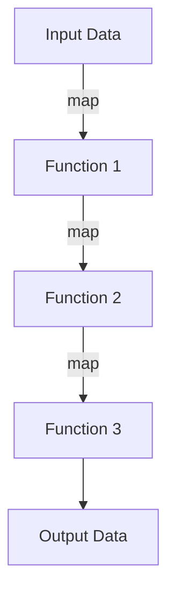
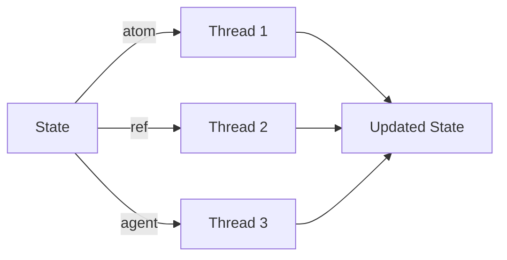

## 20.9.1 Language and Framework Differences in Microservices: Clojure vs Java

As experienced Java developers, you are likely familiar with the robust ecosystem and extensive libraries that Java offers for building microservices. However, Clojure presents a compelling alternative with its functional programming paradigm, immutability, and concise syntax. In this section, we will delve into the key differences between Clojure and Java in the context of microservices development, focusing on language features, expressiveness, and developer productivity.

### Language Features

#### Syntax and Conciseness

Java is known for its verbose syntax, which can sometimes lead to boilerplate code. In contrast, Clojure's syntax is minimalistic and expressive, allowing developers to write less code to achieve the same functionality. This conciseness can lead to increased productivity and easier maintenance.

**Java Example:**

```java
public class HelloWorld {
    public static void main(String[] args) {
        System.out.println("Hello, World!");
    }
}
```

**Clojure Example:**

```clojure
(println "Hello, World!")
```

In the Clojure example, we achieve the same result with a single line of code, highlighting the language's expressiveness.

#### Functional Programming

Clojure is a functional programming language, which means it emphasizes immutability and first-class functions. Java, traditionally an object-oriented language, has incorporated some functional features since Java 8, such as lambda expressions and the Stream API. However, Clojure's functional nature is more deeply ingrained, offering a more seamless experience for developers who embrace this paradigm.

**Clojure Example:**

```clojure
(defn square [x]
  (* x x))

(map square [1 2 3 4 5]) ; => (1 4 9 16 25)
```

**Java Example:**

```java
import java.util.Arrays;
import java.util.List;
import java.util.stream.Collectors;

public class SquareNumbers {
    public static void main(String[] args) {
        List<Integer> numbers = Arrays.asList(1, 2, 3, 4, 5);
        List<Integer> squares = numbers.stream()
                                       .map(x -> x * x)
                                       .collect(Collectors.toList());
        System.out.println(squares);
    }
}
```

While Java's Stream API provides functional capabilities, Clojure's approach is more natural and concise.

#### Immutability

Immutability is a core concept in Clojure, which helps prevent side effects and makes concurrent programming more manageable. Java developers often rely on mutable objects, which can lead to complex state management and concurrency issues.

**Clojure Example:**

```clojure
(def my-map {:a 1 :b 2 :c 3})
(assoc my-map :d 4) ; => {:a 1, :b 2, :c 3, :d 4}
```

In Clojure, `assoc` returns a new map with the added key-value pair, leaving the original map unchanged.

**Java Example:**

```java
import java.util.HashMap;
import java.util.Map;

public class ImmutableExample {
    public static void main(String[] args) {
        Map<String, Integer> myMap = new HashMap<>();
        myMap.put("a", 1);
        myMap.put("b", 2);
        myMap.put("c", 3);
        myMap.put("d", 4); // Modifies the original map
    }
}
```

In Java, modifying a map directly changes its state, which can lead to unintended side effects.

### Expressiveness

Clojure's expressiveness allows developers to write more declarative code, focusing on what needs to be done rather than how to do it. This can lead to more readable and maintainable codebases.

#### Higher-Order Functions

Clojure treats functions as first-class citizens, enabling higher-order functions that can take other functions as arguments or return them as results. This leads to more flexible and reusable code.

**Clojure Example:**

```clojure
(defn apply-twice [f x]
  (f (f x)))

(apply-twice inc 5) ; => 7
```

**Java Example:**

```java
import java.util.function.Function;

public class HigherOrderFunction {
    public static void main(String[] args) {
        Function<Integer, Integer> inc = x -> x + 1;
        System.out.println(applyTwice(inc, 5)); // => 7
    }

    public static <T> T applyTwice(Function<T, T> f, T x) {
        return f.apply(f.apply(x));
    }
}
```

While Java supports higher-order functions through the `Function` interface, Clojure's syntax is more concise and expressive.

#### Macros and Metaprogramming

Clojure's macro system allows developers to extend the language by writing code that generates code. This powerful feature enables metaprogramming, which can simplify complex tasks and reduce boilerplate.

**Clojure Macro Example:**

```clojure
(defmacro unless [condition & body]
  `(if (not ~condition)
     (do ~@body)))

(unless false
  (println "This will print"))
```

Java lacks a direct equivalent to macros, which can limit its expressiveness in certain scenarios.

### Developer Productivity

Clojure's concise syntax and functional nature can lead to increased developer productivity by reducing the amount of code that needs to be written and maintained. Additionally, Clojure's REPL (Read-Eval-Print Loop) provides an interactive development environment that allows for rapid prototyping and testing.

#### REPL-Driven Development

The REPL is a core part of the Clojure development experience, enabling developers to interactively evaluate code and see results immediately. This can speed up the development process and facilitate experimentation.

**Clojure REPL Example:**

```clojure
user=> (defn greet [name] (str "Hello, " name))
#'user/greet
user=> (greet "World")
"Hello, World"
```

Java developers typically rely on compiling and running the entire application to test changes, which can be more time-consuming.

#### Tooling and Libraries

Both Clojure and Java have rich ecosystems of libraries and tools. Java's ecosystem is more mature, with a wide range of frameworks for building microservices, such as Spring Boot and Micronaut. Clojure, while newer, has a growing ecosystem with libraries like Pedestal and Luminus for web development.

**Java Framework Example: Spring Boot**

Spring Boot is a popular framework for building microservices in Java, offering features like dependency injection, configuration management, and RESTful web services.

**Clojure Framework Example: Pedestal**

Pedestal is a Clojure framework for building web applications, emphasizing simplicity and composability.

### Concurrency and Parallelism

Clojure's approach to concurrency is fundamentally different from Java's. Clojure provides a set of concurrency primitives, such as atoms, refs, and agents, that simplify state management in concurrent applications.

#### Atoms and Refs

Clojure's atoms and refs provide a way to manage state changes safely in a concurrent environment, without the need for explicit locks.

**Clojure Atom Example:**

```clojure
(def counter (atom 0))

(defn increment-counter []
  (swap! counter inc))

(increment-counter) ; => 1
```

**Java Example:**

```java
import java.util.concurrent.atomic.AtomicInteger;

public class AtomicExample {
    private static AtomicInteger counter = new AtomicInteger(0);

    public static void incrementCounter() {
        counter.incrementAndGet();
    }
}
```

While Java provides atomic classes for concurrency, Clojure's approach is more integrated into the language.

#### Agents

Clojure's agents provide a way to manage asynchronous state changes, allowing for non-blocking updates.

**Clojure Agent Example:**

```clojure
(def my-agent (agent 0))

(send my-agent inc)
```

Java developers often rely on threads and executors for asynchronous programming, which can be more complex to manage.

### Try It Yourself

To get hands-on experience with Clojure's features, try modifying the code examples provided. For instance, experiment with creating your own higher-order functions or macros. You can also explore Clojure's concurrency primitives by implementing a simple counter using atoms or agents.

### Diagrams and Visuals

To better understand the flow of data and concurrency models in Clojure, let's explore some diagrams.

#### Data Flow in Higher-Order Functions



*Caption*: This diagram illustrates the flow of data through a series of higher-order functions, showcasing how data is transformed step-by-step.

#### Concurrency Model in Clojure



*Caption*: This diagram represents Clojure's concurrency model, highlighting how atoms, refs, and agents manage state changes across multiple threads.

### Further Reading

For more information on Clojure and its features, consider exploring the following resources:

- [Official Clojure Documentation](https://clojure.org/)
- [ClojureDocs](https://clojuredocs.org/)
- [Pedestal Documentation](https://pedestal.io/)
- [Spring Boot Documentation](https://spring.io/projects/spring-boot)

### Exercises

1. Implement a simple web service in Clojure using Pedestal and compare it with a similar service in Java using Spring Boot.
2. Create a macro in Clojure that simplifies repetitive code in your project.
3. Experiment with Clojure's concurrency primitives by building a multithreaded application that updates shared state.

### Key Takeaways

- Clojure offers a concise syntax and functional programming paradigm that can enhance developer productivity.
- Immutability and higher-order functions are core features of Clojure, providing benefits in expressiveness and concurrency management.
- Clojure's REPL-driven development and macro system offer unique advantages over Java's traditional development workflow.
- While Java has a more mature ecosystem, Clojure's growing library support makes it a viable option for microservices development.

Now that we've explored the language and framework differences between Clojure and Java, let's apply these insights to build efficient and maintainable microservices.

## Quiz: Understanding Language and Framework Differences in Microservices



### Which of the following is a core feature of Clojure that enhances concurrency management?

- [x] Immutability
- [ ] Inheritance
- [ ] Polymorphism
- [ ] Reflection

> **Explanation:** Immutability is a core feature of Clojure that helps manage concurrency by preventing side effects and ensuring thread safety.

### What is a key advantage of Clojure's syntax compared to Java's?

- [x] Conciseness
- [ ] Verbosity
- [ ] Complexity
- [ ] Redundancy

> **Explanation:** Clojure's syntax is concise, allowing developers to write less code to achieve the same functionality as Java.

### How does Clojure handle state changes in a concurrent environment?

- [x] Using atoms, refs, and agents
- [ ] Using synchronized blocks
- [ ] Using semaphores
- [ ] Using locks

> **Explanation:** Clojure uses atoms, refs, and agents to manage state changes safely in a concurrent environment.

### What is a higher-order function in Clojure?

- [x] A function that takes other functions as arguments or returns them as results
- [ ] A function that only operates on numbers
- [ ] A function that cannot be nested
- [ ] A function that is always recursive

> **Explanation:** A higher-order function in Clojure is one that can take other functions as arguments or return them as results, allowing for more flexible and reusable code.

### Which of the following is NOT a concurrency primitive in Clojure?

- [ ] Atom
- [x] Semaphore
- [ ] Ref
- [ ] Agent

> **Explanation:** Semaphore is not a concurrency primitive in Clojure. Clojure uses atoms, refs, and agents for concurrency.

### What is the purpose of Clojure's macro system?

- [x] To allow developers to write code that generates code
- [ ] To enforce strict typing
- [ ] To manage memory allocation
- [ ] To handle exceptions

> **Explanation:** Clojure's macro system allows developers to write code that generates code, enabling metaprogramming and reducing boilerplate.

### How does Clojure's REPL enhance developer productivity?

- [x] By allowing interactive evaluation of code
- [ ] By enforcing compile-time checks
- [ ] By providing a graphical interface
- [ ] By automating code generation

> **Explanation:** Clojure's REPL allows developers to interactively evaluate code and see results immediately, speeding up the development process.

### What is a key difference between Clojure's and Java's approach to functional programming?

- [x] Clojure treats functions as first-class citizens
- [ ] Java has a more concise syntax
- [ ] Clojure relies on inheritance
- [ ] Java uses macros extensively

> **Explanation:** Clojure treats functions as first-class citizens, enabling higher-order functions and a more natural functional programming experience.

### Which Clojure feature allows for asynchronous state changes?

- [x] Agents
- [ ] Atoms
- [ ] Refs
- [ ] Vars

> **Explanation:** Agents in Clojure allow for asynchronous state changes, enabling non-blocking updates.

### True or False: Java's ecosystem is more mature than Clojure's.

- [x] True
- [ ] False

> **Explanation:** Java's ecosystem is more mature, with a wide range of frameworks and libraries for building microservices.


