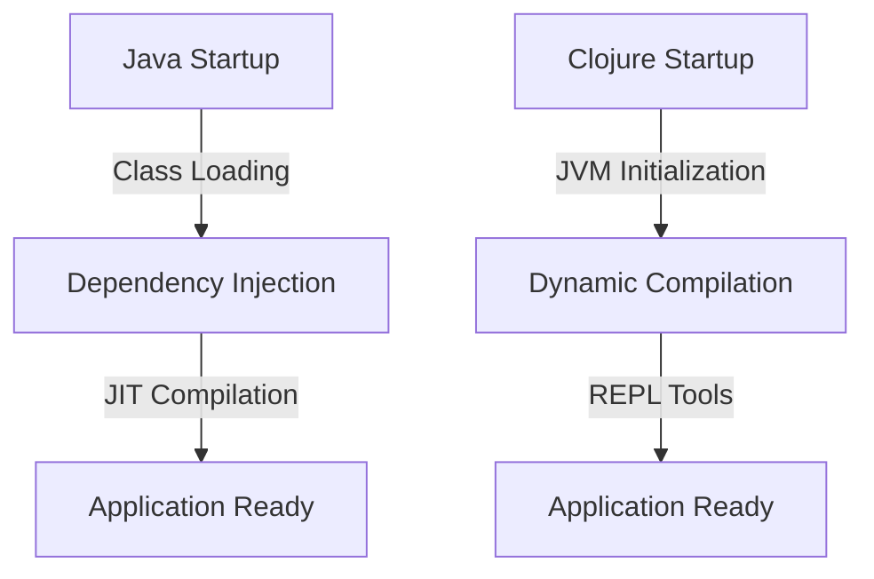
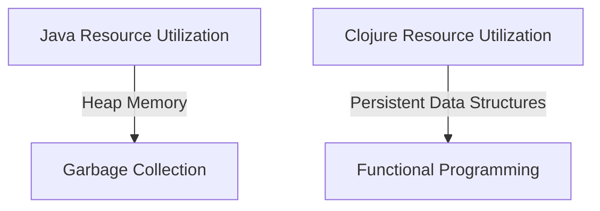

## 20.9.2 Performance Considerations

In this section, we will delve into the performance characteristics of microservices built with Clojure compared to those built with Java. As experienced Java developers transitioning to Clojure, understanding these differences is crucial for making informed decisions about your microservices architecture. We'll explore startup times, resource utilization, and runtime efficiency, providing insights into how Clojure's functional programming paradigm and immutable data structures can impact performance.

### Startup Times

One of the key performance considerations in microservices is startup time. In a microservices architecture, services are often started and stopped frequently, making startup time a critical factor.

#### Java Startup Times

Java applications, especially those using frameworks like Spring Boot, can have relatively long startup times. This is due to several factors:

- **Class Loading**: Java's class loading mechanism can be time-consuming, especially in large applications with many dependencies.
- **Dependency Injection**: Frameworks like Spring perform extensive dependency injection and configuration at startup, which can add to the delay.
- **JIT Compilation**: Java's Just-In-Time (JIT) compiler optimizes code at runtime, which can initially slow down startup as it compiles bytecode to native code.

#### Clojure Startup Times

Clojure, being a dynamic language, also faces challenges with startup times:

- **JVM Initialization**: Like Java, Clojure runs on the JVM, so it inherits the JVM's startup overhead.
- **Dynamic Compilation**: Clojure code is compiled to bytecode at runtime, which can add to startup time.
- **REPL and Development Tools**: Clojure's interactive development environment can introduce additional startup delays.

However, Clojure's startup times can be mitigated by techniques such as Ahead-Of-Time (AOT) compilation, which compiles Clojure code to bytecode before runtime, reducing the need for dynamic compilation.

```clojure
;; Example of AOT Compilation in Clojure
(ns myapp.core
  (:gen-class))

(defn -main [& args]
  (println "Hello, World!"))

;; Compile with: lein uberjar
```

**Try It Yourself**: Experiment with AOT compilation by creating a simple Clojure application and compiling it using `lein uberjar`. Measure the startup time with and without AOT compilation.

### Resource Utilization

Resource utilization is another critical aspect of microservices performance. It includes CPU, memory, and I/O usage.

#### Java Resource Utilization

Java applications are known for their relatively high memory usage due to:

- **Heap Memory**: Java applications often require large heap sizes to accommodate object-oriented data structures.
- **Garbage Collection**: Java's garbage collector can introduce latency and CPU overhead, especially in high-throughput applications.

Java's resource utilization can be optimized through techniques such as:

- **Tuning JVM Parameters**: Adjusting heap size, garbage collection algorithms, and other JVM settings.
- **Using Lightweight Frameworks**: Opting for lightweight frameworks like Micronaut instead of Spring Boot to reduce memory footprint.

#### Clojure Resource Utilization

Clojure's functional programming paradigm and immutable data structures can lead to different resource utilization patterns:

- **Persistent Data Structures**: Clojure's use of persistent data structures can reduce memory usage by sharing structure between versions.
- **Functional Programming**: The emphasis on pure functions can lead to more predictable resource usage patterns.

Clojure's resource utilization can be optimized by:

- **Using Transients**: For local mutability, transients can be used to temporarily allow mutable operations, improving performance.
- **Profiling and Optimization**: Tools like `VisualVM` and `YourKit` can help profile and optimize Clojure applications.

```clojure
;; Example of Using Transients in Clojure
(defn sum-transient [coll]
  (reduce + (transient coll)))

(sum-transient [1 2 3 4 5]) ;; => 15
```

**Try It Yourself**: Modify the above example to use persistent data structures and compare the performance with transients.

### Runtime Efficiency

Runtime efficiency involves the ability of a microservice to handle requests and perform computations efficiently.

#### Java Runtime Efficiency

Java's runtime efficiency is often enhanced by:

- **JIT Compilation**: Java's JIT compiler optimizes code at runtime, improving performance over time.
- **Concurrency**: Java provides robust concurrency support through threads, `ExecutorService`, and `CompletableFuture`.

Java's runtime efficiency can be further improved by:

- **Using Non-Blocking I/O**: Libraries like Netty and frameworks like Vert.x offer non-blocking I/O for high-performance applications.
- **Optimizing Algorithms**: Profiling and optimizing algorithms to reduce computational complexity.

#### Clojure Runtime Efficiency

Clojure's runtime efficiency benefits from:

- **Immutable Data Structures**: These structures can lead to more efficient memory usage and reduced contention in concurrent applications.
- **Concurrency Primitives**: Clojure provides powerful concurrency primitives like atoms, refs, and agents, which simplify state management in concurrent applications.

Clojure's runtime efficiency can be enhanced by:

- **Leveraging Core.async**: For asynchronous programming, `core.async` provides channels and go blocks for efficient concurrency.
- **Optimizing Function Calls**: Reducing the overhead of function calls through inlining and avoiding reflection.

```clojure
;; Example of Using core.async for Concurrency
(require '[clojure.core.async :refer [go chan >! <!]])

(defn async-example []
  (let [c (chan)]
    (go (>! c "Hello, async!"))
    (println (<! c))))

(async-example) ;; => "Hello, async!"
```

**Try It Yourself**: Extend the above example to perform more complex asynchronous operations, such as fetching data from an API.

### Comparing Clojure and Java Performance

To better understand the performance differences between Clojure and Java microservices, let's compare them in terms of startup times, resource utilization, and runtime efficiency.

| Aspect               | Java                                   | Clojure                                |
|----------------------|----------------------------------------|----------------------------------------|
| **Startup Times**    | Longer due to class loading and JIT    | Can be reduced with AOT compilation    |
| **Resource Utilization** | Higher memory usage due to heap and GC | Efficient with persistent data structures |
| **Runtime Efficiency** | Enhanced by JIT and concurrency support | Efficient with immutable data and core.async |

### Diagrams and Visualizations

To visualize the differences in performance characteristics, let's use a few diagrams.



**Diagram 1**: This flowchart compares the startup processes of Java and Clojure applications, highlighting key steps that contribute to startup time.



**Diagram 2**: This flowchart illustrates the resource utilization patterns of Java and Clojure, emphasizing memory management and functional programming.

### Key Takeaways

- **Startup Times**: Clojure's startup times can be optimized with AOT compilation, making it competitive with Java.
- **Resource Utilization**: Clojure's persistent data structures and functional paradigm can lead to more efficient resource usage.
- **Runtime Efficiency**: Both Java and Clojure offer robust concurrency support, but Clojure's immutable data structures can simplify state management.

### Exercises and Practice Problems

1. **Experiment with AOT Compilation**: Create a simple Clojure application and measure the startup time with and without AOT compilation.
2. **Optimize Resource Utilization**: Use transients in a Clojure application to improve performance and compare it with persistent data structures.
3. **Implement Asynchronous Operations**: Extend the core.async example to perform complex asynchronous tasks, such as fetching data from multiple APIs concurrently.

### Further Reading

- [Official Clojure Documentation](https://clojure.org/reference/documentation)
- [ClojureDocs](https://clojuredocs.org/)
- [Java Performance Tuning](https://www.oracle.com/java/technologies/javase/performance.html)

By understanding these performance considerations, we can make informed decisions about when and how to use Clojure for building efficient microservices. Now that we've explored the performance characteristics of Clojure and Java microservices, let's apply these insights to optimize your applications.

## SEO optimized quiz title



### What is a common cause of longer startup times in Java applications?

- [x] Class loading and JIT compilation
- [ ] Dynamic typing
- [ ] Lack of concurrency support
- [ ] Immutable data structures

> **Explanation:** Java applications often experience longer startup times due to class loading and JIT compilation, which are necessary for optimizing code at runtime.

### How can Clojure's startup times be improved?

- [x] Using Ahead-Of-Time (AOT) compilation
- [ ] Increasing heap size
- [ ] Using more threads
- [ ] Disabling garbage collection

> **Explanation:** AOT compilation in Clojure reduces the need for dynamic compilation at runtime, thereby improving startup times.

### What is a benefit of Clojure's persistent data structures?

- [x] Reduced memory usage through structural sharing
- [ ] Faster garbage collection
- [ ] Improved class loading
- [ ] Enhanced dynamic typing

> **Explanation:** Clojure's persistent data structures use structural sharing, which reduces memory usage by reusing parts of data structures.

### Which Java feature enhances runtime efficiency?

- [x] Just-In-Time (JIT) compilation
- [ ] Dynamic typing
- [ ] Immutable data structures
- [ ] Lack of concurrency support

> **Explanation:** JIT compilation in Java optimizes code at runtime, enhancing runtime efficiency by converting bytecode to native code.

### What is a key advantage of using core.async in Clojure?

- [x] Efficient concurrency with channels and go blocks
- [ ] Faster startup times
- [x] Reduced memory usage
- [ ] Improved class loading

> **Explanation:** Core.async provides efficient concurrency in Clojure through channels and go blocks, allowing for asynchronous programming.

### How does Java's garbage collection impact resource utilization?

- [x] It can introduce latency and CPU overhead
- [ ] It reduces memory usage
- [ ] It improves startup times
- [ ] It enhances dynamic typing

> **Explanation:** Java's garbage collection can introduce latency and CPU overhead, affecting resource utilization, especially in high-throughput applications.

### What is a common technique to optimize Java's resource utilization?

- [x] Tuning JVM parameters
- [ ] Using dynamic typing
- [x] Disabling garbage collection
- [ ] Increasing class loading

> **Explanation:** Tuning JVM parameters, such as heap size and garbage collection algorithms, can optimize Java's resource utilization.

### Which Clojure feature simplifies state management in concurrent applications?

- [x] Immutable data structures
- [ ] Dynamic typing
- [ ] Class loading
- [ ] JIT compilation

> **Explanation:** Clojure's immutable data structures simplify state management in concurrent applications by eliminating shared mutable state.

### What is a benefit of using transients in Clojure?

- [x] Improved performance for local mutability
- [ ] Faster startup times
- [ ] Enhanced dynamic typing
- [ ] Reduced class loading

> **Explanation:** Transients in Clojure provide improved performance for local mutability by allowing temporary mutable operations.

### True or False: Clojure's functional programming paradigm can lead to more predictable resource usage patterns.

- [x] True
- [ ] False

> **Explanation:** Clojure's functional programming paradigm emphasizes pure functions, leading to more predictable resource usage patterns.


