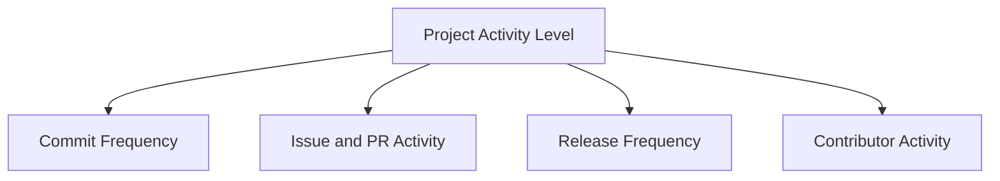
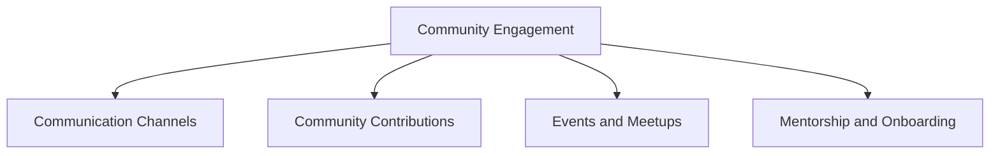
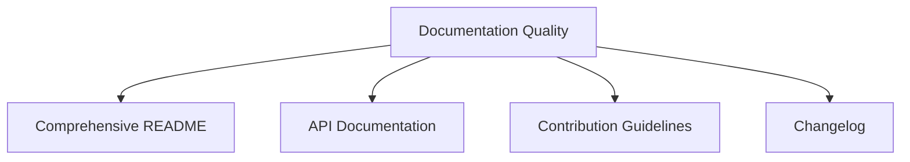
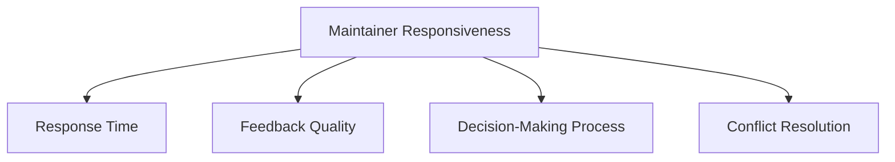

## 21.1.2 Evaluating Project Health

Contributing to open source projects can be a rewarding experience, offering opportunities to learn, collaborate, and make a meaningful impact. However, choosing the right project to contribute to is crucial. Evaluating the health of a project helps ensure that your efforts are well-placed and that you are joining a vibrant, supportive community. In this section, we'll explore the key criteria for assessing the health of open source Clojure projects, focusing on activity level, community engagement, documentation quality, and the responsiveness of maintainers.

### Understanding Project Health

Before diving into the specifics, let's define what we mean by "project health." A healthy project is one that is active, well-maintained, and has a supportive community. It should have clear documentation, regular updates, and responsive maintainers. These factors contribute to a project's sustainability and the likelihood of successful contributions.

### Activity Level

The activity level of a project is a primary indicator of its health. It reflects how frequently the project is updated and how actively the community is involved. Here are some ways to assess activity level:

1. **Commit Frequency**: Check the project's repository for recent commits. A steady stream of commits indicates ongoing development and maintenance. Look for patterns in commit history to understand the project's lifecycle.

   ```clojure
   ;; Example: Checking commit history using Git
   ;; Run this command in the terminal within the project directory
   git log --since="1 month ago" --oneline
   ```

2. **Issue and Pull Request Activity**: Examine the number of open and closed issues and pull requests. A high number of unresolved issues might indicate maintenance challenges, while a healthy balance of open and closed pull requests suggests active development.

3. **Release Frequency**: Regular releases demonstrate that the project is evolving and that the maintainers are committed to improving it. Check the release history for consistency.

4. **Contributor Activity**: Analyze the number of active contributors. A diverse contributor base can indicate a robust community and reduce the risk of the project becoming inactive if a key contributor leaves.

#### Diagram: Project Activity Indicators



*Caption: This diagram illustrates the key indicators of a project's activity level.*

### Community Engagement

A strong community is vital for the longevity of an open source project. Community engagement can be assessed through:

1. **Communication Channels**: Identify the platforms where the community interacts, such as mailing lists, forums, or chat rooms. Active discussions and prompt responses are signs of a healthy community.

2. **Community Contributions**: Look for evidence of community-driven contributions, such as feature requests, bug reports, and patches. A project that welcomes and integrates community input is likely to be more dynamic and inclusive.

3. **Events and Meetups**: Participation in events, conferences, or meetups can indicate a project's influence and the community's enthusiasm. Check if the project hosts or participates in such events.

4. **Mentorship and Onboarding**: Evaluate the project's efforts to onboard new contributors. A welcoming environment with mentorship opportunities can enhance community growth and engagement.

#### Diagram: Community Engagement Factors



*Caption: This diagram highlights the factors contributing to community engagement in open source projects.*

### Documentation Quality

Good documentation is crucial for understanding a project's purpose, usage, and contribution guidelines. Assess documentation quality by:

1. **Comprehensive README**: The README file should provide an overview of the project, installation instructions, usage examples, and contribution guidelines. It serves as the first point of contact for potential contributors.

2. **API Documentation**: For projects with complex APIs, detailed documentation is essential. It should include function descriptions, parameters, return values, and examples.

3. **Contribution Guidelines**: Clear guidelines for contributing help streamline the process and set expectations for contributors. Look for a CONTRIBUTING.md file or similar documentation.

4. **Changelog**: A well-maintained changelog provides insight into the project's development history and helps contributors understand recent changes.

#### Diagram: Documentation Components



*Caption: This diagram outlines the essential components of high-quality project documentation.*

### Responsiveness of Maintainers

The maintainers' responsiveness is critical for a project's success. It affects how quickly issues are resolved, pull requests are reviewed, and contributors receive feedback. Evaluate maintainer responsiveness by:

1. **Response Time**: Check how quickly maintainers respond to issues and pull requests. Prompt responses indicate active involvement and commitment to the project.

2. **Feedback Quality**: Assess the quality of feedback provided by maintainers. Constructive feedback helps contributors improve and feel valued.

3. **Decision-Making Process**: Understand the decision-making process for accepting contributions. Transparent processes foster trust and collaboration.

4. **Conflict Resolution**: Observe how conflicts are handled within the community. Effective conflict resolution is essential for maintaining a positive and productive environment.

#### Diagram: Maintainer Responsiveness Factors



*Caption: This diagram illustrates the factors that contribute to the responsiveness of project maintainers.*

### Try It Yourself: Evaluating a Clojure Project

To practice evaluating project health, choose a Clojure project on GitHub and assess it based on the criteria discussed. Consider the following steps:

1. **Clone the Repository**: Clone the project's repository to your local machine.

   ```bash
   git clone https://github.com/example/clojure-project.git
   ```

2. **Review the Commit History**: Use Git commands to analyze the commit history and assess activity levels.

3. **Examine Issues and Pull Requests**: Explore the project's issues and pull requests to evaluate community engagement and maintainer responsiveness.

4. **Assess Documentation**: Review the project's documentation for clarity and completeness.

5. **Engage with the Community**: Join the project's communication channels and observe interactions.

### Exercises

1. **Identify a Healthy Project**: Find a Clojure project that meets the criteria for a healthy project. Write a brief report on your findings.

2. **Contribute to a Project**: Choose a project with a welcoming community and contribute a small patch or documentation improvement.

3. **Compare Two Projects**: Select two Clojure projects and compare their health based on the criteria discussed. Identify strengths and weaknesses.

### Key Takeaways

- Evaluating project health is essential for choosing the right open source project to contribute to.
- Key indicators of project health include activity level, community engagement, documentation quality, and maintainer responsiveness.
- A healthy project is active, well-documented, and has a supportive community with responsive maintainers.
- Engaging with a healthy project can enhance your learning experience and increase the impact of your contributions.

### Further Reading

- [Official Clojure Documentation](https://clojure.org/)
- [ClojureDocs](https://clojuredocs.org/)
- [GitHub Guides: Understanding the GitHub Flow](https://guides.github.com/introduction/flow/)

Now that we've explored how to evaluate the health of open source Clojure projects, let's apply these concepts to find and contribute to projects that align with your interests and skills.

## Quiz: Evaluating Project Health in Open Source Clojure Projects



### What is a primary indicator of a project's activity level?

- [x] Commit frequency
- [ ] Number of stars on GitHub
- [ ] Project age
- [ ] Number of forks

> **Explanation:** Commit frequency reflects ongoing development and maintenance, making it a primary indicator of activity level.

### Which factor is NOT a part of community engagement?

- [ ] Communication channels
- [ ] Community contributions
- [x] Code complexity
- [ ] Events and meetups

> **Explanation:** Code complexity is not directly related to community engagement, which focuses on interaction and participation.

### What should a comprehensive README include?

- [x] Overview, installation instructions, usage examples, and contribution guidelines
- [ ] Only installation instructions
- [ ] Only usage examples
- [ ] Only contribution guidelines

> **Explanation:** A comprehensive README should provide a complete overview, including installation, usage, and contribution information.

### How can you assess the responsiveness of maintainers?

- [x] By checking response time to issues and pull requests
- [ ] By counting the number of maintainers
- [ ] By evaluating the project's age
- [ ] By analyzing the codebase size

> **Explanation:** Responsiveness is best assessed by observing how quickly maintainers respond to issues and pull requests.

### Which of the following is a sign of good documentation quality?

- [x] Detailed API documentation
- [ ] High number of contributors
- [ ] Frequent code changes
- [ ] Large codebase

> **Explanation:** Detailed API documentation is a key component of good documentation quality.

### What is a benefit of having a diverse contributor base?

- [x] Reduces the risk of project inactivity
- [ ] Increases code complexity
- [ ] Slows down development
- [ ] Decreases community engagement

> **Explanation:** A diverse contributor base helps ensure the project remains active even if key contributors leave.

### Which of the following is NOT a factor in maintainer responsiveness?

- [ ] Response time
- [ ] Feedback quality
- [x] Number of stars on GitHub
- [ ] Conflict resolution

> **Explanation:** The number of stars on GitHub does not directly relate to maintainer responsiveness.

### What is an appropriate use of a changelog?

- [x] To provide insight into the project's development history
- [ ] To list all contributors
- [ ] To summarize the project's purpose
- [ ] To display the project's license

> **Explanation:** A changelog provides a record of changes and updates, offering insight into the project's development history.

### Which of the following is a sign of a welcoming community?

- [x] Mentorship and onboarding opportunities
- [ ] High code complexity
- [ ] Strict contribution guidelines
- [ ] Limited communication channels

> **Explanation:** Mentorship and onboarding opportunities indicate a welcoming and supportive community.

### True or False: Regular releases are a sign of a project's evolution and commitment to improvement.

- [x] True
- [ ] False

> **Explanation:** Regular releases demonstrate that the project is evolving and that maintainers are committed to its improvement.


