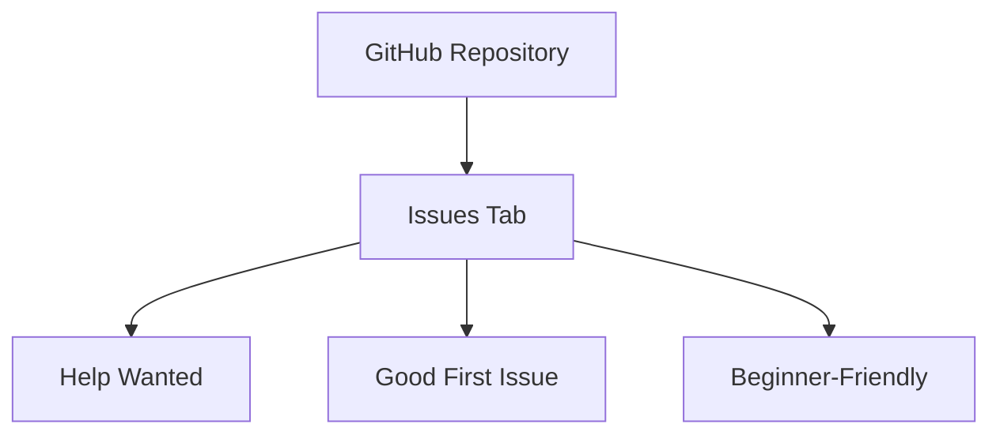

## 21.1.3 Identifying Contribution Opportunities

Contributing to open source projects is a rewarding way to enhance your skills, gain experience, and give back to the community. For Java developers transitioning to Clojure, identifying the right contribution opportunities can be a gateway to mastering the language and its ecosystem. In this section, we'll explore how to find areas where your contributions can make a significant impact, such as open issues labeled "help wanted" or "good first issue," documentation improvements, or feature requests.

### Understanding the Landscape

Before diving into contributions, it's essential to understand the landscape of Clojure open source projects. Clojure, being a Lisp dialect, has a vibrant community with projects ranging from web frameworks to data processing libraries. Familiarizing yourself with the ecosystem will help you identify projects that align with your interests and expertise.

#### Key Clojure Projects and Ecosystem

1. **Clojure Core Libraries**: These are the foundational libraries that form the backbone of Clojure applications. Contributing here requires a deep understanding of Clojure's core principles and idioms.

2. **Web Frameworks**: Projects like Ring, Compojure, and Luminus are popular for building web applications in Clojure. They often have issues related to routing, middleware, and API design.

3. **Data Processing Libraries**: Libraries such as core.async, transducers, and Clojure's data structures are crucial for handling large data sets and concurrent programming.

4. **ClojureScript**: This is Clojure for the JavaScript ecosystem, enabling developers to write front-end applications. Contributions here might involve working with Reagent or Re-frame.

5. **Tooling and Build Systems**: Leiningen and Boot are essential for managing Clojure projects. Contributions can include improving plugins or enhancing build processes.

### Finding Contribution Opportunities

Once you have a grasp of the ecosystem, the next step is to identify specific contribution opportunities. Here are some strategies to help you get started:

#### 1. Browsing GitHub Repositories

GitHub is the primary platform for hosting Clojure open source projects. Here's how you can find contribution opportunities:

- **Search for Repositories**: Use GitHub's search functionality to find Clojure projects. You can filter by language to narrow down your search to Clojure-specific repositories.

- **Explore Issues**: Once you find a repository of interest, navigate to the "Issues" tab. Look for labels such as "help wanted," "good first issue," or "beginner-friendly." These labels indicate tasks that are suitable for new contributors.



*Diagram 1: Navigating GitHub to find contribution opportunities.*

#### 2. Engaging with the Community

The Clojure community is active and welcoming. Engaging with the community can open doors to contribution opportunities:

- **Join Clojure Forums and Mailing Lists**: Platforms like ClojureVerse and the Clojure Google Group are excellent places to ask questions and learn about ongoing projects.

- **Participate in Clojure Meetups and Conferences**: Events like Clojure/conj and local meetups are great for networking and discovering projects that need help.

- **Follow Clojure Influencers on Social Media**: Twitter and LinkedIn can be valuable for staying updated on the latest trends and projects in the Clojure ecosystem.

#### 3. Contributing to Documentation

Documentation is a critical aspect of any project, and there's always room for improvement. Here are ways you can contribute:

- **Improve Existing Documentation**: Review the project's documentation for clarity, accuracy, and completeness. Look for areas that might benefit from additional examples or explanations.

- **Create Tutorials and Guides**: If you have a knack for teaching, consider writing tutorials or guides that help others understand the project better.

- **Translate Documentation**: If you're multilingual, translating documentation into other languages can significantly broaden the project's reach.

#### 4. Addressing Feature Requests

Feature requests are suggestions from users about new functionalities they would like to see in a project. Here's how you can contribute:

- **Review Open Feature Requests**: Check the project's issue tracker for open feature requests. Assess whether you have the skills and interest to implement any of them.

- **Propose New Features**: If you have ideas for improving the project, propose them to the maintainers. Be prepared to discuss the benefits and potential implementation strategies.

#### 5. Fixing Bugs

Bug fixing is a classic way to contribute to open source projects. Here's how to get started:

- **Identify Bugs**: Look for issues labeled as "bug" in the issue tracker. These are often prioritized by maintainers and can be a good starting point for contributions.

- **Reproduce and Diagnose**: Before fixing a bug, try to reproduce it on your local setup. This will help you understand the problem and develop a solution.

- **Submit a Pull Request**: Once you've fixed the bug, submit a pull request with your changes. Include a detailed description of the issue and how your fix addresses it.

### Comparing Clojure and Java Contribution Processes

As a Java developer, you might be familiar with contributing to Java projects. Let's compare the contribution processes in Java and Clojure to highlight similarities and differences:

- **Issue Tracking**: Both Java and Clojure projects use platforms like GitHub for issue tracking. However, Clojure projects might have more emphasis on community-driven labels like "good first issue."

- **Code Style and Guidelines**: Clojure's code style is influenced by its Lisp heritage, emphasizing simplicity and conciseness. Java projects might have more extensive style guides due to the language's verbosity.

- **Tooling**: While Java projects often use Maven or Gradle, Clojure projects typically use Leiningen or Boot. Understanding these tools is crucial for effective contributions.

### Code Example: Contributing to a Clojure Project

Let's walk through a simple example of contributing to a Clojure project. We'll fix a bug in a hypothetical project that calculates the factorial of a number.

**Java Code Example:**

```java
public class Factorial {
    public static int factorial(int n) {
        if (n < 0) throw new IllegalArgumentException("Negative number");
        int result = 1;
        for (int i = 1; i <= n; i++) {
            result *= i;
        }
        return result;
    }
}
```

**Clojure Code Example:**

```clojure
(defn factorial [n]
  (if (neg? n)
    (throw (IllegalArgumentException. "Negative number"))
    (reduce * (range 1 (inc n)))))

;; Usage
(factorial 5) ;; => 120
```

*Explanation*: The Clojure code uses the `reduce` function to multiply numbers in a range, demonstrating a functional approach to calculating factorials. This is more concise compared to the imperative loop in Java.

### Try It Yourself

To deepen your understanding, try modifying the Clojure code to handle edge cases, such as when `n` is zero. Experiment with different approaches to see how they affect the code's readability and performance.

### Exercises

1. **Explore a Clojure Project**: Choose a Clojure project on GitHub and identify at least three issues labeled "help wanted" or "good first issue." Analyze the issues and propose solutions.

2. **Contribute to Documentation**: Find a Clojure project with incomplete documentation. Improve the documentation by adding examples or clarifying existing content.

3. **Implement a Feature Request**: Select a feature request from a Clojure project and implement it. Ensure you follow the project's contribution guidelines and submit a pull request.

### Key Takeaways

- Identifying contribution opportunities in Clojure projects involves exploring issues, engaging with the community, and addressing documentation and feature requests.
- Clojure's functional programming paradigm offers unique approaches to problem-solving, which can differ significantly from Java's imperative style.
- Contributing to open source projects is a valuable way to improve your skills, gain experience, and become part of the Clojure community.

### Further Reading

- [Official Clojure Documentation](https://clojure.org/)
- [ClojureDocs](https://clojuredocs.org/)
- [GitHub's Guide to Open Source](https://opensource.guide/)

## Quiz: Identifying Contribution Opportunities in Clojure Projects



### What is a common label used in GitHub issues to indicate beginner-friendly tasks?

- [x] Good First Issue
- [ ] Critical Bug
- [ ] Enhancement
- [ ] Documentation Needed

> **Explanation:** "Good First Issue" is a label used to indicate tasks that are suitable for beginners or new contributors.

### Which Clojure project area often involves working with Reagent or Re-frame?

- [x] ClojureScript
- [ ] Clojure Core Libraries
- [ ] Data Processing Libraries
- [ ] Tooling and Build Systems

> **Explanation:** ClojureScript is used for front-end applications, often involving Reagent or Re-frame for building user interfaces.

### What is a key difference between Java and Clojure contribution processes?

- [x] Clojure emphasizes community-driven labels like "good first issue."
- [ ] Java projects use GitHub for issue tracking.
- [ ] Clojure projects have more extensive style guides.
- [ ] Java projects use Leiningen or Boot.

> **Explanation:** Clojure projects often emphasize community-driven labels to help new contributors find suitable tasks.

### Which tool is commonly used for managing Clojure projects?

- [x] Leiningen
- [ ] Maven
- [ ] Gradle
- [ ] Ant

> **Explanation:** Leiningen is a popular tool for managing Clojure projects, similar to Maven or Gradle in the Java ecosystem.

### What is a common way to contribute to Clojure documentation?

- [x] Improve existing documentation
- [ ] Write new code features
- [ ] Fix critical bugs
- [ ] Optimize performance

> **Explanation:** Improving existing documentation is a common and valuable way to contribute to Clojure projects.

### Which of the following is a Clojure web framework?

- [x] Compojure
- [ ] Spring
- [ ] Hibernate
- [ ] Struts

> **Explanation:** Compojure is a popular web framework in the Clojure ecosystem, used for routing and handling web requests.

### What is the primary platform for hosting Clojure open source projects?

- [x] GitHub
- [ ] Bitbucket
- [ ] GitLab
- [ ] SourceForge

> **Explanation:** GitHub is the primary platform for hosting Clojure open source projects, providing tools for collaboration and issue tracking.

### Which of the following is NOT a Clojure data processing library?

- [x] Hibernate
- [ ] core.async
- [ ] transducers
- [ ] Clojure's data structures

> **Explanation:** Hibernate is a Java ORM library, not a Clojure data processing library.

### What is a common strategy for fixing bugs in open source projects?

- [x] Reproduce and diagnose the bug locally
- [ ] Ignore the bug
- [ ] Rewrite the entire codebase
- [ ] Only report the bug

> **Explanation:** Reproducing and diagnosing the bug locally is a crucial step in understanding and fixing it effectively.

### True or False: Translating documentation into other languages can broaden a project's reach.

- [x] True
- [ ] False

> **Explanation:** Translating documentation into other languages can make a project accessible to a wider audience, enhancing its reach and impact.


