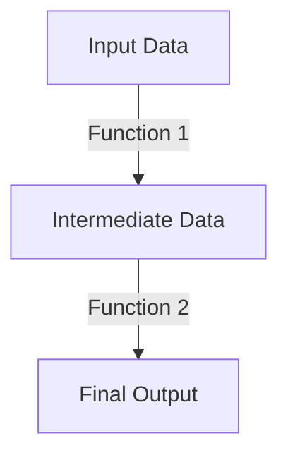

## 21.10.1 Skill Development through Open Source Contributions

Contributing to open source projects is a powerful way to enhance your technical skills, especially when transitioning from Java to Clojure. This section will explore how engaging with open source Clojure projects can accelerate your learning, expose you to real-world challenges, and provide opportunities to learn from a vibrant community of developers.

### The Value of Open Source Contributions

Open source contributions offer a unique environment for skill development. Unlike traditional learning methods, contributing to open source projects allows you to:

- **Engage with Real-World Code**: Work on actual projects that are used by people worldwide.
- **Collaborate with Experienced Developers**: Learn from seasoned contributors and gain insights into best practices.
- **Enhance Problem-Solving Skills**: Tackle real-world problems and find solutions collaboratively.
- **Build a Portfolio**: Showcase your contributions to potential employers or clients.

### Enhancing Technical Skills

#### Understanding Clojure's Functional Paradigm

Transitioning from Java to Clojure involves embracing a functional programming paradigm. Open source projects provide a practical context to apply and deepen your understanding of functional concepts such as immutability, higher-order functions, and lazy evaluation.

**Example: Higher-Order Functions**

In Clojure, functions are first-class citizens, meaning they can be passed as arguments, returned from other functions, and assigned to variables. This is a departure from Java's object-oriented approach, especially before Java 8 introduced lambdas.

```clojure
;; Clojure example of a higher-order function
(defn apply-twice [f x]
  (f (f x)))

(apply-twice inc 5) ; => 7

;; Java equivalent using lambdas (Java 8+)
import java.util.function.Function;

Function<Integer, Integer> applyTwice = f -> f.apply(f.apply(5));
applyTwice.apply(x -> x + 1); // => 7
```

**Try It Yourself**: Modify the `apply-twice` function to work with a list of numbers instead of a single number.

#### Mastering Clojure's Immutability

Immutability is a cornerstone of Clojure's design, offering benefits in terms of concurrency and simplicity. Open source projects often require contributors to work with immutable data structures, providing a hands-on opportunity to master this concept.

**Example: Immutable Data Structures**

Clojure's persistent data structures allow you to work with immutable collections efficiently.

```clojure
;; Creating an immutable vector
(def numbers [1 2 3 4 5])

;; Adding an element to the vector
(def new-numbers (conj numbers 6))

;; Original vector remains unchanged
numbers ; => [1 2 3 4 5]
new-numbers ; => [1 2 3 4 5 6]
```

**Try It Yourself**: Experiment with other Clojure data structures like maps and sets, and observe how operations preserve immutability.

#### Leveraging Concurrency Primitives

Clojure offers powerful concurrency primitives such as atoms, refs, and agents, which simplify concurrent programming compared to Java's traditional threading model.

**Example: Using Atoms for Concurrency**

Atoms provide a way to manage shared, mutable state in a thread-safe manner.

```clojure
;; Define an atom
(def counter (atom 0))

;; Increment the atom's value
(swap! counter inc)

;; Read the atom's value
@counter ; => 1
```

**Try It Yourself**: Create a simple counter application using atoms and compare it with a similar implementation in Java using synchronized methods.

### Exposure to Real-World Projects

Contributing to open source projects exposes you to a variety of real-world challenges, such as:

- **Complex Codebases**: Navigate and understand large, complex codebases.
- **Diverse Technologies**: Work with various tools, libraries, and frameworks.
- **Version Control Systems**: Gain proficiency in using Git and other version control systems.

### Learning from Others

Open source communities are rich with experienced developers who are often willing to mentor newcomers. By contributing to projects, you can:

- **Receive Feedback**: Get constructive feedback on your code and learn from code reviews.
- **Participate in Discussions**: Engage in technical discussions and broaden your understanding of different approaches.
- **Observe Best Practices**: Learn about coding standards, testing strategies, and documentation practices.

### Building a Portfolio

Your contributions to open source projects serve as a testament to your skills and dedication. They can be showcased in your portfolio, providing tangible evidence of your capabilities to potential employers or clients.

### Diagrams and Visual Aids

To better understand the flow of data through higher-order functions, consider the following diagram:



*Diagram: Flow of data through a series of higher-order functions.*

### Exercises and Practice Problems

1. **Exercise**: Refactor a Java class to a Clojure namespace, focusing on using immutable data structures and pure functions.
2. **Challenge**: Implement a simple web server in Clojure using Ring and Compojure, and compare it with a similar implementation in Java using Spring Boot.

### Key Takeaways

- **Skill Development**: Open source contributions enhance your technical skills, especially when transitioning from Java to Clojure.
- **Real-World Exposure**: Engage with real-world projects and learn from experienced developers.
- **Community Learning**: Benefit from the collective knowledge of the open source community.
- **Portfolio Building**: Showcase your contributions to demonstrate your skills and dedication.

### Further Reading

- [Official Clojure Documentation](https://clojure.org/)
- [ClojureDocs](https://clojuredocs.org/)
- [GitHub - Clojure Projects](https://github.com/clojure)

### Quiz: Test Your Understanding of Skill Development through Open Source Contributions



### How can contributing to open source projects enhance your technical skills?

- [x] By engaging with real-world code and collaborating with experienced developers
- [ ] By working in isolation without any feedback
- [ ] By focusing solely on theoretical knowledge
- [ ] By avoiding complex codebases

> **Explanation:** Contributing to open source projects allows you to work on real-world code, collaborate with experienced developers, and receive feedback, which enhances your technical skills.

### What is a key benefit of Clojure's immutability?

- [x] It simplifies concurrent programming
- [ ] It makes code harder to understand
- [ ] It requires more memory
- [ ] It slows down performance

> **Explanation:** Immutability simplifies concurrent programming by eliminating issues related to shared mutable state, making it easier to reason about code.

### How do higher-order functions differ between Clojure and Java?

- [x] Clojure treats functions as first-class citizens, while Java introduced lambdas in Java 8
- [ ] Java has always supported higher-order functions
- [ ] Clojure does not support higher-order functions
- [ ] Java's higher-order functions are more powerful

> **Explanation:** Clojure treats functions as first-class citizens, allowing them to be passed as arguments and returned from other functions. Java introduced similar capabilities with lambdas in Java 8.

### What is the purpose of using atoms in Clojure?

- [x] To manage shared, mutable state in a thread-safe manner
- [ ] To create mutable data structures
- [ ] To replace all variables
- [ ] To slow down execution

> **Explanation:** Atoms in Clojure are used to manage shared, mutable state in a thread-safe manner, providing a simple way to handle concurrency.

### How can open source contributions help build your portfolio?

- [x] By showcasing your contributions to potential employers or clients
- [ ] By keeping your work private
- [ ] By focusing only on personal projects
- [ ] By avoiding collaboration

> **Explanation:** Open source contributions can be showcased in your portfolio, providing tangible evidence of your skills and dedication to potential employers or clients.

### What is a key advantage of learning from open source communities?

- [x] Receiving feedback and observing best practices
- [ ] Working in isolation
- [ ] Avoiding discussions
- [ ] Ignoring coding standards

> **Explanation:** Open source communities provide opportunities to receive feedback, engage in discussions, and observe best practices, enhancing your learning experience.

### Which Clojure feature simplifies concurrent programming compared to Java?

- [x] Concurrency primitives like atoms, refs, and agents
- [ ] Java's synchronized methods
- [ ] Java's threading model
- [ ] Java's concurrent collections

> **Explanation:** Clojure's concurrency primitives like atoms, refs, and agents simplify concurrent programming compared to Java's traditional threading model.

### What is a benefit of participating in open source discussions?

- [x] Broadening your understanding of different approaches
- [ ] Avoiding new ideas
- [ ] Focusing only on your own code
- [ ] Ignoring other contributors

> **Explanation:** Participating in open source discussions helps broaden your understanding of different approaches and enhances your learning experience.

### How can you demonstrate your skills through open source contributions?

- [x] By showcasing your contributions in your portfolio
- [ ] By keeping your work hidden
- [ ] By avoiding collaboration
- [ ] By focusing only on theoretical knowledge

> **Explanation:** Showcasing your open source contributions in your portfolio provides tangible evidence of your skills and dedication to potential employers or clients.

### True or False: Open source contributions offer a unique environment for skill development.

- [x] True
- [ ] False

> **Explanation:** Open source contributions provide a unique environment for skill development by allowing you to work on real-world projects, collaborate with experienced developers, and learn from the community.



Now that we've explored how contributing to open source Clojure projects can enhance your skills, let's dive into the next section to understand how these contributions can impact your career advancement.
