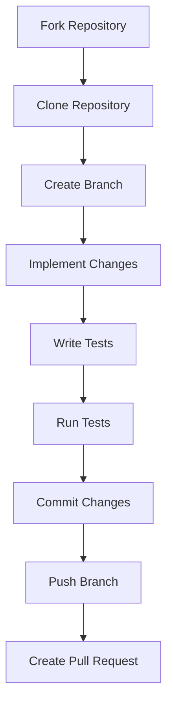

## 21.10.2 Networking Opportunities

Contributing to open source Clojure projects offers a wealth of networking opportunities that can significantly impact your career. By engaging with the Clojure community, you can connect with other developers, industry leaders, and potential employers. This section explores the various ways you can leverage open source contributions to build a robust professional network.

### The Power of Community

The Clojure community is known for its inclusivity and collaborative spirit. By participating in open source projects, you become part of a global network of developers who share a passion for functional programming and Clojure's unique features. This community is a valuable resource for learning, sharing knowledge, and building professional relationships.

#### Connecting with Other Developers

One of the primary benefits of contributing to open source projects is the opportunity to connect with other developers. These connections can lead to collaborative projects, knowledge exchange, and even lifelong friendships. Here are some ways to engage with fellow developers:

- **Join Clojure Forums and Mailing Lists**: Participate in discussions on platforms like the Clojure Google Group or the Clojure subreddit. These forums are excellent places to ask questions, share insights, and connect with other Clojure enthusiasts.
- **Attend Clojure Meetups and Conferences**: Events like Clojure/conj and local meetups provide opportunities to meet developers in person. These gatherings often feature talks, workshops, and networking sessions.
- **Contribute to Online Discussions**: Engage in conversations on GitHub issues, pull requests, and other project-related discussions. This interaction not only helps you learn but also makes you visible to other contributors.

#### Building Relationships with Industry Leaders

Open source projects often attract experienced developers and industry leaders who are passionate about Clojure. By contributing to these projects, you can build relationships with influential figures in the tech industry. Here are some strategies to connect with industry leaders:

- **Contribute High-Quality Code**: Demonstrating your skills through well-crafted contributions can catch the attention of project maintainers and industry leaders.
- **Engage in Thoughtful Discussions**: Participate in technical discussions and offer valuable insights. This engagement can lead to recognition and respect from experienced developers.
- **Follow and Interact with Influential Developers**: Many industry leaders are active on social media platforms like Twitter and LinkedIn. Follow them, engage with their content, and participate in discussions to build rapport.

#### Networking with Potential Employers

Contributing to open source projects can also open doors to new career opportunities. Many companies value open source contributions and actively seek developers who are involved in the community. Here's how you can leverage open source contributions to connect with potential employers:

- **Showcase Your Contributions**: Highlight your open source work on your resume, LinkedIn profile, and personal website. This visibility can attract the attention of recruiters and hiring managers.
- **Network at Industry Events**: Attend conferences and meetups where potential employers are present. These events often include networking sessions where you can meet representatives from companies looking for talent.
- **Engage with Company-Sponsored Projects**: Some companies sponsor open source projects. Contributing to these projects can help you build relationships with the sponsoring company's developers and potentially lead to job opportunities.

### Code Example: Contributing to an Open Source Project

To illustrate the process of contributing to an open source project, let's walk through a simple example. We'll contribute a small enhancement to a hypothetical Clojure library called `clojure-math`.

```clojure
;; Step 1: Fork the repository on GitHub
;; Visit the repository page and click the "Fork" button to create a copy of the repository under your GitHub account.

;; Step 2: Clone the forked repository to your local machine
$ git clone https://github.com/your-username/clojure-math.git
$ cd clojure-math

;; Step 3: Create a new branch for your enhancement
$ git checkout -b add-square-function

;; Step 4: Implement the enhancement
;; Open the source file where you want to add the new function and implement it.

(ns clojure-math.core)

(defn square
  "Returns the square of a number."
  [x]
  (* x x))

;; Step 5: Write tests for the new function
;; Open the test file and add tests for the new function.

(ns clojure-math.core-test
  (:require [clojure.test :refer :all]
            [clojure-math.core :refer :all]))

(deftest test-square
  (testing "square function"
    (is (= 4 (square 2)))
    (is (= 9 (square 3)))
    (is (= 0 (square 0)))))

;; Step 6: Run the tests to ensure everything works
$ lein test

;; Step 7: Commit your changes and push the branch to your forked repository
$ git add .
$ git commit -m "Add square function"
$ git push origin add-square-function

;; Step 8: Create a pull request
;; Visit the original repository and create a pull request from your branch.
```

**Try It Yourself**: Modify the `square` function to handle negative numbers by returning the absolute value of the square. Update the tests accordingly and create a pull request with your changes.

### Diagram: Contribution Workflow

Below is a diagram illustrating the workflow of contributing to an open source project.



**Diagram Description**: This flowchart outlines the typical steps involved in contributing to an open source project, from forking the repository to creating a pull request.

### Engaging with the Clojure Community

Engaging with the Clojure community is a key aspect of networking. Here are some ways to get involved:

- **Participate in Community Projects**: Many Clojure projects welcome contributions from developers of all skill levels. Look for projects labeled with "good first issue" or "help wanted" to get started.
- **Join Online Communities**: Platforms like Slack, Discord, and Zulip have active Clojure channels where you can ask questions, share knowledge, and connect with other developers.
- **Contribute to Documentation**: Improving project documentation is a valuable contribution that helps other developers and increases your visibility in the community.

### Comparing Networking in Clojure and Java Communities

While both Clojure and Java communities offer networking opportunities, there are some differences in how these communities operate:

- **Size and Scope**: The Java community is larger and more established, offering a wide range of events and resources. The Clojure community, while smaller, is tightly-knit and focused on functional programming.
- **Focus on Functional Programming**: Clojure's community is centered around functional programming principles, which can lead to more specialized discussions and collaborations.
- **Open Source Culture**: Clojure has a strong open source culture, with many projects actively seeking contributions. This openness can make it easier to get involved and build connections.

### Exercises: Building Your Network

1. **Join a Clojure Forum**: Sign up for a Clojure forum or mailing list and introduce yourself. Participate in at least one discussion each week.
2. **Attend a Meetup**: Find a local or virtual Clojure meetup and attend a session. Network with at least three new people and exchange contact information.
3. **Contribute to a Project**: Choose an open source Clojure project and make a small contribution. Share your experience on social media or a blog post.

### Key Takeaways

- **Networking through open source contributions can significantly impact your career** by connecting you with developers, industry leaders, and potential employers.
- **Engaging with the Clojure community** provides opportunities for learning, collaboration, and professional growth.
- **Contributing to open source projects** showcases your skills and can attract the attention of recruiters and hiring managers.
- **Participating in community events and discussions** helps build relationships and expand your professional network.

By actively participating in the Clojure community and contributing to open source projects, you can build a strong professional network that supports your career growth and development.

## Quiz: Networking Opportunities in Open Source Clojure Projects



### What is one primary benefit of contributing to open source Clojure projects?

- [x] Connecting with other developers
- [ ] Receiving financial compensation
- [ ] Guaranteed job offers
- [ ] Access to proprietary software

> **Explanation:** Contributing to open source projects allows you to connect with other developers, which can lead to collaboration and networking opportunities.

### How can you engage with industry leaders through open source contributions?

- [x] By contributing high-quality code
- [ ] By demanding recognition
- [ ] By avoiding discussions
- [ ] By working in isolation

> **Explanation:** Contributing high-quality code and engaging in thoughtful discussions can help you connect with industry leaders.

### What is a recommended way to showcase your open source contributions to potential employers?

- [x] Highlight them on your resume and LinkedIn profile
- [ ] Keep them private
- [ ] Only discuss them in interviews
- [ ] Use them as bargaining chips

> **Explanation:** Highlighting your open source contributions on your resume and LinkedIn profile increases visibility to potential employers.

### Which of the following is a platform where you can participate in Clojure discussions?

- [x] Clojure Google Group
- [ ] Instagram
- [ ] TikTok
- [ ] Pinterest

> **Explanation:** The Clojure Google Group is a platform where you can participate in discussions and connect with other Clojure developers.

### What is a key difference between the Clojure and Java communities?

- [x] Clojure's community is more focused on functional programming
- [ ] Java's community is smaller
- [ ] Clojure's community is less open to contributions
- [ ] Java's community is centered around Clojure

> **Explanation:** Clojure's community is centered around functional programming principles, which distinguishes it from the broader Java community.

### What is the first step in contributing to an open source project on GitHub?

- [x] Fork the repository
- [ ] Clone the repository
- [ ] Create a pull request
- [ ] Write tests

> **Explanation:** The first step in contributing to an open source project on GitHub is to fork the repository to your account.

### How can attending Clojure meetups benefit your career?

- [x] By providing networking opportunities
- [ ] By guaranteeing promotions
- [ ] By offering free certifications
- [ ] By replacing formal education

> **Explanation:** Attending Clojure meetups provides networking opportunities that can benefit your career.

### What should you do after implementing changes in an open source project?

- [x] Write tests for the changes
- [ ] Immediately create a pull request
- [ ] Delete the branch
- [ ] Ignore the changes

> **Explanation:** After implementing changes, it's important to write tests to ensure the changes work as expected.

### Why is engaging with online Clojure communities beneficial?

- [x] It helps build relationships and expand your network
- [ ] It guarantees job offers
- [ ] It provides financial rewards
- [ ] It replaces professional experience

> **Explanation:** Engaging with online Clojure communities helps build relationships and expand your professional network.

### True or False: Contributing to open source projects can attract the attention of recruiters.

- [x] True
- [ ] False

> **Explanation:** True. Contributing to open source projects showcases your skills and can attract the attention of recruiters and hiring managers.


