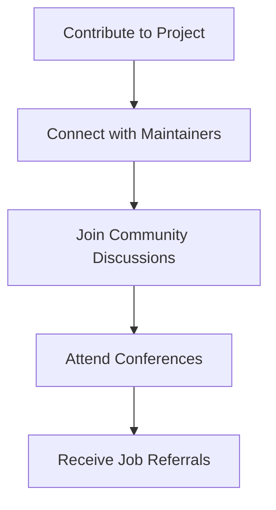

## 21.10.3 Career Advancement

Contributing to open source projects, particularly in a language as dynamic and community-driven as Clojure, can significantly impact your career trajectory. For experienced Java developers transitioning to Clojure, engaging with open source not only enhances your technical skills but also opens doors to a myriad of professional opportunities. In this section, we will explore how open source contributions can lead to job offers, consulting opportunities, and speaking engagements, providing real-world examples and strategies to maximize your career advancement.

### The Power of Open Source in Career Development

Open source contributions are more than just a way to give back to the community; they are a powerful tool for career development. By contributing to open source projects, you can:

- **Showcase Your Skills**: Demonstrate your coding abilities, problem-solving skills, and understanding of complex systems.
- **Build a Professional Network**: Connect with other developers, project maintainers, and industry leaders.
- **Gain Recognition**: Establish yourself as an expert in the Clojure community.
- **Access New Opportunities**: Open doors to job offers, consulting gigs, and speaking engagements.

#### Showcasing Your Skills

Open source projects provide a platform to showcase your skills to a global audience. Unlike closed-source projects, where your work is often hidden behind corporate walls, open source contributions are visible to anyone interested. This visibility can be a significant advantage when seeking new career opportunities.

**Example: Contributing to a Clojure Library**

Suppose you contribute to a popular Clojure library by adding a new feature or fixing a critical bug. Your work is reviewed by experienced maintainers and visible to anyone using the library. This exposure can lead to recognition within the community and beyond.

**Clojure Code Example: Adding a Feature to a Library**

```clojure
(ns my-library.core
  (:require [clojure.string :as str]))

;; Adding a new feature to capitalize each word in a string
(defn capitalize-words [s]
  (->> (str/split s #"\s+")
       (map str/capitalize)
       (str/join " ")))

;; Example usage
(capitalize-words "hello world from clojure") ; => "Hello World From Clojure"
```

*Comment:* This function demonstrates a simple yet useful feature addition to a library, showcasing your ability to enhance existing codebases.

#### Building a Professional Network

Engaging with open source projects allows you to connect with other developers and industry leaders. These connections can lead to mentorship opportunities, collaborations, and even job referrals. Networking is a crucial aspect of career advancement, and open source provides a natural platform for building these relationships.

**Mermaid Diagram: Networking through Open Source**



*Caption:* This diagram illustrates the networking opportunities that arise from contributing to open source projects.

#### Gaining Recognition

Consistent contributions to open source projects can establish you as an expert in the Clojure community. Recognition can lead to invitations to speak at conferences, write articles, or participate in podcasts. These activities further enhance your visibility and credibility.

**Example: Speaking Engagements**

Imagine being invited to speak at a Clojure conference about your contributions to a significant project. This opportunity not only boosts your profile but also allows you to share your knowledge and insights with a broader audience.

### Real-World Examples of Career Advancement

Let's explore some real-world examples of how open source contributions have led to career advancements for developers.

#### Case Study 1: From Contributor to Core Team Member

A developer started contributing to a Clojure web framework by fixing bugs and adding documentation. Over time, their consistent contributions and deep understanding of the codebase led to an invitation to join the core team. This role not only enhanced their technical skills but also positioned them as a leader in the community.

#### Case Study 2: Landing a Dream Job

Another developer contributed to a Clojure data processing library, focusing on performance optimizations. Their work caught the attention of a company using the library, leading to a job offer as a senior engineer. The open source contributions served as a portfolio, showcasing their expertise and problem-solving abilities.

### Strategies for Maximizing Career Advancement

To maximize the career benefits of open source contributions, consider the following strategies:

1. **Choose Projects Wisely**: Select projects that align with your interests and career goals. Contributing to projects you are passionate about will keep you motivated and engaged.

2. **Focus on Quality**: Ensure your contributions are well-documented, tested, and adhere to the project's coding standards. High-quality contributions are more likely to be accepted and recognized.

3. **Engage with the Community**: Participate in discussions, attend meetups, and collaborate with other contributors. Building relationships within the community can lead to new opportunities.

4. **Leverage Your Contributions**: Highlight your open source work in your resume, LinkedIn profile, and during interviews. Use specific examples to demonstrate your skills and impact.

5. **Seek Feedback and Learn**: Use feedback from project maintainers to improve your skills. Open source is a learning opportunity, and constructive criticism can help you grow as a developer.

### Try It Yourself: Contributing to an Open Source Project

To get started with open source contributions, try the following exercise:

1. **Find a Clojure Project**: Explore [Clojure's GitHub page](https://github.com/clojure) to find projects that interest you.
2. **Identify an Issue**: Look for issues labeled "good first issue" or "help wanted."
3. **Make a Contribution**: Fork the repository, make your changes, and submit a pull request.
4. **Engage with the Community**: Join the project's discussion forums or chat channels to connect with other contributors.

### Key Takeaways

- Open source contributions can significantly impact your career by showcasing your skills, building your network, and gaining recognition.
- Real-world examples demonstrate how developers have advanced their careers through open source involvement.
- Strategies such as choosing projects wisely, focusing on quality, and engaging with the community can maximize the career benefits of open source contributions.

### Exercises and Practice Problems

1. **Identify a Clojure Project**: Find a Clojure project on GitHub that aligns with your interests and career goals. Analyze the project's issues and identify one you could contribute to.

2. **Draft a Contribution Plan**: Create a plan for your contribution, including the steps you will take to address the issue, the tests you will write, and how you will document your changes.

3. **Submit a Pull Request**: Implement your plan, submit a pull request, and engage with the project's maintainers to refine your contribution.

4. **Reflect on Your Experience**: After your contribution is accepted, reflect on what you learned from the process and how it has impacted your skills and career prospects.

By actively engaging with open source projects, you can not only enhance your technical skills but also open doors to new career opportunities. Embrace the power of open source to advance your career and make a meaningful impact in the Clojure community.

## Quiz: Advancing Your Career through Open Source Contributions



### How can open source contributions showcase your skills?

- [x] By making your work visible to a global audience
- [ ] By keeping your work private
- [ ] By limiting your contributions to internal projects
- [ ] By avoiding collaboration with others

> **Explanation:** Open source contributions are public, allowing anyone to see your work and assess your skills.

### What is a key benefit of building a professional network through open source?

- [x] Access to job referrals and collaborations
- [ ] Isolation from other developers
- [ ] Limited exposure to new ideas
- [ ] Reduced opportunities for mentorship

> **Explanation:** Networking through open source can lead to job referrals, collaborations, and mentorship opportunities.

### How can open source contributions lead to speaking engagements?

- [x] By establishing you as an expert in the community
- [ ] By keeping your work hidden
- [ ] By avoiding public discussions
- [ ] By focusing solely on private projects

> **Explanation:** Consistent contributions can establish you as an expert, leading to invitations to speak at conferences.

### What should you focus on when making open source contributions?

- [x] Quality and adherence to coding standards
- [ ] Quantity over quality
- [ ] Avoiding documentation
- [ ] Ignoring feedback from maintainers

> **Explanation:** High-quality contributions that adhere to coding standards are more likely to be accepted and recognized.

### Which strategy can maximize the career benefits of open source contributions?

- [x] Engaging with the community
- [ ] Working in isolation
- [ ] Avoiding communication with maintainers
- [ ] Focusing only on personal projects

> **Explanation:** Engaging with the community can lead to new opportunities and collaborations.

### What is a potential outcome of contributing to a popular Clojure library?

- [x] Recognition within the community
- [ ] Limited exposure
- [ ] Isolation from other developers
- [ ] Reduced career opportunities

> **Explanation:** Contributing to a popular library can lead to recognition and new career opportunities.

### How can you leverage your open source contributions during a job interview?

- [x] By highlighting specific examples of your work
- [ ] By avoiding discussion of your contributions
- [ ] By focusing only on closed-source projects
- [ ] By minimizing the impact of your work

> **Explanation:** Highlighting specific examples of your open source work can demonstrate your skills and impact.

### What is a key takeaway from engaging with open source projects?

- [x] Open source contributions can significantly impact your career
- [ ] Open source contributions have no impact on your career
- [ ] Open source contributions are only for hobbyists
- [ ] Open source contributions are not recognized by employers

> **Explanation:** Open source contributions can showcase your skills, build your network, and lead to new opportunities.

### How can you start contributing to an open source project?

- [x] By finding a project that aligns with your interests
- [ ] By avoiding projects that interest you
- [ ] By focusing only on closed-source projects
- [ ] By ignoring community discussions

> **Explanation:** Finding a project that aligns with your interests will keep you motivated and engaged.

### True or False: Open source contributions can lead to job offers.

- [x] True
- [ ] False

> **Explanation:** Open source contributions can showcase your skills and lead to job offers from companies using the projects you contribute to.


