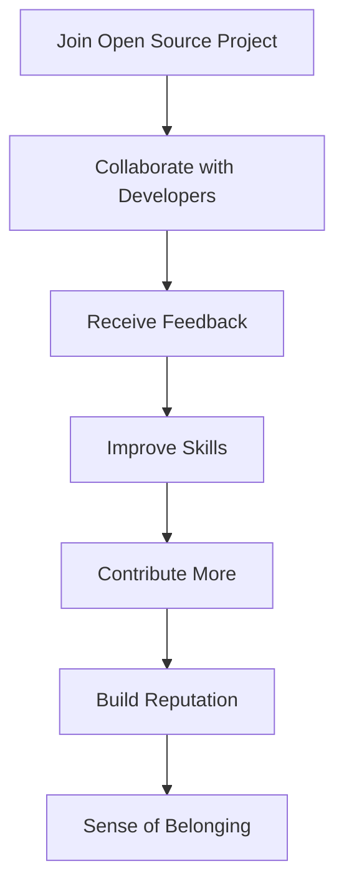

## 21.10.4 Personal Fulfillment

### Introduction

Contributing to open source projects is not just about writing code; it's a journey of personal growth, community engagement, and making a meaningful impact on the technology landscape. For Java developers transitioning to Clojure, this journey can be particularly rewarding, offering a unique opportunity to explore functional programming paradigms and contribute to a vibrant community. In this section, we will delve into the intrinsic rewards of open source contributions, focusing on personal satisfaction, community involvement, and the broader impact on technology.

### The Joy of Giving Back

One of the most fulfilling aspects of contributing to open source is the opportunity to give back to the community. As developers, we often rely on open source tools and libraries to build our applications. By contributing to these projects, we can express our gratitude and help improve the tools that have supported our work.

#### Code Example: Contributing a New Feature

Let's consider a scenario where you contribute a new feature to an open source Clojure library. Suppose you have identified a need for a new function that simplifies data transformation in a popular library. Here's a simple example of how you might implement and contribute this feature:

```clojure
;; Define a new function to transform data
(defn transform-data
  "Transforms a map by applying a function to each value."
  [data f]
  (into {} (map (fn [[k v]] [k (f v)]) data)))

;; Example usage
(def sample-data {:a 1 :b 2 :c 3})
(transform-data sample-data inc) ; => {:a 2, :b 3, :c 4}
```

*Comments within code:*  
- `transform-data`: A function that applies a transformation function `f` to each value in a map.
- `sample-data`: An example map to demonstrate the usage of `transform-data`.

By contributing this feature, you not only enhance the library but also help other developers who might face similar challenges. This act of giving back can be incredibly rewarding, knowing that your work benefits others.

### Building a Sense of Community

Open source projects thrive on collaboration and community engagement. By participating in these projects, you become part of a global network of developers who share your interests and passions. This sense of community can be a powerful motivator, providing support, feedback, and inspiration.

#### Diagram: Community Engagement in Open Source



*Diagram Description:*  
This flowchart illustrates the cycle of community engagement in open source projects, highlighting how collaboration leads to skill improvement, increased contributions, and a sense of belonging.

### Personal Growth and Skill Development

Contributing to open source projects is an excellent way to enhance your skills and grow as a developer. It provides opportunities to work on diverse projects, learn new technologies, and tackle complex problems. For Java developers exploring Clojure, this can be a chance to deepen your understanding of functional programming and its unique features.

#### Code Example: Exploring Clojure's Immutability

Clojure's emphasis on immutability is a key aspect of its functional programming paradigm. Let's explore how immutability can be leveraged in a practical example:

```clojure
;; Define an immutable data structure
(defn update-user
  "Updates a user's profile without modifying the original data."
  [user updates]
  (merge user updates))

;; Example usage
(def original-user {:name "Alice" :age 30})
(def updated-user (update-user original-user {:age 31}))

;; original-user remains unchanged
original-user ; => {:name "Alice", :age 30}
updated-user ; => {:name "Alice", :age 31}
```

*Comments within code:*  
- `update-user`: A function that merges updates into a user profile, demonstrating immutability.
- `original-user` and `updated-user`: Show how the original data remains unchanged.

By contributing to projects that leverage Clojure's immutability, you can gain a deeper appreciation for its benefits, such as simplified reasoning and enhanced concurrency.

### Making a Positive Impact on Technology

Open source contributions have the potential to drive innovation and shape the future of technology. By participating in these projects, you can influence the direction of software development and contribute to the creation of cutting-edge tools and frameworks.

#### Table: Impact of Open Source Contributions

| Contribution Type | Impact on Technology |
|-------------------|----------------------|
| Bug Fixes         | Improves software reliability and user experience. |
| New Features      | Expands functionality and addresses user needs. |
| Documentation     | Enhances usability and accessibility for developers. |
| Community Support | Fosters collaboration and knowledge sharing. |

*Table Description:*  
This table outlines different types of open source contributions and their impact on technology, emphasizing the diverse ways developers can make a difference.

### Encouraging Best Practices

Contributing to open source projects encourages adherence to best practices in software development. It promotes code quality, documentation, and testing, which are essential for maintaining robust and reliable software.

#### Code Example: Writing Tests for Clojure Code

Testing is a crucial aspect of software development, ensuring that code behaves as expected. Here's an example of how you might write tests for the `transform-data` function:

```clojure
(ns myproject.core-test
  (:require [clojure.test :refer :all]
            [myproject.core :refer :all]))

(deftest test-transform-data
  (testing "Transforming data with increment function"
    (is (= {:a 2, :b 3, :c 4} (transform-data {:a 1, :b 2, :c 3} inc)))))

(run-tests)
```

*Comments within code:*  
- `deftest` and `testing`: Define a test for the `transform-data` function.
- `is`: Asserts that the function produces the expected result.

By contributing well-tested code, you help maintain the integrity of open source projects and set a standard for others to follow.

### Try It Yourself: Experiment with Clojure Code

To deepen your understanding of Clojure and open source contributions, try modifying the code examples provided. For instance, experiment with different transformation functions in `transform-data` or add new test cases to cover edge scenarios. This hands-on approach will reinforce your learning and boost your confidence in contributing to open source projects.

### Conclusion

Contributing to open source projects offers a wealth of intrinsic rewards, from personal satisfaction and skill development to community engagement and technological impact. For Java developers transitioning to Clojure, this journey can be particularly enriching, providing a platform to explore new paradigms and make meaningful contributions. Embrace the opportunity to give back, grow, and make a difference in the world of software development.

### Key Takeaways

- **Personal Satisfaction**: Experience the joy of giving back to the community and enhancing tools you rely on.
- **Community Engagement**: Build a sense of belonging and collaborate with like-minded developers.
- **Skill Development**: Enhance your technical skills and explore new programming paradigms.
- **Technological Impact**: Contribute to innovation and shape the future of software development.
- **Best Practices**: Promote code quality, documentation, and testing in open source projects.

### Exercises

1. **Contribute a Feature**: Identify a feature you would like to add to an open source Clojure project. Implement the feature and submit a pull request.
2. **Write Tests**: Choose an existing function in an open source project and write comprehensive tests to ensure its reliability.
3. **Engage with the Community**: Participate in discussions on open source forums or mailing lists. Share your insights and learn from others.

### Further Reading

- [Official Clojure Documentation](https://clojure.org/)
- [ClojureDocs](https://clojuredocs.org/)
- [GitHub: Clojure Projects](https://github.com/clojure)

## Quiz: Understanding Personal Fulfillment in Open Source Contributions



### What is one of the primary intrinsic rewards of contributing to open source projects?

- [x] Personal satisfaction from giving back to the community
- [ ] Financial compensation
- [ ] Guaranteed career advancement
- [ ] Exclusive access to proprietary tools

> **Explanation:** Contributing to open source projects provides personal satisfaction from giving back to the community and improving tools that others use.

### How does community engagement in open source projects benefit developers?

- [x] It provides support, feedback, and inspiration.
- [ ] It guarantees financial rewards.
- [ ] It limits exposure to new technologies.
- [ ] It isolates developers from industry trends.

> **Explanation:** Community engagement in open source projects offers support, feedback, and inspiration, fostering collaboration and personal growth.

### What is a key benefit of Clojure's immutability in open source projects?

- [x] Simplified reasoning and enhanced concurrency
- [ ] Increased complexity in code management
- [ ] Limited applicability in real-world scenarios
- [ ] Reduced performance in data processing

> **Explanation:** Clojure's immutability simplifies reasoning and enhances concurrency, making it beneficial for open source projects.

### What impact do bug fixes have on open source projects?

- [x] They improve software reliability and user experience.
- [ ] They decrease software usability.
- [ ] They complicate the codebase.
- [ ] They have no significant impact.

> **Explanation:** Bug fixes improve software reliability and user experience, making them valuable contributions to open source projects.

### How can contributing to open source projects influence your career?

- [x] By enhancing skills and providing networking opportunities
- [ ] By guaranteeing immediate promotions
- [x] By building a professional reputation
- [ ] By limiting career options

> **Explanation:** Contributing to open source projects enhances skills, provides networking opportunities, and builds a professional reputation.

### What is a common practice encouraged by open source contributions?

- [x] Writing well-documented and tested code
- [ ] Prioritizing speed over quality
- [ ] Avoiding collaboration with others
- [ ] Keeping code proprietary

> **Explanation:** Open source contributions encourage writing well-documented and tested code, promoting quality and collaboration.

### How does contributing to open source projects promote personal growth?

- [x] By providing opportunities to learn new technologies and tackle complex problems
- [ ] By limiting exposure to different programming paradigms
- [x] By offering challenges that enhance problem-solving skills
- [ ] By discouraging experimentation

> **Explanation:** Contributing to open source projects promotes personal growth by offering opportunities to learn new technologies and tackle complex problems.

### What role does testing play in open source contributions?

- [x] Ensures code behaves as expected and maintains project integrity
- [ ] Increases the complexity of the codebase
- [ ] Reduces the need for documentation
- [ ] Limits the scope of contributions

> **Explanation:** Testing ensures code behaves as expected and maintains project integrity, making it a crucial aspect of open source contributions.

### How can developers make a positive impact on technology through open source contributions?

- [x] By driving innovation and shaping the future of software development
- [ ] By focusing solely on proprietary projects
- [ ] By avoiding collaboration with others
- [ ] By limiting contributions to minor bug fixes

> **Explanation:** Developers can make a positive impact on technology through open source contributions by driving innovation and shaping the future of software development.

### True or False: Contributing to open source projects can lead to personal fulfillment and career advancement.

- [x] True
- [ ] False

> **Explanation:** Contributing to open source projects can lead to personal fulfillment and career advancement by providing opportunities for skill development, networking, and making a meaningful impact.


