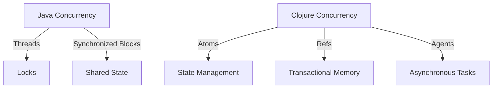

## 21.2.1 Reading the Codebase

Reading and understanding the codebase of an open source project is a crucial skill for any developer looking to contribute effectively. As experienced Java developers transitioning to Clojure, you already possess a strong foundation in object-oriented programming and are familiar with navigating complex Java codebases. This section will guide you through the process of reading and understanding Clojure codebases, highlighting the differences and similarities with Java projects, and providing strategies to help you become a valuable contributor to the Clojure community.

### Understanding the Structure of a Clojure Project

Before diving into the code, it's essential to understand the typical structure of a Clojure project. While Clojure projects can vary in organization, they often follow a common structure that includes directories for source code, tests, and resources. Here's a typical layout:

```
my-clojure-project/
├── src/
│   └── my_clojure_project/
│       ├── core.clj
│       └── utils.clj
├── test/
│   └── my_clojure_project/
│       └── core_test.clj
├── resources/
├── project.clj
└── README.md
```

- **`src/`**: Contains the source code for the project. Each namespace typically corresponds to a file within this directory.
- **`test/`**: Contains test files, often mirroring the structure of the `src/` directory.
- **`resources/`**: Used for static resources like configuration files or templates.
- **`project.clj`**: The project configuration file used by Leiningen, a popular build tool for Clojure.
- **`README.md`**: Provides an overview of the project, including installation instructions and usage examples.

### Navigating the Codebase

#### 1. **Start with the Documentation**

Begin by reading the `README.md` file and any other documentation available. This will give you an overview of the project's purpose, features, and how to set it up. Look for any architectural diagrams or design documents that can provide insight into the project's structure.

#### 2. **Identify the Entry Point**

In Clojure projects, the entry point is often a `-main` function defined in a `core.clj` file or a similarly named file. This function is analogous to the `main` method in Java and is a good starting point to understand how the application is initialized and executed.

```clojure
(ns my-clojure-project.core)

(defn -main
  "The main entry point of the application."
  [& args]
  (println "Hello, Clojure World!"))
```

#### 3. **Explore the Namespaces**

Clojure uses namespaces to organize code, similar to packages in Java. Each file typically defines a namespace, and understanding these can help you navigate the codebase. Use the `ns` declaration at the top of each file to understand its purpose and dependencies.

```clojure
(ns my-clojure-project.utils
  (:require [clojure.string :as str]))

(defn capitalize-words
  "Capitalizes each word in a string."
  [s]
  (str/capitalize s))
```

#### 4. **Examine the Core Logic**

Identify the core logic of the application by looking at the functions defined in the main namespaces. Pay attention to how data flows through these functions and how they interact with each other. Clojure's functional nature means you'll often see data transformations using higher-order functions like `map`, `reduce`, and `filter`.

```clojure
(defn process-data
  "Processes a collection of data by applying a series of transformations."
  [data]
  (->> data
       (map capitalize-words)
       (filter #(> (count %) 3))))
```

### Comparing Clojure and Java Codebases

#### **Code Organization**

- **Java**: Uses classes and interfaces to organize code. Each class typically resides in its own file, and packages are used to group related classes.
- **Clojure**: Uses namespaces and functions. Code is organized into files based on functionality rather than class hierarchy.

#### **Data Structures**

- **Java**: Relies on mutable data structures like `ArrayList`, `HashMap`, and `HashSet`.
- **Clojure**: Emphasizes immutable data structures such as lists, vectors, maps, and sets. This immutability simplifies reasoning about code and enhances concurrency.

#### **Concurrency**

- **Java**: Uses threads, locks, and synchronized blocks to manage concurrency.
- **Clojure**: Provides concurrency primitives like atoms, refs, and agents, which offer a more declarative approach to managing state changes.



*Diagram: Comparison of concurrency models in Java and Clojure.*

### Strategies for Reading Clojure Code

#### **1. Follow the Data Flow**

Clojure's functional nature means that understanding how data flows through the application is crucial. Trace the transformations applied to data as it moves through functions and namespaces.

#### **2. Leverage the REPL**

The Read-Eval-Print Loop (REPL) is a powerful tool for exploring and understanding Clojure code. Use it to experiment with functions, test hypotheses, and gain immediate feedback.

```clojure
;; Start the REPL and load the namespace
(require '[my-clojure-project.core :as core])

;; Test a function interactively
(core/capitalize-words "hello world")
;; => "Hello World"
```

#### **3. Understand the Tests**

Tests provide valuable insight into how the code is expected to behave. Look for test files in the `test/` directory and examine the test cases to understand the intended functionality of the code.

```clojure
(ns my-clojure-project.core-test
  (:require [clojure.test :refer :all]
            [my-clojure-project.core :refer :all]))

(deftest test-capitalize-words
  (testing "Capitalization of words"
    (is (= "Hello World" (capitalize-words "hello world")))))
```

#### **4. Identify Key Functions and Macros**

Clojure's use of higher-order functions and macros can be powerful but also complex. Identify key functions and macros that are central to the project's functionality and understand how they are used.

### Practical Exercises

1. **Explore an Open Source Clojure Project**

   - Choose a Clojure project from GitHub or another repository.
   - Clone the repository and set up the development environment.
   - Identify the main entry point and trace the data flow through the application.

2. **Experiment with the REPL**

   - Load the project's namespaces into the REPL.
   - Test various functions and observe their behavior.
   - Modify a function and see how it affects the overall application.

3. **Write a Test Case**

   - Identify a function in the project that lacks test coverage.
   - Write a test case for this function and run it using `clojure.test`.

### Key Takeaways

- **Understand the Project Structure**: Familiarize yourself with the typical layout of a Clojure project, including source code, tests, and resources.
- **Leverage Documentation**: Use the `README.md` and other documentation to gain an overview of the project.
- **Trace Data Flow**: Follow how data is transformed through functions and namespaces to understand the application's logic.
- **Use the REPL**: Experiment with code interactively to deepen your understanding.
- **Examine Tests**: Tests provide insight into the expected behavior of the code and can guide your exploration.

By mastering these strategies, you'll be well-equipped to read and understand Clojure codebases, enabling you to contribute effectively to open source projects and enhance your skills as a developer.

### Further Reading

- [Official Clojure Documentation](https://clojure.org/)
- [ClojureDocs](https://clojuredocs.org/)
- [Leiningen Documentation](https://leiningen.org/)

---

## Quiz: Mastering Clojure Codebase Navigation



### What is the typical entry point for a Clojure application?

- [x] A `-main` function in a `core.clj` file
- [ ] A `main` method in a `Main.java` file
- [ ] A `start` function in a `start.clj` file
- [ ] A `run` method in a `Run.java` file

> **Explanation:** The entry point for a Clojure application is typically a `-main` function defined in a `core.clj` file, similar to the `main` method in Java.

### How are Clojure projects typically organized?

- [x] Using directories like `src/`, `test/`, and `resources/`
- [ ] Using directories like `bin/`, `lib/`, and `doc/`
- [ ] Using directories like `app/`, `config/`, and `public/`
- [ ] Using directories like `source/`, `tests/`, and `assets/`

> **Explanation:** Clojure projects are typically organized with directories like `src/` for source code, `test/` for tests, and `resources/` for static resources.

### What tool is commonly used to build and manage Clojure projects?

- [x] Leiningen
- [ ] Maven
- [ ] Gradle
- [ ] Ant

> **Explanation:** Leiningen is a popular build tool for Clojure projects, similar to Maven or Gradle for Java.

### What is the purpose of the `ns` declaration in a Clojure file?

- [x] To define the namespace and its dependencies
- [ ] To declare a new class
- [ ] To initialize a variable
- [ ] To start a new thread

> **Explanation:** The `ns` declaration in a Clojure file defines the namespace and specifies its dependencies, similar to package declarations in Java.

### Which Clojure construct is used to organize code similarly to Java packages?

- [x] Namespaces
- [ ] Classes
- [ ] Modules
- [ ] Packages

> **Explanation:** Clojure uses namespaces to organize code, similar to how Java uses packages.

### How does Clojure handle concurrency differently from Java?

- [x] By using concurrency primitives like atoms, refs, and agents
- [ ] By using synchronized blocks and locks
- [ ] By using threads and semaphores
- [ ] By using coroutines and fibers

> **Explanation:** Clojure handles concurrency using primitives like atoms, refs, and agents, offering a more declarative approach compared to Java's threads and locks.

### What is the role of the REPL in Clojure development?

- [x] To interactively test and explore code
- [ ] To compile and run Java applications
- [ ] To manage project dependencies
- [ ] To deploy applications to production

> **Explanation:** The REPL (Read-Eval-Print Loop) in Clojure is used to interactively test and explore code, providing immediate feedback.

### What is a common strategy for understanding the core logic of a Clojure application?

- [x] Tracing the data flow through functions
- [ ] Reading the class hierarchy
- [ ] Analyzing the UML diagrams
- [ ] Reviewing the database schema

> **Explanation:** A common strategy for understanding the core logic of a Clojure application is to trace the data flow through functions, given Clojure's functional nature.

### Why is it important to examine tests in a Clojure project?

- [x] To understand the expected behavior of the code
- [ ] To identify performance bottlenecks
- [ ] To find security vulnerabilities
- [ ] To generate documentation

> **Explanation:** Examining tests in a Clojure project helps understand the expected behavior of the code and guides exploration.

### True or False: Clojure projects often use mutable data structures like Java.

- [ ] True
- [x] False

> **Explanation:** False. Clojure emphasizes immutable data structures, unlike Java, which often uses mutable data structures.


