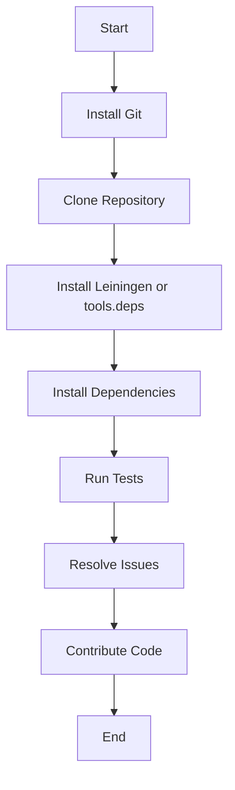

## 21.3.1 Preparing Your Development Environment

Contributing to open source Clojure projects can be a rewarding experience, allowing you to collaborate with a vibrant community and improve your skills. However, before you can start contributing, it's crucial to set up your development environment correctly. This section will guide you through the process of preparing your environment, including cloning repositories, installing dependencies, and running tests. We'll also provide troubleshooting tips for common setup issues.

### Setting Up Your Development Environment

#### Cloning Repositories

The first step in contributing to an open source Clojure project is to clone the project's repository to your local machine. This allows you to work on the codebase, make changes, and test your contributions.

1. **Install Git**: Ensure that Git is installed on your system. You can download it from [Git's official website](https://git-scm.com/).

2. **Clone the Repository**: Use the `git clone` command to copy the repository to your local machine. For example:

   ```bash
   git clone https://github.com/username/project-name.git
   ```

   This command creates a local copy of the repository in a directory named `project-name`.

3. **Navigate to the Project Directory**: Change into the project directory using the `cd` command:

   ```bash
   cd project-name
   ```

4. **Check the Branches**: Use `git branch` to see the available branches and switch to the one you want to work on:

   ```bash
   git checkout branch-name
   ```

#### Installing Dependencies

Clojure projects typically use tools like Leiningen or tools.deps to manage dependencies. Let's explore how to install and manage dependencies using these tools.

##### Using Leiningen

Leiningen is a popular build automation tool for Clojure. It simplifies the process of managing dependencies, building projects, and running tests.

1. **Install Leiningen**: Follow the instructions on the [Leiningen website](https://leiningen.org/) to install it on your system.

2. **Check the `project.clj` File**: This file contains the project's dependencies and configuration. Open it to understand the dependencies required for the project.

3. **Install Dependencies**: Run the following command to install the project's dependencies:

   ```bash
   lein deps
   ```

   This command downloads and installs all the dependencies specified in the `project.clj` file.

##### Using tools.deps

Tools.deps is another tool for managing dependencies in Clojure projects. It uses a `deps.edn` file to specify dependencies.

1. **Install Clojure CLI Tools**: Follow the instructions on the [Clojure website](https://clojure.org/guides/getting_started) to install the Clojure CLI tools.

2. **Check the `deps.edn` File**: Open this file to see the dependencies and configurations for the project.

3. **Install Dependencies**: Use the following command to install the dependencies:

   ```bash
   clj -A:dev
   ```

   This command resolves and downloads the dependencies specified in the `deps.edn` file.

#### Running Tests

Testing is a crucial part of contributing to open source projects. It ensures that your changes do not break existing functionality.

1. **Identify the Testing Framework**: Most Clojure projects use `clojure.test` for unit testing. Check the documentation or the `project.clj` or `deps.edn` file for the testing framework used.

2. **Run Tests with Leiningen**: If the project uses Leiningen, run the tests with:

   ```bash
   lein test
   ```

3. **Run Tests with tools.deps**: For projects using tools.deps, execute the tests with:

   ```bash
   clj -A:test
   ```

4. **Review Test Results**: Analyze the test output to ensure all tests pass. If any tests fail, investigate and resolve the issues before proceeding.

#### Troubleshooting Common Setup Issues

Setting up a development environment can sometimes be challenging. Here are some common issues and their solutions:

- **Dependency Conflicts**: If you encounter dependency conflicts, check the versions specified in `project.clj` or `deps.edn`. You may need to update or exclude certain dependencies.

- **Environment Variables**: Ensure all necessary environment variables are set. This may include paths to Java or other tools required by the project.

- **Java Version Issues**: Clojure runs on the JVM, so ensure you have a compatible Java version installed. Use `java -version` to check your current version.

- **Network Issues**: If you experience network issues while downloading dependencies, check your internet connection and proxy settings.

- **Build Errors**: Review the error messages carefully. They often provide clues about missing dependencies or misconfigurations.

### Try It Yourself

To solidify your understanding, try setting up a development environment for a simple Clojure project. Clone a repository, install dependencies, and run tests. Experiment with modifying the code and observe how changes affect the test results.

### Diagrams and Visual Aids

Below is a diagram illustrating the flow of setting up a Clojure development environment:



**Diagram Description**: This flowchart outlines the steps for setting up a Clojure development environment, from installing Git to contributing code.

### Key Takeaways

- **Cloning Repositories**: Use Git to clone and manage the project's codebase.
- **Installing Dependencies**: Understand and use tools like Leiningen and tools.deps to manage project dependencies.
- **Running Tests**: Ensure your changes do not break existing functionality by running tests.
- **Troubleshooting**: Be prepared to resolve common setup issues, such as dependency conflicts and environment variable misconfigurations.

### Exercises

1. **Clone a Repository**: Choose an open source Clojure project and clone its repository. Explore the codebase and identify the main components.

2. **Install Dependencies**: Use Leiningen or tools.deps to install the project's dependencies. Note any issues you encounter and how you resolve them.

3. **Run Tests**: Execute the project's test suite and analyze the results. Try modifying a test and observe the impact.

4. **Troubleshoot**: Intentionally introduce a dependency conflict or misconfiguration and practice resolving it.

### Further Reading

- [Official Clojure Documentation](https://clojure.org/)
- [Leiningen Documentation](https://leiningen.org/)
- [tools.deps Guide](https://clojure.org/guides/deps_and_cli)

By following these steps and practicing with real projects, you'll be well-prepared to contribute effectively to open source Clojure projects. Now, let's dive into the next section, where we'll explore writing effective contributions.

## Quiz Time!



### What is the first step in setting up a development environment for a Clojure project?

- [x] Cloning the repository
- [ ] Installing dependencies
- [ ] Running tests
- [ ] Configuring environment variables

> **Explanation:** The first step is to clone the repository to have a local copy of the project's codebase.

### Which tool is commonly used for managing dependencies in Clojure projects?

- [x] Leiningen
- [ ] Maven
- [ ] Gradle
- [ ] Ant

> **Explanation:** Leiningen is a popular tool for managing dependencies in Clojure projects.

### What command is used to install dependencies with Leiningen?

- [x] lein deps
- [ ] lein install
- [ ] lein build
- [ ] lein run

> **Explanation:** The `lein deps` command is used to install dependencies specified in the `project.clj` file.

### How can you run tests in a Clojure project using tools.deps?

- [x] clj -A:test
- [ ] clj -A:run
- [ ] clj -A:build
- [ ] clj -A:install

> **Explanation:** The `clj -A:test` command runs tests in a Clojure project using tools.deps.

### What should you do if you encounter dependency conflicts?

- [x] Check the versions in `project.clj` or `deps.edn`
- [ ] Reinstall Git
- [ ] Change the Java version
- [ ] Ignore the conflicts

> **Explanation:** Dependency conflicts can often be resolved by checking and adjusting the versions specified in `project.clj` or `deps.edn`.

### Which file contains the dependencies for a project using tools.deps?

- [x] deps.edn
- [ ] project.clj
- [ ] build.gradle
- [ ] pom.xml

> **Explanation:** The `deps.edn` file contains the dependencies for a project using tools.deps.

### What is a common issue when setting up a Clojure development environment?

- [x] Java version compatibility
- [ ] Lack of internet connection
- [ ] Missing Git installation
- [ ] Incorrect file permissions

> **Explanation:** Java version compatibility is a common issue since Clojure runs on the JVM.

### What is the purpose of running tests in a Clojure project?

- [x] To ensure changes do not break existing functionality
- [ ] To install new dependencies
- [ ] To clone the repository
- [ ] To configure environment variables

> **Explanation:** Running tests ensures that changes do not break existing functionality.

### Which command is used to switch branches in a Git repository?

- [x] git checkout branch-name
- [ ] git switch branch-name
- [ ] git branch branch-name
- [ ] git change branch-name

> **Explanation:** The `git checkout branch-name` command is used to switch branches in a Git repository.

### True or False: It's important to resolve all test failures before contributing code.

- [x] True
- [ ] False

> **Explanation:** Resolving all test failures ensures that your contributions do not introduce new issues into the project.


