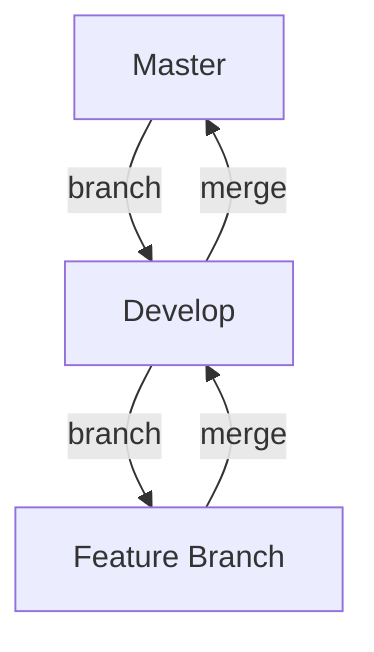

## 21.3.2 Making Code Changes

Contributing to open source projects is a rewarding way to improve your skills, collaborate with others, and give back to the community. When making code changes, especially in a language like Clojure, it's important to follow best practices to ensure your contributions are effective and well-received. In this section, we'll explore how to make focused code changes, write clear commit messages, and adhere to the project's branching model.

### Understanding the Importance of Focused Changes

When contributing to a project, it's crucial to keep your changes focused. This means addressing one issue or feature at a time. Focused changes are easier to review, test, and integrate into the main codebase. They also help maintain the project's stability and make it easier for other contributors to understand the purpose of your changes.

#### Benefits of Focused Changes

- **Improved Review Process**: Smaller, focused changes are easier for maintainers to review and understand.
- **Reduced Risk of Bugs**: By isolating changes, you minimize the risk of introducing bugs into unrelated parts of the code.
- **Clearer Commit History**: Each commit tells a specific story, making it easier to track changes over time.

#### Strategies for Keeping Changes Focused

1. **Plan Your Changes**: Before you start coding, outline what you intend to achieve. This helps you stay on track and avoid scope creep.
2. **Break Down Large Tasks**: If a task is too large, break it down into smaller, manageable pieces.
3. **Use Feature Branches**: Create a new branch for each feature or bug fix. This keeps your work separate from the main codebase until it's ready to be merged.

### Writing Clear Commit Messages

A clear commit message is essential for understanding the history of a project. It should explain what changes were made and why. This is especially important in open source projects where multiple contributors are involved.

#### Anatomy of a Good Commit Message

A well-written commit message typically consists of a short summary, a detailed description, and any relevant metadata.

- **Summary**: A concise explanation of the change (50 characters or less).
- **Description**: A more detailed explanation of what was changed and why. This can include the motivation for the change, any trade-offs considered, and links to relevant issues or discussions.
- **Metadata**: Any additional information, such as issue numbers or references to related commits.

#### Example of a Good Commit Message

```
Fix: Correct null pointer exception in user login

The user login function was throwing a null pointer exception when the
user object was not initialized. This change adds a check to ensure the
user object is initialized before attempting to access its properties.

Fixes #123
```

### Adhering to the Project's Branching Model

Most open source projects use a branching model to manage changes. Understanding and following this model is crucial for making effective contributions.

#### Common Branching Models

1. **Git Flow**: A popular branching model that uses feature branches, a develop branch, and a master branch. Features are developed in separate branches and merged into the develop branch. Once stable, changes are merged into the master branch for release.
2. **GitHub Flow**: A simpler model that uses a main branch and feature branches. Changes are made in feature branches and merged directly into the main branch after review.
3. **Trunk-Based Development**: A model where all changes are made directly to the main branch. This requires frequent integration and testing to ensure stability.

#### Best Practices for Working with Branches

- **Follow Naming Conventions**: Use descriptive names for your branches, such as `feature/login-improvement` or `bugfix/null-pointer-exception`.
- **Keep Branches Up-to-Date**: Regularly merge changes from the main branch into your feature branch to avoid conflicts.
- **Test Before Merging**: Ensure your changes are thoroughly tested before merging them into the main branch.

### Code Example: Implementing a New Feature

Let's walk through an example of implementing a new feature in a Clojure project. We'll add a function to calculate the factorial of a number.

#### Step 1: Create a Feature Branch

First, create a new branch for your feature:

```bash
git checkout -b feature/factorial-function
```

#### Step 2: Implement the Feature

Add the new function to your Clojure project. Here's a simple implementation of a factorial function:

```clojure
(ns myproject.math)

(defn factorial
  "Calculates the factorial of a given number n."
  [n]
  (reduce * (range 1 (inc n))))

;; Usage example
(factorial 5) ; => 120
```

#### Step 3: Write Tests

Before committing your changes, write tests to ensure the function works as expected.

```clojure
(ns myproject.math-test
  (:require [clojure.test :refer :all]
            [myproject.math :refer :all]))

(deftest test-factorial
  (testing "Factorial of 0"
    (is (= 1 (factorial 0))))
  (testing "Factorial of 5"
    (is (= 120 (factorial 5)))))
```

#### Step 4: Commit Your Changes

Write a clear commit message explaining your changes.

```
Add factorial function to math namespace

This commit adds a new function to calculate the factorial of a number.
Tests are included to verify the function's correctness.
```

#### Step 5: Push and Create a Pull Request

Push your changes to the remote repository and create a pull request for review.

```bash
git push origin feature/factorial-function
```

### Try It Yourself

Experiment with the factorial function by modifying it to handle negative numbers or large inputs. Consider edge cases and update the tests accordingly.

### Visualizing the Branching Model

Below is a diagram illustrating a typical Git Flow branching model:



**Diagram Description**: This diagram shows the flow of changes from the master branch to the develop branch and then to a feature branch. Once the feature is complete, it is merged back into the develop branch and eventually into the master branch for release.

### Key Takeaways

- **Keep Changes Focused**: Address one issue or feature at a time to simplify the review process and reduce the risk of bugs.
- **Write Clear Commit Messages**: Clearly explain what changes were made and why to maintain a clear project history.
- **Follow the Branching Model**: Adhere to the project's branching model to ensure smooth integration of your changes.

By following these best practices, you'll make valuable contributions to open source Clojure projects and collaborate effectively with other developers.

### Exercises

1. **Implement a New Function**: Choose a simple mathematical function, implement it in Clojure, and write tests for it.
2. **Create a Branching Model Diagram**: Use Mermaid.js to create a diagram of your project's branching model.
3. **Write a Commit Message**: Practice writing a commit message for a recent change you made to a project.

### Further Reading

- [Official Clojure Documentation](https://clojure.org/)
- [ClojureDocs](https://clojuredocs.org/)
- [Git Flow](https://nvie.com/posts/a-successful-git-branching-model/)
- [GitHub Flow](https://guides.github.com/introduction/flow/)

## Quiz: Best Practices for Making Code Changes in Clojure Projects



### What is the primary benefit of keeping code changes focused?

- [x] Easier review and integration
- [ ] More comprehensive changes
- [ ] Faster development
- [ ] Increased complexity

> **Explanation:** Focused changes are easier to review and integrate, reducing the risk of introducing bugs.


### What should a good commit message include?

- [x] A concise summary and detailed description
- [ ] Only a summary
- [ ] Only a description
- [ ] A list of all files changed

> **Explanation:** A good commit message includes a concise summary and a detailed description to explain the changes.


### Which branching model uses a develop branch for integration?

- [x] Git Flow
- [ ] GitHub Flow
- [ ] Trunk-Based Development
- [ ] Feature Branching

> **Explanation:** Git Flow uses a develop branch for integrating features before merging into the master branch.


### What is the purpose of writing tests before committing changes?

- [x] To ensure the changes work as expected
- [ ] To increase code complexity
- [ ] To delay the review process
- [ ] To avoid writing documentation

> **Explanation:** Writing tests ensures that the changes work as expected and helps catch bugs early.


### How can you keep your feature branch up-to-date?

- [x] Regularly merge changes from the main branch
- [ ] Avoid making any changes
- [ ] Delete the branch frequently
- [ ] Only work on weekends

> **Explanation:** Regularly merging changes from the main branch keeps your feature branch up-to-date and reduces conflicts.


### What is a common naming convention for feature branches?

- [x] `feature/description`
- [ ] `main/description`
- [ ] `develop/description`
- [ ] `bugfix/description`

> **Explanation:** A common naming convention for feature branches is `feature/description` to indicate the purpose of the branch.


### What is the role of metadata in a commit message?

- [x] To provide additional context, such as issue numbers
- [ ] To increase the length of the message
- [ ] To hide the purpose of the commit
- [ ] To confuse other developers

> **Explanation:** Metadata provides additional context, such as issue numbers, to help understand the commit's purpose.


### Which tool can you use to create a branching model diagram?

- [x] Mermaid.js
- [ ] GitHub
- [ ] IntelliJ IDEA
- [ ] Visual Studio Code

> **Explanation:** Mermaid.js is a tool that can be used to create diagrams, including branching model diagrams.


### What is the main advantage of using feature branches?

- [x] Isolating changes until they are ready to be merged
- [ ] Increasing the number of branches
- [ ] Avoiding code reviews
- [ ] Reducing the need for testing

> **Explanation:** Feature branches isolate changes until they are ready to be merged, reducing the risk of affecting the main codebase.


### True or False: Trunk-Based Development requires frequent integration and testing.

- [x] True
- [ ] False

> **Explanation:** Trunk-Based Development requires frequent integration and testing to ensure stability as changes are made directly to the main branch.


