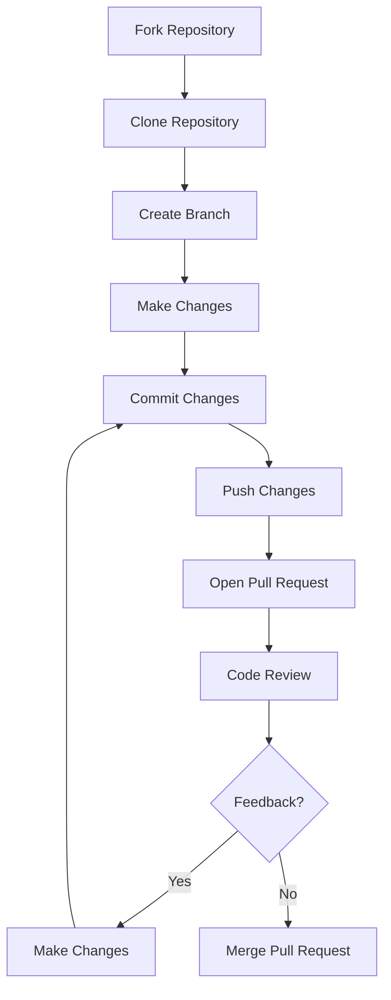

## 21.3.4 Submitting Pull Requests

Contributing to open source projects is a rewarding way to improve your skills, collaborate with others, and give back to the community. A key part of this process is submitting pull requests (PRs), which are essential for proposing changes to a codebase. In this section, we'll explore the process of creating and submitting pull requests on popular platforms like GitHub and GitLab, and how to effectively respond to code reviews. We'll also draw parallels with Java development practices to help you transition smoothly.

### Understanding Pull Requests

A pull request is a method of submitting contributions to a project. It allows developers to notify project maintainers about changes they've made to the codebase. The maintainers can then review the changes, discuss them, and decide whether to merge them into the main branch. This process is crucial for maintaining code quality and ensuring that all contributions align with the project's goals.

#### Key Concepts

- **Branch**: A separate line of development. In Git, branches allow you to work on different features or fixes independently.
- **Fork**: A personal copy of someone else's project. Forking is common in open source projects to allow contributors to make changes without affecting the original codebase.
- **Merge**: The process of integrating changes from one branch into another.
- **Code Review**: The practice of having others review your code to catch errors, improve quality, and share knowledge.

### Creating a Pull Request

Let's walk through the steps of creating a pull request on GitHub and GitLab, two of the most popular platforms for hosting open source projects.

#### Step 1: Fork the Repository

Before making any changes, you need to fork the repository. This creates a personal copy of the project under your GitHub or GitLab account.

- **GitHub**: Navigate to the repository page and click the "Fork" button at the top right.
- **GitLab**: Similar to GitHub, click the "Fork" button on the repository page.

#### Step 2: Clone the Forked Repository

Once you've forked the repository, clone it to your local machine to start making changes.

```bash
git clone https://github.com/your-username/repository-name.git
cd repository-name
```

#### Step 3: Create a New Branch

It's best practice to create a new branch for each feature or bug fix. This keeps your changes organized and makes it easier to manage multiple contributions.

```bash
git checkout -b feature/your-feature-name
```

#### Step 4: Make Your Changes

Now, you can start coding! As you work, remember to commit your changes with clear, descriptive messages.

```bash
git add .
git commit -m "Add feature X to improve Y"
```

#### Step 5: Push Your Changes

After committing your changes, push them to your forked repository on GitHub or GitLab.

```bash
git push origin feature/your-feature-name
```

#### Step 6: Open a Pull Request

With your changes pushed, you can now open a pull request.

- **GitHub**: Go to your forked repository, switch to your feature branch, and click "New Pull Request." Follow the prompts to create the PR.
- **GitLab**: Navigate to the "Merge Requests" section, click "New Merge Request," and select your source and target branches.

### Responding to Code Reviews

Once you've submitted a pull request, project maintainers and other contributors will review your code. This is an opportunity to receive feedback and improve your contribution.

#### Best Practices for Code Reviews

- **Be Open to Feedback**: Code reviews are a learning opportunity. Be receptive to suggestions and willing to make changes.
- **Communicate Clearly**: If you disagree with feedback, explain your reasoning respectfully. Good communication is key to resolving differences.
- **Make Necessary Changes**: Address the feedback by updating your code and pushing the changes to your branch. This will automatically update the pull request.

### Comparing with Java Development

In Java development, especially in enterprise environments, code reviews and version control are also standard practices. However, the tools and workflows might differ slightly. For instance, Java developers might use tools like Gerrit for code reviews or Jenkins for continuous integration. The principles, however, remain the same: ensure code quality, facilitate collaboration, and maintain a clean codebase.

### Code Example: Submitting a Pull Request

Let's look at a simple example of submitting a pull request in Clojure. Suppose you're contributing a new function to a Clojure library.

#### Clojure Code

```clojure
(ns myproject.core)

(defn greet
  "Returns a greeting message for the given name."
  [name]
  (str "Hello, " name "!"))

;; Usage example
(greet "Clojure Developer")
```

#### Java Equivalent

In Java, you might write a similar function as follows:

```java
public class Greeter {
    public static String greet(String name) {
        return "Hello, " + name + "!";
    }

    public static void main(String[] args) {
        System.out.println(greet("Java Developer"));
    }
}
```

### Try It Yourself

Experiment with the Clojure code by modifying the `greet` function to include a time of day in the greeting. For example, "Good morning, Clojure Developer!"

### Diagram: Pull Request Workflow

Below is a diagram illustrating the typical workflow for submitting a pull request.



*Diagram: The flowchart shows the steps involved in creating and submitting a pull request, including forking, cloning, branching, making changes, and responding to feedback.*

### External Resources

For more information on pull requests and code reviews, consider these resources:

- [GitHub Pull Request Documentation](https://docs.github.com/en/pull-requests)
- [GitLab Merge Request Documentation](https://docs.gitlab.com/ee/user/project/merge_requests/)
- [ClojureDocs](https://clojuredocs.org/)

### Exercises

1. **Create a Pull Request**: Fork a simple Clojure project on GitHub, make a small change, and submit a pull request.
2. **Review a Pull Request**: Find an open pull request in a project you're interested in and provide constructive feedback.
3. **Respond to Feedback**: Practice responding to feedback by making changes to your pull request based on a hypothetical review.

### Key Takeaways

- **Pull requests** are essential for contributing to open source projects, allowing for collaborative development and code quality assurance.
- **Code reviews** are a valuable part of the development process, providing opportunities for learning and improvement.
- **Effective communication** and openness to feedback are crucial for successful collaboration in open source projects.

By mastering the art of submitting pull requests, you'll be well-equipped to contribute to the Clojure community and beyond. Remember, each contribution is a step towards becoming a more skilled and collaborative developer.

## Quiz: Mastering Pull Requests in Clojure



### What is the first step in creating a pull request?

- [x] Fork the repository
- [ ] Clone the repository
- [ ] Create a new branch
- [ ] Open a pull request

> **Explanation:** Forking the repository is the first step, as it creates a personal copy of the project for you to work on.

### Which command is used to clone a repository?

- [x] `git clone`
- [ ] `git fork`
- [ ] `git branch`
- [ ] `git pull`

> **Explanation:** The `git clone` command is used to copy a repository to your local machine.

### What should you do after making changes to your code?

- [x] Commit the changes
- [ ] Open a pull request
- [ ] Fork the repository
- [ ] Merge the changes

> **Explanation:** After making changes, you should commit them with a descriptive message before proceeding to open a pull request.

### How do you update a pull request after receiving feedback?

- [x] Push changes to the same branch
- [ ] Create a new pull request
- [ ] Fork the repository again
- [ ] Close the pull request

> **Explanation:** Pushing changes to the same branch automatically updates the existing pull request.

### What is the purpose of a code review?

- [x] To ensure code quality
- [x] To facilitate collaboration
- [ ] To merge changes immediately
- [ ] To delete branches

> **Explanation:** Code reviews help maintain code quality and facilitate collaboration by allowing others to review and discuss changes.

### Which platform is commonly used for hosting open source projects?

- [x] GitHub
- [ ] Bitbucket
- [ ] SourceForge
- [ ] AWS

> **Explanation:** GitHub is one of the most popular platforms for hosting open source projects.

### What is a common practice before making changes to a codebase?

- [x] Create a new branch
- [ ] Merge the main branch
- [ ] Delete old branches
- [ ] Fork the repository

> **Explanation:** Creating a new branch for each feature or bug fix is a common practice to keep changes organized.

### How can you communicate effectively during a code review?

- [x] Be open to feedback
- [ ] Ignore suggestions
- [ ] Merge changes without discussion
- [ ] Delete comments

> **Explanation:** Being open to feedback and discussing suggestions respectfully is key to effective communication during code reviews.

### What is the benefit of using pull requests?

- [x] They allow for collaborative development
- [ ] They automatically merge changes
- [ ] They replace the need for branches
- [ ] They delete old code

> **Explanation:** Pull requests facilitate collaborative development by allowing others to review and discuss changes before merging.

### True or False: A pull request can be updated after it is opened.

- [x] True
- [ ] False

> **Explanation:** A pull request can be updated by pushing additional changes to the same branch.


