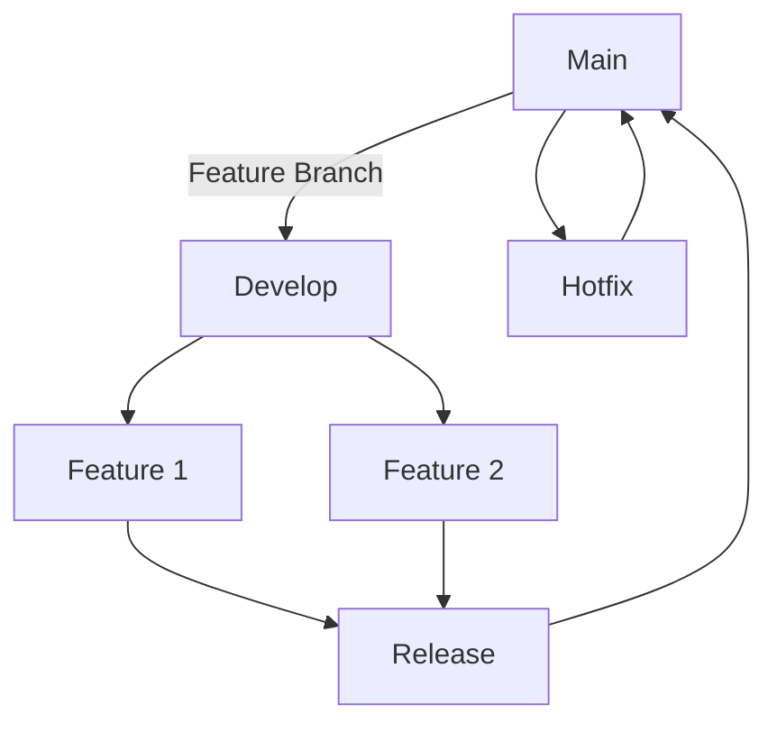

## 21.4.1 Version Control with Git

As experienced Java developers transitioning to Clojure, mastering Git is essential for effective collaboration in open-source projects. Git, a distributed version control system, allows multiple developers to work on a project simultaneously without overwriting each other's changes. This section will guide you through the essentials of using Git for collaboration, including branching strategies, merging, and resolving conflicts, with an emphasis on maintaining a clean commit history.

### Understanding Git and Its Importance

Git is a powerful tool that tracks changes in your codebase, enabling you to revert to previous states, collaborate with others, and maintain a history of your project's evolution. Unlike centralized version control systems, Git is distributed, meaning every developer has a complete copy of the project history on their local machine. This architecture offers several advantages:

- **Resilience**: With multiple copies of the repository, the risk of data loss is minimized.
- **Flexibility**: Developers can work offline and commit changes locally.
- **Collaboration**: Git supports branching and merging, allowing multiple developers to work on different features simultaneously.

### Setting Up Git

Before diving into Git's features, ensure you have Git installed on your system. You can download it from the [official Git website](https://git-scm.com/). Once installed, configure your Git identity:

```bash
git config --global user.name "Your Name"
git config --global user.email "your.email@example.com"
```

These configurations associate your commits with your identity, which is crucial for collaboration.

### Basic Git Workflow

The basic Git workflow involves the following steps:

1. **Cloning a Repository**: Start by cloning an existing repository to your local machine.
   ```bash
   git clone https://github.com/user/repository.git
   ```

2. **Making Changes**: Edit files in your local repository.

3. **Staging Changes**: Add changes to the staging area.
   ```bash
   git add <file>
   ```

4. **Committing Changes**: Commit the staged changes with a descriptive message.
   ```bash
   git commit -m "Add feature X"
   ```

5. **Pushing Changes**: Push your commits to the remote repository.
   ```bash
   git push origin main
   ```

### Branching Strategies

Branches in Git allow you to diverge from the main codebase and work on features or bug fixes independently. This is particularly useful in collaborative environments where multiple developers are working on different parts of a project.

#### Common Branching Strategies

1. **Feature Branching**: Create a new branch for each feature or bug fix. Once the work is complete, merge it back into the main branch.
   ```bash
   git checkout -b feature/new-feature
   ```

2. **Git Flow**: A more structured approach that uses branches for features, releases, and hotfixes. It involves the following branches:
   - **Main**: The production-ready state of your code.
   - **Develop**: The integration branch for features.
   - **Feature**: Branches off from develop for new features.
   - **Release**: Prepares for a new production release.
   - **Hotfix**: Fixes critical bugs in the main branch.

3. **Trunk-Based Development**: Developers work on small, short-lived branches and merge changes back into the main branch frequently.

### Merging and Resolving Conflicts

Merging is the process of integrating changes from one branch into another. While Git handles most merges automatically, conflicts can arise when changes overlap.

#### Merging Branches

To merge a branch into the main branch, use the following commands:

```bash
git checkout main
git merge feature/new-feature
```

#### Resolving Conflicts

When conflicts occur, Git marks the conflicting areas in the files. You'll need to manually resolve these conflicts and mark them as resolved:

1. Open the conflicting files and look for conflict markers (`<<<<<<<`, `=======`, `>>>>>>>`).
2. Edit the files to resolve the conflicts.
3. Stage the resolved files:
   ```bash
   git add <file>
   ```
4. Complete the merge:
   ```bash
   git commit
   ```

### Maintaining a Clean Commit History

A clean commit history is crucial for understanding the evolution of a project. Here are some best practices:

- **Write Descriptive Commit Messages**: Clearly describe what changes were made and why.
- **Use Atomic Commits**: Each commit should represent a single logical change.
- **Rebase Before Merging**: Rebasing can create a linear commit history, making it easier to follow.
  ```bash
  git rebase main
  ```

### Try It Yourself

Experiment with Git by creating a new repository and practicing the following:

- Create a feature branch and make some changes.
- Commit your changes with descriptive messages.
- Merge your feature branch into the main branch and resolve any conflicts.
- Use rebase to clean up your commit history.

### Diagrams and Visual Aids

Below is a diagram illustrating a typical Git branching strategy using Git Flow:



*Diagram 1: Git Flow Branching Strategy*

### Further Reading

For more in-depth information on Git, consider the following resources:

- [Pro Git Book](https://git-scm.com/book/en/v2)
- [Git Documentation](https://git-scm.com/doc)
- [GitHub Guides](https://guides.github.com/)

### Exercises

1. Create a new Git repository and practice the basic workflow.
2. Implement a feature using a feature branch and merge it into the main branch.
3. Simulate a merge conflict and resolve it.
4. Rebase a branch to clean up the commit history.

### Key Takeaways

- **Git is essential for collaboration** in Clojure projects, enabling multiple developers to work simultaneously.
- **Branching strategies** help manage parallel development efforts and maintain code quality.
- **Merging and conflict resolution** are critical skills for integrating changes smoothly.
- **A clean commit history** aids in understanding project evolution and simplifies debugging.

By mastering Git, you'll enhance your ability to contribute effectively to open-source Clojure projects and collaborate with other developers. Now that we've explored version control with Git, let's apply these concepts to manage your Clojure projects efficiently.

## Quiz: Mastering Git for Clojure Projects



### What is the primary advantage of using Git for version control?

- [x] It allows distributed collaboration and offline work.
- [ ] It requires a central server for all operations.
- [ ] It does not support branching.
- [ ] It is only suitable for small projects.

> **Explanation:** Git's distributed nature allows developers to work offline and collaborate without a central server, making it ideal for projects of all sizes.

### Which command is used to create a new branch in Git?

- [x] `git checkout -b <branch-name>`
- [ ] `git branch <branch-name>`
- [ ] `git new-branch <branch-name>`
- [ ] `git create-branch <branch-name>`

> **Explanation:** The `git checkout -b <branch-name>` command creates and switches to a new branch in one step.

### What is the purpose of a feature branch?

- [x] To develop new features or fixes independently.
- [ ] To store backup copies of the main branch.
- [ ] To merge changes from other branches.
- [ ] To delete old branches.

> **Explanation:** Feature branches allow developers to work on new features or fixes without affecting the main codebase.

### How do you resolve a merge conflict in Git?

- [x] Manually edit the conflicting files and commit the changes.
- [ ] Use `git resolve-conflict` command.
- [ ] Delete the conflicting branch.
- [ ] Restart the merge process.

> **Explanation:** Merge conflicts require manual resolution by editing the files and committing the resolved changes.

### What is the benefit of rebasing before merging?

- [x] It creates a linear commit history.
- [ ] It automatically resolves conflicts.
- [x] It simplifies the commit history.
- [ ] It deletes old commits.

> **Explanation:** Rebasing re-applies commits on top of another base tip, creating a linear and simplified commit history.

### Which command is used to push changes to a remote repository?

- [x] `git push origin main`
- [ ] `git send main`
- [ ] `git upload main`
- [ ] `git transfer main`

> **Explanation:** The `git push origin main` command uploads local commits to the remote repository.

### What is a common practice for writing commit messages?

- [x] Use descriptive messages that explain the changes.
- [ ] Use single-word messages.
- [x] Include the reason for the changes.
- [ ] Use random characters.

> **Explanation:** Descriptive commit messages help others understand the changes and the reasons behind them.

### What does the `git clone` command do?

- [x] Copies a repository to your local machine.
- [ ] Deletes a remote repository.
- [ ] Merges two branches.
- [ ] Creates a new branch.

> **Explanation:** The `git clone` command copies an existing repository to your local machine, allowing you to work on it.

### What is the main branch in Git Flow?

- [x] The production-ready state of the code.
- [ ] A branch for experimental features.
- [ ] A backup branch.
- [ ] A branch for deleted code.

> **Explanation:** In Git Flow, the main branch represents the production-ready state of the code.

### True or False: Git is only useful for large projects.

- [ ] True
- [x] False

> **Explanation:** Git is useful for projects of all sizes, providing version control and collaboration features that benefit both small and large projects.


