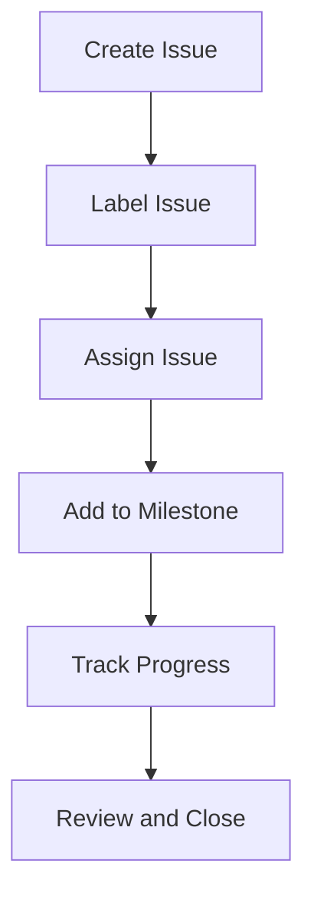

## 21.4.2 Issue Tracking and Project Management

In the world of software development, especially in open source projects like those in the Clojure ecosystem, **issue tracking and project management** are crucial for maintaining organization, ensuring clear communication, and achieving project goals efficiently. This section will guide you through the essential tools and practices for managing issues and projects effectively, drawing parallels to Java-based systems where applicable.

### Understanding Issue Tracking

Issue tracking is the backbone of any software project, providing a structured way to manage tasks, bugs, enhancements, and more. In Clojure projects, as in Java, issue tracking systems (ITS) like GitHub Issues, Jira, and GitLab Issues are commonly used.

#### Key Components of Issue Tracking

1. **Issues**: These are individual tasks or problems that need to be addressed. They can be bugs, feature requests, or general tasks.
2. **Labels**: Labels categorize issues, making it easier to filter and prioritize them. Common labels include "bug", "enhancement", "question", and "documentation".
3. **Milestones**: Milestones group issues into larger goals or releases, helping teams track progress towards significant project objectives.
4. **Assignees**: Assigning issues to team members clarifies responsibility and accountability.

### Using GitHub Issues for Clojure Projects

GitHub Issues is a popular choice for many Clojure projects due to its integration with GitHub repositories. Here's how you can leverage GitHub Issues effectively:

#### Creating and Managing Issues

- **Creating an Issue**: When creating an issue, provide a clear and concise title and description. Include steps to reproduce (for bugs), expected vs. actual behavior, and any relevant screenshots or logs.
  
  ```markdown
  # Example Issue Template
  ## Description
  Briefly describe the issue.

  ## Steps to Reproduce
  1. Step one
  2. Step two

  ## Expected Behavior
  Describe what you expected to happen.

  ## Actual Behavior
  Describe what actually happened.
  ```

- **Using Labels**: Apply labels to categorize issues. For instance, use "bug" for defects, "enhancement" for feature requests, and "help wanted" to indicate issues where community contributions are welcome.

- **Assigning Issues**: Assign issues to team members based on expertise and availability. This helps in tracking who is responsible for what.

#### Organizing with Milestones

Milestones in GitHub help in organizing issues into larger goals. For example, you might have a milestone for an upcoming release or a specific feature set.

- **Creating Milestones**: Define milestones with a clear goal and due date. This helps in planning and prioritizing work.

- **Tracking Progress**: Use the milestone view to see the progress of issues towards completion. This provides a high-level overview of what remains to be done.

#### Example: Managing a Clojure Library Project

Consider a Clojure library project hosted on GitHub. You can use GitHub Issues to manage feature requests, bug reports, and documentation tasks. Here's a simple workflow:

1. **Create Issues**: As issues arise, create them in the GitHub repository with detailed descriptions.
2. **Label and Assign**: Apply appropriate labels and assign issues to contributors.
3. **Set Milestones**: Group issues into milestones for upcoming releases.
4. **Review and Close**: Once issues are resolved, review the changes and close the issues.

### Integrating Issue Tracking with Project Management

While issue tracking focuses on individual tasks, project management encompasses the broader scope of planning, executing, and monitoring project progress. Tools like GitHub Projects, Jira, and Trello can be integrated with issue tracking systems to provide a comprehensive view of the project's status.

#### GitHub Projects

GitHub Projects offers a Kanban-style board for managing issues and pull requests. This visual approach helps teams organize work and track progress.

- **Creating a Project Board**: Set up columns for different stages of work, such as "To Do", "In Progress", and "Done".
- **Adding Issues**: Drag and drop issues from GitHub Issues into the project board to track their status.
- **Automating Workflows**: Use automation to move issues between columns based on events, such as closing an issue or merging a pull request.

#### Jira for Clojure Projects

Jira is a powerful project management tool that offers advanced features like customizable workflows, detailed reporting, and integration with other tools.

- **Creating Epics and Stories**: Use epics to represent large bodies of work and break them down into smaller stories or tasks.
- **Tracking Progress**: Use Jira's reporting features to track progress and identify bottlenecks.
- **Integrating with GitHub**: Link Jira issues to GitHub commits and pull requests for seamless traceability.

### Best Practices for Issue Tracking and Project Management

1. **Clear Communication**: Ensure that all issues and tasks are clearly described and communicated to the team. This reduces misunderstandings and increases efficiency.
2. **Regular Updates**: Keep issues and project boards updated with the latest information. This helps in maintaining an accurate view of the project's status.
3. **Prioritization**: Regularly review and prioritize issues to ensure that the most critical tasks are addressed first.
4. **Community Engagement**: In open source projects, engage with the community by labeling issues as "good first issue" or "help wanted" to encourage contributions.

### Try It Yourself

To get hands-on experience, try setting up a GitHub repository for a small Clojure project. Create a few issues, apply labels, and organize them into a project board. Experiment with different workflows and see how they impact your project's management.

### Diagrams and Visuals

Below is a simple flowchart illustrating the issue tracking and project management process:



**Diagram Description**: This flowchart represents the typical process of managing issues in a project, from creation to closure.

### Further Reading

- [GitHub Issues Documentation](https://docs.github.com/en/issues)
- [Jira Software Guide](https://www.atlassian.com/software/jira/guides)
- [GitHub Projects](https://docs.github.com/en/issues/planning-and-tracking-with-projects/learning-about-projects/about-projects)

### Exercises

1. **Create a GitHub Issue**: Set up a GitHub repository and create an issue with a detailed description and labels.
2. **Organize with Milestones**: Create a milestone for an upcoming release and add issues to it.
3. **Experiment with GitHub Projects**: Set up a project board and move issues through different stages.

### Key Takeaways

- **Issue tracking** is essential for managing tasks and communication in software projects.
- **Labels and milestones** help in organizing and prioritizing work.
- **Project management tools** like GitHub Projects and Jira provide a comprehensive view of project progress.
- **Clear communication and regular updates** are crucial for effective project management.

By mastering these tools and practices, you'll be well-equipped to contribute effectively to Clojure projects and manage your own projects with confidence.

## Quiz: Mastering Issue Tracking and Project Management in Clojure Projects



### What is the primary purpose of issue tracking in software projects?

- [x] To manage tasks, bugs, and enhancements
- [ ] To write code
- [ ] To compile programs
- [ ] To design user interfaces

> **Explanation:** Issue tracking is used to manage tasks, bugs, and enhancements, providing a structured way to organize work.

### Which of the following is a common label used in issue tracking?

- [x] Bug
- [ ] Compile
- [ ] Execute
- [ ] Design

> **Explanation:** "Bug" is a common label used to categorize issues related to defects in the software.

### What is the role of milestones in issue tracking?

- [x] To group issues into larger goals or releases
- [ ] To assign issues to developers
- [ ] To write documentation
- [ ] To compile code

> **Explanation:** Milestones are used to group issues into larger goals or releases, helping track progress towards significant objectives.

### How can GitHub Projects help in project management?

- [x] By providing a Kanban-style board for organizing issues
- [ ] By writing code automatically
- [ ] By compiling programs
- [ ] By designing user interfaces

> **Explanation:** GitHub Projects offers a Kanban-style board that helps teams organize work and track progress visually.

### What is a best practice for issue tracking?

- [x] Clear communication and regular updates
- [ ] Writing code without comments
- [ ] Ignoring community feedback
- [ ] Skipping documentation

> **Explanation:** Clear communication and regular updates ensure that all team members are aligned and informed about the project's status.

### Which tool is known for advanced project management features like customizable workflows?

- [x] Jira
- [ ] GitHub Issues
- [ ] Trello
- [ ] Slack

> **Explanation:** Jira is known for its advanced project management features, including customizable workflows and detailed reporting.

### What is the benefit of using labels in issue tracking?

- [x] To categorize and prioritize issues
- [ ] To write code
- [ ] To compile programs
- [ ] To design user interfaces

> **Explanation:** Labels help categorize and prioritize issues, making it easier to filter and manage them.

### How can community engagement be encouraged in open source projects?

- [x] By labeling issues as "good first issue" or "help wanted"
- [ ] By writing code without comments
- [ ] By ignoring community feedback
- [ ] By skipping documentation

> **Explanation:** Labeling issues as "good first issue" or "help wanted" encourages community contributions and engagement.

### What is a common practice when creating an issue?

- [x] Providing a clear and concise title and description
- [ ] Writing code without comments
- [ ] Ignoring community feedback
- [ ] Skipping documentation

> **Explanation:** Providing a clear and concise title and description helps in understanding the issue and facilitates its resolution.

### True or False: Milestones are used to assign issues to developers.

- [ ] True
- [x] False

> **Explanation:** Milestones are used to group issues into larger goals or releases, not to assign issues to developers.


