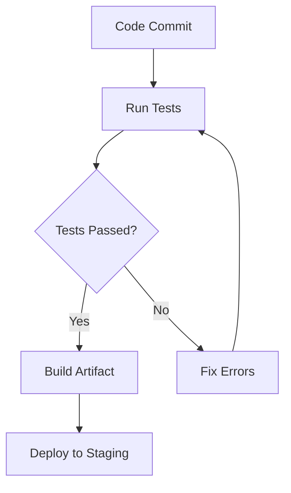

## 21.4.3 Continuous Integration Systems

Continuous Integration (CI) systems are a cornerstone of modern software development, especially in open source projects. They ensure that code changes are automatically tested and validated, providing immediate feedback to developers. In this section, we'll explore how CI systems are used in Clojure projects, how they compare to Java-based CI practices, and how you can effectively contribute to open source projects by understanding and utilizing CI pipelines.

### Understanding Continuous Integration

Continuous Integration is a development practice where developers integrate code into a shared repository frequently, ideally several times a day. Each integration is verified by an automated build and test process, allowing teams to detect problems early.

#### Key Benefits of CI

- **Early Detection of Errors**: CI systems run automated tests on every code change, helping to catch bugs early in the development cycle.
- **Improved Code Quality**: By enforcing coding standards and running tests, CI helps maintain high code quality.
- **Faster Feedback**: Developers receive immediate feedback on their changes, allowing for quick iterations.
- **Reduced Integration Problems**: Frequent integrations reduce the complexity of merging code changes.

### CI Systems in Clojure Projects

Clojure projects, like those in Java, benefit greatly from CI systems. However, there are unique aspects to consider when setting up CI for Clojure.

#### Popular CI Tools

- **GitHub Actions**: A popular choice for open source projects, GitHub Actions provides a flexible CI/CD platform integrated directly with GitHub repositories.
- **Travis CI**: Known for its simplicity and ease of use, Travis CI is widely used in the open source community.
- **CircleCI**: Offers powerful configuration options and is known for its speed and efficiency.
- **Jenkins**: A highly customizable open-source automation server that can be used for CI/CD.

#### Setting Up CI for Clojure

Setting up a CI pipeline for a Clojure project involves configuring the CI system to run Clojure-specific tasks, such as:

- **Dependency Resolution**: Using tools like Leiningen or tools.deps to manage dependencies.
- **Running Tests**: Executing unit tests using `clojure.test` or other testing frameworks.
- **Building Artifacts**: Compiling Clojure code into executable artifacts if necessary.

Here's a basic example of a GitHub Actions workflow for a Clojure project:

```yaml
name: Clojure CI

on: [push, pull_request]

jobs:
  build:
    runs-on: ubuntu-latest

    steps:
    - name: Checkout code
      uses: actions/checkout@v2

    - name: Set up JDK 11
      uses: actions/setup-java@v2
      with:
        java-version: '11'

    - name: Install Clojure CLI
      run: |
        curl -O https://download.clojure.org/install/linux-install-1.10.3.967.sh
        chmod +x linux-install-1.10.3.967.sh
        sudo ./linux-install-1.10.3.967.sh

    - name: Run tests
      run: clojure -M:test
```

**Explanation**: This workflow triggers on every push and pull request. It checks out the code, sets up Java, installs the Clojure CLI, and runs tests.

### Comparing CI in Clojure and Java

While the principles of CI remain the same across languages, there are some differences in how CI is implemented in Clojure compared to Java.

#### Dependency Management

- **Java**: Typically uses Maven or Gradle for dependency management.
- **Clojure**: Uses Leiningen or tools.deps, which are simpler and more declarative.

#### Build Tools

- **Java**: Often involves complex build scripts and configurations.
- **Clojure**: Focuses on simplicity, with Leiningen providing a straightforward way to define tasks.

#### Testing Frameworks

- **Java**: JUnit is the standard testing framework.
- **Clojure**: `clojure.test` is commonly used, with support for property-based testing via `test.check`.

### Interpreting and Fixing Build Failures

Understanding how to interpret and fix build failures is crucial for contributing to open source projects. Here's a step-by-step guide:

#### Common Causes of Build Failures

1. **Test Failures**: Ensure all tests pass locally before pushing changes.
2. **Dependency Issues**: Check for version conflicts or missing dependencies.
3. **Syntax Errors**: Use linters and formatters to catch syntax issues before committing.
4. **Environment Differences**: Ensure your local environment matches the CI environment.

#### Fixing Build Failures

- **Review Logs**: CI systems provide detailed logs. Start by reviewing these to understand the failure.
- **Reproduce Locally**: Try to reproduce the issue on your local machine.
- **Consult Documentation**: Check the project's documentation for any specific CI configurations.
- **Ask for Help**: If you're stuck, reach out to the project's maintainers or community for guidance.

### Try It Yourself

To get hands-on experience, try setting up a CI pipeline for a simple Clojure project. Modify the GitHub Actions workflow example above to include additional steps, such as linting or deploying to a staging environment.

### Diagrams and Visualizations

Below is a flowchart illustrating a typical CI pipeline for a Clojure project:



**Caption**: This flowchart represents the CI pipeline for a Clojure project, starting from a code commit to deploying to a staging environment.

### Further Reading

For more information on CI systems and best practices, consider the following resources:

- [Official Clojure Documentation](https://clojure.org/)
- [GitHub Actions Documentation](https://docs.github.com/en/actions)
- [Travis CI Documentation](https://docs.travis-ci.com/)
- [CircleCI Documentation](https://circleci.com/docs/)
- [Jenkins Documentation](https://www.jenkins.io/doc/)

### Exercises

1. **Set Up a CI Pipeline**: Create a new Clojure project and set up a CI pipeline using GitHub Actions. Ensure it runs tests and builds artifacts.
2. **Fix a Build Failure**: Intentionally introduce a syntax error in your project and observe how the CI system reports it. Fix the error and verify the build passes.
3. **Extend the Pipeline**: Add a step to your CI pipeline to deploy the application to a cloud provider or a local server.

### Key Takeaways

- Continuous Integration is essential for maintaining code quality and facilitating collaboration in open source projects.
- Clojure projects benefit from CI systems by automating testing and validation processes.
- Understanding and fixing build failures is crucial for contributing effectively to open source projects.
- CI systems like GitHub Actions, Travis CI, and CircleCI are popular choices for Clojure projects.

By mastering CI systems, you'll be well-equipped to contribute to open source Clojure projects and ensure your code changes are robust and reliable.

## Quiz: Mastering Continuous Integration Systems in Clojure



### What is the primary purpose of Continuous Integration (CI) systems?

- [x] To automatically test and validate code changes
- [ ] To manually review code changes
- [ ] To deploy code to production
- [ ] To manage project documentation

> **Explanation:** CI systems are designed to automatically test and validate code changes to ensure code quality and catch errors early.

### Which CI tool is integrated directly with GitHub repositories?

- [x] GitHub Actions
- [ ] Travis CI
- [ ] CircleCI
- [ ] Jenkins

> **Explanation:** GitHub Actions is a CI/CD platform that is integrated directly with GitHub repositories, making it a popular choice for open source projects.

### What is a common cause of build failures in CI pipelines?

- [x] Test failures
- [ ] Successful deployments
- [ ] Code documentation
- [ ] Code formatting

> **Explanation:** Test failures are a common cause of build failures in CI pipelines, as they indicate that the code changes have introduced errors.

### How can you reproduce a CI build failure locally?

- [x] By running the same tests and build commands locally
- [ ] By deploying the code to production
- [ ] By reviewing the project's documentation
- [ ] By ignoring the failure

> **Explanation:** Reproducing the CI build failure locally involves running the same tests and build commands on your local machine to identify the issue.

### What is the role of dependency management in CI pipelines?

- [x] To ensure all necessary libraries and tools are available for the build
- [ ] To deploy code to production
- [ ] To manage project documentation
- [ ] To manually review code changes

> **Explanation:** Dependency management ensures that all necessary libraries and tools are available for the build process, preventing version conflicts and missing dependencies.

### Which tool is commonly used for dependency management in Clojure projects?

- [x] Leiningen
- [ ] Maven
- [ ] Gradle
- [ ] Ant

> **Explanation:** Leiningen is a popular tool for dependency management and build automation in Clojure projects.

### What should you do if you're stuck fixing a build failure?

- [x] Reach out to the project's maintainers or community for guidance
- [ ] Ignore the failure and proceed with the deployment
- [ ] Delete the project and start over
- [ ] Manually edit the CI logs

> **Explanation:** If you're stuck fixing a build failure, reaching out to the project's maintainers or community for guidance can provide valuable insights and assistance.

### What is the first step in setting up a CI pipeline for a Clojure project?

- [x] Configuring the CI system to run Clojure-specific tasks
- [ ] Deploying the code to production
- [ ] Writing project documentation
- [ ] Manually reviewing code changes

> **Explanation:** The first step in setting up a CI pipeline for a Clojure project is configuring the CI system to run Clojure-specific tasks, such as dependency resolution and testing.

### What is the benefit of using GitHub Actions for CI in open source projects?

- [x] It provides a flexible CI/CD platform integrated directly with GitHub
- [ ] It requires manual intervention for each build
- [ ] It is only suitable for private repositories
- [ ] It does not support Clojure projects

> **Explanation:** GitHub Actions provides a flexible CI/CD platform integrated directly with GitHub, making it ideal for open source projects.

### True or False: Continuous Integration helps reduce integration problems by merging code changes frequently.

- [x] True
- [ ] False

> **Explanation:** Continuous Integration helps reduce integration problems by merging code changes frequently, which minimizes the complexity of merging and ensures that changes are tested early.


