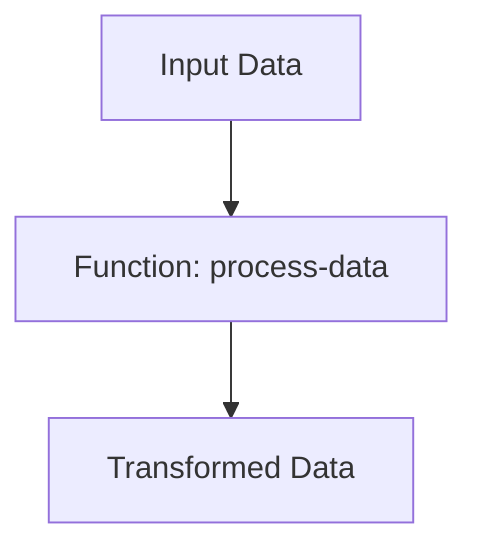

## 21.5.1 Adhering to Style Guides

As experienced Java developers transitioning to Clojure, understanding and adhering to style guides is crucial for maintaining code consistency and quality, especially when contributing to open source projects. In this section, we will explore the importance of style guides, common Clojure style conventions, and tools like `cljfmt` that help enforce these standards. We'll also draw parallels with Java style guides to ease your transition.

### The Importance of Style Guides

Style guides are essential in any programming language as they ensure that code is consistent, readable, and maintainable. In open source projects, where multiple contributors work on the same codebase, adhering to a style guide becomes even more critical. It helps in:

- **Maintaining Consistency**: Ensures that all code looks and feels the same, regardless of who wrote it.
- **Improving Readability**: Makes it easier for developers to read and understand the code.
- **Facilitating Collaboration**: Reduces friction when multiple developers work on the same codebase.
- **Enhancing Maintainability**: Simplifies future modifications and debugging.

### Common Clojure Style Conventions

Clojure, being a Lisp dialect, has its unique style conventions that might differ from Java. Here are some key conventions to keep in mind:

#### 1. **Indentation and Whitespace**

Clojure code relies heavily on proper indentation to convey structure. Unlike Java, which uses braces to define blocks, Clojure uses parentheses. Proper indentation helps in visualizing the nested structure of code.

```clojure
;; Correct indentation
(defn example-function
  [arg1 arg2]
  (let [result (+ arg1 arg2)]
    (println "The result is:" result)
    result))
```

In Java, you might see:

```java
// Java equivalent
public int exampleFunction(int arg1, int arg2) {
    int result = arg1 + arg2;
    System.out.println("The result is: " + result);
    return result;
}
```

#### 2. **Naming Conventions**

Clojure favors kebab-case for naming functions and variables, whereas Java uses camelCase. This is a significant shift for Java developers.

```clojure
;; Clojure naming convention
(defn calculate-sum [a b]
  (+ a b))
```

```java
// Java naming convention
public int calculateSum(int a, int b) {
    return a + b;
}
```

#### 3. **Function Definitions**

In Clojure, functions are first-class citizens and are defined using `defn`. It's important to keep function definitions concise and focused on a single task.

```clojure
(defn greet
  "Greets a person with their name."
  [name]
  (str "Hello, " name "!"))
```

#### 4. **Use of Collections**

Clojure provides rich collection types like lists, vectors, maps, and sets. Understanding when to use each type is crucial for writing idiomatic Clojure code.

```clojure
;; Using a vector for ordered collection
(def fruits ["apple" "banana" "cherry"])

;; Using a map for key-value pairs
(def person {:name "Alice" :age 30})
```

### Tools for Enforcing Style: `cljfmt`

`cljfmt` is a popular tool for formatting Clojure code. It helps in automatically applying style guide rules, ensuring that your code adheres to the project's standards.

#### Installing and Using `cljfmt`

To install `cljfmt`, you can add it to your project dependencies. Here's how you can use it:

1. **Add `cljfmt` to your `project.clj`:**

```clojure
:plugins [[lein-cljfmt "0.6.8"]]
```

2. **Format your code:**

Run the following command to format your codebase:

```bash
lein cljfmt fix
```

This command will automatically format your code according to the style guide rules.

### Comparing Clojure and Java Style Guides

While both Clojure and Java have style guides, they differ significantly due to the languages' paradigms. Here are some key differences:

- **Syntax and Structure**: Clojure's syntax is more concise and relies on parentheses, whereas Java uses braces and semicolons.
- **Immutability**: Clojure emphasizes immutability, which affects how you structure your code and manage state.
- **Functional vs. Object-Oriented**: Clojure is functional, focusing on functions and data transformations, while Java is object-oriented, focusing on objects and classes.

### Try It Yourself

To get hands-on experience with Clojure style guides, try modifying the following code snippet to adhere to Clojure conventions:

```clojure
(defn addNumbers [x y]
  (let [sum (+ x y)]
    (println "Sum is:" sum)
    sum))
```

**Challenge**: Convert the function name to kebab-case and ensure proper indentation.

### Diagrams and Visual Aids

Below is a diagram illustrating the flow of data through a simple Clojure function:



**Diagram Description**: This flowchart shows how input data is processed through a Clojure function, resulting in transformed data.

### Exercises

1. **Exercise 1**: Refactor a Java class to a Clojure function, adhering to Clojure style conventions.
2. **Exercise 2**: Use `cljfmt` to format a Clojure codebase and observe the changes.
3. **Exercise 3**: Compare a Java method and a Clojure function that perform the same task. Identify style differences.

### Key Takeaways

- Adhering to style guides is crucial for maintaining code consistency and quality.
- Clojure has unique style conventions, such as kebab-case naming and reliance on indentation.
- Tools like `cljfmt` help enforce style guide rules automatically.
- Understanding the differences between Clojure and Java style guides can ease the transition for Java developers.

By following these guidelines, you'll be well-equipped to contribute to open source Clojure projects effectively. Remember, consistency is key to collaborative success!

### Further Reading

- [Official Clojure Style Guide](https://github.com/bbatsov/clojure-style-guide)
- [ClojureDocs](https://clojuredocs.org/)
- [cljfmt GitHub Repository](https://github.com/weavejester/cljfmt)

## Quiz Time!



### What is the primary purpose of adhering to style guides in Clojure projects?

- [x] To maintain code consistency and readability
- [ ] To increase code execution speed
- [ ] To reduce the number of lines of code
- [ ] To ensure compatibility with Java

> **Explanation:** Adhering to style guides ensures that code is consistent and readable, which is crucial for collaboration and maintenance.

### Which naming convention is preferred in Clojure for functions and variables?

- [x] kebab-case
- [ ] camelCase
- [ ] snake_case
- [ ] PascalCase

> **Explanation:** Clojure uses kebab-case for naming functions and variables, which is different from Java's camelCase.

### What tool is commonly used to format Clojure code according to style guides?

- [x] cljfmt
- [ ] Checkstyle
- [ ] Prettier
- [ ] ESLint

> **Explanation:** `cljfmt` is a tool used to format Clojure code, ensuring adherence to style guides.

### How does Clojure handle code blocks differently from Java?

- [x] Uses parentheses for structure
- [ ] Uses braces for structure
- [ ] Uses semicolons to end statements
- [ ] Uses indentation only

> **Explanation:** Clojure uses parentheses to define code blocks, unlike Java, which uses braces.

### What is a key difference between Clojure and Java style guides?

- [x] Clojure emphasizes immutability
- [ ] Java uses kebab-case
- [ ] Clojure requires semicolons
- [ ] Java uses parentheses for blocks

> **Explanation:** Clojure emphasizes immutability, affecting how code is structured compared to Java.

### Which of the following is NOT a benefit of adhering to style guides?

- [ ] Improved readability
- [ ] Enhanced maintainability
- [x] Faster code execution
- [ ] Easier collaboration

> **Explanation:** While style guides improve readability and maintainability, they do not directly affect code execution speed.

### What is the purpose of the `lein cljfmt fix` command?

- [x] To automatically format Clojure code
- [ ] To compile Clojure code
- [ ] To run Clojure tests
- [ ] To deploy Clojure applications

> **Explanation:** The `lein cljfmt fix` command formats Clojure code according to style guide rules.

### In Clojure, what is the preferred way to define a function?

- [x] Using `defn`
- [ ] Using `def`
- [ ] Using `fn`
- [ ] Using `let`

> **Explanation:** Functions in Clojure are defined using `defn`, which is the preferred method.

### Which of the following is a common Clojure collection type?

- [x] Vector
- [ ] Array
- [ ] List
- [ ] Set

> **Explanation:** Vectors are a common collection type in Clojure, used for ordered collections.

### True or False: Clojure style guides are identical to Java style guides.

- [ ] True
- [x] False

> **Explanation:** Clojure style guides differ from Java style guides due to the languages' different paradigms and syntax.


