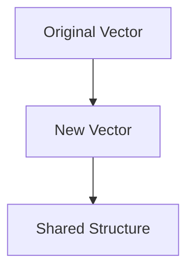

## 21.5.2 Writing Idiomatic Clojure

Writing idiomatic Clojure is about embracing the language's functional programming paradigms and leveraging its unique features to write clean, efficient, and expressive code. As experienced Java developers, you already have a strong foundation in programming concepts, and this guide will help you transition smoothly to writing idiomatic Clojure by drawing parallels with Java where appropriate.

### Understanding Idiomatic Clojure

Idiomatic Clojure code is characterized by its simplicity, expressiveness, and adherence to functional programming principles. Here are some key aspects that define idiomatic Clojure:

- **Immutability**: Clojure emphasizes immutable data structures, which leads to safer and more predictable code.
- **First-Class Functions**: Functions are first-class citizens in Clojure, allowing for higher-order functions and function composition.
- **Conciseness**: Clojure's syntax is designed to be concise and expressive, reducing boilerplate code.
- **Data-Oriented Programming**: Clojure encourages treating data as a first-class entity, often using maps and sequences to represent complex data structures.
- **Concurrency**: Clojure provides powerful concurrency primitives that simplify concurrent programming.

Let's explore these concepts in detail and see how they translate into idiomatic Clojure code.

### Embracing Immutability

In Java, mutable objects are common, and developers often use synchronization to manage concurrent access. In contrast, Clojure's immutable data structures eliminate the need for locks, making concurrent programming easier and safer.

#### Immutable Data Structures

Clojure provides a rich set of immutable data structures, including lists, vectors, maps, and sets. These structures are persistent, meaning that operations on them return new versions of the data structure without modifying the original.

```clojure
;; Creating an immutable vector
(def numbers [1 2 3 4 5])

;; Adding an element to the vector
(def new-numbers (conj numbers 6))

;; Original vector remains unchanged
(println numbers)      ;; Output: [1 2 3 4 5]
(println new-numbers)  ;; Output: [1 2 3 4 5 6]
```

In this example, `conj` adds an element to the vector, returning a new vector without modifying the original. This immutability simplifies reasoning about code and enhances concurrency.

#### Structural Sharing

Clojure's data structures use structural sharing to efficiently manage memory. When a new version of a data structure is created, it shares as much of its structure as possible with the original, minimizing memory usage.



*Diagram: Structural sharing between original and new vectors.*

### First-Class and Higher-Order Functions

Clojure treats functions as first-class citizens, meaning they can be passed as arguments, returned from other functions, and assigned to variables. This capability enables higher-order functions, which are functions that take other functions as arguments or return them as results.

#### Passing Functions as Arguments

In Clojure, you can pass functions as arguments to other functions, enabling powerful abstractions and code reuse.

```clojure
;; Define a function that applies a given function to each element of a collection
(defn apply-to-all [f coll]
  (map f coll))

;; Use the function with a lambda
(defn square [x] (* x x))
(println (apply-to-all square [1 2 3 4]))  ;; Output: (1 4 9 16)
```

Here, `apply-to-all` is a higher-order function that applies the function `f` to each element of `coll`.

#### Function Composition

Function composition is a powerful technique in functional programming, allowing you to combine simple functions to build more complex ones.

```clojure
;; Compose two functions
(defn add-one [x] (+ x 1))
(defn double [x] (* x 2))

(def composed-fn (comp double add-one))
(println (composed-fn 3))  ;; Output: 8
```

In this example, `comp` creates a new function that first applies `add-one` and then `double`.

### Conciseness and Expressiveness

Clojure's syntax is designed to be concise and expressive, allowing you to write less code to achieve the same functionality as in Java.

#### Example: Filtering a Collection

Consider filtering a list of numbers to find even numbers. In Java, you might write:

```java
List<Integer> numbers = Arrays.asList(1, 2, 3, 4, 5);
List<Integer> evens = numbers.stream()
                             .filter(n -> n % 2 == 0)
                             .collect(Collectors.toList());
```

In Clojure, the same operation is more concise:

```clojure
(def numbers [1 2 3 4 5])
(def evens (filter even? numbers))
```

Clojure's `filter` function and `even?` predicate make the code more readable and expressive.

### Data-Oriented Programming

Clojure encourages a data-oriented approach, often using maps and sequences to represent complex data structures. This approach simplifies data manipulation and transformation.

#### Using Maps for Data Representation

Maps are a versatile data structure in Clojure, often used to represent entities with named attributes.

```clojure
;; Define a map representing a person
(def person {:name "Alice" :age 30 :city "New York"})

;; Accessing map values
(println (:name person))  ;; Output: Alice
```

Maps provide a simple and flexible way to work with structured data.

### Concurrency Made Simple

Clojure provides several concurrency primitives, such as atoms, refs, and agents, that simplify concurrent programming by managing state changes in a controlled manner.

#### Atoms for Managing State

Atoms provide a way to manage shared, mutable state in a thread-safe manner. They allow you to update state using functions, ensuring consistency.

```clojure
;; Define an atom
(def counter (atom 0))

;; Update the atom's state
(swap! counter inc)
(println @counter)  ;; Output: 1
```

In this example, `swap!` applies the `inc` function to the atom's current value, updating its state.

### Idiomatic Patterns and Anti-Patterns

Writing idiomatic Clojure involves recognizing common patterns and avoiding anti-patterns that can lead to less efficient or less readable code.

#### Pattern: Using `let` for Local Bindings

The `let` form is used to create local bindings, improving code readability and avoiding unnecessary global state.

```clojure
;; Use let to create local bindings
(let [x 10
      y 20]
  (+ x y))  ;; Output: 30
```

#### Anti-Pattern: Overusing `def`

While `def` is used to define global variables, overusing it can lead to code that is difficult to reason about due to excessive global state.

```clojure
;; Avoid using def for local variables
(def x 10)
(def y 20)
(+ x y)  ;; Not recommended
```

Instead, prefer `let` for local bindings.

### Try It Yourself

Experiment with the following code snippets to deepen your understanding of idiomatic Clojure:

1. Modify the `apply-to-all` function to accept a collection of functions and apply each function to the collection.
2. Create a map representing a book with attributes like title, author, and year. Write a function to update the year.
3. Implement a simple counter using an atom and explore different ways to update its state.

### Exercises

1. **Refactor Java Code**: Take a simple Java class with mutable fields and refactor it into idiomatic Clojure using immutable data structures.
2. **Higher-Order Functions**: Write a higher-order function that takes a collection and a predicate function, returning a new collection with elements that satisfy the predicate.
3. **Concurrency with Atoms**: Implement a shared counter using atoms and simulate concurrent updates from multiple threads.

### Key Takeaways

- **Immutability**: Embrace immutable data structures to simplify reasoning and enhance concurrency.
- **First-Class Functions**: Leverage higher-order functions and function composition for more expressive code.
- **Conciseness**: Write concise and expressive code by utilizing Clojure's syntax and functional programming paradigms.
- **Data-Oriented Programming**: Use maps and sequences to represent and manipulate data effectively.
- **Concurrency**: Utilize Clojure's concurrency primitives to manage state changes safely and efficiently.

By embracing these principles and practices, you'll be well on your way to writing idiomatic Clojure code that is both elegant and efficient.

## Quiz: Mastering Idiomatic Clojure for Java Developers



### What is a key characteristic of idiomatic Clojure code?

- [x] Immutability
- [ ] Extensive use of global variables
- [ ] Complex syntax
- [ ] Heavy reliance on object-oriented patterns

> **Explanation:** Idiomatic Clojure code emphasizes immutability, which simplifies reasoning and enhances concurrency.


### In Clojure, what is a higher-order function?

- [x] A function that takes other functions as arguments or returns them
- [ ] A function that only operates on numbers
- [ ] A function that modifies global state
- [ ] A function that is defined globally

> **Explanation:** Higher-order functions in Clojure can take other functions as arguments or return them, enabling powerful abstractions.


### How does Clojure handle data immutability efficiently?

- [x] Through structural sharing
- [ ] By copying data structures entirely
- [ ] By using locks and synchronization
- [ ] By using mutable data structures

> **Explanation:** Clojure uses structural sharing to efficiently manage memory while maintaining immutability.


### What is the purpose of the `let` form in Clojure?

- [x] To create local bindings
- [ ] To define global variables
- [ ] To perform side effects
- [ ] To handle exceptions

> **Explanation:** The `let` form is used to create local bindings, improving code readability and avoiding unnecessary global state.


### Which of the following is an anti-pattern in Clojure?

- [x] Overusing `def` for local variables
- [ ] Using `let` for local bindings
- [ ] Leveraging higher-order functions
- [ ] Embracing immutability

> **Explanation:** Overusing `def` for local variables is an anti-pattern because it leads to excessive global state.


### What is a common use case for atoms in Clojure?

- [x] Managing shared, mutable state in a thread-safe manner
- [ ] Performing I/O operations
- [ ] Defining immutable data structures
- [ ] Creating complex class hierarchies

> **Explanation:** Atoms are used to manage shared, mutable state in a thread-safe manner, allowing for consistent state updates.


### How does Clojure's `comp` function work?

- [x] It composes multiple functions into a single function
- [ ] It compares two values
- [ ] It concatenates strings
- [ ] It compiles Clojure code

> **Explanation:** The `comp` function composes multiple functions into a single function, allowing for function composition.


### What is the benefit of using maps in Clojure?

- [x] They provide a simple and flexible way to work with structured data
- [ ] They are mutable by default
- [ ] They require complex syntax
- [ ] They are only used for configuration

> **Explanation:** Maps in Clojure provide a simple and flexible way to work with structured data, often representing entities with named attributes.


### Which Clojure feature simplifies concurrent programming?

- [x] Concurrency primitives like atoms, refs, and agents
- [ ] Extensive use of locks and synchronization
- [ ] Mutable data structures
- [ ] Complex class hierarchies

> **Explanation:** Clojure's concurrency primitives, such as atoms, refs, and agents, simplify concurrent programming by managing state changes in a controlled manner.


### True or False: Clojure encourages a data-oriented approach to programming.

- [x] True
- [ ] False

> **Explanation:** True. Clojure encourages a data-oriented approach, often using maps and sequences to represent complex data structures.


