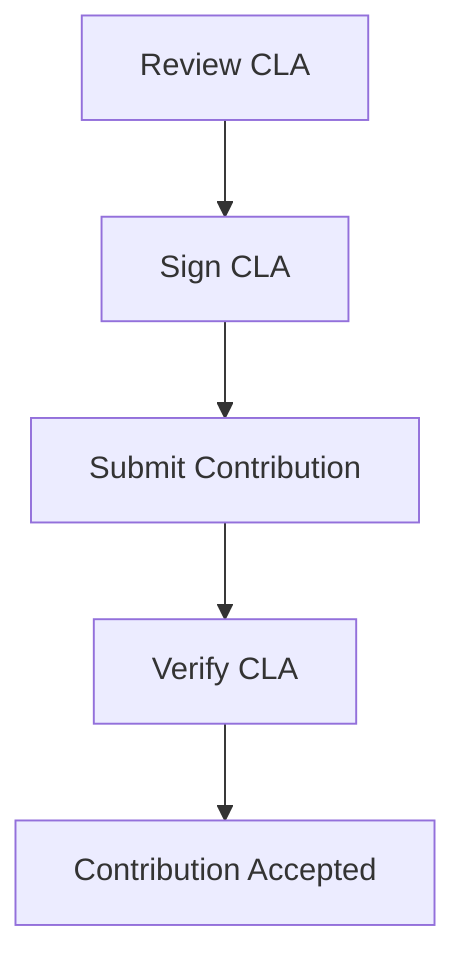

## 21.6.2 Contributor License Agreements (CLAs)

Contributor License Agreements (CLAs) are an essential component of many open source projects, including those in the Clojure ecosystem. They serve as a legal framework that governs the contributions made by developers to a project. In this section, we'll delve into what CLAs are, why they are necessary, and how they affect your contributions to Clojure projects. We'll also explore the process of agreeing to a CLA and the legal considerations involved.

### Understanding Contributor License Agreements (CLAs)

A Contributor License Agreement is a legal document that a contributor must sign before their contributions can be accepted into an open source project. The CLA outlines the terms under which the contributor grants the project maintainers the rights to use, modify, and distribute the contributed code. This agreement ensures that the project can legally incorporate the contributions and that there are no future disputes over intellectual property rights.

#### Why Are CLAs Necessary?

1. **Legal Clarity**: CLAs provide legal clarity and protection for both the contributors and the project maintainers. They ensure that all parties understand the rights and obligations associated with the contributions.

2. **Intellectual Property Rights**: By signing a CLA, contributors affirm that they have the right to contribute the code and that they grant the project maintainers the necessary rights to use it. This prevents future legal disputes over ownership and usage rights.

3. **Project Longevity**: CLAs help ensure the long-term viability of a project by securing the legal rights to all contributions. This is particularly important for projects that may be commercialized or used in proprietary software.

4. **Consistency Across Contributions**: With a CLA in place, all contributions are subject to the same legal terms, creating consistency and reducing the risk of legal issues.

### The Process of Agreeing to a CLA

Agreeing to a CLA is typically a straightforward process, but it can vary depending on the project's requirements. Here is a general overview of the steps involved:

1. **Review the CLA**: Before contributing, review the CLA to understand the terms and conditions. This document is usually available on the project's website or repository.

2. **Sign the CLA**: Contributors may be required to sign the CLA electronically. This can be done through a web form, a digital signature service, or by submitting a signed document via email.

3. **Submit the Contribution**: Once the CLA is signed, you can submit your contribution to the project. The maintainers will verify that the CLA is in place before accepting the contribution.

4. **Maintain Records**: Keep a copy of the signed CLA for your records. This can be useful if there are any future questions about your contributions.

### Legal Considerations in CLAs

When agreeing to a CLA, there are several legal considerations to keep in mind:

1. **Ownership of Contributions**: Ensure that you have the legal right to contribute the code. This means that the code should not infringe on any third-party intellectual property rights.

2. **Grant of Rights**: Understand the rights you are granting to the project maintainers. This typically includes the right to use, modify, and distribute your contributions.

3. **Warranties and Representations**: Many CLAs include warranties and representations that you must agree to. These may include affirmations that your contributions are original and do not violate any laws.

4. **Indemnification**: Some CLAs include indemnification clauses, which require you to indemnify the project maintainers against any legal claims related to your contributions.

5. **Governing Law**: Pay attention to the governing law specified in the CLA. This determines which jurisdiction's laws will apply in the event of a dispute.

### Comparing CLAs in Clojure and Java Projects

Both Clojure and Java projects may require CLAs, but there can be differences in how they are implemented and enforced. Let's compare the two:

- **Clojure Projects**: Clojure projects often emphasize community collaboration and may have simpler CLAs that focus on ensuring contributions are legally sound. The Clojure community values transparency and may provide clear documentation on the CLA process.

- **Java Projects**: Java projects, especially those backed by large organizations, may have more complex CLAs with detailed legal language. These projects may require more formal processes for signing and submitting CLAs.

### Code Example: Submitting a Contribution with a CLA

Let's look at a simple example of how you might submit a contribution to a Clojure project that requires a CLA.

```clojure
;; Define a simple function to add two numbers
(defn add [a b]
  (+ a b))

;; Example usage of the add function
(println (add 3 5)) ; Output: 8

;; To contribute this function to a project, you would:
;; 1. Review the project's CLA.
;; 2. Sign the CLA electronically.
;; 3. Submit a pull request with your code.
;; 4. Ensure the maintainers have a record of your signed CLA.
```

### Try It Yourself

- **Modify the Function**: Try modifying the `add` function to handle more complex operations, such as subtraction or multiplication. Submit your changes to a mock project repository to practice the CLA process.

- **Review a CLA**: Find a CLA from an open source project and review its terms. Consider how these terms would apply to your contributions.

### Diagrams and Visuals

Below is a flowchart illustrating the process of contributing to a project with a CLA:



**Diagram Description**: This flowchart outlines the steps involved in contributing to a project with a CLA, from reviewing and signing the CLA to submitting and verifying the contribution.

### Further Reading

For more information on Contributor License Agreements and their role in open source projects, consider the following resources:

- [Open Source Initiative: Contributor License Agreements](https://opensource.org/cla)
- [Apache Software Foundation: Contributor License Agreement](https://www.apache.org/licenses/contributor-agreements.html)
- [GitHub: Understanding Contributor License Agreements](https://docs.github.com/en/github/setting-up-and-managing-your-github-user-account/setting-up-and-managing-your-github-user-account/understanding-contributor-license-agreements)

### Exercises

1. **Review a CLA**: Find a CLA from a popular open source project and analyze its key terms. What rights are you granting, and what warranties are you making?

2. **Mock Contribution**: Create a simple Clojure project and draft a CLA for it. Practice the process of signing and submitting contributions.

3. **Legal Research**: Research the legal implications of contributing to open source projects in your jurisdiction. How do local laws affect your contributions?

### Key Takeaways

- Contributor License Agreements are crucial for ensuring legal clarity and protecting the rights of both contributors and project maintainers.
- CLAs help secure the long-term viability of open source projects by ensuring all contributions are legally sound.
- Understanding the terms of a CLA is essential before contributing to a project, as it affects your rights and obligations.
- The process of agreeing to a CLA typically involves reviewing the document, signing it, and submitting your contributions with the assurance that the CLA is in place.

By understanding and navigating the CLA process, you can contribute effectively to Clojure projects and other open source initiatives, ensuring that your contributions are legally sound and beneficial to the community.

## Quiz: Understanding Contributor License Agreements (CLAs)



### What is the primary purpose of a Contributor License Agreement (CLA)?

- [x] To provide legal clarity and protection for contributions
- [ ] To restrict contributions to a project
- [ ] To enforce coding standards
- [ ] To manage project funding

> **Explanation:** CLAs provide legal clarity and protection for both contributors and project maintainers, ensuring that contributions can be legally incorporated into the project.

### Which of the following is NOT typically included in a CLA?

- [ ] Grant of rights to use contributions
- [ ] Warranties and representations
- [x] Project funding details
- [ ] Indemnification clauses

> **Explanation:** Project funding details are not typically included in a CLA, which focuses on legal rights and obligations related to contributions.

### Why might a Clojure project require a CLA?

- [x] To ensure contributions are legally sound
- [ ] To limit the number of contributors
- [ ] To enforce a specific coding style
- [ ] To manage project documentation

> **Explanation:** A CLA ensures that contributions are legally sound and that the project maintainers have the rights to use the contributed code.

### How does a CLA benefit project maintainers?

- [x] It provides legal protection and clarity
- [ ] It increases the project's funding
- [ ] It reduces the need for documentation
- [ ] It limits the project's scope

> **Explanation:** A CLA provides legal protection and clarity for project maintainers, ensuring they can use contributions without legal disputes.

### What is a common step in the CLA process?

- [x] Signing the CLA electronically
- [ ] Attending a project meeting
- [ ] Submitting a funding proposal
- [ ] Writing project documentation

> **Explanation:** Signing the CLA electronically is a common step in the process, allowing contributors to formally agree to the terms.

### What should contributors do before signing a CLA?

- [x] Review the CLA terms and conditions
- [ ] Submit their contribution
- [ ] Write a project proposal
- [ ] Attend a legal seminar

> **Explanation:** Contributors should review the CLA terms and conditions to understand their rights and obligations before signing.

### Which of the following is a legal consideration in a CLA?

- [x] Ownership of contributions
- [ ] Project management strategies
- [ ] Coding style guidelines
- [ ] Marketing plans

> **Explanation:** Ownership of contributions is a key legal consideration in a CLA, ensuring contributors have the right to contribute the code.

### How can contributors verify their CLA is in place?

- [x] By checking with project maintainers
- [ ] By reviewing project documentation
- [ ] By attending project meetings
- [ ] By submitting a funding request

> **Explanation:** Contributors can verify their CLA is in place by checking with project maintainers, who ensure the CLA is signed before accepting contributions.

### What is a potential risk of not having a CLA?

- [x] Legal disputes over contributions
- [ ] Increased project funding
- [ ] Improved project documentation
- [ ] Enhanced project visibility

> **Explanation:** Without a CLA, there is a risk of legal disputes over contributions, as the rights and obligations may not be clearly defined.

### True or False: A CLA is only necessary for commercial open source projects.

- [ ] True
- [x] False

> **Explanation:** False. A CLA is necessary for any open source project that wants to ensure legal clarity and protection for contributions, regardless of its commercial status.


