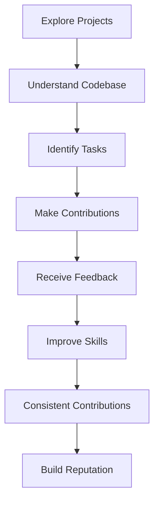

## 21.7.1 Consistent Contributions

Contributing consistently to open source projects, particularly in the Clojure community, offers numerous benefits that extend beyond personal satisfaction. It builds your credibility, enhances your professional reputation, and opens doors to career opportunities. For Java developers transitioning to Clojure, understanding how to make meaningful contributions can significantly impact your journey in the functional programming world.

### The Importance of Consistent Contributions

Consistent contributions to open source projects demonstrate commitment, reliability, and expertise. They help you establish a presence in the community, making you a recognized and trusted member. This recognition can lead to collaboration opportunities, mentorship, and even job offers.

#### Building Credibility and Trust

Credibility in the open source community is built through regular and meaningful contributions. By consistently engaging with projects, you show that you are dependable and invested in the community's success. This trust can lead to more significant responsibilities, such as becoming a project maintainer or leading new initiatives.

**Key Benefits:**

- **Visibility:** Regular contributions increase your visibility within the community, leading to recognition from peers and potential employers.
- **Networking:** Engaging with other contributors helps you build a network of professionals who can offer support, advice, and opportunities.
- **Skill Development:** Working on diverse projects enhances your technical skills and exposes you to new tools and methodologies.

### How to Contribute Consistently

To contribute consistently, it's essential to find projects that align with your interests and expertise. Start by exploring the Clojure ecosystem to identify projects that excite you. Once you've found a project, follow these steps to ensure consistent contributions:

1. **Understand the Project:** Familiarize yourself with the project's goals, codebase, and contribution guidelines. This understanding will help you make meaningful contributions that align with the project's objectives.

2. **Start Small:** Begin with small tasks, such as fixing bugs or improving documentation. These tasks are often less intimidating and provide a good entry point into the project.

3. **Communicate Effectively:** Engage with the community through forums, mailing lists, or chat platforms. Clear communication helps you understand the project's needs and how you can contribute effectively.

4. **Set a Schedule:** Allocate regular time for contributions. Consistency is key, so even small, regular contributions can have a significant impact over time.

5. **Seek Feedback:** Request feedback on your contributions to learn and improve. Constructive criticism helps you refine your skills and understand the project's standards better.

### Code Example: Contributing to a Clojure Project

Let's explore a simple example of contributing to a Clojure project by fixing a bug in a hypothetical library. Suppose we have a library that provides utility functions for string manipulation, and there's a bug in the `reverse-string` function.

**Original Code:**

```clojure
(defn reverse-string [s]
  ;; Incorrectly reverses the string by splitting on spaces
  (clojure.string/join " " (reverse (clojure.string/split s #" "))))
```

**Bug Fix:**

```clojure
(defn reverse-string [s]
  ;; Correctly reverses the entire string
  (apply str (reverse s)))
```

**Explanation:**

- The original function incorrectly splits the string by spaces before reversing, leading to incorrect results for strings without spaces.
- The fixed version uses `apply str` to reverse the entire string correctly.

**Try It Yourself:**

- Modify the function to handle edge cases, such as empty strings or strings with special characters.
- Write tests to ensure the function behaves as expected for various inputs.

### Comparing with Java

In Java, contributing to open source projects follows a similar process, but the language's verbosity can make contributions more complex. Here's how the Clojure example compares to Java:

**Java Code:**

```java
public class StringUtils {
    public static String reverseString(String s) {
        // Incorrectly reverses the string by splitting on spaces
        String[] words = s.split(" ");
        StringBuilder reversed = new StringBuilder();
        for (int i = words.length - 1; i >= 0; i--) {
            reversed.append(words[i]).append(" ");
        }
        return reversed.toString().trim();
    }
}
```

**Bug Fix:**

```java
public class StringUtils {
    public static String reverseString(String s) {
        // Correctly reverses the entire string
        return new StringBuilder(s).reverse().toString();
    }
}
```

**Comparison:**

- Clojure's concise syntax allows for more straightforward bug fixes and contributions.
- Java requires more boilerplate code, which can be a barrier for new contributors.

### Visualizing Contribution Flow

Below is a Mermaid.js diagram illustrating the flow of contributing to an open source project:



**Diagram Explanation:**

- **Explore Projects:** Start by exploring projects that interest you.
- **Understand Codebase:** Familiarize yourself with the project's structure and guidelines.
- **Identify Tasks:** Look for tasks that match your skills and interests.
- **Make Contributions:** Submit code changes or documentation improvements.
- **Receive Feedback:** Engage with the community to receive feedback.
- **Improve Skills:** Use feedback to enhance your skills and contributions.
- **Consistent Contributions:** Regular contributions build your reputation.
- **Build Reputation:** Establish yourself as a trusted member of the community.

### Impact on Career Opportunities

Consistent contributions to open source projects can significantly impact your career. They demonstrate your ability to work collaboratively, solve problems, and contribute to real-world projects. This experience is invaluable when seeking new job opportunities or advancing in your current role.

**Career Benefits:**

- **Portfolio Building:** Contributions serve as a portfolio of your work, showcasing your skills and expertise.
- **Job Offers:** Many companies value open source contributions and may reach out with job offers.
- **Professional Growth:** Engaging with diverse projects helps you grow professionally and stay updated with industry trends.

### Exercises and Practice Problems

To reinforce your understanding of consistent contributions, try the following exercises:

1. **Find a Clojure Project:** Explore GitHub to find a Clojure project that interests you. Review the codebase and identify a small task you can contribute to.

2. **Fix a Bug:** Choose a simple bug in the project and submit a pull request with your fix. Ensure you follow the project's contribution guidelines.

3. **Improve Documentation:** Identify areas in the project's documentation that could be improved or expanded. Submit your changes and request feedback.

4. **Engage with the Community:** Join the project's communication channels and participate in discussions. Share your experiences and seek advice from other contributors.

### Key Takeaways

- **Consistency is Key:** Regular contributions build credibility and trust within the community.
- **Start Small:** Begin with manageable tasks and gradually take on more complex contributions.
- **Seek Feedback:** Use feedback to improve your skills and align with project standards.
- **Career Impact:** Open source contributions enhance your professional reputation and open doors to new opportunities.

By consistently contributing to open source Clojure projects, you can build a strong reputation, enhance your skills, and advance your career. Embrace the opportunity to learn, collaborate, and make a meaningful impact in the Clojure community.

## Quiz: Building Your Reputation in the Clojure Community



### What is a key benefit of consistent contributions to open source projects?

- [x] Building credibility and trust within the community
- [ ] Earning monetary rewards
- [ ] Gaining exclusive access to private repositories
- [ ] Avoiding the need for documentation

> **Explanation:** Consistent contributions help build credibility and trust, which are essential for establishing a strong reputation in the community.


### How can consistent contributions impact your career?

- [x] They can lead to job offers and professional growth
- [ ] They guarantee a promotion in your current job
- [ ] They provide a direct financial benefit
- [ ] They eliminate the need for a resume

> **Explanation:** Consistent contributions showcase your skills and expertise, which can lead to job offers and professional growth opportunities.


### What is the first step in contributing to an open source project?

- [x] Exploring projects that align with your interests
- [ ] Submitting a pull request
- [ ] Writing extensive documentation
- [ ] Creating a new repository

> **Explanation:** The first step is to explore projects that align with your interests to ensure meaningful and engaging contributions.


### Why is it important to start with small tasks when contributing?

- [x] They are less intimidating and provide a good entry point
- [ ] They require less time and effort
- [ ] They are more likely to be accepted
- [ ] They do not require any coding skills

> **Explanation:** Starting with small tasks is less intimidating and helps you gradually become familiar with the project's codebase and guidelines.


### What should you do after making a contribution?

- [x] Seek feedback to learn and improve
- [ ] Immediately start a new project
- [ ] Delete your local repository
- [ ] Avoid further communication with the community

> **Explanation:** Seeking feedback helps you learn and improve, ensuring your contributions align with the project's standards.


### How can you increase your visibility in the open source community?

- [x] By making regular and meaningful contributions
- [ ] By creating multiple accounts
- [ ] By only contributing to popular projects
- [ ] By avoiding communication with other contributors

> **Explanation:** Regular and meaningful contributions increase your visibility and help establish your presence in the community.


### What is a common barrier for new contributors in Java compared to Clojure?

- [x] Java's verbosity and boilerplate code
- [ ] Lack of documentation
- [ ] Limited community support
- [ ] Incompatibility with open source licenses

> **Explanation:** Java's verbosity and boilerplate code can be a barrier for new contributors, making Clojure's concise syntax more appealing.


### What is the role of feedback in open source contributions?

- [x] It helps refine your skills and align with project standards
- [ ] It is optional and not necessary for improvement
- [ ] It should be ignored if negative
- [ ] It is only useful for documentation contributions

> **Explanation:** Feedback helps refine your skills and ensures your contributions align with the project's standards, leading to better contributions.


### How can you engage with the open source community effectively?

- [x] By participating in forums, mailing lists, or chat platforms
- [ ] By only submitting code without communication
- [ ] By creating private repositories
- [ ] By avoiding feedback from other contributors

> **Explanation:** Engaging in forums, mailing lists, or chat platforms helps you understand the project's needs and contribute effectively.


### True or False: Consistent contributions guarantee a promotion in your current job.

- [ ] True
- [x] False

> **Explanation:** While consistent contributions can enhance your professional reputation and open doors to new opportunities, they do not guarantee a promotion in your current job.


