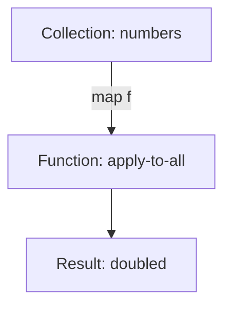

## 21.7.2 Engaging in Community Discussions

Engaging in community discussions is a vital aspect of contributing to the Clojure ecosystem. As experienced Java developers transitioning to Clojure, participating in forums, mailing lists, and conferences not only enhances your understanding of the language but also builds your reputation as a knowledgeable and helpful member of the community. In this section, we will explore the importance of community engagement, how to effectively participate in discussions, and the benefits of sharing knowledge and helping others.

### The Importance of Community Engagement

Community engagement is the lifeblood of open-source projects. It fosters collaboration, innovation, and the sharing of ideas. For Clojure developers, engaging with the community can lead to:

- **Enhanced Learning**: By participating in discussions, you gain insights into best practices, new libraries, and emerging trends in the Clojure ecosystem.
- **Networking Opportunities**: Engaging with other developers can lead to collaborations, job opportunities, and friendships.
- **Reputation Building**: Consistently contributing valuable insights and assistance can establish you as a respected member of the community.
- **Personal Growth**: Helping others and sharing knowledge can improve your communication skills and deepen your understanding of Clojure.

### Platforms for Community Engagement

There are several platforms where Clojure developers can engage with the community:

1. **Clojure Mailing Lists**: These are great for in-depth discussions and announcements. The [Clojure Google Group](https://groups.google.com/g/clojure) is a popular mailing list for Clojure enthusiasts.

2. **Online Forums**: Platforms like [ClojureVerse](https://clojureverse.org/) provide a space for developers to ask questions, share projects, and discuss Clojure-related topics.

3. **Social Media**: Twitter and LinkedIn have active Clojure communities where developers share insights and updates.

4. **Conferences and Meetups**: Attending events like [Clojure/conj](https://clojure-conj.org/) or local meetups can provide face-to-face networking opportunities.

5. **GitHub**: Engaging in discussions on GitHub issues and pull requests is a direct way to contribute to Clojure projects.

### Effective Participation in Discussions

To effectively participate in community discussions, consider the following strategies:

#### 1. **Be Respectful and Constructive**

Always approach discussions with respect and a constructive attitude. Avoid negative or dismissive language, and focus on providing helpful feedback.

#### 2. **Share Your Knowledge**

If you have expertise in a particular area, share your knowledge with others. This could be through answering questions, writing blog posts, or giving talks at meetups.

#### 3. **Ask Thoughtful Questions**

Asking questions is a great way to learn and engage with the community. Ensure your questions are clear and well-researched to encourage meaningful responses.

#### 4. **Provide Detailed Answers**

When answering questions, provide detailed and well-explained responses. Use code examples and references to support your points.

#### 5. **Stay Informed**

Keep up-to-date with the latest developments in the Clojure ecosystem. This will enable you to contribute to discussions on current topics and trends.

### Sharing Knowledge and Helping Others

Sharing knowledge and helping others is a cornerstone of community engagement. Here are some ways to do this effectively:

#### **Writing Blog Posts**

Blogging about your experiences with Clojure can help others learn from your insights. Consider writing about:

- **Tutorials**: Step-by-step guides on using Clojure features or libraries.
- **Case Studies**: Share your experiences with Clojure projects, including challenges and solutions.
- **Comparisons**: Compare Clojure with Java or other languages to highlight its strengths.

#### **Contributing to Documentation**

Good documentation is crucial for any open-source project. Contribute to Clojure's documentation by:

- **Improving Existing Docs**: Identify areas that need clarification or expansion.
- **Creating New Guides**: Write guides on topics you are familiar with.

#### **Mentoring New Developers**

Mentoring new developers can be a rewarding way to give back to the community. Offer guidance and support to those new to Clojure, helping them navigate the learning curve.

### Code Example: Engaging in Discussions with Code

Let's look at a simple example of how you might engage in a community discussion by sharing a code snippet. Suppose someone asks about using higher-order functions in Clojure. You could respond with the following example:

```clojure
;; Define a higher-order function that takes a function and a collection
(defn apply-to-all [f coll]
  (map f coll))

;; Example usage
(def numbers [1 2 3 4 5])

;; Double each number in the collection
(def doubled (apply-to-all #(* 2 %) numbers))

;; Print the result
(println doubled) ; Output: (2 4 6 8 10)
```

**Explanation**: This code defines a higher-order function `apply-to-all` that applies a given function `f` to each element in a collection `coll`. We then use this function to double each number in a list of numbers.

### Try It Yourself

- Modify the `apply-to-all` function to filter out odd numbers before applying the function.
- Experiment with different functions to apply, such as squaring each number or converting numbers to strings.

### Diagrams and Visual Aids

To further illustrate the concept of higher-order functions, let's use a diagram to show the flow of data through the `apply-to-all` function.



**Diagram Description**: This diagram shows how the `apply-to-all` function takes a collection of numbers and applies a function to each element, resulting in a new collection.

### Benefits of Engaging in Community Discussions

Engaging in community discussions offers numerous benefits:

- **Knowledge Sharing**: By sharing your knowledge, you contribute to the collective learning of the community.
- **Problem Solving**: Community discussions can help you solve problems faster by leveraging the collective expertise of others.
- **Reputation Building**: Consistent and valuable contributions can establish you as a thought leader in the Clojure community.
- **Career Opportunities**: Active participation can lead to job offers, collaborations, and speaking opportunities.

### Challenges and Solutions

Engaging in community discussions can come with challenges, such as:

- **Time Commitment**: Balancing community engagement with other responsibilities can be challenging. Set aside dedicated time for participation.
- **Imposter Syndrome**: You may feel inadequate compared to more experienced developers. Remember that everyone has unique insights to offer.
- **Negative Interactions**: Occasionally, discussions can become heated. Stay calm and focus on constructive dialogue.

### Exercises and Practice Problems

1. **Join a Discussion**: Participate in a discussion on ClojureVerse or the Clojure mailing list. Share your insights or ask a question.

2. **Write a Blog Post**: Write a blog post about a Clojure topic you are passionate about. Share it with the community for feedback.

3. **Contribute to Documentation**: Find an area of Clojure's documentation that could be improved and submit a pull request with your changes.

### Key Takeaways

- Engaging in community discussions is essential for learning, networking, and building your reputation in the Clojure ecosystem.
- Participate respectfully and constructively, sharing your knowledge and helping others.
- Use platforms like mailing lists, forums, and conferences to engage with the community.
- Overcome challenges by setting aside dedicated time for engagement and focusing on positive interactions.

By actively participating in community discussions, you not only enhance your own skills and knowledge but also contribute to the growth and success of the Clojure ecosystem. Let's continue to build a vibrant and supportive community together!

## Quiz: Mastering Community Engagement in Clojure



### What is a primary benefit of engaging in community discussions?

- [x] Enhanced learning and networking opportunities
- [ ] Increased salary
- [ ] Guaranteed job offers
- [ ] Immediate recognition as an expert

> **Explanation:** Engaging in community discussions enhances learning and provides networking opportunities, which can indirectly lead to career advancement.

### Which platform is NOT typically used for Clojure community engagement?

- [ ] ClojureVerse
- [ ] Clojure Mailing Lists
- [x] TikTok
- [ ] GitHub

> **Explanation:** TikTok is not typically used for technical community engagement, whereas ClojureVerse, mailing lists, and GitHub are common platforms.

### What should you focus on when participating in discussions?

- [x] Being respectful and constructive
- [ ] Proving others wrong
- [ ] Dominating the conversation
- [ ] Avoiding questions

> **Explanation:** Being respectful and constructive fosters a positive community environment and encourages meaningful dialogue.

### How can you share your knowledge with the Clojure community?

- [x] Writing blog posts and contributing to documentation
- [ ] Keeping your knowledge to yourself
- [ ] Criticizing others' work
- [ ] Avoiding public discussions

> **Explanation:** Writing blog posts and contributing to documentation are effective ways to share knowledge and help others learn.

### What is a challenge of community engagement?

- [x] Time commitment
- [ ] Lack of resources
- [ ] Guaranteed success
- [ ] Immediate recognition

> **Explanation:** Balancing community engagement with other responsibilities can be challenging due to the time commitment involved.

### Which of the following is a benefit of sharing knowledge?

- [x] Building your reputation
- [ ] Keeping others dependent on you
- [ ] Gaining control over the community
- [ ] Avoiding collaboration

> **Explanation:** Sharing knowledge helps build your reputation as a knowledgeable and helpful community member.

### What is an effective way to ask questions in the community?

- [x] Ensure questions are clear and well-researched
- [ ] Ask vague and open-ended questions
- [ ] Demand immediate answers
- [ ] Avoid asking questions

> **Explanation:** Clear and well-researched questions encourage meaningful responses and demonstrate respect for others' time.

### How can you overcome imposter syndrome in community discussions?

- [x] Focus on your unique insights and contributions
- [ ] Avoid participating in discussions
- [ ] Compare yourself to others constantly
- [ ] Seek validation from others

> **Explanation:** Focusing on your unique insights and contributions helps overcome imposter syndrome and builds confidence.

### What is a key takeaway from engaging in community discussions?

- [x] It enhances learning and builds your reputation
- [ ] It guarantees job offers
- [ ] It requires no effort
- [ ] It is only for beginners

> **Explanation:** Engaging in community discussions enhances learning and builds your reputation, benefiting both beginners and experienced developers.

### True or False: Engaging in community discussions can lead to career opportunities.

- [x] True
- [ ] False

> **Explanation:** Active participation in community discussions can lead to career opportunities through networking and reputation building.


