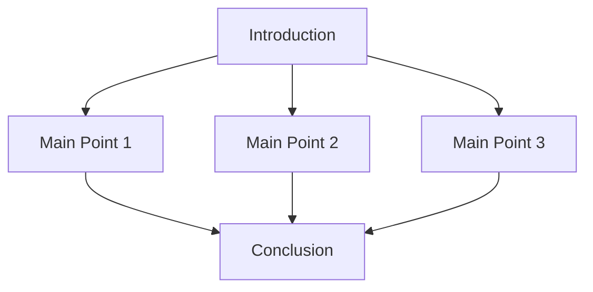

## 21.7.3 Showcasing Your Work: Building a Strong Clojure Developer Portfolio

As an experienced Java developer transitioning to Clojure, showcasing your work is crucial for establishing your reputation in the open-source community. This section will guide you through various strategies to effectively present your contributions, including maintaining a portfolio, blogging about your experiences, and speaking at meetups. By the end of this guide, you'll have a clear understanding of how to leverage these platforms to highlight your skills and achievements.

### The Importance of Showcasing Your Work

In the competitive world of software development, simply contributing to projects is not enough. You need to make your work visible to potential employers, collaborators, and the broader community. Showcasing your work can lead to new opportunities, such as job offers, speaking engagements, and collaborations on exciting projects. It also helps you build a personal brand and establish yourself as a thought leader in the Clojure community.

### Creating a Developer Portfolio

A developer portfolio is a curated collection of your best work. It serves as a visual resume that demonstrates your skills, experience, and contributions to potential employers and collaborators. Here are some steps to create an effective portfolio:

#### 1. Choose the Right Platform

Select a platform that allows you to easily showcase your projects and contributions. Popular options include GitHub Pages, GitLab Pages, and personal websites built with static site generators like Jekyll or Hugo. These platforms offer flexibility and customization, allowing you to tailor your portfolio to your personal style.

#### 2. Highlight Your Best Work

Focus on quality over quantity. Choose projects that demonstrate your expertise in Clojure and highlight your ability to solve complex problems. Include a mix of personal projects, open-source contributions, and any relevant work experience.

#### 3. Provide Context and Details

For each project, provide a brief description, your role, and the technologies used. Explain the problem you solved, the approach you took, and the impact of your work. Use diagrams and code snippets to illustrate key points.

```clojure
;; Example of a simple Clojure function to demonstrate your coding style
(defn factorial [n]
  "Calculates the factorial of a number n."
  (reduce * (range 1 (inc n))))

;; Usage
(factorial 5) ; => 120
```

#### 4. Keep It Updated

Regularly update your portfolio with new projects and contributions. This shows that you are actively engaged in the community and continuously improving your skills.

### Blogging About Your Experiences

Blogging is an excellent way to share your knowledge, experiences, and insights with the community. It helps you establish your voice and connect with others who share your interests. Here are some tips for effective blogging:

#### 1. Choose Topics That Interest You

Write about topics that you are passionate about and have expertise in. This could include tutorials, project retrospectives, or insights into the Clojure ecosystem.

#### 2. Write for Your Audience

Consider your audience when writing. As a Java developer transitioning to Clojure, you can provide valuable insights to others making the same transition. Use clear language and provide examples to illustrate your points.

#### 3. Promote Your Blog

Share your blog posts on social media, developer forums, and Clojure community channels. Engage with readers by responding to comments and participating in discussions.

#### 4. Consistency is Key

Maintain a regular posting schedule to keep your audience engaged. Consistency helps build a loyal readership and establishes you as a reliable source of information.

### Speaking at Meetups and Conferences

Public speaking is a powerful way to showcase your expertise and connect with the community. It allows you to share your knowledge, learn from others, and gain visibility. Here are some steps to get started:

#### 1. Identify Opportunities

Look for local meetups, conferences, and online events where you can present. The Clojure community is active and welcoming, making it a great place to start.

#### 2. Prepare Your Presentation

Choose a topic that you are knowledgeable about and that will resonate with your audience. Structure your presentation clearly, with an introduction, main points, and a conclusion. Use slides, diagrams, and code examples to enhance your message.



*Diagram: Structure of a Presentation*

#### 3. Practice and Get Feedback

Rehearse your presentation multiple times and seek feedback from peers. This will help you refine your delivery and build confidence.

#### 4. Engage with Your Audience

During your presentation, encourage questions and discussions. Engaging with your audience makes your presentation more interactive and memorable.

### Building a Personal Brand

Your portfolio, blog, and speaking engagements contribute to your personal brand. A strong personal brand helps you stand out in the community and opens doors to new opportunities. Here are some tips for building your brand:

#### 1. Be Authentic

Be genuine in your interactions and content. Authenticity builds trust and credibility with your audience.

#### 2. Network with Others

Connect with other developers, attend events, and participate in online communities. Networking helps you build relationships and learn from others.

#### 3. Share Your Journey

Document your learning journey and share your experiences. This not only helps others but also shows your growth and dedication.

### Try It Yourself

To put these concepts into practice, try the following exercises:

1. **Create a Portfolio**: Choose a platform and start building your developer portfolio. Include at least three projects and provide detailed descriptions.

2. **Write a Blog Post**: Write a blog post about a recent project or a topic you are passionate about. Share it on social media and engage with readers.

3. **Prepare a Presentation**: Choose a topic and prepare a presentation for a local meetup or online event. Practice your delivery and seek feedback.

### Key Takeaways

- **Showcasing your work** is essential for building your reputation in the Clojure community.
- **A developer portfolio** highlights your skills and contributions.
- **Blogging** helps you share knowledge and connect with others.
- **Public speaking** allows you to engage with the community and gain visibility.
- **Building a personal brand** involves authenticity, networking, and sharing your journey.

By following these strategies, you'll be well on your way to establishing yourself as a respected member of the Clojure community.

### Further Reading

- [Official Clojure Documentation](https://clojure.org/)
- [ClojureDocs](https://clojuredocs.org/)
- [GitHub Pages](https://pages.github.com/)
- [Jekyll](https://jekyllrb.com/)
- [Hugo](https://gohugo.io/)

## Quiz: Mastering the Art of Showcasing Your Work



### What is the primary purpose of a developer portfolio?

- [x] To showcase your skills and contributions
- [ ] To store all your code
- [ ] To replace your resume
- [ ] To host your personal blog

> **Explanation:** A developer portfolio is designed to showcase your skills and contributions, providing a visual resume to potential employers and collaborators.

### Which platform is NOT commonly used for hosting a developer portfolio?

- [ ] GitHub Pages
- [ ] GitLab Pages
- [x] LinkedIn
- [ ] Personal websites

> **Explanation:** LinkedIn is a professional networking site, not a platform specifically for hosting developer portfolios.

### What should you focus on when selecting projects for your portfolio?

- [x] Quality over quantity
- [ ] Quantity over quality
- [ ] Projects with the most code
- [ ] Projects with the least code

> **Explanation:** It's important to focus on quality over quantity, selecting projects that best demonstrate your expertise and problem-solving abilities.

### What is a key benefit of blogging about your experiences?

- [x] Sharing knowledge and connecting with others
- [ ] Keeping a personal diary
- [ ] Replacing technical documentation
- [ ] Avoiding public speaking

> **Explanation:** Blogging allows you to share your knowledge and connect with others who share your interests, helping to establish your voice in the community.

### Which of the following is NOT a benefit of public speaking?

- [ ] Gaining visibility
- [ ] Sharing knowledge
- [x] Avoiding networking
- [ ] Engaging with the community

> **Explanation:** Public speaking is an opportunity to network, share knowledge, and engage with the community, not to avoid networking.

### What is an important aspect of building a personal brand?

- [x] Being authentic
- [ ] Imitating others
- [ ] Avoiding social media
- [ ] Keeping your work private

> **Explanation:** Authenticity is crucial in building a personal brand, as it builds trust and credibility with your audience.

### How can you engage with your audience during a presentation?

- [x] Encourage questions and discussions
- [ ] Ignore questions
- [ ] Focus only on slides
- [ ] Avoid eye contact

> **Explanation:** Encouraging questions and discussions makes your presentation more interactive and memorable, helping to engage your audience.

### What is a recommended practice for maintaining a blog?

- [x] Consistency in posting
- [ ] Posting only once a year
- [ ] Writing only about personal topics
- [ ] Avoiding reader engagement

> **Explanation:** Consistency in posting helps build a loyal readership and establishes you as a reliable source of information.

### What is a key takeaway from showcasing your work?

- [x] It helps build your reputation in the community
- [ ] It replaces the need for a resume
- [ ] It is only for beginners
- [ ] It is not necessary for experienced developers

> **Explanation:** Showcasing your work is essential for building your reputation in the community, regardless of your experience level.

### True or False: Networking is not important for building a personal brand.

- [ ] True
- [x] False

> **Explanation:** Networking is a crucial part of building a personal brand, as it helps you connect with others and learn from their experiences.


