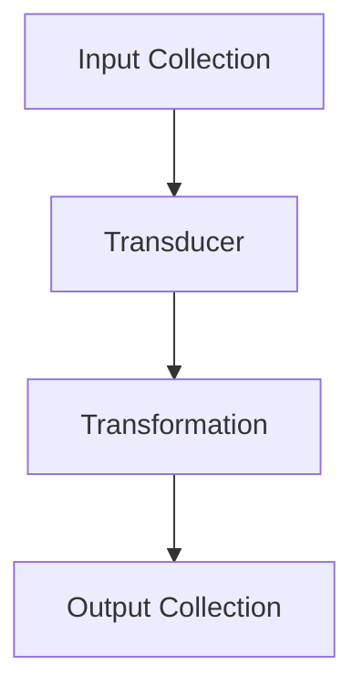
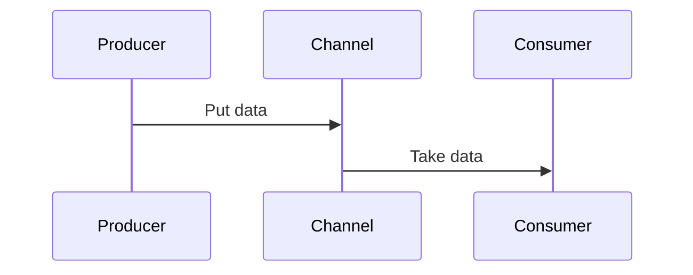

## 21.8.2 Impactful Contributions

In the world of open-source software, contributions can range from minor documentation updates to major feature implementations that redefine a project's trajectory. In this section, we will explore some impactful contributions to Clojure projects that have made significant differences, whether through major feature additions, performance enhancements, or critical bug fixes. These examples will not only illustrate the power of community-driven development but also provide inspiration and guidance for your own contributions.

### Major Feature Additions

Adding new features to an open-source project can significantly enhance its functionality and appeal. Let's examine a few notable examples in the Clojure ecosystem.

#### Example 1: Introducing Transducers

Transducers are a powerful feature in Clojure that provide a way to compose transformations independently of the context in which they are applied. They were introduced to address the inefficiencies of sequence operations that create intermediate collections.

**Clojure Code Example: Transducers**

```clojure
;; Define a simple transducer that increments each element
(def increment (map inc))

;; Use the transducer with a collection
(def result (transduce increment conj [] [1 2 3 4 5]))
;; => [2 3 4 5 6]

;; Use the transducer with a channel (core.async)
(require '[clojure.core.async :as async])
(def ch (async/chan 10 increment))
(async/onto-chan ch [1 2 3 4 5])
(async/<!! (async/into [] ch))
;; => [2 3 4 5 6]
```

**Java Comparison: Stream API**

In Java, similar transformations can be achieved using the Stream API introduced in Java 8. However, transducers offer more flexibility as they are not tied to a specific data structure.

```java
import java.util.Arrays;
import java.util.List;
import java.util.stream.Collectors;

List<Integer> numbers = Arrays.asList(1, 2, 3, 4, 5);
List<Integer> incremented = numbers.stream()
                                   .map(n -> n + 1)
                                   .collect(Collectors.toList());
// => [2, 3, 4, 5, 6]
```

**Impact**: The introduction of transducers in Clojure allowed for more efficient data processing and opened up new possibilities for composing data transformations across different contexts, such as collections and streams.

#### Example 2: Spec Library

The Clojure Spec library was introduced to provide a powerful way to describe the structure of data and functions. It enables runtime validation, generative testing, and documentation.

**Clojure Code Example: Spec**

```clojure
(require '[clojure.spec.alpha :as s])

;; Define a spec for a simple map
(s/def ::person (s/keys :req-un [::name ::age]))

;; Validate data against the spec
(s/valid? ::person {:name "Alice" :age 30})
;; => true

(s/valid? ::person {:name "Bob"})
;; => false

;; Generate sample data
(require '[clojure.spec.gen.alpha :as gen])
(gen/sample (s/gen ::person))
;; => ({:name "Alice", :age 30} ...)
```

**Impact**: Spec has become an essential tool for Clojure developers, providing a standardized way to validate data and functions, which enhances code reliability and maintainability.

### Performance Improvements

Performance is a critical aspect of software development, and contributions that enhance performance can have a profound impact on a project's success.

#### Example 3: Persistent Data Structures Optimization

Clojure's persistent data structures are a cornerstone of its functional programming model, providing immutability and efficient updates. Optimizations to these data structures can lead to significant performance gains.

**Clojure Code Example: Persistent Vector**

```clojure
;; Create a large vector
(def large-vector (vec (range 1000000)))

;; Efficiently update an element
(def updated-vector (assoc large-vector 999999 42))
```

**Impact**: Optimizations to persistent data structures have improved the performance of Clojure applications, making them more competitive with mutable data structures in other languages.

#### Example 4: Core.async Enhancements

Core.async is a library that brings asynchronous programming to Clojure. Enhancements to its performance and capabilities have made it a powerful tool for building concurrent applications.

**Clojure Code Example: Core.async**

```clojure
(require '[clojure.core.async :as async])

;; Create a channel and a go block
(def ch (async/chan))
(async/go
  (async/>! ch "Hello, world!"))

;; Read from the channel
(async/<!! ch)
;; => "Hello, world!"
```

**Impact**: Improvements to core.async have enabled developers to build more responsive and scalable applications, leveraging Clojure's strengths in concurrency.

### Critical Bug Fixes

Bug fixes, especially those addressing critical issues, are vital to the stability and reliability of software projects.

#### Example 5: Fixing Memory Leaks

Memory leaks can severely impact an application's performance and reliability. Identifying and fixing these issues is crucial for maintaining a healthy codebase.

**Clojure Code Example: Memory Management**

```clojure
;; Example of a memory leak fix in a hypothetical Clojure application
(defn process-data [data]
  ;; Ensure resources are properly released
  (with-open [resource (acquire-resource)]
    (do-something-with resource data)))
```

**Impact**: Fixing memory leaks has improved the stability and performance of Clojure applications, ensuring they can handle large datasets and long-running processes without degradation.

### Try It Yourself

To truly understand the impact of these contributions, try experimenting with the code examples provided. Modify the transducer to perform a different transformation, or create your own spec for a complex data structure. Explore the performance of persistent data structures by benchmarking operations on large collections.

### Diagrams and Visualizations

To better understand the flow of data and the impact of these contributions, let's visualize some of these concepts using diagrams.

**Mermaid Diagram: Transducer Flow**



*Caption*: This diagram illustrates the flow of data through a transducer, transforming an input collection into an output collection.

**Mermaid Diagram: Core.async Channels**



*Caption*: This sequence diagram shows the interaction between a producer, a channel, and a consumer in a core.async setup.

### Further Reading

For more information on these topics, consider exploring the following resources:

- [Official Clojure Documentation](https://clojure.org/)
- [ClojureDocs](https://clojuredocs.org/)
- [Clojure Spec Guide](https://clojure.org/guides/spec)
- [Core.async Documentation](https://clojure.github.io/core.async/)

### Exercises

1. **Transducer Experiment**: Modify the transducer example to filter out even numbers before incrementing.
2. **Spec Challenge**: Create a spec for a nested data structure representing a book with title, author, and chapters.
3. **Performance Test**: Benchmark the performance of persistent vectors versus Java's ArrayList for large data sets.
4. **Core.async Exploration**: Implement a simple producer-consumer model using core.async channels.

### Key Takeaways

- **Community Contributions**: Open-source projects thrive on community contributions, which can range from feature additions to critical bug fixes.
- **Clojure's Strengths**: Clojure's unique features, such as transducers and core.async, enable powerful and efficient programming paradigms.
- **Performance Matters**: Optimizing performance is crucial for the success of any software project, and contributions in this area can have a lasting impact.
- **Engagement Encouraged**: By engaging with open-source projects, you can make meaningful contributions that benefit both the community and your own development skills.

Now that we've explored impactful contributions in the Clojure ecosystem, consider how you might apply these insights to your own projects or contributions. Whether it's adding a new feature, optimizing performance, or fixing a critical bug, your contributions can make a significant difference.

## Quiz: Understanding Impactful Contributions in Clojure



### Which Clojure feature allows for efficient data transformations without creating intermediate collections?

- [x] Transducers
- [ ] Reducers
- [ ] Macros
- [ ] Agents

> **Explanation:** Transducers provide a way to compose transformations independently of the context, avoiding intermediate collections.


### What is the primary purpose of the Clojure Spec library?

- [x] To describe the structure of data and functions
- [ ] To optimize performance
- [ ] To manage concurrency
- [ ] To handle exceptions

> **Explanation:** Clojure Spec is used to describe data and function structures, enabling validation, testing, and documentation.


### How do persistent data structures in Clojure improve performance?

- [x] By providing efficient updates and immutability
- [ ] By using mutable state
- [ ] By reducing code complexity
- [ ] By simplifying syntax

> **Explanation:** Persistent data structures allow for efficient updates while maintaining immutability, which enhances performance.


### What library in Clojure is used for asynchronous programming?

- [x] Core.async
- [ ] Spec
- [ ] Transducers
- [ ] Reducers

> **Explanation:** Core.async is a library that facilitates asynchronous programming in Clojure.


### Which of the following is a critical aspect of software development that can be improved through contributions?

- [x] Performance
- [ ] Syntax
- [ ] Documentation
- [ ] Licensing

> **Explanation:** Performance is a critical aspect that can be significantly improved through contributions.


### What is a common issue in software that can severely impact performance and reliability?

- [x] Memory leaks
- [ ] Syntax errors
- [ ] Typographical errors
- [ ] Code comments

> **Explanation:** Memory leaks can degrade performance and reliability, making their resolution crucial.


### Which Clojure feature allows for the composition of data transformations across different contexts?

- [x] Transducers
- [ ] Macros
- [ ] Atoms
- [ ] Vars

> **Explanation:** Transducers allow for the composition of data transformations across various contexts.


### What is the benefit of fixing memory leaks in a Clojure application?

- [x] Improved stability and performance
- [ ] Enhanced syntax
- [ ] Better documentation
- [ ] Easier licensing

> **Explanation:** Fixing memory leaks improves the stability and performance of applications.


### What does the core.async library enable developers to build?

- [x] Responsive and scalable applications
- [ ] Simple scripts
- [ ] Static websites
- [ ] Database schemas

> **Explanation:** Core.async enables the development of responsive and scalable applications through asynchronous programming.


### True or False: Transducers are tied to a specific data structure in Clojure.

- [ ] True
- [x] False

> **Explanation:** Transducers are not tied to a specific data structure; they can be applied across different contexts.


