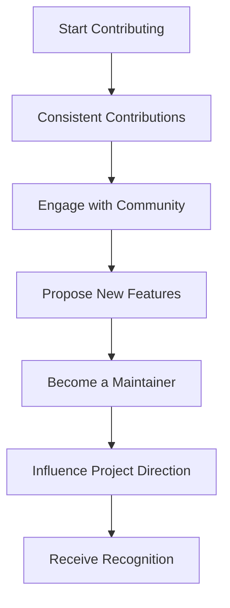

## 21.8.3 Community Recognition

In the world of open source software, community recognition is a powerful motivator and a testament to the impact of one's contributions. For Java developers transitioning to Clojure, understanding how to gain recognition within the Clojure community can be both inspiring and rewarding. This section delves into the various ways contributors are recognized, the paths to becoming maintainers, and how one can influence the direction of projects.

### The Importance of Community Recognition

Community recognition in open source projects serves several purposes:

- **Validation of Skills**: Recognition by peers validates your technical skills and contributions.
- **Career Advancement**: Being recognized can open doors to new job opportunities and collaborations.
- **Influence and Leadership**: Recognized contributors often have a say in project direction and decision-making.
- **Personal Fulfillment**: Knowing that your work is valued and impactful can be deeply satisfying.

### Paths to Recognition

There are multiple paths to gaining recognition in the Clojure community:

1. **Consistent Contributions**: Regularly contributing quality code, documentation, or support can lead to recognition.
2. **Becoming a Maintainer**: Taking on responsibilities such as reviewing pull requests and managing releases.
3. **Community Engagement**: Actively participating in discussions, forums, and events.
4. **Innovative Solutions**: Introducing new features or solving complex problems can highlight your expertise.

### Becoming a Maintainer

Becoming a maintainer is a significant step in gaining community recognition. It involves:

- **Demonstrating Expertise**: Show deep understanding of the project through consistent contributions.
- **Building Trust**: Engage positively with other contributors and maintainers.
- **Taking Initiative**: Volunteer for tasks that require leadership, such as organizing releases or managing issues.

#### Code Example: Contributing to a Clojure Project

Let's look at a simple example of contributing to a Clojure project. Suppose you want to add a new feature to a library that processes data collections.

```clojure
(ns myproject.core
  (:require [clojure.string :as str]))

;; Existing function to process a collection of strings
(defn process-strings [coll]
  (map str/upper-case coll))

;; New feature: filter strings based on a predicate
(defn filter-strings [coll pred]
  "Filters strings in coll based on the predicate pred."
  (filter pred coll))

;; Example usage
(def strings ["hello" "world" "clojure" "java"])
(def filtered-strings (filter-strings strings #(str/includes? % "o")))

;; Output: ("hello" "world")
```

**Try It Yourself**: Modify the `filter-strings` function to also transform the strings to uppercase before filtering.

### Influencing Project Direction

Influencing the direction of a project is a hallmark of recognized contributors. This can be achieved by:

- **Proposing New Features**: Identify gaps or potential improvements and propose solutions.
- **Leading Discussions**: Facilitate discussions on project goals and future directions.
- **Mentoring New Contributors**: Help onboard and guide new contributors, fostering a collaborative environment.

### Awards and Recognition

Many open source communities, including Clojure, have systems for formally recognizing contributors:

- **Community Awards**: Some projects or organizations offer awards for outstanding contributions.
- **Public Acknowledgments**: Contributors may be acknowledged in release notes, blogs, or community meetings.
- **Invitations to Speak**: Recognized contributors may be invited to speak at conferences or meetups.

### Case Study: A Journey to Recognition

Consider the journey of a developer who transitioned from Java to Clojure and became a key contributor to a popular Clojure library. Initially, they started by fixing minor bugs and gradually moved to implementing new features. Through consistent contributions and active participation in community discussions, they gained the trust of the maintainers and were eventually invited to become a maintainer themselves. Their influence grew as they led the implementation of a major feature that significantly improved the library's performance.

### Diagram: Path to Community Recognition

Below is a flowchart illustrating the typical path to community recognition in an open source project.



**Caption**: This diagram outlines the journey from initial contributions to gaining recognition and influence within the community.

### Challenges and Solutions

While the path to recognition is rewarding, it is not without challenges:

- **Time Commitment**: Balancing contributions with other responsibilities can be challenging.
- **Navigating Community Dynamics**: Understanding and integrating into the community culture is crucial.
- **Overcoming Imposter Syndrome**: Many contributors feel they are not skilled enough, despite evidence to the contrary.

**Solutions**:

- **Set Realistic Goals**: Start with small, manageable contributions and gradually increase involvement.
- **Seek Mentorship**: Engage with experienced contributors for guidance and support.
- **Celebrate Milestones**: Acknowledge and celebrate your achievements, no matter how small.

### Exercises and Practice Problems

1. **Identify a Clojure Project**: Choose a Clojure project on GitHub and identify areas where you can contribute.
2. **Engage in Discussions**: Participate in a community forum or mailing list related to Clojure.
3. **Propose a Feature**: Draft a proposal for a new feature or improvement for a Clojure library.

### Key Takeaways

- **Community recognition** is a powerful motivator and can significantly impact your career and personal growth.
- **Consistent contributions** and active engagement are key to gaining recognition.
- **Becoming a maintainer** and influencing project direction are significant milestones in an open source journey.
- **Overcoming challenges** such as time commitment and imposter syndrome is essential for sustained contributions.

By understanding and navigating the path to community recognition, you can make meaningful contributions to the Clojure ecosystem and beyond. Now that we've explored the importance of community recognition, let's apply these insights to your open source journey.

## Quiz: Understanding Community Recognition in Clojure Projects



### What is one of the primary benefits of gaining community recognition in open source projects?

- [x] Career Advancement
- [ ] Increased Salary
- [ ] Free Software Licenses
- [ ] Guaranteed Job Offers

> **Explanation:** Community recognition can lead to career advancement by opening doors to new opportunities and collaborations.

### Which of the following is a key step towards becoming a maintainer in a Clojure project?

- [x] Demonstrating Expertise
- [ ] Writing a Book
- [ ] Attending Conferences
- [ ] Hosting a Podcast

> **Explanation:** Demonstrating expertise through consistent contributions and engagement is crucial for becoming a maintainer.

### How can contributors influence the direction of a Clojure project?

- [x] Proposing New Features
- [ ] By Only Fixing Bugs
- [ ] By Avoiding Discussions
- [ ] By Working Alone

> **Explanation:** Proposing new features and leading discussions are effective ways to influence project direction.

### What is a common challenge faced by contributors seeking recognition?

- [x] Time Commitment
- [ ] Lack of Interest
- [ ] Too Many Opportunities
- [ ] Excessive Recognition

> **Explanation:** Balancing contributions with other responsibilities can be a significant challenge.

### Which of the following is a solution to overcoming imposter syndrome in open source contributions?

- [x] Seek Mentorship
- [ ] Avoid Feedback
- [x] Celebrate Milestones
- [ ] Work in Isolation

> **Explanation:** Seeking mentorship and celebrating milestones can help overcome imposter syndrome.

### What is a formal way communities recognize contributors?

- [x] Community Awards
- [ ] Free Merchandise
- [ ] Social Media Shoutouts
- [ ] Private Messages

> **Explanation:** Community awards are a formal way to recognize outstanding contributions.

### What should you do if you want to propose a new feature for a Clojure project?

- [x] Draft a Proposal
- [ ] Implement Without Discussion
- [ ] Wait for an Invitation
- [ ] Ignore Community Feedback

> **Explanation:** Drafting a proposal and engaging with the community is the right approach.

### What is a benefit of becoming a maintainer in a Clojure project?

- [x] Influence Project Direction
- [ ] Guaranteed Financial Rewards
- [ ] Unlimited Access to Resources
- [ ] Automatic Recognition in All Projects

> **Explanation:** Becoming a maintainer allows you to influence the project's direction and decision-making.

### How can you engage with the Clojure community?

- [x] Participate in Forums
- [ ] Only Read Documentation
- [ ] Avoid Social Media
- [ ] Work in Isolation

> **Explanation:** Engaging in forums and discussions is a great way to connect with the community.

### True or False: Community recognition is only about technical contributions.

- [ ] True
- [x] False

> **Explanation:** Community recognition also involves engagement, leadership, and influence beyond just technical contributions.


