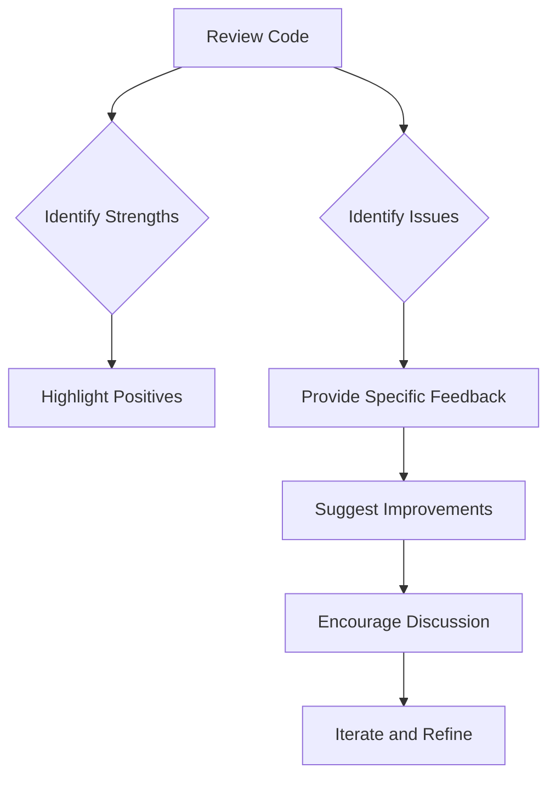

## 21.9.2 Providing Constructive Feedback

As experienced Java developers transitioning to Clojure, you are likely familiar with the importance of code reviews in maintaining code quality and fostering team collaboration. In the open-source community, providing constructive feedback is crucial not only for improving code but also for nurturing a positive and inclusive environment. This section will guide you through the principles and practices of delivering effective feedback during Clojure code reviews.

### The Importance of Constructive Feedback

Constructive feedback is a cornerstone of effective code reviews. It serves multiple purposes:

- **Improving Code Quality**: Feedback helps identify potential issues, suggest improvements, and ensure adherence to coding standards.
- **Facilitating Learning**: Both the reviewer and the reviewee can learn from each other, sharing knowledge and best practices.
- **Building Community**: Respectful feedback fosters a supportive community, encouraging more contributions and collaboration.

### Principles of Constructive Feedback

To provide feedback that is both helpful and respectful, consider the following principles:

1. **Be Specific and Objective**: Focus on specific issues or improvements rather than vague comments. Use objective language to describe what you observe.

2. **Be Empathetic and Respectful**: Remember that there is a person behind the code. Approach feedback with empathy and respect, acknowledging the effort and intent behind the contribution.

3. **Balance Positive and Negative Feedback**: Highlight what is done well alongside areas for improvement. This balanced approach encourages the contributor and maintains morale.

4. **Offer Solutions, Not Just Criticism**: When pointing out issues, suggest possible solutions or alternatives. This helps the contributor learn and understand the rationale behind your feedback.

5. **Encourage Discussion**: Feedback should be a two-way conversation. Encourage the contributor to ask questions and engage in a dialogue about the code.

### Guidelines for Delivering Feedback

#### 1. Start with the Positive

Begin your review by acknowledging the strengths of the contribution. This sets a positive tone and shows appreciation for the contributor's efforts.

```clojure
;; Example: Positive Feedback
;; "Great job on implementing the new feature! The use of higher-order functions
;; to handle data transformation is particularly impressive."
```

#### 2. Be Clear and Concise

When identifying issues, be clear and concise. Avoid jargon or overly technical language that might confuse the contributor.

```clojure
;; Example: Clear Feedback
;; "Consider using `map` instead of `for` here to improve readability and leverage
;; Clojure's functional programming capabilities."
```

#### 3. Provide Context

Explain why a change is necessary or beneficial. Providing context helps the contributor understand the reasoning behind your feedback.

```clojure
;; Example: Contextual Feedback
;; "Using `map` instead of `for` can enhance performance by avoiding unnecessary
;; intermediate collections, which is crucial in large-scale data processing."
```

#### 4. Suggest Improvements

Offer concrete suggestions for improvement. This not only helps the contributor but also demonstrates your willingness to assist.

```clojure
;; Example: Suggesting Improvements
;; "To simplify this function, you might consider using `reduce` to aggregate
;; the results instead of manually iterating over the collection."
```

#### 5. Be Mindful of Tone

Written feedback can sometimes be misinterpreted. Use a friendly and encouraging tone to avoid misunderstandings.

```clojure
;; Example: Mindful Tone
;; "I noticed a small opportunity for optimization here. Perhaps we could explore
;; using a lazy sequence to defer computation until necessary?"
```

### Comparing Feedback in Java and Clojure

While the principles of constructive feedback apply universally, there are nuances when transitioning from Java to Clojure:

- **Functional Paradigm**: Clojure's emphasis on immutability and functional programming may require feedback to focus more on functional idioms and less on object-oriented design patterns.
- **Code Readability**: Clojure's concise syntax can lead to dense code. Feedback should emphasize clarity and readability, ensuring that code is accessible to contributors of varying experience levels.
- **Concurrency Models**: Clojure's concurrency primitives (atoms, refs, agents) differ from Java's traditional threading model. Feedback should address the appropriate use of these constructs.

### Code Example: Feedback in Action

Let's consider a simple Clojure function and how we might provide feedback on it:

```clojure
(defn calculate-sum [numbers]
  ;; Imperative style loop
  (loop [nums numbers
         sum 0]
    (if (empty? nums)
      sum
      (recur (rest nums) (+ sum (first nums))))))

;; Feedback Example
;; "The `loop` construct here works, but we can simplify this function using
;; `reduce`, which is more idiomatic in Clojure. Here's a suggestion:

(defn calculate-sum [numbers]
  (reduce + numbers))

;; This change not only makes the code more concise but also leverages
;; Clojure's functional programming strengths."
```

### Try It Yourself

Experiment with the code example above by modifying the `calculate-sum` function to handle additional scenarios, such as filtering out negative numbers before summing. Consider how you would provide feedback on these changes.

### Visualizing Feedback Flow

Below is a flowchart illustrating the process of providing constructive feedback during a code review:



*Caption: Flowchart depicting the steps involved in providing constructive feedback during a code review.*

### Exercises and Practice Problems

1. **Review a Clojure Function**: Find a simple Clojure function online or in your codebase. Practice providing constructive feedback using the guidelines discussed.

2. **Rewrite Java Code in Clojure**: Take a small piece of Java code and rewrite it in Clojure. Share it with a peer for feedback and discuss the differences in approach.

3. **Feedback Role-Play**: Pair up with a colleague and role-play a code review session. One person provides feedback while the other responds, focusing on maintaining a positive and constructive dialogue.

### Key Takeaways

- Constructive feedback is essential for improving code quality and fostering a collaborative community.
- Focus on being specific, empathetic, and solution-oriented in your feedback.
- Leverage your Java experience to understand the nuances of providing feedback in Clojure.
- Encourage open dialogue and continuous learning through feedback.

### Further Reading

- [Official Clojure Documentation](https://clojure.org/)
- [ClojureDocs](https://clojuredocs.org/)
- [Effective Code Reviews](https://www.atlassian.com/agile/software-development/code-reviews)

By mastering the art of providing constructive feedback, you contribute not only to the improvement of code but also to the growth and cohesion of the Clojure community.

## Quiz: Mastering Constructive Feedback in Clojure Code Reviews



### What is the primary purpose of providing constructive feedback in code reviews?

- [x] Improving code quality and fostering collaboration
- [ ] Criticizing the contributor's coding style
- [ ] Demonstrating the reviewer's expertise
- [ ] Identifying the contributor's weaknesses

> **Explanation:** Constructive feedback aims to improve code quality and foster collaboration, not to criticize or showcase expertise.

### Which principle is NOT part of providing constructive feedback?

- [ ] Be specific and objective
- [ ] Be empathetic and respectful
- [ ] Focus solely on negative feedback
- [x] Balance positive and negative feedback

> **Explanation:** Constructive feedback should balance positive and negative feedback, not focus solely on negatives.

### How should feedback be delivered to ensure clarity?

- [x] Use clear and concise language
- [ ] Use technical jargon
- [ ] Be vague to encourage interpretation
- [ ] Focus on personal opinions

> **Explanation:** Clear and concise language ensures that feedback is understood and actionable.

### What is a key difference when providing feedback in Clojure compared to Java?

- [x] Emphasis on functional idioms
- [ ] Focus on object-oriented design patterns
- [ ] Use of verbose syntax
- [ ] Avoiding concurrency discussions

> **Explanation:** Clojure feedback often emphasizes functional idioms due to its functional programming nature.

### What should be included when suggesting improvements?

- [x] Concrete solutions or alternatives
- [ ] Only criticism without solutions
- [ ] Personal opinions
- [ ] Irrelevant examples

> **Explanation:** Providing concrete solutions helps the contributor understand and implement improvements.

### Why is it important to start feedback with positive comments?

- [x] Sets a positive tone and shows appreciation
- [ ] To avoid addressing issues
- [ ] To make the review longer
- [ ] To focus only on strengths

> **Explanation:** Starting with positive comments sets a positive tone and shows appreciation for the contributor's efforts.

### What is the benefit of encouraging discussion during feedback?

- [x] Facilitates a two-way conversation and learning
- [ ] Ends the review process quickly
- [ ] Avoids addressing complex issues
- [ ] Focuses on the reviewer's perspective

> **Explanation:** Encouraging discussion facilitates a two-way conversation and learning, enhancing the review process.

### How can feedback be made more empathetic?

- [x] Acknowledge the effort and intent behind the code
- [ ] Focus solely on technical details
- [ ] Use harsh language
- [ ] Avoid personal engagement

> **Explanation:** Acknowledging the effort and intent behind the code makes feedback more empathetic.

### What is a common pitfall to avoid in written feedback?

- [x] Misinterpretation due to tone
- [ ] Providing specific examples
- [ ] Offering solutions
- [ ] Encouraging dialogue

> **Explanation:** Written feedback can be misinterpreted due to tone, so it's important to be mindful of how it is conveyed.

### True or False: Constructive feedback should only focus on code issues.

- [ ] True
- [x] False

> **Explanation:** Constructive feedback should balance code issues with positive aspects and suggestions for improvement.


