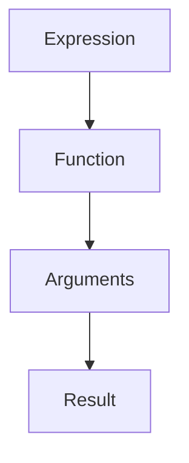
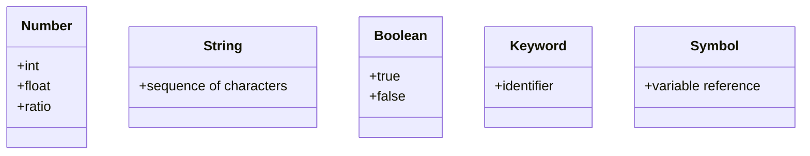

## A.1.1 Basic Syntax and Data Types

Welcome to the world of Clojure, a modern Lisp dialect that runs on the Java Virtual Machine (JVM). As experienced Java developers, you're already familiar with the concepts of syntax and data types. In this section, we'll explore how Clojure's syntax and data types differ from Java, providing you with a solid foundation to transition smoothly into functional programming with Clojure.

### Understanding Clojure's Syntax

Clojure's syntax is minimalistic and consistent, which is one of its strengths. The language is built around a few core principles that make it both powerful and expressive. Let's dive into the basic syntax elements.

#### The Role of Parentheses

In Clojure, parentheses are not just for grouping expressions; they are fundamental to the language's syntax. Every expression in Clojure is a list, and lists are denoted by parentheses. This is a key difference from Java, where parentheses are used primarily for method calls and grouping expressions.

```clojure
;; A simple expression in Clojure
(+ 1 2 3)
```

In the example above, the `+` function is applied to the numbers 1, 2, and 3. The entire expression is enclosed in parentheses, indicating that it is a list.

#### Comments in Clojure

Comments in Clojure are denoted by a semicolon (`;`). Everything after the semicolon on the same line is considered a comment and is ignored by the compiler.

```clojure
;; This is a single-line comment
(+ 1 2 3) ;; This is an inline comment
```

### Clojure's Data Types

Clojure provides a rich set of data types that are immutable by default. This immutability is a cornerstone of functional programming, allowing for safer and more predictable code. Let's explore the basic data types in Clojure.

#### Numbers

Clojure supports several numeric types, including integers, floats, and ratios. Unlike Java, where you have to specify the type of number (e.g., `int`, `double`), Clojure handles numbers more flexibly.

- **Integers**: Whole numbers, similar to Java's `int`.

```clojure
42 ;; An integer
```

- **Floats**: Numbers with decimal points, akin to Java's `double`.

```clojure
3.14 ;; A floating-point number
```

- **Ratios**: Exact fractions, which are unique to Clojure and not directly available in Java.

```clojure
1/2 ;; A ratio representing one-half
```

#### Strings

Strings in Clojure are sequences of characters enclosed in double quotes, similar to Java.

```clojure
"Hello, Clojure!" ;; A string
```

#### Characters

Characters in Clojure are denoted by a backslash followed by the character, which is slightly different from Java's single quotes.

```clojure
\a ;; A character
```

#### Booleans

Clojure uses `true` and `false` for boolean values, just like Java.

```clojure
true  ;; A boolean value
false ;; Another boolean value
```

#### Keywords

Keywords are unique to Clojure and are often used as identifiers or keys in maps. They are prefixed with a colon.

```clojure
:keyword ;; A keyword
```

#### Symbols

Symbols are used to refer to variables and functions. They are similar to variable names in Java but are more flexible.

```clojure
'my-symbol ;; A symbol
```

### Defining Variables and Functions

In Clojure, you define variables and functions using `def` and `defn`, respectively.

#### Defining Variables with `def`

The `def` keyword is used to bind a value to a symbol, similar to declaring a variable in Java.

```clojure
(def my-var 10) ;; Defining a variable
```

#### Defining Functions with `defn`

The `defn` keyword is used to define a function. This is akin to defining a method in Java.

```clojure
(defn add [a b]
  (+ a b)) ;; Defining a function that adds two numbers
```

### Try It Yourself

Experiment with the following code snippets to get a feel for Clojure's syntax and data types. Try modifying the examples to see how Clojure handles different data types and expressions.

```clojure
;; Experiment with numbers
(def my-int 42)
(def my-float 3.14)
(def my-ratio 1/2)

;; Experiment with strings and characters
(def my-string "Hello, Clojure!")
(def my-char \a)

;; Experiment with booleans
(def my-true true)
(def my-false false)

;; Experiment with keywords and symbols
(def my-keyword :my-key)
(def my-symbol 'my-symbol)

;; Experiment with defining functions
(defn multiply [x y]
  (* x y))

(multiply 3 4) ;; Try calling the function with different arguments
```

### Diagrams and Visuals

To better understand the flow of data and the structure of Clojure code, let's use a few diagrams.



*Diagram 1: The flow of data in a Clojure expression, where a function is applied to arguments to produce a result.*



*Diagram 2: Clojure's basic data types and their characteristics.*

### Key Takeaways

- **Parentheses** are fundamental in Clojure, denoting lists and expressions.
- **Comments** are marked with a semicolon (`;`).
- Clojure supports **immutable data types**, including numbers, strings, characters, booleans, keywords, and symbols.
- Use `def` to define variables and `defn` to define functions.
- Clojure's syntax is concise and consistent, emphasizing functional programming principles.

### Exercises

1. Define a variable for each data type discussed and print their values.
2. Write a function that takes two numbers and returns their sum, product, and ratio.
3. Create a map using keywords as keys and symbols as values. Access the values using the keywords.

### Further Reading

- [Official Clojure Documentation](https://clojure.org/reference/documentation)
- [ClojureDocs](https://clojuredocs.org/)
- [Clojure for the Brave and True](https://www.braveclojure.com/)

Now that we've explored Clojure's basic syntax and data types, you're ready to dive deeper into functional programming with Clojure. Let's continue this journey by applying these concepts to build robust and efficient applications.

## Quiz: Test Your Knowledge on Clojure Basic Syntax and Data Types



### What is the purpose of parentheses in Clojure?

- [x] To denote lists and expressions
- [ ] To group expressions like in Java
- [ ] To indicate comments
- [ ] To define variables

> **Explanation:** In Clojure, parentheses denote lists and expressions, which is a fundamental aspect of the language's syntax.

### How are comments written in Clojure?

- [x] Using a semicolon (`;`)
- [ ] Using double slashes (`//`)
- [ ] Using a hash (`#`)
- [ ] Using a backslash (`\`)

> **Explanation:** Comments in Clojure are written using a semicolon (`;`), and everything after it on the same line is ignored by the compiler.

### Which of the following is a Clojure keyword?

- [x] `:keyword`
- [ ] `keyword`
- [ ] `#keyword`
- [ ] `@keyword`

> **Explanation:** Keywords in Clojure are prefixed with a colon (`:`), making `:keyword` a valid keyword.

### How do you define a function in Clojure?

- [x] Using `defn`
- [ ] Using `def`
- [ ] Using `fn`
- [ ] Using `function`

> **Explanation:** Functions in Clojure are defined using the `defn` keyword, which is similar to defining a method in Java.

### What is the result of evaluating the expression `(+ 1 2 3)` in Clojure?

- [x] 6
- [ ] 123
- [ ] 5
- [ ] 7

> **Explanation:** The expression `(+ 1 2 3)` adds the numbers 1, 2, and 3, resulting in 6.

### Which data type is unique to Clojure and not directly available in Java?

- [x] Ratios
- [ ] Integers
- [ ] Strings
- [ ] Booleans

> **Explanation:** Ratios are unique to Clojure, allowing for exact fractions, unlike Java's numeric types.

### How are characters represented in Clojure?

- [x] Using a backslash followed by the character
- [ ] Using single quotes
- [ ] Using double quotes
- [ ] Using a hash

> **Explanation:** Characters in Clojure are represented by a backslash followed by the character, such as `\a`.

### What is the purpose of the `def` keyword in Clojure?

- [x] To bind a value to a symbol
- [ ] To define a function
- [ ] To create a list
- [ ] To comment code

> **Explanation:** The `def` keyword is used to bind a value to a symbol, similar to declaring a variable in Java.

### Which of the following is a valid Clojure symbol?

- [x] `'my-symbol`
- [ ] `:my-symbol`
- [ ] `#my-symbol`
- [ ] `@my-symbol`

> **Explanation:** Symbols in Clojure are used to refer to variables and functions, and they are written without any prefix.

### True or False: Clojure's data types are mutable by default.

- [ ] True
- [x] False

> **Explanation:** Clojure's data types are immutable by default, which is a key feature of the language and functional programming.


