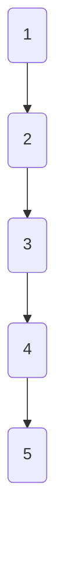
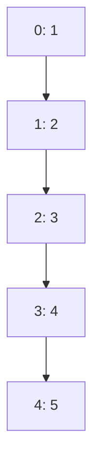
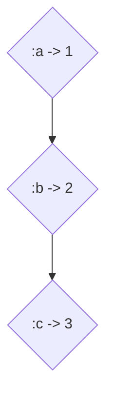
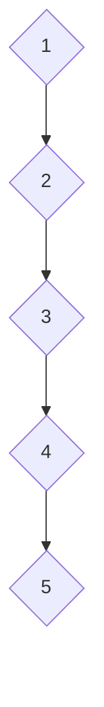

## A.1.2 Collection Literals

In Clojure, collections are a fundamental part of the language, providing a rich set of data structures that are both immutable and persistent. As a Java developer, you may be accustomed to using arrays, lists, maps, and sets, but Clojure offers its own unique take on these data structures. In this section, we'll explore the literal notations for Clojure's core collection types: lists `()`, vectors `[]`, maps `{}`, and sets `#{}`. We'll provide examples of each collection type with sample data, highlight the differences in usage between the collections, and offer tips on nested collections and how to read complex data structures.

### Lists `()`

Lists in Clojure are ordered collections of elements, typically used for sequential processing. They are similar to Java's `LinkedList`, but with a key difference: Clojure lists are immutable. This means once a list is created, it cannot be changed. Lists are represented using parentheses `()`.

#### Example of a List

```clojure
(def my-list '(1 2 3 4 5))
;; my-list is a list containing the numbers 1 through 5
```

**Usage**: Lists are ideal for scenarios where you need to process elements sequentially, such as in recursive functions. They are also used to represent code, as Clojure is a Lisp dialect.

**Comparison with Java**: In Java, you might use a `LinkedList` for similar purposes, but remember that Java's lists are mutable by default.

#### Diagram: List Structure



*Diagram 1: A simple representation of a Clojure list.*

### Vectors `[]`

Vectors are the go-to collection for indexed access in Clojure. They are similar to Java's `ArrayList`, providing fast access to elements by index. Vectors are represented using square brackets `[]`.

#### Example of a Vector

```clojure
(def my-vector [1 2 3 4 5])
;; my-vector is a vector containing the numbers 1 through 5
```

**Usage**: Use vectors when you need efficient random access to elements. They are also commonly used for function arguments and return values.

**Comparison with Java**: Vectors in Clojure are akin to `ArrayList` in Java, but with the added benefit of immutability.

#### Diagram: Vector Structure



*Diagram 2: A simple representation of a Clojure vector.*

### Maps `{}`

Maps in Clojure are collections of key-value pairs, similar to Java's `HashMap`. They are represented using curly braces `{}`.

#### Example of a Map

```clojure
(def my-map {:a 1 :b 2 :c 3})
;; my-map is a map with keys :a, :b, :c and corresponding values 1, 2, 3
```

**Usage**: Maps are perfect for associative data, where you need to look up values by keys.

**Comparison with Java**: While Java's `HashMap` is mutable, Clojure's maps are immutable, providing thread-safe access without synchronization.

#### Diagram: Map Structure



*Diagram 3: A simple representation of a Clojure map.*

### Sets `#{}`

Sets in Clojure are collections of unique elements, similar to Java's `HashSet`. They are represented using hash braces `#{}`.

#### Example of a Set

```clojure
(def my-set #{1 2 3 4 5})
;; my-set is a set containing the unique numbers 1 through 5
```

**Usage**: Use sets when you need to ensure uniqueness of elements.

**Comparison with Java**: Like Java's `HashSet`, Clojure's sets ensure that each element is unique, but they are immutable.

#### Diagram: Set Structure



*Diagram 4: A simple representation of a Clojure set.*

### Nested Collections

Clojure collections can be nested, allowing you to create complex data structures. This is similar to Java's nested collections, but with the added benefit of immutability.

#### Example of Nested Collections

```clojure
(def nested-collection
  {:numbers [1 2 3]
   :letters '(:a :b :c)
   :sets #{#{1 2} #{3 4}}})
;; nested-collection is a map containing a vector, a list, and a set of sets
```

**Reading Complex Data Structures**: When dealing with nested collections, it's important to understand the structure to access elements correctly. Use functions like `get`, `assoc`, and `update` to navigate and manipulate nested data.

### Try It Yourself

Experiment with the following code snippets:

1. Create a list of your favorite programming languages.
2. Define a vector of numbers and access the third element.
3. Construct a map with keys as country names and values as their capitals.
4. Form a set of unique numbers and attempt to add a duplicate.

### Key Takeaways

- **Lists** are ordered and ideal for sequential processing.
- **Vectors** provide fast indexed access and are commonly used for function arguments.
- **Maps** store key-value pairs and are perfect for associative data.
- **Sets** ensure uniqueness of elements.
- Clojure collections are immutable, offering thread-safe operations without synchronization.

### Further Reading

- [Clojure Official Documentation](https://clojure.org/reference/data_structures)
- [ClojureDocs](https://clojuredocs.org/)

### Exercises

1. Create a nested collection representing a simple database of users, each with a name, age, and a set of hobbies.
2. Write a function that takes a map and returns a vector of its keys.
3. Implement a function to merge two sets and return the union.

## Quiz: Test Your Understanding of Clojure Collection Literals



### Which Clojure collection is best for ensuring element uniqueness?

- [ ] List
- [ ] Vector
- [ ] Map
- [x] Set

> **Explanation:** Sets in Clojure are designed to ensure that each element is unique.

### What is the primary advantage of Clojure's immutable collections?

- [x] Thread-safe operations without synchronization
- [ ] Faster access times
- [ ] Smaller memory footprint
- [ ] Easier to modify

> **Explanation:** Immutability in Clojure collections ensures thread-safe operations without the need for synchronization.

### How are lists represented in Clojure?

- [x] ()
- [ ] []
- [ ] {}
- [ ] #{}

> **Explanation:** Lists in Clojure are represented using parentheses `()`.

### Which collection type is most similar to Java's ArrayList?

- [ ] List
- [x] Vector
- [ ] Map
- [ ] Set

> **Explanation:** Vectors in Clojure are similar to Java's `ArrayList` as they provide indexed access to elements.

### What is the literal notation for a Clojure map?

- [ ] ()
- [ ] []
- [x] {}
- [ ] #{}

> **Explanation:** Maps in Clojure are represented using curly braces `{}`.

### How can you access the third element of a vector in Clojure?

- [x] Using the `nth` function
- [ ] Using the `get` function
- [ ] Using the `assoc` function
- [ ] Using the `conj` function

> **Explanation:** The `nth` function is used to access elements by index in a vector.

### What is a key difference between Java's HashMap and Clojure's map?

- [x] Immutability
- [ ] Faster access times
- [ ] Smaller memory footprint
- [ ] Easier to modify

> **Explanation:** Clojure's maps are immutable, unlike Java's `HashMap`.

### Which Clojure collection is typically used for function arguments?

- [ ] List
- [x] Vector
- [ ] Map
- [ ] Set

> **Explanation:** Vectors are commonly used for function arguments in Clojure.

### What is the result of adding a duplicate element to a Clojure set?

- [x] The set remains unchanged
- [ ] The duplicate is added
- [ ] An error is thrown
- [ ] The set is cleared

> **Explanation:** Clojure sets ensure uniqueness, so adding a duplicate element does not change the set.

### True or False: Clojure collections are mutable by default.

- [ ] True
- [x] False

> **Explanation:** Clojure collections are immutable by default, providing thread-safe operations.


