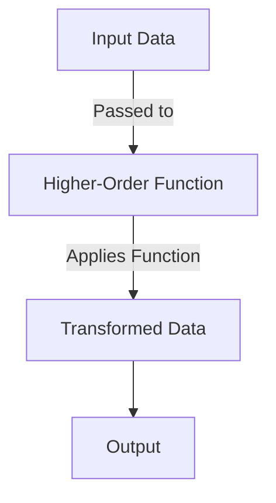

## A.1.3 Functions and Anonymous Functions

In this section, we delve into the world of functions in Clojure, a fundamental aspect of functional programming. As experienced Java developers, you are familiar with methods and lambda expressions. Clojure offers a powerful and flexible approach to defining and using functions, both named and anonymous. We will explore how to define functions using `defn`, create anonymous functions with `fn` and the shorthand `#()`, and leverage advanced features like variadic functions and parameter destructuring.

### Understanding Functions in Clojure

Functions are first-class citizens in Clojure, meaning they can be passed as arguments, returned from other functions, and assigned to variables. This is a key aspect of functional programming, allowing for more abstract and flexible code design.

#### Named Functions with `defn`

In Clojure, named functions are defined using the `defn` macro. This is similar to defining a method in Java, but with a more concise syntax.

```clojure
(defn greet
  "A simple function to greet a user."
  [name]
  (str "Hello, " name "!"))

;; Usage
(greet "Alice") ; => "Hello, Alice!"
```

**Explanation:**
- **`defn`**: Used to define a named function.
- **`greet`**: The name of the function.
- **`[name]`**: The parameter list, enclosed in square brackets.
- **`str`**: A Clojure function to concatenate strings.

In Java, a similar function might look like this:

```java
public String greet(String name) {
    return "Hello, " + name + "!";
}
```

#### Anonymous Functions with `fn` and `#()`

Anonymous functions, also known as lambda functions, are functions without a name. They are useful for short-lived operations or when passing functions as arguments.

**Using `fn`:**

```clojure
(fn [x] (* x x))

;; Usage
((fn [x] (* x x)) 5) ; => 25
```

**Using `#()`:**

The `#()` syntax is a shorthand for creating anonymous functions.

```clojure
#(* % %)

;; Usage
(#(* % %) 5) ; => 25
```

**Explanation:**
- **`fn`**: Defines an anonymous function.
- **`#()`**: Shorthand for anonymous functions.
- **`%`**: Represents the first argument passed to the function.

In Java, anonymous functions are typically created using lambda expressions:

```java
Function<Integer, Integer> square = x -> x * x;
square.apply(5); // => 25
```

### Function Parameters

Clojure functions can have fixed, optional, and variadic parameters, providing flexibility in how functions are defined and invoked.

#### Fixed Parameters

A function with fixed parameters expects a specific number of arguments.

```clojure
(defn add [a b]
  (+ a b))

(add 2 3) ; => 5
```

#### Optional and Variadic Parameters

Clojure supports optional and variadic parameters using the `&` symbol, allowing functions to accept a variable number of arguments.

```clojure
(defn greet-all
  "Greets multiple people."
  [& names]
  (map #(str "Hello, " % "!") names))

(greet-all "Alice" "Bob" "Charlie")
; => ("Hello, Alice!" "Hello, Bob!" "Hello, Charlie!")
```

**Explanation:**
- **`& names`**: Collects all additional arguments into a list called `names`.

In Java, variadic parameters are handled using varargs:

```java
public void greetAll(String... names) {
    for (String name : names) {
        System.out.println("Hello, " + name + "!");
    }
}
```

### Parameter Destructuring

Clojure allows destructuring in parameter lists, enabling more readable and concise code by directly extracting values from data structures.

#### Destructuring Maps

```clojure
(defn print-person
  "Prints a person's details."
  [{:keys [name age]}]
  (println (str "Name: " name ", Age: " age)))

(print-person {:name "Alice" :age 30})
; => Name: Alice, Age: 30
```

**Explanation:**
- **`{:keys [name age]}`**: Destructures the map to extract `name` and `age`.

#### Destructuring Vectors

```clojure
(defn sum-pair
  "Sums a pair of numbers."
  [[a b]]
  (+ a b))

(sum-pair [3 4]) ; => 7
```

**Explanation:**
- **`[a b]`**: Destructures the vector to extract the first and second elements.

### Creating and Invoking Functions

Functions in Clojure are invoked by placing the function name or expression in the first position of a list, followed by its arguments.

```clojure
(defn multiply [a b]
  (* a b))

(multiply 3 4) ; => 12
```

Anonymous functions are invoked similarly, but they must be wrapped in parentheses.

```clojure
((fn [x] (* x x)) 5) ; => 25
```

### Advanced Function Usage

Clojure's functional programming paradigm encourages the use of higher-order functions, which can take other functions as arguments or return them as results.

#### Higher-Order Functions

```clojure
(defn apply-twice [f x]
  (f (f x)))

(apply-twice inc 5) ; => 7
```

**Explanation:**
- **`apply-twice`**: A higher-order function that applies a function `f` twice to an argument `x`.
- **`inc`**: A function that increments its argument by 1.

In Java, higher-order functions can be implemented using functional interfaces:

```java
Function<Integer, Integer> applyTwice = f -> f.andThen(f);
applyTwice.apply(x -> x + 1).apply(5); // => 7
```

### Try It Yourself

Experiment with the following code snippets to deepen your understanding of Clojure functions:

1. Modify the `greet-all` function to include a default greeting message if no names are provided.
2. Create a function that takes a list of numbers and returns a list of their squares using an anonymous function.
3. Implement a higher-order function that takes a function and a list, applying the function to each element of the list.

### Diagrams and Visual Aids

Below is a diagram illustrating the flow of data through a higher-order function in Clojure.



**Diagram Explanation:**
- **Input Data**: The initial data passed to the higher-order function.
- **Higher-Order Function**: The function that takes another function as an argument.
- **Transformed Data**: The result after applying the function to the input data.
- **Output**: The final output of the higher-order function.

### Further Reading

For more information on functions in Clojure, consider exploring the following resources:
- [Official Clojure Documentation on Functions](https://clojure.org/reference/functions)
- [ClojureDocs: Function Examples](https://clojuredocs.org/)

### Exercises

1. **Define a Function**: Write a function that takes two arguments and returns their product.
2. **Anonymous Function**: Create an anonymous function that doubles a number and use it to double the elements of a list.
3. **Variadic Function**: Implement a variadic function that calculates the average of a list of numbers.
4. **Destructuring**: Write a function that takes a map with keys `:x` and `:y` and returns their sum.
5. **Higher-Order Function**: Create a higher-order function that takes a function and a number, applying the function three times to the number.

### Key Takeaways

- **Functions are first-class citizens** in Clojure, enabling powerful abstractions.
- **Named functions** are defined using `defn`, while **anonymous functions** can be created with `fn` or `#()`.
- **Clojure supports variadic functions** and **parameter destructuring**, enhancing flexibility and readability.
- **Higher-order functions** are a cornerstone of functional programming, allowing functions to be passed as arguments and returned as results.

Now that we've explored functions in Clojure, let's apply these concepts to build more modular and reusable code in your applications.

## Quiz: Mastering Functions and Anonymous Functions in Clojure



### What is the primary way to define a named function in Clojure?

- [x] `defn`
- [ ] `fn`
- [ ] `def`
- [ ] `#()`

> **Explanation:** `defn` is the macro used to define named functions in Clojure.

### How do you create an anonymous function using shorthand syntax in Clojure?

- [x] `#()`
- [ ] `fn`
- [ ] `defn`
- [ ] `lambda`

> **Explanation:** `#()` is the shorthand syntax for creating anonymous functions in Clojure.

### What symbol is used to denote variadic parameters in Clojure?

- [x] `&`
- [ ] `*`
- [ ] `...`
- [ ] `@`

> **Explanation:** The `&` symbol is used to collect additional arguments into a list for variadic functions.

### How can you destructure a map in a function parameter list?

- [x] `{:keys [key1 key2]}`
- [ ] `[key1 key2]`
- [ ] `(key1 key2)`
- [ ] `#{key1 key2}`

> **Explanation:** `{:keys [key1 key2]}` is the syntax for destructuring a map to extract specific keys.

### Which of the following is a higher-order function?

- [x] A function that takes another function as an argument
- [ ] A function that returns a string
- [ ] A function that calculates the sum of two numbers
- [ ] A function that prints a message

> **Explanation:** A higher-order function is one that takes another function as an argument or returns a function as a result.

### What is the purpose of the `fn` keyword in Clojure?

- [x] To define an anonymous function
- [ ] To define a named function
- [ ] To declare a variable
- [ ] To import a library

> **Explanation:** `fn` is used to define anonymous functions in Clojure.

### How do you invoke an anonymous function in Clojure?

- [x] By wrapping it in parentheses and passing arguments
- [ ] By using the `call` keyword
- [ ] By using the `invoke` keyword
- [ ] By using the `apply` keyword

> **Explanation:** Anonymous functions are invoked by wrapping them in parentheses and passing the required arguments.

### What is the result of the following Clojure expression: `((fn [x] (* x x)) 3)`?

- [x] 9
- [ ] 6
- [ ] 3
- [ ] 0

> **Explanation:** The anonymous function squares its argument, so `3 * 3` results in `9`.

### Which keyword is used to define a function that can accept a variable number of arguments?

- [x] `&`
- [ ] `*`
- [ ] `...`
- [ ] `@`

> **Explanation:** The `&` symbol is used to define a function that can accept a variable number of arguments.

### True or False: In Clojure, functions can be passed as arguments to other functions.

- [x] True
- [ ] False

> **Explanation:** In Clojure, functions are first-class citizens, meaning they can be passed as arguments to other functions.


