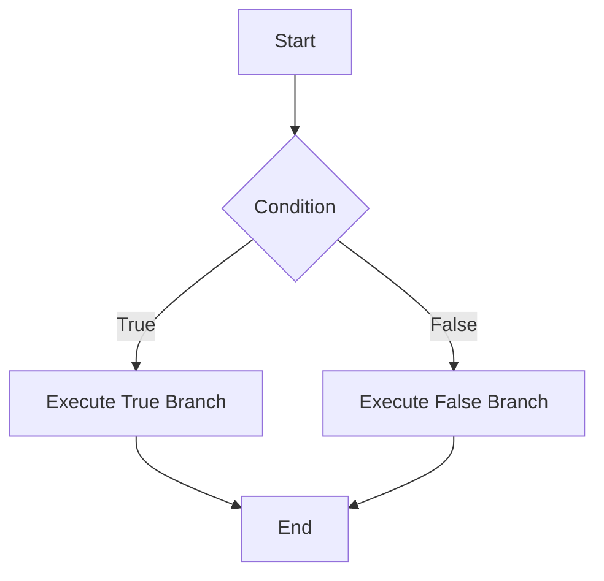

## A.1.4 Special Forms and Macros

In Clojure, special forms and macros are foundational elements that enable powerful programming paradigms, such as functional programming and metaprogramming. As experienced Java developers, you might be familiar with the concept of control structures and methods, but Clojure's special forms and macros offer a unique approach to these concepts. In this section, we will explore the essential special forms like `if`, `do`, `let`, `quote`, `var`, and `loop`, and introduce macros, which allow for code transformation and generation.

### Understanding Special Forms

Special forms in Clojure are the building blocks of the language. Unlike regular functions, special forms have unique evaluation rules and are not subject to the same constraints. They are essential for defining the language's core syntax and semantics. Let's delve into some of the most important special forms.

#### `if`: Conditional Evaluation

The `if` special form is used for conditional branching. It evaluates a condition and executes one of two expressions based on the result.

**Clojure Example:**

```clojure
(if (> 5 3)
  "Greater"
  "Lesser")
;; => "Greater"
```

**Java Equivalent:**

```java
String result = (5 > 3) ? "Greater" : "Lesser";
```

In Clojure, `if` evaluates the condition and returns the first expression if true, otherwise the second. Unlike Java's ternary operator, `if` is a special form, allowing it to control evaluation directly.

#### `do`: Sequential Execution

The `do` special form is used to execute multiple expressions in sequence, returning the value of the last expression.

**Clojure Example:**

```clojure
(do
  (println "First")
  (println "Second")
  "Done")
;; Output: 
;; First
;; Second
;; => "Done"
```

**Java Equivalent:**

```java
System.out.println("First");
System.out.println("Second");
String result = "Done";
```

In Clojure, `do` is often used in places where multiple expressions need to be evaluated, such as within `if` branches.

#### `let`: Local Bindings

The `let` special form introduces local bindings, similar to variable declarations in Java, but with immutability.

**Clojure Example:**

```clojure
(let [x 10
      y 20]
  (+ x y))
;; => 30
```

**Java Equivalent:**

```java
int x = 10;
int y = 20;
int sum = x + y;
```

`let` allows for the creation of local variables within a scope, promoting functional programming practices by avoiding mutable state.

#### `quote`: Preventing Evaluation

The `quote` special form is used to prevent the evaluation of an expression, treating it as data.

**Clojure Example:**

```clojure
(quote (1 2 3))
;; => (1 2 3)
```

**Java Equivalent:**

Java does not have a direct equivalent to `quote`, but it can be thought of as similar to treating code as a string or data structure without executing it.

#### `var`: Variable Reference

The `var` special form is used to refer to a variable, often in the context of dynamic scoping or metadata.

**Clojure Example:**

```clojure
(def my-var 42)
(var my-var)
;; => #'user/my-var
```

**Java Equivalent:**

Java does not have a direct equivalent, but `var` can be thought of as a reference to a variable's metadata or state.

#### `loop`: Recursion and Iteration

The `loop` special form is used for recursion, providing a way to iterate with state.

**Clojure Example:**

```clojure
(loop [i 0]
  (when (< i 5)
    (println i)
    (recur (inc i))))
;; Output:
;; 0
;; 1
;; 2
;; 3
;; 4
```

**Java Equivalent:**

```java
for (int i = 0; i < 5; i++) {
    System.out.println(i);
}
```

`loop` works with `recur` to provide tail-recursive iteration, avoiding stack overflow issues common in traditional recursion.

### Introduction to Macros

Macros in Clojure are a powerful feature that allows for code transformation and metaprogramming. They enable developers to extend the language by creating new syntactic constructs.

#### Defining Macros

Macros are defined using the `defmacro` special form. They take code as input and return transformed code.

**Clojure Example:**

```clojure
(defmacro unless [condition body]
  `(if (not ~condition)
     ~body))

(unless false
  (println "This will print"))
;; Output: This will print
```

In this example, the `unless` macro is a custom control structure that executes the body if the condition is false.

#### Macro Expansion

Macros are expanded at compile time, allowing for complex transformations before execution. This is similar to Java's annotations and reflection but more powerful and flexible.

**Clojure Example:**

```clojure
(macroexpand '(unless false (println "Hello")))
;; => (if (not false) (println "Hello"))
```

**Java Equivalent:**

Java's annotations can modify behavior at runtime, but they lack the compile-time transformation capabilities of Clojure macros.

### Try It Yourself

To deepen your understanding, try modifying the examples above:

- Change the condition in the `if` example to explore different branches.
- Add more expressions to the `do` form and observe the output.
- Experiment with `let` by introducing more bindings and using them in expressions.
- Create a new macro that mimics another control structure, such as `while`.

### Diagrams and Visualizations

Let's visualize how data flows through these special forms and macros.



*Diagram 1: Flowchart of the `if` Special Form*

This diagram illustrates the decision-making process within the `if` special form, highlighting the branching based on the condition.

### Exercises and Practice Problems

1. **Exercise 1**: Write a Clojure function using `let` to calculate the area of a rectangle given its length and width.
2. **Exercise 2**: Create a macro that implements a `repeat-until` loop, executing a body of code until a condition is met.
3. **Exercise 3**: Use `loop` and `recur` to implement a factorial function.

### Key Takeaways

- **Special Forms**: Essential constructs in Clojure that define the language's core syntax and control flow.
- **Macros**: Enable metaprogramming by transforming code at compile time, offering flexibility and power beyond Java's capabilities.
- **Functional Paradigm**: Emphasized through immutability and local bindings, contrasting with Java's mutable state.

By mastering special forms and macros, you can harness the full potential of Clojure's functional programming paradigm, creating more expressive and efficient code.

### Further Reading

- [Official Clojure Documentation](https://clojure.org/reference/special_forms)
- [ClojureDocs](https://clojuredocs.org/)
- [Clojure Macros Guide](https://clojure.org/guides/macros)

---

## Quiz: Mastering Clojure Special Forms and Macros



### What is the primary purpose of special forms in Clojure?

- [x] To define the core syntax and semantics of the language
- [ ] To provide a library of reusable functions
- [ ] To handle exceptions and errors
- [ ] To manage memory allocation

> **Explanation:** Special forms are fundamental constructs that define Clojure's core syntax and semantics, unlike regular functions.

### How does the `let` special form in Clojure differ from variable declarations in Java?

- [x] It creates immutable local bindings
- [ ] It allows for mutable state
- [ ] It is used for exception handling
- [ ] It performs I/O operations

> **Explanation:** `let` creates immutable local bindings, promoting functional programming practices, unlike Java's mutable variable declarations.

### What is the role of macros in Clojure?

- [x] To transform code at compile time
- [ ] To execute code at runtime
- [ ] To manage memory allocation
- [ ] To handle exceptions

> **Explanation:** Macros transform code at compile time, allowing for powerful metaprogramming capabilities.

### Which special form is used for recursion in Clojure?

- [x] `loop`
- [ ] `if`
- [ ] `do`
- [ ] `quote`

> **Explanation:** `loop` is used for recursion, often in conjunction with `recur` to provide tail-recursive iteration.

### What does the `quote` special form do in Clojure?

- [x] Prevents evaluation of an expression
- [ ] Executes an expression
- [ ] Handles exceptions
- [ ] Manages memory

> **Explanation:** `quote` prevents the evaluation of an expression, treating it as data.

### How are macros different from functions in Clojure?

- [x] Macros operate on code, while functions operate on values
- [ ] Macros are executed at runtime, while functions are at compile time
- [ ] Macros manage memory, while functions handle exceptions
- [ ] Macros are used for I/O operations, while functions are not

> **Explanation:** Macros operate on code, transforming it at compile time, while functions operate on values at runtime.

### What is the output of the following Clojure code: `(if false "Yes" "No")`?

- [x] "No"
- [ ] "Yes"
- [ ] `nil`
- [ ] An error

> **Explanation:** Since the condition is `false`, the `if` form evaluates and returns the second expression, "No".

### Which special form allows for sequential execution of expressions?

- [x] `do`
- [ ] `let`
- [ ] `var`
- [ ] `quote`

> **Explanation:** `do` allows for sequential execution of multiple expressions, returning the value of the last one.

### What is a common use case for the `var` special form?

- [x] Referring to a variable's metadata or state
- [ ] Creating local bindings
- [ ] Handling exceptions
- [ ] Performing I/O operations

> **Explanation:** `var` is used to refer to a variable's metadata or state, often in dynamic scoping contexts.

### True or False: Macros in Clojure can be used to create new syntactic constructs.

- [x] True
- [ ] False

> **Explanation:** True. Macros allow developers to create new syntactic constructs by transforming code at compile time.


